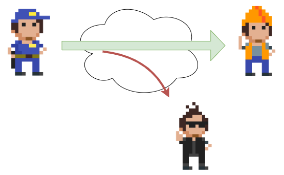
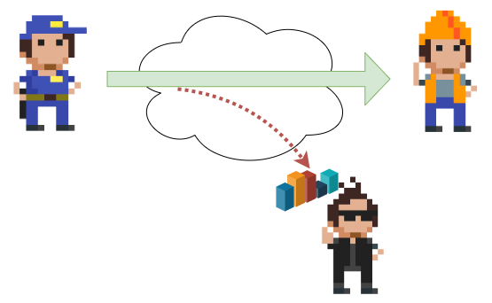
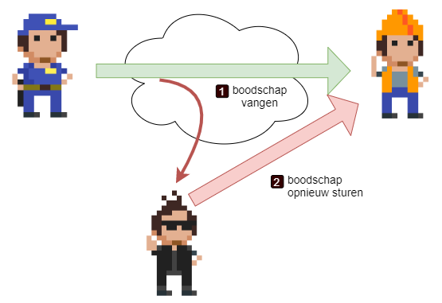
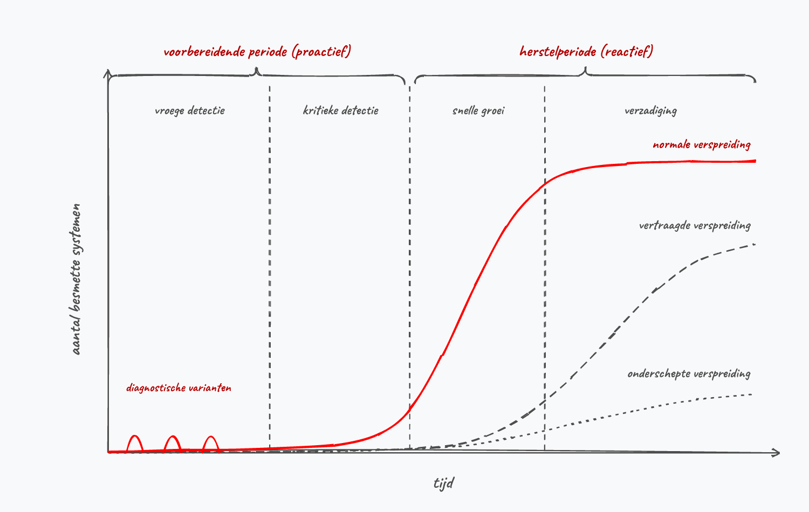
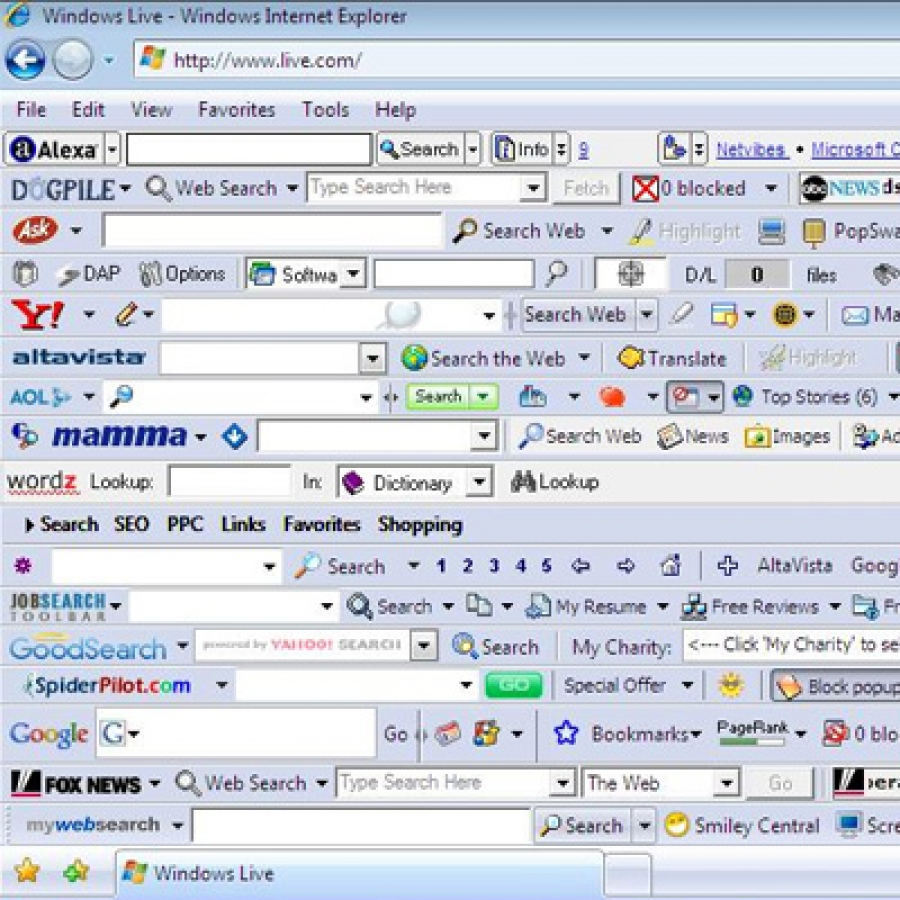
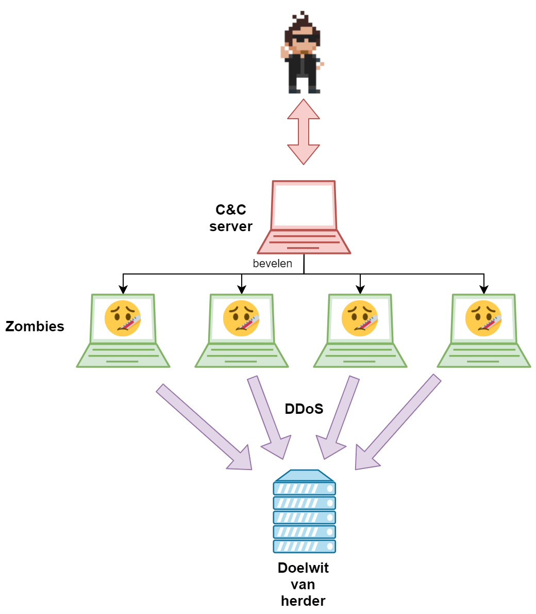

# Cybersecurity fundamenten

::: {.callout-note title="Leerdoelen"}
Na dit hoofdstuk kan je:

1. **Het CIA-model en de McCumber-kubus toepassen** op een gegeven (bedrijfs)scenario om te toetsen of aan alle beveiligingsaspecten gedacht werd.
2. De verschillende **soorten aanvallers** (scriptkiddies, werknemers, cybercriminelen, overheden…) onderscheiden op basis van motivatie, middelen en doelwit.
3. Het verschil tussen **passieve en actieve aanvallen** toelichten en ze herkennen in een concrete case.
4. De belangrijkste **malware-families** (virus, worm, trojan, rootkit, ransomware, botnet) én **social engineering**-technieken benoemen en illustreren met een actueel voorbeeld.
5. Uitleggen wat een **zero day** en een **window of vulnerability** zijn, en waarom **side-channel aanvallen** een bijzonder moeilijk aanvalsoppervlak vormen.
:::

"Iedere goede film begint met een zwart scherm", zegt Batman in de "The Lego Batman Movie" &trade; film. Wel, ik vul dit aan met "...en ieder goed hoofdstuk begint met een definitie."

Laten we daarom eerst eens een definitie van cybersecurity neerpennen dat netwerkbedrijf *Cisco* gebruikt: 

*"Cybersecurity is the practice of protecting systems, networks, and programs from digital attacks. These cyberattacks are usually aimed at accessing, changing, or destroying sensitive information; extorting money from users; or interrupting normal business processes.*

*Implementing effective cybersecurity measures is particularly challenging today because there are more devices than people, and attackers are becoming more innovative."*

Alles draait met andere woorden rond het beschermen van informatie, of dat die nu op een server, in een document of in iemands hoofd zit.

::: {.callout-tip}
**De formele NIST-definitie**: waar Cisco een praktische, marketing-vriendelijke omschrijving geeft, hanteert het Amerikaanse *National Institute of Standards and Technology* (NIST) een strakkere, juridisch-academische definitie in hun *Computer Security Handbook*:

> *"The protection afforded to an automated information system in order to attain the applicable objectives of preserving the **integrity**, **availability** and **confidentiality** of information system resources (includes hardware, software, firmware, information/data, and telecommunications)."*

Merk op dat NIST meteen drie centrale begrippen introduceert &mdash; integrity, availability, confidentiality &mdash; én vier types *resources*: hardware, software, firmware, data en telecommunicatie. Dit sluit perfect aan bij het **CIA-model** en de **McCumber kubus** die we hierna bespreken.
:::

## CIA en het security model

Data (of informatie), in welke vorm dan ook (berichten over een netwerk, bestanden op een harde schijf, tekst in een database), moeten beschermd worden, dat beseffen we nu. Het doel van onze data is dat deze voldoet aan het acroniem **C.I.A** wat staat voor:

* **C** voor "**confidentiality**": vertrouwelijkheid. De data kan enkel door zij die er recht toe hebben gebruikt worden. We gaan dit onder andere oplossen met behulp van encryptie en wachtwoorden.
* **I** voor "**integrity**": integriteit. We moeten weten of onze data onbeschadigd is en niet werd aangepast door derden (of storingen). Bij bestanden gaan we bijvoorbeeld werken met zogenaamde (secure) hashes.
* **A** voor "**availability**": beschikbaarheid. Data die niet door rechtmatige gebruikers kan bereikt worden is onbestaande data. Zogenaamde "Denial-of-Service" (DoS) aanvallen hebben als doel deze pijler van CIA aan te vallen. Availability is een breed veld en wordt onder andere opgelost door back-ups, redundante servers enerzijds, en preventieve maatregelen anderzijds zoals firewalls, load balancers, etc.

::: {.callout-note}
**CIA gaat dieper dan je denkt**: zowel confidentiality als integrity hebben in de praktijk **twee aparte dimensies** die vaak door elkaar gehaald worden.

* **Confidentiality** valt uiteen in:
  * *Data confidentiality* &mdash; de **inhoud** van de data zelf is afgeschermd (bv. je bericht is versleuteld).
  * *Privacy* &mdash; het feit **dát er data bestaat** over jou, of wie ze mag verwerken, is beschermd. Denk aan GDPR: zelfs als niemand je medisch dossier effectief leest, is het al een privacy-inbreuk dat een onbevoegde werknemer het kan opvragen.
* **Integrity** valt uiteen in:
  * *Data integrity* &mdash; de **data zelf** is niet aangepast (vandaar onze hashes).
  * *System integrity* &mdash; het **systeem** functioneert zoals bedoeld, zonder stille manipulatie. Een rootkit kan je data onaangeroerd laten maar toch je systeem *hijacken*: je data is integer, maar je systeem niet.

**Availability** heeft daarnaast ook een extra laag: *non-repudiation* (onweerlegbaarheid) &mdash; kon de zender later ontkennen dat hij het bericht verstuurd heeft? Digitale handtekeningen lossen dat op.
:::

### McCumber kubus

De zogenaamde McCumber kubus, ontwikkeld door John McCumber in 1991, geeft een goed beeld weer waarom het steeds belangrijk is goed te beseffen binnen welke context we praten. Deze kubus stelt een model voor dat kan gebruikt worden om je ervan te vergewissen dat je aan alles denkt wanneer je je informatie wilt beschermen. De kubus bestaat uit drie dimensies en iedere dimensie bestaat uit een aantal aspecten. **Enkel wanneer we alle aspecten van alle dimensies in onze beveiligingsaanpak voorzien kunnen we hopen dat we onze C.I.A. doelen hebben bereikt.** 

Om ons doel te bereiken (C.I.A.) moeten we ervoor zorgen dat we dit toepassen op alle vormen die onze data kan hebben (opslag, verzenden, verwerken). Dit kunnen we bewerkstelligen door technologische oplossingen (zoals encryptie wat in het volgende hoofdstuk wordt uitgespit), maar een niet onbelangrijke factor zijn ook de mensen die met de data moeten werken. Als zij zich niet aan de afspraken (procedures) houden en hun wachtwoorden gewoon op post-its aan hun scherm hangen, dan mag je een nog zo'n dure firewall hebben, het zal niet baten. 

{ width=70% }

::: {.callout-note}
**Twitter's hashing-bug (2018)**: een treffende illustratie waarom de McCumber kubus *alle* informatiestatus-aspecten moet dekken. Twitter hashte netjes wachtwoorden met **bcrypt** in hun database (status: *opslag*). Maar door een bug werden de wachtwoorden **vóór** het hashen in een interne log geschreven (status: *verwerking*). Resultaat: miljoenen wachtwoorden in plaintext terug te vinden in logs waar Twitter-medewerkers bij konden. Eén vergeten hoekje van de kubus volstaat om de hele beveiliging te omzeilen. [Bron: Twitter Blog](https://blog.x.com/en_us/topics/company/2018/keeping-your-account-secure)
:::

::: {.callout-warning}

De wereld van de cyberboswachters houdt van afkortingen, protocollen en vreemd klinkende standaarden. De wereldwijd gebruikte **ISO 27001** standaard (of norm) is er zo eentje, maar wel een erg belangrijke om te kennen. Wanneer een bedrijf of organisatie wil aantonen dat ze informatiebeveiliging hoog in het vaandel dragen, dan zullen ze deze norm trachten te behalen. Om als *ISO 27001 bedrijf* door het leven te mogen gaan moeten ze aan een hele hoop strenge eisen voldoen (die alle dimensies van de McCumber kubus omvatten, zou je kunnen zeggen) die in de standaard beschreven staan. Hierbij zal een externe auditor vervolgens controleren of je hier aan voldoet als bedrijf (en moet je dit elke drie jaar opnieuw doen). 

:::

## Een ongelijke strijd

De McCumber kubus is een mooi concept, maar het is ook niet meer dan dat: een theoretisch framework. Het is ideaal om vanuit een high-level perspectief je ervan te vergewissen dat je aan alles hebt gedacht, maar in de praktijk komt er uiteraard bij alle aspecten van deze kubus aardig wat kijken.

De cyberboswachters van de 21e eeuw hebben geen eenvoudige job. Ze was in de vorige eeuw al pittig, de laatste jaren is de wapenwedloop er helaas alleen maar grimmiger op geworden.

* De aanvallers kunnen aan bijna supersonische **snelheid** aanvallen op duizenden, of zelfs miljoenen, systemen starten. 
* "Alles is verbonden": onze huidige IT-netwerken zijn vele malen groter en complexer dan circa 20 jaar geleden. Hierdoor is ook de zogenaamde **attack surface** steeds groter. Gedaan zijn de tijden dat een middelgroot tot groot bedrijf genoeg had aan één cyberboswachter. Er zijn nu zelfs bedrijven die kunnen ingehuurd worden om bij problemen (of slimmer: vooraf als audit) te komen helpen om de boel te blussen.
* De tools die aanvallers, van welke aard ook, ter hun beschikking hebben zijn vaak ongelooflijk **eenvoudig** geworden. Gedaan is de tijd dat een ietwat stevige aanval kon gedaan worden door experts met tien jaar script- en netwerkervaring. Sommige vreeswekkende aanvallen vereisen niet meer dan het IP-adres van het slachtoffer in een invulveld invullen en vervolgens een klik op een grote rode knop "Start attack".
* Aanvallers schuimen *underground* fora af, op zoek naar de nieuwste *zero-day vulnerabilities* die ze in hun arsenaal kunnen opnemen. Fabrikanten van besturingssystemen en software kunnen de **snelheid waarmee nieuwe zwakheden** in hun systeem worden gevonden niet volgen. 
* Door voorgaande snelheid van nieuwe zwakheden, duurt het ook langer en langer voor alles kan **gepatcht** worden door de ontwikkelaars van de software.
* Aanvallers kunnen **gigantische legers van computers en botnets** gebruiken om een ijzingwekkende hoeveelheid aan simultane aanvallen op één enkel slachtoffer uit te voeren.
* **Gebruikers** zijn een nog kleiner radertje in dit alles geworden en zullen nog sneller fouten maken (klikken op een link in een phishing e-mail bijvoorbeeld) dan voorheen, met alle gevolgen van dien.

::: {.callout-tip}
**De scheve grafiek**: een beroemd diagram uit de security-wereld toont twee lijnen die in tegenovergestelde richting gaan over de voorbije decennia. De *attack sophistication* stijgt onafgebroken, terwijl de *knowledge required of the attacker* kelderde in diezelfde periode. Wat vroeger decennia ervaring vereiste, vraagt nu enkel een download en een muisklik. Dit verklaart waarom scriptkiddies een reëel probleem zijn geworden.

* 1980 : Password guessing : Self-replicating code
* 1990 : Sniffers : Session hijacking : Packet spoofing
* 2000 : WWW attacks : DoS : Automated probes : GUI-tools
* 2010 : Botnets : DDoS : Morphing malware : Stealth scanning
* 2020 : Ransomware-as-a-Service : AI-gedreven aanvallen : Supply-chain attacks

*Aanvalstools worden steeds krachtiger &mdash; terwijl de vereiste kennis van de aanvaller alleen maar daalt.*
:::

### Zero days en patching

Aanvallers hebben voor zero days aardig wat geld over. Een zero day kopen is een aanval kopen die gegarandeerd zal werken daar deze een zwakte misbruikt die nog niet bij de maker van de software gekend is.

Een zero day zal quasi gegarandeerd blijven werken tot de ontwikkelaars een nieuwe patch ervoor maken. Maar zelfs dan blijven zero days nuttig: het is niet omdat er een patch bestaat, dat de doelwitten deze patch ook effectief reeds geïnstalleerd hebben. Veel bedrijven hebben nu erg strenge *patching policies* maar toch blijft het dweilen met de kraan open: er moet maar één systeem niet gepatcht zijn tegen de zero day van de aanvallers en het gaatje in de verdedigingslinie is gevonden en kan misbruikt worden.

De meeste fabrikanten van besturingssystemen (Apple, Microsoft, etc.) en veelgebruikte softwarepakketten (Adobe, Microsoft, etc.) brengen patches op welbepaalde dagen uit. Dit zorgt er bijvoorbeeld voor dat systeembeheerders hier rekening mee kunnen houden in hun wekelijkse planning. Voor gebruikers van zero days is dit ook nuttig: er ontstaat een zogenaamde **window of vulnerability**. Dit is de periode tussen het "ontdekken en in gebruik nemen van een zero day" en de moment waarop de patch tegen de zero day wordt verspreid. In dit *window* heeft de aanvaller vrij spel daar geen enkel systeem al kan gepatcht zijn. 

::: {.callout-note}
**Patch Tuesday &amp; Exploit Wednesday**: Microsoft rolt sinds 2003 haar beveiligingsupdates standaard uit op de **tweede dinsdag van elke maand** &mdash; bekend als *Patch Tuesday*. Voordeel voor systeembeheerders: voorspelbaarheid in hun onderhoudsplanning. Maar&hellip; aanvallers weten dit óók. De dag erna wordt in de security-wereld vaak **Exploit Wednesday** genoemd: aanvallers doen *reverse-engineering* op de patch om te achterhalen **welke kwetsbaarheid** er juist gedicht werd, en richten zich dan op alle systemen die nog niet zijn bijgewerkt. Het *window of vulnerability* is in die zin vaak verrassend goed te voorspellen.
:::

::: {.callout-tip}
In 2021 verscheen "How they tell me the world ends" van New York Times journaliste Nicole Perlroth. Dit boek is erg ontluisterend en geeft een griezelig inzicht in hoe het er momenteel aan toe gaat in de schimmige wereld van zero days, offensieve cybersecurity, etc. Bekijk bijvoorbeeld maar eens de twitter-account van Chaouki Bekrar ([twitter.com/cbekrar](https://twitter.com/cbekrar)), oprichter van Zerodium, een zero-days *broker* en huiver bij de gigantische prijzen die zero days waard kunnen zijn (soms meer dan één miljoen dollar...).

:::

## Wie zijn de stropers?

Waar moeten we ons tegen beschermen als cyberboswachter? Het zou verleidelijk zijn om ons te richten op één specifieke doelgroep en ons daar volledig tegen te wapenen. Helaas is het niet te voorspellen van wie je last zal hebben. Iedere groep aanvallers heeft eigen motivaties en middelen en het is niet altijd evident om tegen ieder iets te doen. Het kan natuurlijk geen kwaad om tenminste te weten met welke groepen je mogelijk zal geconfronteerd worden:

* **Hackers**: waarbij we een onderscheid moeten maken tussen white, black en grey hat hackers uiteraard.
* **Scriptkiddies**: een groep die soms te laat beseft dat ook zij dingen doen die erg strafbaar zijn.
* **Werknemers**: een vaak over het hoofd gekeken, maar oh zo veel voorkomende groep.
* **Cybercriminelen**: dé grootste plaag, nog steeds.
* **Cyberterroristen**: rebel, vrijheidsstrijders, terrorist. *It's all in the eye of the beholder* uiteraard.
* **Spionnen** : *James Bond of the WWW*.
* **Overheden** (of door overheden gesponsord): een probleem dat steeds groter blijkt te worden.

### Hackers

Wanneer een digitale stroper niet onder één van de andere noemers kan gezet worden dan wordt hij "hacker" genoemd, een soort catch-all term die soms een positieve, soms een negatieve connotatie heeft. Om toch wat onderscheid mogelijk te maken kunnen we zeggen dat er drie soorten hackers zijn:

* **Whitehat**: *"de goei"*. Dit zijn hackers die onder duidelijke afspraken met hun doelwit de sterktes en zwaktes van een systeem zullen testen door deze te proberen te omzeilen. White hat hackers werken volledig binnen de krijtlijnen van de wet en zullen enkel die zaken testen waartoe zij recht hebben. Denk bijvoorbeeld aan audit-bedrijven die de beveiliging van andere bedrijven zullen *pentesten* (penetration testing: trachten in een systeem te geraken) of bounty hunters die bijvoorbeeld via *intigrity.com* op zoek gaan naar nieuwe problemen bij een website of product.
* **Greyhat**: letterlijk een grijze zone. Grey hat hackers hebben meestal een positief doel maar zullen niet altijd volgens "de regels van de wet werken". Denk maar aan een hacker die ongevraagd een lek ontdekt in een bedrijf en dit ook rapporteert. De kans is bestaande (maar gelukkig kleiner dan vroeger) dat het bedrijf in kwestie hier niet mee opgezet is en alsnog de hacker zal aanklagen. Vergelijk grey hat hackers met een soort "goede dief": hij gebruikt zijn expertise om ongevraagd huizen binnen te breken om dan vervolgens, zonder iets te stelen, een briefje achter te laten met uitleg hoe de inbreker net is binnen geraakt.
* **Blackhat**: de "bad guys" van de hoop en ook wel *crackers* genoemd. Black hat hackers zullen systemen aanvallen waar ze geen toestemming voor hebben en meestal met als doel om niet legale resultaten (lees: geld, kennis of macht) te bereiken ten koste van het doelwit. 

Recent zijn er nog 3, minder vaak gebruikte, types die aan de hand van een kleur specifieke hacker-types definiëren:

* **Redhat**: dit zijn hackers die als doel hebben blackhat hackers het leven moeilijk te maken. Ze worden ook soms *vigilantes* genoemd. De middelen die de redhat hackers gebruiken zijn echter niet noodzakelijk legaal en dus alhoewel hun doel nobel is, moeten we toch vraagtekens plaatsen bij hun werkwijzen.
* **Bluehat**: de wraaklustige hackers. Bluehat hackers hebben maar 1 doel, en dat is wraak nemen op iets of iemand, gebruik maken van alle middelen beschikbaar. Laten we auteur Jodi Picoult citeren die het volgende zegt over wraak: *"When you begin your journey of revenge, start by digging two graves: one for your enemy, and one for yourself"*...
* **Greenhat**: de jonkies, ook wel scriptkiddies genoemd. We zullen deze in de volgende sectie uit de doeken doen.

### Scriptkiddies

Iemand die weinig tot niets kent van cybersecurity maar toch bestaande tools uittest op slachtoffers, wordt ook wel een scriptkiddie genoemd. Deze groep mensen gebruikt tools die eenvoudig in gebruik zijn, zonder altijd goed te weten wat de tool doet én wat de gevolgen ervan zijn. Doordat tools steeds krachtiger worden, zijn ook de gevolgen van scriptkiddie-aanvallen steeds drastischer. Wat deze gebruikers vaak vergeten is dat hun acties strafbaar zijn. Zo vergeten ze dat klikken op een knopje in een programma, vanuit hun gezellige bureaukamer thuis, erge gevolgen kan hebben voor hun doelwit. Het gebeurt dan ook geregeld dat een scriptie onzacht én snel in aanraking met het gerecht komt. De veiligheidsdiensten die op cyberaanvallen reageren kunnen natuurlijk niet zien wie er achter een aanval zit en zullen dus altijd op dezelfde manier reageren. Een inval van een team zwaar bewapende agenten omdat een bank of webshop al dagen wordt lamgelegd is een "ervaring" die een scriptkiddie nog lang zal herinneren (en zien op z'n lege spaarboekje ten gevolge van de grote boetes die hij of zij nog jaren zal moeten afbetalen)

::: {.callout-tip}
Low Orbit Ion Cannon is zo'n typische scriptkiddie tool: eenvoudig in gebruik, met potentieel grote gevolgen voor het slachtoffer. Deze tool, wanneer meerdere gebruikers hem samen gebruiken, voert DDOS-aanvallen op het doelwit uit. In 2010 werd de tool bijvoorbeeld gebruikt om de servers van Visa, MasterCard en Paypal uren lang lam te leggen als wraak op het feit dat deze betalingsdiensten geen betalingen voor WikiLeaks meer aanvaardden. [Meer informatie](https://www.smh.com.au/technology/the-aussie-who-blitzed-visa-mastercard-and-paypal-with-the-low-orbit-ion-cannon-20101209-18qr1.html).

{ width=70% }
:::

### Werknemers

Werknemers die niet tevreden zijn over hun baas of werkomgeving, of net zijn ontslagen, zijn een veelvoorkomend probleem (volgens sommige experts zelfs hét belangrijkste cybersecurity probleem). Ze zitten vaak letterlijk "aan de binnenkant" van de beveiligingssystemen en kunnen daardoor ook veel meer schade aanrichten als ze dat willen. Ontevreden werknemers die wraak nemen op hun werkgever is een veel voorkomend probleem. Zeker als die werknemer op de koop toe bijvoorbeeld de netwerk-administrator was. Er zijn verhalen van ex-admins die voor hun vertrek de IT-systemen van het bedrijf saboteerden en, als klap op de vuurpijl, dan ook nog eens losgeld eisten om de systemen terug up-and-running te brengen. Het hoeft natuurlijk niet zo spectaculair zijn. Of wat te denken van werknemers die waardevolle documenten stelen, doorverkopen of aanpassen zonder dat het bedrijf er erg op heeft.

::: {.callout-warning}
**`DROP DATABASE;` &mdash; de gebroeders Akhter (2025)**: een textbook voorbeeld van een *insider threat* dat alle alarmbellen had moeten doen rinkelen. De Amerikaanse tweelingbroers **Sohaib en Muneeb Akhter** werkten als IT-contractors voor een tech-bedrijf in Washington D.C. dat software leverde aan **meer dan 45 federale agentschappen** &mdash; van het Department of Homeland Security tot het Freedom of Information Act-verwerkingssysteem.

Op **18 februari 2025** werden ze tijdens een online vergadering ontslagen, nadat het bedrijf ontdekt had dat Sohaib een eerdere strafrechtelijke veroordeling verzwegen had. *Onmiddellijk* daarna gebruikten de broers hun nog actieve credentials om in te loggen en begonnen ze aan een digitale sloopactie van enkele uren:

* eerst zetten ze databases op *write-protect*, zodat collega's de schade niet meer konden tegenhouden;
* vervolgens **droppen ze 96 federale databases**
* op het einde vroegen ze aan een **AI-assistent** hoe ze de systeemlogs konden wissen om hun sporen uit te poetsen.

Het pijnlijkste detail? Het was **niet hun eerste keer**. In **2016** waren de broers al veroordeeld voor het ongeoorloofd binnendringen van systemen van het **Amerikaanse State Department** en het stelen van persoonsgegevens van collega's. Na het uitzitten van hun straf werden ze gewoon **opnieuw aangenomen** als overheidscontractor &mdash; het bedrijf in kwestie had blijkbaar geen background check gedaan.

Muneeb pleitte schuldig en kreeg **39 maanden cel**. Sohaib koos voor een juryproces, werd op **8 mei 2026** schuldig bevonden en riskeert tot **21 jaar gevangenisstraf** (strafmeting voorzien op 9 september 2026).

> *Drie pijnlijke lessen*: (1) trek credentials **onmiddellijk** in bij ontslag &mdash; niet "morgen, na de papierwinkel"; (2) doe een echte **background check** vóór je iemand toegang geeft tot kritieke systemen; (3) één rancuneuze admin doet in een paar uur meer schade dan een externe aanvaller in een jaar.

[Bron: Ars Technica, *Drop database: what not to do after losing an IT job* (mei 2026)](https://arstechnica.com/tech-policy/2026/05/drop-database-what-not-to-do-after-losing-an-it-job/).

:::

Werknemers zijn ook vaak onbedoeld de oorzaak van veel problemen: ze gaan misschien slordig om met de manier waarop ze hun wachtwoord bewaren, waardoor anderen via hun account kunnen inbreken. Ze laten mensen binnen die gekleed zijn als "collega's" zonder te vragen of ze wel werknemer van het bedrijf zijn. Of ze installeren bijvoorbeeld een extra draadloos access point om een betere wifi-dekking op de bureau te hebben, waardoor dit toestel plots een veel minder goed beveiligd doelwit is dat hackers kunnen misbruiken.  

::: {.callout-tip}
Veel van dit soort problemen kunnen voorkomen worden door een doordacht "identity management"-systeem dat er voor zorgt dat de accounts van recent ontslagen werknemers ogenblikkelijk worden verwijderd of dat tenminste de toegang tot bedrijfskritische systemen uitschakelt. Voorts moet personeel (op alle niveaus!) opgeleid en getraind worden zodat ook dit facet van de McCumber kubus gedekt wordt.
:::

De laatste tien jaar heeft het **Bring your own device (BYOD)**-concept in bedrijven voor een extra dimensie gezorgd waar cyberboswachters rekening mee moeten houden. Vroeger kon je je verdediging opbouwen als een soort ommuurde burcht waarbij je er van uit mocht gaan dat alles "binnen de burcht" veilig was. Door BYOD gaat dit concept natuurlijk niet meer op: gebruikers wandelen bedrijven binnen met hun eigen laptop, tablet, smartwatch en smartphone, etc. Allemaal apparaten die potentieel door stropers vooraf, bij de gebruiker thuis, werden geïnfecteerd. Van zodra dit besmette apparaat dan in het bedrijf wordt geïntroduceerd heeft de aanvaller mogelijks ongelimiteerde toegang tot het bedrijfsnetwerk. Kortom, we moeten nu ook verdedigingsmuren rondom de individuele werknemers én hun apparaten bouwen. Denk daarbij aan on-device firewalls en virusscanners, maar ook netwerk-authenticatie voor ieder toestel, etc.

### Cybercriminelen

*Money talks* zegt men wel eens, en dat geldt (geld, snap je'm ;) )  zeker voor deze groep. Cybercriminelen doen wat criminelen al millennia doen en dat is rijkdom die hen niet toebehoort proberen te pakken krijgen. Geld, geld, geld is de motivatie van deze groep mensen. Een onderzoek in 2021 ([bron](https://www.iii.org/fact-statistic/facts-statistics-identity-theft-and-cybercrime#:~:text=There%20were%204.8%20million%20identity,up%20from%20651%2C000%20in%202019.)) schat dat meer dan 700 miljard dollar verlies werd opgetekend ten gevolge van online criminaliteit. Doordat steeds meer mensen hun betalingen en identiteiten (denk maar aan de vele its-me phishing sms'jes dat je geregeld krijgt) online beheren wordt ook de groep potentiële slachtoffers steeds groter.

Cybercriminaliteit wordt soms wel eens de motor van de cybersecurity genoemd omdat ze steeds blijven innoveren en zoeken naar nog betere manieren om onschuldige slachtoffer hun centjes te stelen. Hierdoor moeten ook de boswachters steeds blijven vernieuwen. 

Cybercriminaliteit is nu zelfs zo ver geëvolueerd dat ze heuse moderne bedrijfsconcepten overnemen en hun zaakje als echte bedrijven runnen. Moderne ransomware criminelen hebben zelfs helpdesks die je kan bellen om je te helpen om de betaling (de *ransom*) te regelen. Of wat te denken van website die botnets verhuren als waren het legale services. Hier en daar zie je nu zelfs het "-as a service" zinnetje verschijnen waarbij bijvoorbeeld "Ransomware as a Service" ([RaaS](https://zvelo.com/raas-ransomware-as-a-service/)) of "spam as a service" kan gehuurd worden. Het doel hierbij is natuurlijk om de strafbare feiten zoveel mogelijk te verleggen naar de persoon die de services inhuurt, en niet naar de aanbieder ervan.

::: {.callout-note}
**Max Butler alias *Iceman***: in 2006 nam Butler, vanuit een appartement in San Francisco's Tenderloin, de **wereldwijde zwarte markt voor gestolen kredietkaarten** over. Niet door technisch de beste te zijn, maar door zijn concurrenten gewoon te *hacken* en hun databases met gestolen cards over te nemen. Hij kreeg 13 jaar cel &mdash; maar het verhaal stopt daar niet. In **2018** werd hij vanuit de gevangenis aangeklaagd voor een poging om met een **drone** een smartphone binnen te smokkelen, zodat hij z'n business kon heropstarten. [Wired: *One Hacker's Audacious Plan*](https://www.wired.com/2008/12/ff-max-butler/) &mdash; [Washington Times: *Iceman with a drone*](https://www.washingtontimes.com/news/2018/dec/1/iceman-hacker-accused-having-drone-smuggle-cellpho/)
:::

::: {.callout-note}
**Phishing &amp; *money mules***: cybercriminelen werken zelden rechtstreeks met het gestolen geld &mdash; dat laat te duidelijke sporen na. Ze rekruteren *money mules* (geldezels): gewone mensen die via een jobadvertentie denken een legitieme job te hebben als *"financial manager"*. Zij stellen hun bankrekening ter beschikking om gestolen geld door te sluizen, meestal via Western Union, richting de echte criminelen. In november 2017 werden bij één actie van Europese opsporingsdiensten **159 geldezels** gearresteerd. Moraal: als een online vacature verdacht goed klinkt ("verdien €3000 per maand van thuis uit, enkel uw rekening ter beschikking stellen")&hellip; is het dat ook. [Bron: HLN, 28 nov 2017](https://m.hln.be/nieuws/buitenland/159-arrestaties-voor-witwassen-via-geldezels~ab33f566/)
:::

### Cyberterroristen, spionnen en overheden

De laatste drie groepen bespreken we samen, ook al omdat de termen soms overvloeien afhankelijk aan wie je vraagt om iets of iemand met dit label te bestempelen. Zoals reeds in het eerste hoofdstuk aangehaald is de cyberwereld tegenwoordig ook een belangrijk terrein waar geopolitieke ruzies op worden uitgevochten. Er bereiken ons steeds meer berichten van de exploten die hier doorgaan. De financiële en technische middelen die deze groep voorhanden heeft voor zowel offensieve als defensieve cyberacties is meestal immens groter dan van alle andere stropers in dit overzicht. We zagen ooit een presentatie waarin een cybersecurity expert ietwat lachend sprak over het "Mossad / Non-Mossad verdedigingsprincipe" (Mossad is een Israëlische geheime dienst en staat in de top van *strafste* cybersecurity expertise). Het principe gaat uit van de manier waarop je je beveiliging opbouwt: ga er van uit dat de Mossad in je systemen zal geraken, ongeacht hoeveel geld en personeel je tegen het probleem aan gooit. Het is met andere woorden efficiënter dat je een realistische inschatting maakt van je tegenstanders (qua expertise en middelen) en daar specifiek je op richt, waarbij je natuurlijk het  *low hanging fruit* niet over het hoofd ziet. 

::: {.callout-warning}
**Een (onvolledige) geschiedenis van state-sponsored cyberaanvallen**:

* **Titan Rain** (2005): Chinese aanvallen op honderden Amerikaanse overheid- en defensiesystemen, waarbij onder andere militaire hardware-designs werden gestolen.
* **Estonia** (2007): massale DDoS-aanval op Estlandse overheid, banken en media, toegeschreven aan Russische actoren na een diplomatiek incident rond een sovjet-standbeeld. Wordt door sommigen *"de eerste cyberoorlog"* genoemd.
* **Georgia** (2008): synchroon met de Russische militaire invasie werden Georgische overheidsites en infrastructuur lamgelegd &mdash; de eerste keer dat cyberaanvallen parallel liepen met een militaire inval.
* **Operation Aurora** (2009): Chinese aanval op Google, Adobe, Juniper, Yahoo, Rackspace, Morgan Stanley en tientallen andere bedrijven, specifiek gericht op broncode-repositories.
* **Stuxnet** (2010): Amerikaanse/Israëlische worm die Iraanse kerncentrifuges saboteerde (zie hoofdstuk 1).
* **Nitro Zeus**: zwaar geclassificeerd Amerikaans cyber-sabotageprogramma gericht tegen Iraanse infrastructuur, als plan B mocht de nucleaire deal mislukken.

Het boek *"The Perfect Weapon"* van David Sanger (NYT, 2018) geeft een uitstekend overzicht van cyberoorlog als vast instrument van moderne diplomatie.
:::

::: {.callout-note}
**Hacktivisme in de Oekraïne-oorlog**: sinds de Russische invasie van Oekraïne in februari 2022 zijn tienduizenden hacktivisten online tot actie overgegaan &mdash; aan *beide* kanten. Westerse vrijwilligers (het zogenaamde "IT Army of Ukraine") viseerden Russische banken, staatsmedia en overheidswebsites; pro-Russische groepen verstoorden Oekraïense infrastructuur en westerse bedrijven. Wired documenteerde hoe deze *"hacktivist pandemonium"* soms ongecoördineerd en onvoorspelbaar uitpakt: goedbedoelde aanvallen raakten soms neutrale partijen, en bedrijven konden geen onderscheid meer maken tussen staatsactoren en individuele activisten. [Bron: Wired, maart 2022](https://www.wired.com/story/hacktivists-pandemonium-russia-war-ukraine/)

{ width=60% }
:::

## Hoe vallen ze aan?

Alhoewel voorgaande groepen van aanvallers allemaal erg specifieke redenen hebben, kunnen we toch hun aanvallen generaliseren in vijf duidelijke stappen:

1. **Verkennen**: passieve *reconnaissance*. Voor de stropers hun aanval effectief starten zullen ze eerst hun doelwit(ten) onderzoeken. Ze zoeken zo naar de eenvoudigste, of meest verborgen, manier om in een systeem te geraken. Verkennen wordt ook wel passieve reconnaissance genoemd omdat in deze fase het doelwit bijna nooit kan detecteren dat de stroper actief is. Deze fase gaat erg breed en is niet beperkt tot enkel "tools" gebruiken. In deze fase zal de stroper ook vaak via zoekmachines, social media en *dumpster diving* proberen meer te weten te komen over het bedrijf, de werknemers, etc.
2. **Scannen**: actieve  *reconnaissance*. Van zodra de stroper een breed overzicht heeft van z'n doelwit zal hij overgaan op actieve scanning. Denk hierbij aan port scanners, vulnerability scanners, etc. Uiteraard is deze fase actief én bestaat er dus de kans dat de boswachters dit tijdig opmerken en zo de aanvallen in de volgende fase kunnen afslaan. 
3. **Toegang verkrijgen**: door het scannen weet de stroper nu welk systeem hij zal benaderen om toegang tot bijvoorbeeld het bedrijfsnetwerk te krijgen. Meestal heeft de aanvaller een systeem gedetecteerd in de vorige fase met een gekende kwetsbaarheid, of hij heeft bijvoorbeeld via spear phishing een backdoor bij een werknemer geïnstalleerd, etc. In deze fase zal de aanvaller ook trachten steeds meer rechten te krijgen zodat hij steeds meer kan gedaan krijgen op de *gepwnde* systemen. 
4. **Toegang bestendigen**: van zodra de stroper *in het systeem* zit, begint hij als eerste z'n toegang te bestendigen. De aanvaller kan niet voorspellen wanneer het systeem waar hij op zit wordt uitgeschakeld, verwijderd, etc. Kortom, de stroper begint nu naarstig z'n toegang te garanderen door bijvoorbeeld een (nieuwe) backdoor te installeren die ook later actief zal zijn. Voorts zal hij ook mogelijk andere systemen in de buurt aanvallen zodat hij niet beperkt is tot één systeem (en er dus ook geen *"single point of failure"* is voor de stroper).
5. **Sporen wissen**: hoe langer de stroper uit het vizier van de boswachters kan blijven, hoe effectiever hij z'n doelen kan behalen. Een behendig stroper zal er dan ook voor zorgen dat zijn sporen ondetecteerbaar blijven door het aanpassen of wissen van logs, het verwijderen van backdoors, etc. 

::: {.callout-tip}
Om de kracht van de tools die stropers voorhanden hebben aan den lijve te ontdekken, is het aangeraden om Kali OS te installeren. Deze Linux-distributie (die je ook virtueel kunt draaien) zit tjokvol pentest-tools die zowel stropers als boswachters constant gebruiken. Dit OS laat je toe om alle stappen van de aanvaller te simuleren. 

Leer zeker ook werken met Metasploit, dat ook in Kali zit. Het Metasploit project is een verzameling erg krachtige pentest tools, inclusief de nieuwste snufjes om bijvoorbeeld malware in een pdf te embedden, etc. 
:::

::: {.callout-note}
Wanneer een netwerk wordt gepentest (legaal) werkt men vaak met twee teams die tegen elkaar strijden. Het *red team* speelt de rol van de digitale stropers, terwijl het *blue team* als boswachters zal proberen de aanvallen te verijdelen.
:::

::: {.callout-important}
**Dwell time &mdash; de stille meerderheid**: cijfers uit de (ondertussen legendarische) Verizon *Data Breach Investigation Reports* schetsen een ontluisterend beeld. Aanvallers zijn razendsnel *binnen*, maar blijven vaak *maandenlang* onopgemerkt.

| Overgang | Sec. | Min. | Uren | Dagen | Weken | Maanden | Jaren |
|---|---|---|---|---|---|---|---|
| Aanval &rarr; inbraak | 10% | **75%** | 12% | 2% | 0% | 1% | 0% |
| Inbraak &rarr; data stelen | 8% | 38% | 14% | 25% | 8% | 8% | 0% |
| Inbraak &rarr; **ontdekking** | 0% | 0% | 2% | 13% | 29% | **54%** | 2% |
| Ontdekking &rarr; herstel | 0% | 1% | 9% | 32% | 38% | 17% | 4% |

De meest hallucinante regel is de derde: in meer dan de helft van de gevallen ontdekt een organisatie pas **na maanden** dat er iemand in haar netwerk zit.

Kortom: je **detectiecapaciteit** is minstens even kritisch als je preventie. Als je aanvaller maanden ongestoord rondwandelt, heeft hij alle tijd van de wereld om fase 4 (*bestendigen*) en fase 5 (*sporen wissen*) rustig uit te voeren. Investeer dus niet alleen in dikke muren, maar ook in alerte bewakers. *Bron: Verizon DBIR.*
:::

## Classificatie van aanvallen

Dit hoofdstuk begon met een definitie, dan moeten we zeker ook eens enkele zaken classificeren. Alles (moet gedaan worden) om ietwat wetenschappelijk over te komen, niet waar. In dit geval gaan we eens kijken hoe we, algemeen gezien, de typische aanvallen kunnen classificeren die kunnen optreden in de cyber security wereld. Specifiek zullen we met drie personages werken:

* Alice en Bob: zij zijn de *goeie* en willen op een veilige manier met elkaar communiceren. 
* Eve: zij is de aanvaller/hacker/crimelord/snoodaard die het leven van Alice en Bob zuur wil maken in haar voordeel. Mogelijk wil ze te weten komen wat Alice en Bob met elkaar afspreken, misschien wil ze ervoor zorgen dat de berichten van Alice niet bij Bob aankomen, etc.

{ width=75% }

::: {.callout-warning}
Herinner je even aan de McCumber kubus: Alice en Bob zijn eender welk start- en eindpunt van onze informatie, in welke vorm dan ook. Als je bijvoorbeeld C.I.A. vereist in een computer dan is Alice bijvoorbeeld je CPU en Bob het RAM-geheugen (om maar iets te zeggen).  Kortom, probeer altijd al deze informatie breed genoeg te plaatsen en niet alleen aan het klassieke "netwerkcommunicatie"-systeem te denken waarin Alice over een netwerk een boodschap naar Bob stuurt. 
:::

Eve kan op allerlei manieren *aanvallen* en in de eerste plaats kan dat **actief** of **passief** zijn: bij passieve aanvallen zal Eve enkel *luisteren* (en wachten) op de communicatie tussen Alice en Bob. Hierdoor zijn passieve aanvallen veel moeilijker om te detecteren (soms zelfs onmogelijk), maar uiteraard is Eve 100% afhankelijk van wat Bob en Alice doen, daar ze geen dwingende hand heeft in hun communicatie. Bij actieve aanvallen is dat omgekeerd: de pakkans is groter (en afhankelijk van het type aanval), maar ze kan ook mogelijk de communicatie tussen Bob en Alice sturen in de richting die zij nodig heeft om haar aanval uit te voeren.

{ width=100% }

### Passieve aanvallen

Bij een **sniffing** aanval gebruikt Eve een *sniffer* (bijvoorbeeld Wireshark indien ze netwerk-traffiek wenst te meten) om alle communicatie tussen twee eindpunten te zien. Alhoewel data steeds vaker geëncrypteerd wordt, zal Eve toch vaak erg nuttige informatie uit deze moeilijk te detecteren aanval kunnen halen. Denk maar aan MAC-adressen, algemene gebruikersinfo, etc. We staan er niet altijd bij stil hoeveel netwerk-traffiek tegenwoordig constant over netwerken over en weer vliegt. Daarbij komt ook een iets recenter fenomeen: de minder veilige third-party apps van bekende merken. Applicaties gemaakt door derden volgen mogelijk niet altijd de strenge beveiligingscriteria van het bedrijf waarvoor ze een app hebben gemaakt. Hierdoor bestaat er de kans dat sommige apps zelfs flagrante fouten maken en bijvoorbeeld user credentials onbeveiligd opslaan, of erger, over het netwerk sturen.  Dit soort apps maken het werk voor Eve die aan het sniffen is dan ook erg gemakkelijk.

{ width=70% }

Soms is geen traffiek kunnen sniffen ook nuttig voor Eve. Later behandelen we nog side-channel aanvallen, maar we bespreken nu toch al deze vaak vergeten broer van de sniffing-aanval: de **trafiek analyse**. Door het registreren wanneer en hoe een doel communiceert kan Eve ook erg veel informatie op een passieve manier te pakken krijgen. In de eerste plaats laat het de stroper toe om te weten wanneer een gebruiker actief is en wanneer niet. Sommige systemen laten een alarm afgaan als ze zien dat een legale gebruiker op een onverwacht moment actief is, iets waar Eve nu rekening mee kan houden. Voorts laat het Eve ook toe om te ontdekken wat voor activiteiten het slachtoffer gebruikt (zijn er veel e-mail-gerelateerde berichten? Of net veel VoIP-calls?). 

{ width=70% }

### Actieve aanvallen

Het domein van de actieve aanvallen is natuurlijk het domein waar Eve de meeste slaagkansen zal produceren, maar ze heeft ook een veel hogere kans op gevat te worden. Om die kans te verkleinen zal de stroper bijna altijd de aanval uitvoeren door zich als iemand anders voor te doen: *masquerading*. Via **spoofing** zal de stroper de digitale identiteit van een legitieme gebruiker overnemen (denk maar aan MAC-spoofing waarbij Eve het hardware adres van een bedrade of draadloze netwerk-kaart overneemt). Masquerading heeft een dubbel doel:

1. Het zal de daaropvolgende aanvallen moeilijker kunnen linken aan Eve, daar ze onder een pseudoniem actief is.
2. Het zal Eve mogelijk toegang verschaffen tot bronnen waar ze onder haar eigen *identiteit* niet de juiste rechten toe heeft.

{ width=70% }

Het tweede type actieve aanvallen zijn **replay**-attacks. Hierbij zal de stroper eerder bewaarde, legitieme, communicatie heruitzenden in de hoop dat de ontvanger er zich geen vragen bijstelt. Beeld je in dat Eve een login-pakket heeft gesnift van een erg zwak beveiligd systeem: als Eve de volgende dag wil inloggen onder de naam van haar slachtoffer dan hoeft ze enkel dat bewaarde pakket opnieuw te versturen. 

{ width=70% }

Type 3 is vanuit het standpunt van de aanvaller de interessantste: de **man-in-the-middle** of **MitM**-aanval. Hierbij zal Eve zich tussenin de communicatie van Bob en Alice nestelen met als doel op een onzichtbare manier hun communicatie te lezen, aanpassen of blokkeren. Het laat Eve toe als een soort *puppetmaster* de volledige communicatie te bepalen en beïnvloeden. Deze aanval is erg krachtig, maar vereist ook vaak een stevige technische opbouw door Eve daar ze nu twee eindpunten heeft die ze met behulp van onder andere masquerading moet aanvallen. 

{ width=70% }

Als laatste de meest voorkomende aanval: de **Denial-of-Service** (DoS). Deze aanval heeft als doel om een systeem of gebruiker *lam te leggen* zodat deze niet meer voor andere gebruikers of systemen bereikbaar is. De reden om een DoS uit te voeren zijn velerlei en de manier waarop deze uitgevoerd kan worden is ook quasi eindeloos: de stekker uittrekken, gigantische hoeveelheden communicatie versturen, of het signaal verstoren met een microgolf-oven. Alles is mogelijk en het hangt vooral van de creativiteit van de aanvaller af hoe effectief de aanval is. 

{ width=70% }

## Hoe verdedigen

Wat en wie je wilt verdedigen in de cyberwereld kan erg gevarieerd zijn. Toch kunnen we alles herleiden tot 4 + 1 fundamentele principes die je best hanteert indien je een systeem van welke vorm ook wenst te beschermen tegen cyberstropers. Deze zijn:

* **Layering**: bouw je beveiliging zoals de lagen van een ui rondom je te beschermen data, gebruikers en services. Hoe meer lagen hoe beter, op voorwaarde dat ze natuurlijk verschillend zijn. Het voordeel van met meerdere lagen werken is evident: indien één laag om welke reden dan ook gecompromitteerd raakt, zijn er nog steeds de andere lagen die als verdediging werken. 
* **Limiting**: beperk steeds maximaal wat iedereen binnen je systeem kan. Zorg ervoor dat gebruikers en services enkel die zaken kunnen doen waartoe ze recht hebben volgens hun rol. Geef dus niet iedereen admin-rechten, zet je firewall niet op *allow all*, etc.
* **Diversity**: zorg ervoor dat je een verscheidenheid aan beveiligingen hebt. Op die manier voorkomen we, net als bij layering, dat het falen van één systeem je hele verdediging neerhaalt.
* **Simplicity**: KISS, oftewel *keep it simple, stupid*. Al het voorgaande lijkt te doen uitschijnen dat je complexe systemen moet bouwen die als het ware een doolhof voor de aanvallers maken. Op zich is daar iets van aan, maar zorg er wel voor dat je niet zelf in je doolhof verdwaalt en daardoor fouten introduceert zonder het te beseffen. Soms is *less more* en dat geldt ook bij beveiliging. 

::: caution
Het vijfde fundamentele principe krijgt een eigen kadertje omdat deze voor discussie vatbaar is én geregeld voor de nodige controverse kan zorgen. Als je dus, om welke reden dan ook, niet genoeg tijd of budget hebt om alle principes toe te passen, probeer dan de volgende als laatste "oplossing" te gebruiken:

* **Obscurity**: ga niet aan de grote klok hangen hoe jouw verdediging is opgebouwd. Echter, let op met deze leuze. Obscurity wil niet zeggen dat je zelf een of ander vaag crypto-algoritme zelf gaat ontwikkelen en angstvallig gaat geheim houden. Gebruik standaarden en vertrouwde producten in je beveiliging. Eén van de eerste regels in security is "ga niet zelf het wiel heruitvinden"!
:::

::: {.callout-tip}
Soms zal je digitale stropers horen spreken over "Ik heb dat systeem gepwnd", uitgesproken als *ge-powned*. De term "to pwn" is *hacker-slang* voor "to own" om aan te geven dat je in een systeem bent binnen geraakt en nu controle over het systeem hebt. Volgens de [urbandictionary.com](https://www.urbandictionary.com/define.php?term=pwnd) is de enige reden dat de *o* een *p* werd het gevolg van een typfout, daar beide letters vlak naast elkaar staan op een toetsenbord.
:::

## Social Engineering

::: {.callout-note title="De grotere kaart: aanvalsvectoren"}
Social engineering is één manier waarop een aanvaller een eerste voet binnen jouw systeem krijgt &mdash; in vakjargon een *initial access vector*. In dit boek komen de belangrijkste vectoren aan bod, maar verspreid over meerdere secties en hoofdstukken:

* **Social engineering** (phishing, vishing, smishing, &hellip;) &mdash; deze sectie.
* **Zero-day exploit** &mdash; zie *Een ongelijke strijd* &rarr; *Zero days en patching* eerder in dit hoofdstuk.
* **Insider threat** &mdash; zie *Wie zijn de stropers?* &rarr; *Werknemers* eerder in dit hoofdstuk.
* **Supply chain attack** &mdash; uitgebreid behandeld in [hoofdstuk 1](les1_wordtheterger.qmd) (SolarWinds, NotPetya, CCleaner, Hezbollah-pagers, Mini Shai-Hulud&hellip;).
* **Drive-by download & watering hole** &mdash; verderop in dit hoofdstuk onder *Soorten aanvallen &rarr; Software-based aanvallen*.

Het is geen exhaustieve lijst, maar wel een handig mentaal kader: vraag jezelf bij elke aanval die je analyseert eerst af *via welke vector* de stroper binnen is geraakt.
:::

In het eerste hoofdstuk kwam de term "Social engineering" al enkele keren voor. We zagen ook bij de McCumber kubus dat we niet enkel op technologie mogen rekenen wanneer we onze verdediging opzetten, maar dat we ook een heel belangrijke schakel moeten trainen en opvolgen: de mensen. Mensen zijn meestal de zwakste schakel in ons securitymodel en dus daarom ook een interessante "aanvalsvector" voor digitale stropers. 

Social engineering wordt ook wel eens *het hacken van mensen* genoemd en is een erg laagdrempelige, maar oh zo effectieve aanvalstechniek die vaak over het hoofd wordt gezien. Bij social engineering zal de aanvaller *menselijke* interacties gebruiken om zijn slachtoffers onbewust zaken te laten doen of informatie te geven dat niet zou mogen. Hierbij misbruikt de aanvaller onze aangeboren gewoonte om mensen te vertrouwen in plaats van te wantrouwen. We gaan meestal uit *van het goede van onze medemens* en zullen vaak meerdere goede redenen kunnen verzinnen waarom iemand iets van jou nodig heeft. Andere menselijke trekken die we kunnen gebruiken als social engineer zijn onder andere de nieuwsgierigheid van mensen, hun hebzucht, onwetendheid of angst. 

Enkele voorbeelden:

* Je verkleden als pizzakoerier en een grote stapel (lege) pizzadozen het bedrijf binnendragen. Werknemers zullen je willen helpen en de deur voor je openhouden, ook al moet je normaal gezien met je toegangsbadge het gebouw betreden.
* Bij de rokers aan de achterkant van het gebouw gaan staan, wat met hen keuvelen en hen sigaretje aanbieden. Wanneer ze terug binnengaan hen volgen (*piggybacking*).
* Bellen en je voordoen als een technieker van Telenet en vervolgens de login-gegevens vragen van het slachtoffer.

Uiteraard hoeven social engineers zich niet te beperken tot *fysiek* contact. Ze hanteren ook erg vaak geschreven teksten (e-mail) om aan social engineering te doen. Twee veelvoorkomende vormen die we onderscheiden zijn:

* **Phishing**: trachten zoveel mogelijk mensen naar een bepaalde website of document te lokken waar vervolgens de aanvaller informatie van het slachtoffer zal proberen te verkrijgen door een fake login scherm te tonen, malware ongezien te installeren, etc.
* **Spear phishing**: deze vorm van phishing heeft als doel één persoon of groep. De e-mail zal dan ook opgesteld worden om specifiek voor het slachtoffer te werken, i.p.v. een generieke mail.

::: {.callout-tip}
De term *phishing* is afgeleid van *fishing* oftewel vissen/hengelen naar iets. Vroeger had je het concept *phreaking* dat werd toegepast door hackers om op telefooncentrales in te breken door de 2600 hertz fluittonen die telefoons gebruiken te imiteren.
:::

### Meer dan phishing alleen

Phishing en spear phishing zijn slechts het topje van de social engineering ijsberg. Een goede cyberboswachter herkent de volgende technieken meteen aan hun naam, want je zult ze in het werkveld te pas en te onpas tegenkomen:

* **Vishing** (*voice phishing*): hetzelfde principe als phishing, maar dan via de telefoon. Vaak gecombineerd met een verzonnen scenario zoals *"uw bank heeft een verdachte transactie opgemerkt, kunt u even bevestigen?"*. In 2023 werd het hele **MGM Resorts** imperium in Las Vegas hiermee platgelegd: de aanvallers belden simpelweg de helpdesk en vroegen een wachtwoordreset.
* **Smishing**: phishing via SMS of WhatsApp. De klassieker is het *"Bpost-pakketje dat niet kan worden geleverd"* SMS-je met een link naar een fake betaalpagina.
* **Whaling**: een spear phishing aanval die specifiek gericht is op de "grote vissen" van een organisatie (CEO, CFO, andere C-levels). De buit is groter, maar deze profielen zijn meestal ook beter getraind én mediagevoeliger.
* **CEO-fraude** (of *Business Email Compromise*, BEC): een aanvaller doet zich voor als de CEO of een andere leidinggevende en vraagt aan een werknemer (vaak iemand uit de financiële afdeling) een dringende overschrijving uit te voeren. Eén van de duurste vormen van social engineering: het FBI rapporteerde dat BEC-aanvallen tussen 2013 en 2022 wereldwijd meer dan 50 miljard dollar schade veroorzaakten.
* **Pretexting**: het verzinnen van een geloofwaardig scenario (een *pretext*) om informatie of toegang te krijgen. Het Telenet-voorbeeld hierboven is in feite een pretexting-aanval.
* **Baiting**: het uitleggen van *lokaas*. Bijvoorbeeld een USB-stick met een verleidelijke label (*"salarissen 2025"*) op de parking achterlaten in de hoop dat een nieuwsgierige werknemer hem in z'n werkstation steekt.
* **Tailgating** (of *piggybacking*): meelopen met een geautoriseerd persoon om zo een beveiligde ruimte binnen te raken. Het rokers-voorbeeld hierboven is hiervan de schoolvoorbeeld-versie.
* **MFA fatigue** (of *prompt bombing*): wanneer een aanvaller reeds in het bezit is van een wachtwoord en het slachtoffer overspoelt met MFA-goedkeuringsverzoeken (vaak 's nachts), in de hoop dat die uit vermoeidheid of frustratie eens op *"Accepteren"* duwt. Werd onder andere door de groep **Lapsus$** ingezet om bij Microsoft, Uber en Rockstar Games binnen te raken (zie hoofdstuk 1).

### Waarom werkt social engineering zo goed?

Social engineers zijn geen hackers in de traditionele zin, maar eerder *amateur-psychologen*. Ze maken handig gebruik van de zogenaamde **beïnvloedingsprincipes** die de Amerikaanse psycholoog Robert Cialdini in z'n boek *Influence* (1984) beschreef. Ken je deze principes, dan herken je ook meteen de hefbomen die de aanvaller hanteert:

* **Autoriteit**: mensen volgen instructies van iemand die gezag uitstraalt &mdash; de "CEO" die plots mailt, de "politie-agent" die belt, de "IT-helpdesk" die langskomt.
* **Urgentie**: een tijdsdruk creëren zorgt ervoor dat het slachtoffer niet meer kritisch nadenkt (*"uw account wordt binnen 1 uur gedeactiveerd"*).
* **Schaarste**: iets is bijna op of slechts beschikbaar voor weinigen (*"nog 3 plaatsen vrij"*).
* **Wederkerigheid**: als ik jou iets geef, voel jij je verplicht iets terug te doen. Een gratis pen, een sigaretje, een dienstje &mdash; en plots houd je de deur open voor de "pizzakoerier".
* **Sympathie**: we zeggen makkelijker ja tegen mensen die we sympathiek vinden of die op ons lijken.
* **Sociale bewijskracht**: *"iedereen doet het, dus zal het wel oké zijn"*.

::: {.callout-tip}
Het boek **The Art of Deception** van Kevin Mitnick (een ex-cybercrimineel die door de FBI ooit "*America's Most Wanted Hacker*" werd genoemd) is een aanrader voor wie meer wil weten over de psychologie achter social engineering. Mitnick haalde in z'n hoogdagen de meest absurde stunts uit: hij wandelde gewoon zelfverzekerd door deuren van grote bedrijven alsof hij er werkte. Niemand stelde vragen.
:::

### Social engineering in het AI-tijdperk

Sinds de doorbraak van generatieve AI en deepfakes is social engineering nóg een trapje gevaarlijker geworden. Aanvallers gebruiken **deepfakes** (AI-gegenereerde audio of video van bestaande personen) om bijvoorbeeld een CFO te imiteren in een live videocall, of de stem van een familielid te klonen voor een nep-noodgeval-telefoontje. Een uitgebreidere bespreking met concrete voorbeelden (waaronder de 25 miljoen dollar-deepfake-CFO en de fake Joe Biden robocall) vind je in [hoofdstuk 1](les1_wordtheterger.qmd) onder "*A.I. is here to stay*".

### SET

Een veel gebruikte tool die social engineers hanteren is de **Social Engineering Toolkit** (beschikbaar via Kali en [github](https://github.com/trustedsec/social-engineer-toolkit)) en zal je helpen om (spear) phishing attacks op te zetten, fake websites (door bestaande te clonen) te hosten, malware in afbeeldingen te injecteren, etc. Het kan op de koop toe geïntegreerd samenwerken met Metasploit waardoor stropers erg complexe aanvallen kunnen opzetten.

### OSINT

We zagen reeds de vijf fasen die een aanvaller doorloopt: verkennen, scannen, etc. Aangezien Social engineering ook een vorm van cyber-aanval is, zullen ook hier deze fasen worden doorlopen. Zeker bij spear phishing wil de aanvaller zoveel mogelijk informatie over zijn slachtoffer(s) te weten komen om zo de meest doeltreffende mail op te stellen. OSINT, oftewel Open Source INTelligence, is de techniek waarbij een aanvaller open-source bronnen gebruikt om zijn slachtoffers in kaart te brengen tijdens deze eerste verkennings- of reconnaissance fase. 

Enkele nuttige technieken die worden toegepast:

* Google en andere searchengines: besef dat je veel meer informatie kunt vinden indien je ook geavanceerde search-eigenschappen gebruikt (denk aan "site:" en de "+"-operator, etc. in Google).
* Reverse image searching: er zijn tegenwoordig erg krachtige tools om de oorsprong van een afbeelding te traceren, en met bijvoorbeeld Google Lens kan je zelfs objecten en locaties op een foto identificeren.
* Metadata van bestanden: media bestanden (.docx, .jpg, .png, .mp4, etc.) bevatten ook aardig wat onzichtbare informatie die soms onbedoeld meereist met het bestand (denk bijvoorbeeld aan de EXIF data in een afbeelding) en dus door kwaadwillige personen misbruikt kunnen worden.

Het **OSINT Framework** (via [osintframework.com](https://osintframework.com/)) is ontwikkeld om mensen er op te wijzen hoeveel publieke informatie social engineers (en anderen) over iemand te weten kunnen komen. Het is een griezelig uitgebreide hoeveelheid online bronnen die mooi gecategoriseerd zijn. Hierbij is het op de koop toe belangrijk te beseffen dat enkel open-source bronnen worden gebruikt. Digitale stropers zullen zich uiteraard niet beperken tot enkel open-source bronnen en ook vaak betaalde of illegaal verkregen bronnen raadplegen.

## Soorten aanvallen

### Software-based aanvallen

Software-gebaseerde aanvallen zijn de aanvallen die je in het nieuws geregeld hoort. In deze groep vinden we de virussen, wormen, backdoors, trojans en alle andere **malware** terug. De term malware dekt de lading erg goed: *"any kind of malicious software designed to damage or harm a computer system."* Het doel van malware is altijd geld, macht (denk aan blackmailen) of pestgedrag.  De verschillende malware-types hebben soms overlappende eigenschappen en het is dus niet altijd mogelijk om een specifiek stuk malware onder één categorie te plaatsen. Wat ze allemaal gemeen hebben is dat ze bepaalde gekende of ongekende (*zerodays*) fouten of bugs (*kwetsbaarheden* of *vulnerabilities*) misbruiken in software om zo toegang tot een systeem, data of stuk hardware te verkrijgen. 

::: {.callout-tip}
**CVE oftewel "Common Vulnerabilities and Exposures"** is een publiek beschikbare lijst waarin alle gekende security kwetsbaarheden opgelijst staan. Het laat cyberboswachters toe om duidelijk te communiceren over problemen en oplossingen. Volgens een [rapport](https://www.cisa.gov/uscert/ncas/alerts/aa20-133a) van de Amerikaanse "Cybersecurity & Infrastructure Security Agency" (CISA) was de meest misbruikte CVE tussen 2016 en 2019 een kwetsbaarheid (CVE-2017-11882) in Microsoft Office 2013 die samengevat: *"allow an attacker to run arbitrary code in the context of the current user by failing to properly handle objects in memory, aka 'Microsoft Office Memory Corruption Vulnerability'."*
:::

We overlopen nu de belangrijkste vormen van malware.

#### Virus

De moeder van de malware. Hiermee is alles begonnen. De eerste virussen werden geschreven door scriptkiddies en mensen met te veel tijd. Ze hadden zelden een specifiek doel, en wilden gewoon zien wat de kracht van een virus was en hoe ambetant het anderen zou maken. De eerste virussen, in pre-Internet tijd, waren afhankelijk van overdracht via diskettes en raakten dus niet snel verspreid. Virusscanners waren nog onbestaande, maar als je een virus te pakken had dan was dat uiteraard even vloeken: sommige virussen infecteerden je bootsector, zodat je computer niet meer bootte, andere verwijderden bepaalde systeembestanden, enz. Ze werden geactiveerd door een uitvoerbaar bestand uit te voeren (zogenaamde .exe, .bat of .com bestanden) waar het virus zich onzichtbaar aan had vastgeklampt. 

::: {.callout-tip}
De auteur van dit boek heeft z'n vader een hoop extra grijze haren gekost door z'n game-verslaving. In de jaren 90 was de enige manier om aan games te geraken ofwel via de één of twee computerwinkels in de provincie, oftewel door diskettes van klasgenoten te kopiëren. Geregeld bevatte die gekopieerde games echter ook virussen, met alle gevolgen van dien. Moraal van het verhaal: *don't pirate, kids ;)*.
:::

::: {.callout-note}
**Mikko Hyppönen** (F-Secure) is de levende encyclopedie van malware-geschiedenis. Zijn TED-talk [*Fighting viruses, defending the net*](https://www.youtube.com/watch?v=cf3zxHuSM2Y) neemt je mee langs de eerste DOS-virusauteurs (die hij persoonlijk ging opsporen in Pakistan) tot de moderne state-sponsored malware. Hyppönen's wet: *"If it's smart, it's vulnerable."*

{ width=40% }
:::

Heden ten dage komen we nog maar weinig "klassieke" virussen tegen. Je kan zeggen dat ze zijn geëvolueerd naar veel lastigere, soms letterlijke dodelijke varianten zoals wormen, ransomware, etc. 

#### Wormen

Een virus is een beetje zoals een giftige vis op het droge: het ligt maar wat in het zand te spartelen en enkel als je zo dom bent om het ding op te rapen en in je aquarium met zeldzame vissen te plaatsen zal het schade kunnen toebrengen. Wormen daarentegen zijn de *sharknados* van de giftige vissen op het droge. Wormen zijn virussen die zichzelf kunnen voortplanten via één of meerdere communicatiekanalen. Uiteraard in de eerste plaats denken we dan aan het Internet as is, maar ook via e-mail, WhatsApp-berichten, Bluetooth, Facebook, etc.

Als bijkomende handigheid zullen wormen ook vaak zichzelf veranderen zodat ze moeilijker door virusscanners kunnen gedetecteerd worden. Voorts hebben wormen geen *hostfile* nodig wat virussen wel hebben. En als laatste verschil met de virusjes is dat wormen zichzelf ook kunnen verspreiden zonder dat de gebruiker een (on)bewuste handeling moet doen. Kortom, wormen zijn een pittig probleem, vooral vanwege de snelheid (en eenvoud) waarmee ze zich verspreiden. 

::: {.callout-note}
**Hoe reist een worm nu concreet van systeem A naar systeem B?** Er zijn vijf klassieke *replication paths*:

| Pad | Hoe het werkt |
|---|---|
| **E-mail / IM** | De worm mailt zichzelf als bijlage naar elk adres in je adresboek (of stuurt WhatsApp/Messenger-berichten). Beroemd voorbeeld: *ILOVEYOU* (2000). |
| **File sharing** | De worm kopieert zichzelf op een USB-stick, netwerkschijf of gedeelde map, en infecteert of vervangt bestanden. |
| **Remote execution** | De worm misbruikt een *vulnerability* en voert zichzelf rechtstreeks uit op het andere systeem. Typisch voor netwerk-wormen. *Conficker* en *WannaCry* werken zo. |
| **Remote file access** | De worm gebruikt een legitieme file-transfer dienst (SMB, FTP, NFS) om zichzelf naar het andere systeem te schrijven. |
| **Remote login** | De worm logt als gebruiker in op een ander systeem (bv. via SSH, Telnet, of default IoT-wachtwoorden &agrave; la *Mirai*) en start zichzelf daar. |

De werkelijk gevaarlijke wormen combineren vaak **meerdere paden tegelijk** &mdash; als één route geblokkeerd is, blijven de andere nog actief.
:::

{ width=65% }

Bovenstaande afbeelding toont het *worm propagation model*. Dit model toont hoe snel een worm zich kan verspreiden en hoe belangrijk het is om een nieuwe worm zo snel mogelijk te detecteren, in de hoop voldoende systemen vervolgens te beschermen tegen besmettingen ervan. Naarmate een worm meer systemen kan besmetten, die op hun beurt dan ook als uitvalsbasis van de worm dienen, merk je een exponentiële groei van besmette systemen. Deze groei bereikt een plateau wanneer quasi alle systemen besmet zijn die konden besmet worden. 

#### Drive-by download en watering hole

Niet alle malware vereist een nietsvermoedende klik op een bijlage of phishing-link. Bij een **drive-by download** word je gewoon door het bezoeken van een gecompromitteerde webpagina besmet &mdash; *zonder iets te downloaden of aan te klikken*. De pagina misbruikt een kwetsbaarheid in je browser, in een plugin (Flash en Java waren in hun hoogdagen de klassiekers) of in een PDF-viewer, en installeert de payload op de achtergrond. De term "drive-by" verwijst naar de Amerikaanse maffia: net zoals iemand vanuit een rijdende auto schiet zonder uit te stappen, hoef jij ook niets actief te doen om geraakt te worden.

De **watering hole**-aanval is een gerichte variant op datzelfde principe. In de savanne wachten roofdieren bij het drinkpoeltje tot prooien er komen drinken, en dat is exact wat een aanvaller hier nabootst: hij infecteert een website waarvan hij weet dat zijn specifieke doelwit ze regelmatig bezoekt &mdash; bijvoorbeeld een vak-nieuwssite die engineers van een defensieleverancier dagelijks raadplegen. In **2013** infecteerde een staatsgesponsorde groep zo de website van een Amerikaanse buitenlandse-zakendenktank; bezoekers van het Department of Labor, NIST en enkele defensiecontractors raakten besmet zonder ook maar één verdachte e-mail aan te klikken.

::: {.callout-tip}
Een nauw verwante variant is **malvertising**: kwaadaardige advertentiebanners die via reguliere advertentienetwerken op anders volkomen respectabele websites belanden (van krantensites tot YouTube). Bezoek de pagina, krijg een banner ingeladen via een derde-partij ad-server, en de drive-by start. Vandaar de eeuwige aanbeveling: **patch je browser én gebruik een ad-blocker** &mdash; deze laatste is in deze context bijna een security-tool.
:::

#### Trojan

Trojans zijn malware die zich verstoppen binnenin een legale, al dan niet nuttige, applicatie die de gebruiker bewust installeert of downloadt. Van zodra de gebruiker deze host-applicatie installeert of start zal de onderliggende trojan zijn aanval op het systeem beginnen. Die aanval kan velerlei zijn, denk maar aan het installeren van een backdoor, de computer veranderen in een zombie (zie botnet verderop) of een keylogger activeren. 

::: {.callout-note} 

De naam Trojan is gebaseerd op de legende van Het Paard van Troje uit de Aeneid van Vergilius. 

:::

::: {.callout-warning}
**Supply-chain trojans &mdash; de CIA en Xcode**: één van de meest verrassende onthullingen uit de Snowden-lekken (2015) was dat de CIA jarenlang gewerkt heeft aan een **eigen versie van Apple's Xcode**, de officiële IDE waarmee developers iOS- en macOS-apps bouwen. Met die gemanipuleerde Xcode-versie konden onwetende app-developers hun eigen apps bouwen &mdash; waarin ongemerkt **CIA-backdoors** werden mee geïnjecteerd. Eens die *trojan-apps* in de App Store of op iPhones stonden, hadden de Amerikaanse inlichtingendiensten toegang tot het toestel van de eindgebruiker. De CIA zou ook Apple's update-tool voor macOS gemanipuleerd hebben om zo stiekem keyloggers te installeren. Moraal: een trojan hoeft niet per se in *jouw* software te zitten &mdash; ze kan zich veel eerder in de *keten* hebben genesteld. [Bron: The Intercept / Tweakers](https://tweakers.net/nieuws/101806/cia-ontwikkelde-xcode-variant-voor-plaatsen-spyware-op-iphones.html)
:::

#### Spyware

De naam spyware dekt de lading duidelijk: deze malware heeft als doel om informatie te verzamelen van het doelsysteem, zonder dat de gebruiker hiervan op de hoogte is. Deze informatie kan gaan van eenvoudige gebruikersdata zoals usernames en wachtwoorden, maar gaat soms ook verder tot het in kaart brengen van surfgedrag of op welke manier de gebruiker een specifieke applicatie gebruikt. We kunnen stellen dat spyware twee categorieën heeft:

1. Reclamedoeleinden: hoe beter adverteerders de gebruiker kennen, hoe gerichter ze reclame kunnen maken en dus hoe groter de kans wordt dat die gebruiker uiteindelijk een geadverteerd product koopt.
2. Cybercriminelen: de meeste spyware die we heden ten dage tegenkomen verzamelen natuurlijk die dingen waar cyberstropers de meeste interesse in hebben: bankgegevens (logins, kredietkaartinformatie). Het hoofddoel van deze categorie is natuurlijk: centjes! 

Spyware wordt meestal als trojan geïnstalleerd nadat de gebruiker een legitiem programma installeerde. Enkele bekende spyware-dragers waren de erg populaire (illegale downloader) Kazaa en Messenger Plus!, de plugin voor Windows Live Messenger.

#### Adware

Daar waar spyware soms door adverteerders wordt gebruikt om "het doelwit beter te leren kennen", heeft adware als doel om effectief reclame aan deze gebruiker, meestal ongewild te tonen. Ongewild is het sleutelwoord hier in. Adware is op zich niet noodzakelijk malware. Veel adware wordt gemaakt zodat de maker ervan extra inkomsten kan genereren om bijvoorbeeld het hoofddoel van de adware te blijven door ontwikkelen. Denk maar aan bepaalde gratis *musicplayers* die ook reclamebanners tonen terwijl je muziek afspeelt.  Er is echter ook een categorie adware die **ongewild** reclame toont en soms zelfs op een zodanige manier dat een huis-tuin-en-keuken gebruiker zelfs niet beseft waar de reclame vandaan komt. Eind jaren 2010 had je veel browser-extensies die in je menu-balk als flitsende knoppen allerlei handige extra hulpmiddelen beloofden. Vaak zorgden deze extensies er echter ook voor dat je tal van extra reclame-pop-ups kreeg die in eerste instantie het gevolg waren van de website waar je op dat moment naartoe surfte. 

::: {.callout-tip}
Een bijkomend probleem van sommige malware is dat ze *rootkit*-achtige (zie hierna) technieken gebruiken waardoor ze erg moeilijk te verwijderen zijn en je moet opletten dat je niet essentiële bestanden van je computer verminkt of verwijderd.
:::

{ width=40% }

#### Rootkit

Een virus zal zich nestelen op "gebruikersniveau", terwijl een rootkit zich veel dieper in het besturingssysteem zal nestelen (op *kernel-niveau* of administrator-niveau). Hierdoor zijn rootkits veel onzichtbaarder, daar ze ook kunnen bepalen welke informatie de gebruiker van het besturingssysteem te zien krijgt. Een rootkit is eerder een techniek die kan gebruikt worden door de andere vormen van malware die we hier beschrijven. De essentie van een rootkit is natuurlijk dat deze veel robuuster zijn en bijgevolg moeilijker te verwijderen zijn door het slachtoffer. Vaak zal een rootkit ook systeembestanden aanpassen (zie ook de infobox bij adware) waardoor je rootkits niet kunt verwijderen zonder permanente schade aan je besturingssysteem toe te brengen. De enige manier om een rootkit dan goed weg te krijgen is door je harde schijf te formatteren. Je OS opnieuw installeren/resetten, gebruik makend van de aanwezige installatiebestanden op de computer, is namelijk niet gegarandeerd dat dit voldoende zal zijn: mogelijk heeft de rootkit zich ook al in de installatiebestanden op de harde schijf geïnstalleerd!

#### Ransomware

De plaag van de laatste jaren! Het einddoel van cybercriminelen is natuurlijk centjes. Als je virus al je bestanden verwijderd dan heeft een digitale stroper weinig *leverage* om nog geld van z'n slachtoffer te pakken te krijgen. Ransomware lost dit probleem op voor de stropers: het zal de data letterlijk gijzelen en losgeld (*ransom*) vragen aan de gebruiker. Wanneer een ransomware op een systeem geraakt (via bijvoorbeeld een trojan of worm) zal het de data van de gebruiker versleutelen met een sleutel die enkel de maker van de malware kent. Vervolgens verschijnt er een bericht op de computer met daarin wat de gebruiker moet doen (betalen) indien deze z'n data terug wenst. Meestal zal de ransomware betalingen in crypto-coins vragen zodat het geld niet kan getraceerd worden.

{ width=70% }

Ransomware heeft aangetoond dat back-ups maken van je data erg belangrijk is. Maar ook HOE en WAAR je back-up'd zal invloed hebben op hoe ransomware-gevoelig je bent. Indien je back-ups maakt op hetzelfde systeem als waar de originele data staat, dan bestaat de kans dat de ransomware ook de back-up zal *gijzelen*. Indien je niet op geregelde tijdstippen een back-up neemt kan het zijn dat je dagen of weken aan data kwijt bent moest je het slachtoffer van een ransomware-aanval zijn. We gaan niet verder in op back-up strategieën, maar het mogelijk duidelijk zijn dat deze *skillset* een essentieel onderdeel vormt van het *security-beleid* van een bedrijf.

::: {.callout-tip}
Herinner je dat de ransomware-aanvallen uit hoofdstuk 1 (WannaCry en Petya in 2017) ook meer impact hadden dan enkel "dataverlies": ziekenhuizen moesten patiënten de toegang ontzeggen, containerbedrijven zaten met duizenden tonnen aan vracht die niet verscheept geraakten.
:::

::: {.callout-warning}
**Betalen = geen garantie**: onderzoek van [Hive Systems](https://www.hivesystems.com/) op 24.000 Amerikaanse bedrijven toont ontluisterende cijfers. Bij een ransomware-aanval:

| Gedrag | Uitkomst | % |
|---|---|---|
| **Betaald** | Data gerecupereerd | 38% |
| **Betaald** | Data tóch verloren | **19%** |
| Niet betaald | Data gerecupereerd (back-ups) | 36% |
| Niet betaald | Data verloren | 7% |

Eén op de vijf bedrijven die het losgeld betaalde, kreeg dus **gewoon geen data terug**. De totale kost van ransomware-incidenten in de VS bedroeg in 2021 maar liefst **$7.9 miljard** aan downtime, waarvan $1.4 miljard effectief aan losgeld werd betaald. Moraal: betalen is russische roulette &mdash; én het financiert onbedoeld de volgende aanval. Zorg voor goede, *offline* back-ups.
:::

#### Botnet

*Wat als een stroper toegang had tot een legioen computers? Duizenden computers die naar het bevel van de cybercrimineel luisteren en zonder morren doen wat hen gevraagd wordt? Welkom in de wondere wereld van botnets, zombies en herders.*

Wanneer een cybercrimineel een grote groep computers nodig heeft, dan zal deze via voorgaande malware-technieken proberen zoveel mogelijk computers te besmetten met zijn *zombie-virus*. Dit virus zal twee dingen doen:

1. Het zal zich onzichtbaar nestelen op de computer en ervoor zorgen dat het virus ook na heropstart actief is (*maintain access*).
2. Het zal een backdoor creëren en terugbellen naar de *command-en control-server* (**C&C server**) van de originele virusmaker, de zogenaamde *herder*.

Via de C&C-server kan de botnet-herder nu alle zombies benaderen en bevelen geven. Het kan de zombies bijvoorbeeld vertellen dat ze allemaal tegelijkertijd naar een bepaalde website moeten pingen, waardoor een gigantische DDOS (*Distributed DoS*)-aanval plaatsvindt. Of het zou kunnen bevelen dat alle zombies vijf sterren moeten geven aan een specifieke applicatie in de app-store. Of wat te denken van duizenden zombies die permanent als cryptominers naar bitcoins delven voor de herder?

{ width=60% }

Hoe groter het botnet, hoe krachtiger en machtiger de herder is. Botnets kunnen zoveel impact hebben op systemen dat er een hele ecologie rond illegale botnets is verschenen. Zo zijn er websites waar herders de diensten van hun botnets verhuren aan anderen (*botnets-as-a-service*) of gewoon geregeld hun nieuwst verzamelde botnet verkopen aan de hoogste bieder op het darkweb.

Het is in het voordeel van de herder dat botnets zo onzichtbaar mogelijk blijven. Daarom dat de meeste botnet-software heel subtiel op de achtergrond werkt. Veel computers maken maanden, soms jaren, deel uit van een botnet zonder dat ze dat ooit hebben beseft.

Omdat botnets zo'n grote impact kunnen hebben, jagen Microsoft, Cisco, McAfee, etc. actief op deze zaken. Een botnet uitschakelen door de zombies te bestrijden is natuurlijk onbegonnen werk. De oplossing ligt natuurlijk bij de C&C-servers! Als je die server uit de lucht krijgt dan zijn de zombies nutteloos en heb je letterlijk het botnet onthoofd. 

::: {.callout-note}
**Mirai (2016): het IoT-botnet**: in september 2016 dook Mirai op, een botnet dat niet op gewone computers jaagde maar op **IoT-apparaten**: routers, IP-camera's, digitale videorecorders, babyfoons. De verspreidings-*trick* was verbluffend simpel: Mirai probeerde gewoon een lijst van **64 default logins** (admin/admin, root/root, user/user, &hellip;) op elk IoT-toestel dat aan het internet hing. Resultaat: op het hoogtepunt ruim **600.000 besmette toestellen**. Op 21 oktober 2016 voerde Mirai een DDoS-aanval uit op DNS-provider Dyn, waardoor grote delen van het Amerikaanse internet &mdash; Twitter, Netflix, Reddit, GitHub, Spotify &mdash; urenlang onbereikbaar waren. Mirai's broncode werd later publiek gemaakt, waarna tal van varianten ontstonden die tot vandaag actief zijn.
:::

::: {.callout-note}
**Mantis (2022): meest krachtige botnet tot nu toe**: waar Mirai inzette op **volume** (veel, maar zwakke IoT-apparaten), gooit Mantis het over een andere boeg: **kwaliteit**. Dit botnet rekruteert gekaapte virtuele machines en krachtige servers. Gevolg: elke bot heeft enorm veel rekenkracht. Cloudflare registreerde in juni 2022 een DDoS-aanval van **26 miljoen HTTPS-requests per seconde** &mdash; een record. Les: de evolutie van botnets gaat niet noodzakelijk richting *meer zombies*, maar richting *sterkere zombies*. [Bron: Cloudflare blog](https://blog.cloudflare.com/mantis-botnet/)
:::

::: {.callout-warning}
**BYOB &mdash; "Build Your Own Botnet"**: op GitHub staat al jaren een open-source *educatief* framework ([github.com/malwaredllc/byob](https://github.com/malwaredllc/byob)) waarmee je in enkele klikken je eigen botnet kan opzetten: command &amp; control-server met webinterface, payload-generator voor Windows/Linux/macOS, en een dozijn kant-en-klare post-exploitation modules (keylogger, webcam, persistentie, &hellip;). Officieel voor onderzoekers en studenten, maar een mooi illustratie van hoe **laagdrempelig** malware-ontwikkeling is geworden. De scheve grafiek uit eerder in dit hoofdstuk in actie.
:::

::: {.callout-warning}
**Een echte DDoS-afpersingsbrief**: cybercriminelen sturen soms *prijslijsten* die niet zouden misstaan bij een legaal bedrijf. Een uitgelekt voorbeeld:

> *"Hello. If you want to continue having your site operational, you must pay us 10 000 rubles monthly. Attention! Starting as of [DATE] your site will be a subject to a DDoS attack. The first attack will involve 2,000 bots. If you contact the companies involved in the protection of DDoS-attacks and they begin to block our bots, we will increase the number of bots to 50,000.*
>
> ***You will also receive several bonuses:*** *1. 30% discount if you request DDoS attack on your competitors/enemies. 2. If we turn to your competitors/enemies to make an attack on your site, then we deny them."*

Met andere woorden: koop niet alleen je eigen *"bescherming"*, maar gebruik ze ook als aanvalswapen tegen je concurrenten. Het *RaaS*-model (*Ransomware/DDoS-as-a-Service*) in zijn meest ontluisterende vorm.
:::

### Netwerk-based aanvallen

Een groot deel van de aanvallen gebeurt uiteraard via een bedraad of draadloos netwerk. We spenderen een volledig apart hoofdstuk aan draadloze aanvallen verderop in dit handboek. De meer *klassieke* netwerk-gebaseerde aanvallen komen niet in dit handboek voor. Er zijn ongelooflijk veel mogelijkheden op netwerk/communicatie-niveau om als cybercriminal toegang tot systemen te verkrijgen. Ieder bekend protocol (DNS, IP, TCP, CSMA/CD, SNMP, etc.) heeft ontelbare, gekende, bugs. Nog steeds worden er nieuwe technieken ontwikkeld, zelfs bij protocollen die al 20 tot 30 jaar bestaan (om je een idee te geven: het IP-protocol werd in 1977 geschreven).

### Hardware-based aanvallen

*In den ouden tijd* leken aanvallen vooral een software gebeuren. Enkel in de duurdere Hollywood-films werden er ingewikkelde hardware-apparaten gebruikt door stropers om toegang tot streng beveiligde systemen te verkrijgen. Tegenwoordig kan je voor enkele dollars ongelooflijk krachtige Raspberry Pi's, Arduino, etc. kopen, waardoor hardwaregebaseerde aanvallen steeds vaker voorkomen (je zou kunnen spreken van een democratisering van *hacking hardware*). 

Dit hoofdstuk zou wederom een heel eigen boek kunnen bevatten, we gaan daarom enkele van de meest voorkomende of interessantste zaken kort toelichten. Net zoals met malware zal je merken dat er soms overlap is tussen verschillende type aanvallen en het dus zeker geen zwartwit classificatie is:

* **USB sticks**: deze kleine dingen kosten nog geen euro als je ze in bulk koopt. Ideaal dus om ze als aanvaller te vullen met malware die zichzelf automatisch installeert wanneer een slachtoffer de stick goedbedoeld in z'n computer steekt. Of wat te denken van een *USB of death* die 220 volt door je computer jaagt als je hem insteekt, gegarandeerd dat je daarmee een DoS aanval kunt uitvoeren want de stick zal het moederbord, de harde schijven etc. vernietigen door de hoge stroomstoot. 
* **BIOS rootkits**: in moderne computers zitten BIOS chips die voorkomen dat je zomaar eender welke software kan inladen bij het opstarten - met dank aan UEFI dat onze systemen beveiligt met systemen zoals Trusted Platform Modules (TPM), Secure Boot, etc. Maar wat als je er in slaagt om die chip te hacken? Recent dook *Moonbounce* op, UEFI malware die aanvallers als een springplank kunnen gebruiken om vervolgens andere malware op het systeem te krijgen. De sterkte van Moonbounce? Het kan zichzelf in de chip installeren en blijft permanent aanwezig zodat je besturingssysteem verwijderen of harde schijf formatteren geen zin heeft.
* **Raspberry Pi, Arduino, Malduino *and friends***: computers die niet groter dan een dikke duim zijn. De mogelijkheden zijn natuurlijk immens wat je kan doen als je dit soort dingen onzichtbaar kan inplanten in een bedrijf. Doordat dit soort dingen zo goedkoop zijn geworden zien we ook vaker concepten zoals **warshipping** opduiken: een aanvaller verstuurt zijn geautomatiseerde Raspberry Pi naar z'n slachtoffer door het toestel in een gewoon postpakket te verstoppen in bijvoorbeeld een dubbele bodem. Van zodra het pakket aankomt, zal het toestel automatisch proberen verbinding te maken met het aanwezig netwerk en *terugbellen* naar de aanvallers. Zolang het slachtoffer de Raspberry Pi niet detecteert kan de stroper vanuit de veilige haven van z'n huis aanvallen uitvoeren.
* **Keyloggers en *juice hacking***: keyloggers bestaan zowel in software als hardware, maar hun doel is natuurlijk hetzelfde: de toetsaanslagen van het slachtoffer detecteren om er dan bijvoorbeeld wachtwoorden en gebruikersnamen uit te filteren. Hardware keyloggers worden door stropers vaak aan een systeem gehangen waar ze niet permanent toegang tot hebben. Enkele dagen of weken later moet de stroper dan enkel de keylogger ophalen. Gerelateerd hieraan is juice hacking, een fenomeen dat hier en daar opduikt. In publieke plaatsen zijn er meer en meer publieke oplaadpunten waar gebruikers hun digitale toestellen via een USB-draad kunnen opladen. Maar hoe zeker ben je eigenlijk dat die draad die in de muur verdwijnt niets meer is dan een *oplaadkabel*? Wat als aan de andere kant van de muur de draad aan het toestel van de stroper hangt? 
* **USB Ninja, RFID cloners en consoorten op lab401.com en hak5.org**: er zijn vele websites waar je tegenwoordig gespecialiseerde *hacking hardware* kunt kopen. Wat te denken van de USB Ninja? Een *gewone* USB-kabel die echter een ingebouwde verzender heeft en automatisch alle data via een RF-verbinding naar de stroper verderop verstuurt. RFID cloners vind je ook voor een habbekrats en laten je toe om de alomgebruikte RFID toegangskaarten te clonen, zodat de stroper beveiligde gebouwen kan binnenstappen zonder een alarm te laten afgaan. 

::: note
*Warshipping warships**: In april 2026 werd een treffend voorbeeld van warshipping publiek gemaakt: een Bluetooth-tracker van amper €5 werd verstopt in een briefkaart en per post verstuurd naar een Nederlands marineschip ter waarde van €585 miljoen. De tracker zond 24 uur lang de locatie van het oorlogsschip uit, zonder dat iemand het doorhad. Dit incident toont aan hoe goedkope consumententechnologie een ernstig risico kan vormen voor zelfs de best beveiligde militaire assets. Bron: [Tom's Hardware, 18 april 2026](https://www.tomshardware.com/tech-industry/cyber-security/bluetooth-tracker-hidden-in-a-postcard-and-mailed-to-a-warship-exposed-its-location-a-eur5-gadget-put-a-eur500-million-dutch-ship-at-risk-for-24-hours)
:::

::: {.callout-note}
**De Russische USB's van Kabul (2008)**: één van de meest beruchte USB-aanvallen aller tijden, beschreven in Fred Kaplan's boek *"Dark Territory"*. Russische spionnen slaagden erin een **airgapped** (dus volledig van het internet afgesneden) geclassificeerd Amerikaans militair netwerk binnen te dringen. Hun methode? Gewoon **goedkope USB-sticks volgestopt met malware** leveren aan retailkiosken vlak bij het NATO-hoofdkwartier in Kaboel. Pure wiskundige gok: vroeg of laat koopt een Amerikaanse militair er één en steekt die in een veilige computer. Dat is exact wat er gebeurde. Tienduizenden bestanden &mdash; hardware-designs, troepenconfiguraties, kaarten van bases &mdash; werden buitgemaakt. De operatie wordt beschouwd als de eerste grootschalige staats-doordringing van een gerubriceerd Amerikaans netwerk en was de directe aanleiding voor een Pentagon-verbod op USB-sticks in gevoelige omgevingen.
:::

::: {.callout-tip}
**Verdedigen tegen juice jacking**: als je in een luchthaven, trein of hotel op een publieke USB-poort je telefoon oplaadt, hoe weet je dat de kabel niet aan een stropers-toestel hangt? Drie simpele regels:

* Gebruik een **eigen oplader** in een gewoon stopcontact (niet die publieke USB-poort).
* Neem je **eigen power bank** mee.
* Koop een **charge-only cable** of een zogenaamde **USB data blocker** (kostprijs: enkele euro). Dit is een adapter die de datapinnen van de USB-connector fysiek afsluit &mdash; enkel de stroompinnen werken nog, dus data-overdracht is onmogelijk.
* Schakel op je telefoon de optie *"data transfer bij aansluiting"* uit, zodat een toestel bij default enkel oplaadt.
:::

### Mobiele aanvallen

Onze smartphones zijn ondertussen onze *primaire* digitale apparaten geworden: permanent verbonden, bomvol persoonlijke data, met camera, microfoon, GPS en toegang tot onze bank- en sociale media-accounts. Geen wonder dat ze een uitgelezen doelwit zijn voor stropers. Enkele mobile-specifieke aanvalstechnieken:

::: {.callout-warning}
**Clickjacking op Android (*overlay attacks*)**: een kwaadaardige app toont bovenop legitieme schermen een **onzichtbare overlay**. Je denkt dat je op *"Niet nu"* klikt in een dialoogje, maar in werkelijkheid klik je op *"Installeer deze app"* of *"Geef toegang tot je contacten"* onder die overlay. De Android *Accessibility Service* (oorspronkelijk bedoeld als hulp voor mensen met een beperking) maakt dit mogelijk: eens een app die rechten krijgt, kan ze andere apps besturen, velden invullen en knoppen indrukken &mdash; zonder dat de gebruiker het ziet. Gelukkig heeft Google sinds Android 12+ extra beperkingen doorgevoerd.

{ width=60% }
:::

::: {.callout-warning}
**Android/PowerOffHijack (2015)**: malware die de *shutdown*-procedure van je toestel overneemt. Als je je telefoon *uitzet*, **doet hij alleen alsof**: je krijgt het animatie-scherm en het toestel lijkt dood, maar in werkelijkheid blijft hij volledig functioneel. De malware kan ondertussen gewoon telefoneren, foto's maken met de camera en data versturen &mdash; terwijl jij denkt dat je toestel *offline* is. Ongeveer 10.000 toestellen waren besmet voor de aanval werd ontdekt, voornamelijk via Chinese alternatieve app-stores. Moraal: haal je **batterij eruit** (als dat nog kan) wanneer je zeker wilt weten dat je toestel echt uit is.
:::

::: {.callout-warning}
**Xenomorph (2022&ndash;2023): een moderne Android banking-trojan**: verkleed als een onschuldige *"performance booster"* of *"pdf reader"* op de Play Store. Eens geïnstalleerd toont Xenomorph een nep-inlogscherm telkens je een bankapp opent, en steelt zo je credentials. De moderne versie viseert **meer dan 400 banken en cryptowallets wereldwijd**, inclusief Belgische en Nederlandse banken. Xenomorph gebruikt ook een **Automated Transfer System (ATS)**: automatisch geld overboeken zonder dat de gebruiker zelfs maar iets moet invullen. [Bron: BleepingComputer](https://www.bleepingcomputer.com/news/security/xenomorph-android-malware-now-steals-data-from-400-banks/)
:::

::: {.callout-tip}
**De enige écht onhackbare smartphone** blijft de Nokia 3310. Maar dat geeft je dan natuurlijk ook geen WhatsApp, Google Maps of Mobile Banking &mdash; alles heeft z'n prijs.
:::

### Side-channel aanvallen

De persoonlijke favoriet van de auteur vanwege de inventieve aanvallen die onder deze categorie bestaan. Het idee van een side-channel aanval bestaat er uit dat je informatie te pakken krijgt uit een protocol of hardware op onverwachte manier. Een vergelijking in het echte leven zou het volgende kunnen zijn: je wil inbreken bij een bank verderop in de straat. Dit gaat echter enkel wanneer de bewaker slaapt. Na observatie heb je ontdekt dat de bewaker voor het slapengaan altijd een boek leest en z'n progressie ervan op GoodReads deelt. Je hebt geen toegang tot de slaapkamer van de bewaker, maar je volgt hem wel op GoodReads. Van zodra de bewaker een update over z'n voortgang post weet je dat het tijd is. Dit is een voorbeeld van een side-channel aanval.

Ieder stuk hardware, software of protocol is vatbaar voor side-channel aanvallen. Het is onmogelijk om 100% hiertegen beschermd te zijn. Uiteraard zijn niet alle aanvallen even effectief als de andere, en alles hangt dus af van wat de stroper juist nodig heeft. 

Enkele voorbeelden:

* Militairen deelden hun workouts op Strava. Ze waren echter vergeten dat ze in een geheime basis in Afrika werkten. Plots zagen mensen workouts *in the middle of nowhere* gedeeld worden, wat deed vermoeden dat er op die plaats meer was dan enkel een lege woestijn. Oeps.
* Onderzoekers zijn er in geslaagd om data uit een computer te krijgen door de *power consumption* op te meten.
* Rowhammer, spectre (en ook drammer en rampage) zijn recente technieken waarbij de informatie uit het geheugen kan gelezen worden waar de stroper eigenlijk geen rechten toe heeft. 
* Heartbleed: deze bespraken we al kort in het eerste hoofdstuk. Deze inventieve techniek maakt gebruik van het feit dat computers altijd braaf antwoorden als je ze vragen stelt. Maar stropers ontdekten dat de snelheid van antwoorden afhing van de vraag. 

::: {.callout-note}
Wist je dat een oud liedje van Janet Jackson kan gebruikt worden om (oude) laptops te doen crashen door het gewoon af te spelen?  Over een side-channel DoS aanval gesproken. De aanval heeft zelfs een CVE-nummer  toegewezen gekregen! Lees hier hoe de aanval werkt:[https://www.bleepingcomputer.com/news/security/janet-jacksons-music-video-is-now-a-vulnerability-for-crashing-hard-disks/](https://www.bleepingcomputer.com/news/security/janet-jacksons-music-video-is-now-a-vulnerability-for-crashing-hard-disks/)
:::

::: {.callout-warning}
**KNOB Attack (2019): Bluetooth op 1 byte entropie**: de *Key Negotiation of Bluetooth*-aanval misbruikt een zwakheid in de manier waarop twee Bluetooth-toestellen de sterkte van hun gedeelde versleutelingssleutel afspreken. Normaal onderhandelen ze over een sleutel van **16 bytes** (128 bit). Maar een Man-in-the-Middle aanvaller kan die onderhandeling onderscheppen en de beide toestellen laten *"akkoord gaan"* met een sleutel van slechts **1 byte** &mdash; 8 bit. Die sleutel kan dan in minder dan een seconde worden gebruteforced, waarna de stroper de volledige Bluetooth-communicatie in plaintext kan lezen. Bijna elk Bluetooth-toestel van vóór 2019 was kwetsbaar: telefoons, koptelefoons, toetsenborden, auto's. [Meer info: knobattack.com](https://knobattack.com/)
:::

::: {.callout-warning}
**Whisper Leak (Microsoft, nov 2025): LLM-gesprekken afluisteren &mdash; zelfs al zijn ze versleuteld**: een recent ontdekte side-channel in taalmodellen (ChatGPT, Claude, Gemini, &hellip;). Wanneer een LLM een antwoord *streamt* (woord per woord), zijn de **grootte** en **timing** van elk pakketje over het netwerk nog zichtbaar &mdash; ook al is de inhoud geëncrypteerd met TLS. Microsoft toonde aan dat een machine learning-classifier op basis van enkel die metadata met **92% zekerheid** kan voorspellen of een gebruiker een *"gevoelig onderwerp"* (zoals *money laundering*) aan het bespreken is. Een passieve aanvaller op je ISP, op hetzelfde wifi-netwerk of op je router kan dus zien waar je met ChatGPT over praat, zelfs zonder de encryptie te breken. [Bron: The Hacker News](https://thehackernews.com/2025/11/microsoft-uncovers-whisper-leak-attack.html)
:::

::: {.callout-note}
**Bitsquatting &mdash; DNS-hijacking zonder één bug te misbruiken**: RAM-chips zijn niet perfect. Heel af en toe flipt een bit spontaan van 0 naar 1 of omgekeerd (door kosmische straling, hitte, &hellip;). Onderzoeker Artem Dinaburg besefte in 2011 dat je dit kunt uitbuiten. Stel: de domeinnaam `microsoft.com` staat in RAM als een reeks bytes. Als één bit flipt, kan dat `micrnsoft.com` of `licrosoft.com` worden. Door die *look-alike* domeinen alvast te registreren, krijg je gewoon organisch verkeer van gebruikers wiens RAM een foutje maakte &mdash; zonder dat je iets hoeft te hacken. In Dinaburg's experiment kreeg hij honderdduizenden onterechte DNS-queries per dag. Pure passieve side-channel aanval. [Bron: dinaburg.org](http://dinaburg.org/bitsquatting.html)
:::

## Samenvatting

In dit hoofdstuk legden we de fundamenten vast waarop de rest van dit boek verder bouwt:

* **CIA** (confidentiality, integrity, availability) is het doel; de **McCumber kubus** dwingt je om dat doel te bewaken op élke datastatus (opslag, transport, verwerking) én op élke laag (technologie, beleid, mensen).
* De **wapenwedloop is scheef**: aanvallers hebben snelheid, schaal en eenvoudig te gebruiken tools, terwijl verdedigers aan álles moeten denken.
* **Zero days** en het **window of vulnerability** maken patchen tot een permanente discipline — *Patch Tuesday* impliceert *Exploit Wednesday*.
* De **aanvallers** zijn divers: van scriptkiddies over eigen werknemers tot cybercriminelen en door overheden gesponsorde actoren. Ieder profiel vraagt een eigen verdediging.
* Aanvallen zijn **passief** (sniffen, OSINT) of **actief** (modify, replay, DoS); de meeste starten met **social engineering**.
* Malware-families (virus, worm, trojan, rootkit, ransomware, botnet) én **side-channels** (Rowhammer, KNOB, Whisper Leak) tonen dat elke laag — software, hardware én menselijk gedrag — een aanvalsoppervlak is.

Onthoud vooral: **de zwakste schakel is zelden technisch**.

