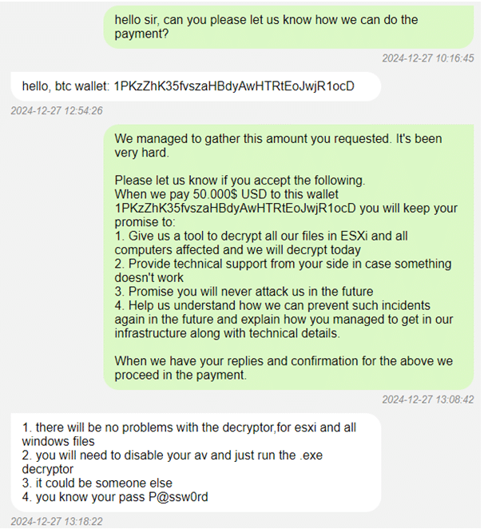
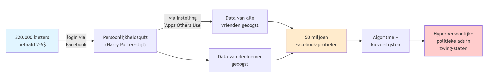
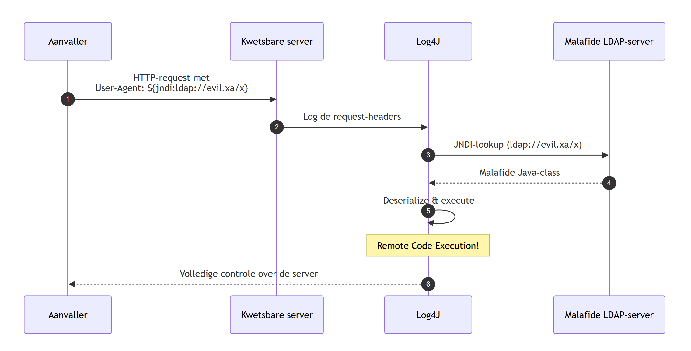

# Wordt het erger?

::: {.callout-note title="Leerdoelen"}
Na dit hoofdstuk kan je:

1. **De evolutie van cyberaanvallen in het voorbije decennium schetsen** aan de hand van kernmomenten (Stuxnet, Snowden, ransomware-golf, AI-dreigingen).
2. **Uitleggen waarom cyberaanvallen impact hebben ver buiten de digitale wereld** — van kritieke infrastructuur tot geopolitiek en democratie.
3. **De rol van AI aan beide zijden van de wapenwedloop duiden**: als offensief wapen én als verdedigingsinstrument.
4. **De paradox *"attack sophistication ↑ / vereiste aanvallerskennis ↓"* toepassen** op een gegeven scenario om de gevolgen voor de verdediging in te schatten.
5. **White, grey en black hat hackers onderscheiden** en de spelregels van ethisch hacken in België (sinds februari 2023) correct toepassen.
:::

Het laatste decennium jaar is de (cyber)security wereld erg veranderd. Ze doet dit niet omdat ze daar zin in heeft, maar wel als antwoord op wat er gebeurt in de wereld omtrent cyberaanvallen, geopolitieke situaties, etc. 

Het is altijd een kat en muisspel, waarbij de boswachters helaas bijna altijd zullen achterlopen op de stropers. De kwaadwillige hackers hoeven maar één klein gaatje te vinden in je peperdure beveiliging en ze zijn binnen. Terwijl jij als boswachter wel aan alles moet (proberen te) denken. Dat het erger wordt, is eigenlijk daarom bijna automatisch een evidentie. De wereld van de beveiliging gebeurt per opbod en hoe beter de boswachters het bos kunnen verdedigen, hoe complexer de technieken zullen worden die de stropers hanteren.

In de volgende secties geven we een klein historisch overzicht van enkele belangrijke, interessante of spectaculaire gebeurtenissen die hebben plaatsgevonden in de cyberwereld de voorbije jaren. Dit laat ons toe om enerzijds enkele begrippen te duiden, anders om de vraag "wordt het erger?" te beantwoorden.

::: {.callout-note}
We gebruiken de term cyber om alles aan te duiden dat zich afspeelt op de digitale snelweg, namelijk het Internet, de *cloud*, het www, en alle synoniemen en aanverwanten.
:::

## Het voorbije decennium

We zullen geregeld terug in de tijd gaan om te bekijken hoe bepaalde cyberverdedigings- en aanvalstechnieken zijn ontstaan, maar in dit hoofdstuk gaan we enkel terug tot 2010. Het jaar waarin Mark Zuckerberg, CEO van Facebook, door Time Magazine tot persoon van het jaar werd uitgeroepen en ook waarin Apple de eerste IPad tablet aan het publiek toonde. Het was helaas ook het jaar waarin het boorplatform, Deepwater Horizon, voor één van de ergste milieurampen ooit zorgde, alsook het jaar dat 33 mijnwerkers anderhalve maand lang 700 meter diep opgesloten zaten in een mijn. Voor ons, als toekomstige cyberboswachters, is echter de meest cruciale gebeurtenis het ontdekken van **Stuxnet**.

### Voor 2010

Voor het ontdekken van Stuxnet in 2010 leek de cyberbeveiligingswereld wel een wereld van (relatieve) peis en vree. Het ergste dat kon gebeuren was dat je computer een virusje opdeed waardoor je mogelijk wat data, en vooral veel werkuren, kwijt raakte. Virussen, wormen en spam waren alomtegenwoordig maar waren eigenlijk niet meer dan luizen in de pels van de eindgebruikers. Tuurlijk, er werd een grondig gevloekt als een virus je foto's verwijderde of wanneer een worm zichzelf verspreidde naar je contacten - denk maar aan het *ILOVEYOU* virus dat als een soort *social engineer* mensen deed geloven dat ze een potentiële liefdesmatch hadden waarop ze vol spanning de bijlage openden en zo de worm *in huis haalden*. Of wat te denken van de *Conficker* worm die in 2008 meer dan 3 miljoen systemen kon besmetten en telkens de update-services van het Windows toestel uitschakelde. Uiteraard, dat was irritant, maar menig mens zou maar al te graag terug naar die tijd willen gaan als daarmee ransomware, botnets en door overheden gesponsorde cyberaanvallen onbestaande zouden zijn.

:::note
De termen worm, virus en malware zullen geregeld door elkaar worden gebruikt in deze cursus. Alle drie betekenen net niet hetzelfde, maar  toch:

* Een **virus** is een kwaadaardig programma dat, eens het op een computer of apparaat staat, digitale schade kan aanbrengen.
* Een **worm** daarentegen is ook een virus, maar eentje dat zichzelf kan *voortplanten* naar andere systemen, iets wat een virus niet kan. Een worm kan zichzelf dus verspreiden zonder menselijke hulp.
* **Malware** is een overkoepelende term voor alle programma's en code die digitale schade aan een systeem of netwerk brengen. Virussen en wormen behoren dus tot deze groep.

Naast deze drie termen zullen we ook nog enkele andere malware types tegenkomen zoals Adware, spyware, spam, trojans, backdoors en rootkit. Wanneer nodig zullen we deze termen toelichten. Onthoud nu alvast dat malware de algemene naam is voor alle malafide software.
:::

### 2010: En dan verscheen Stuxnet

Virussen konden computers (tijdelijk) onbruikbaar maken. OK, lastig, maar niet het einde van de wereld. De Stuxnet worm die in 2010 plots op de radar verscheen kon dat potentieel wel: de wereld beëindigen! Het was een worm die op maat was gemaakt om zogenaamde **PLCs** (*Programmable Logic Controllers*) te controleren. Héél veel van onze kritische infrastructuur is geautomatiseerd met behulp van deze PLCs , krachtige apparaten die machines kunnen aansturen zoals liften, robotarmen aan assemblagelijnen, zuiveringsinstallaties en zelfs kernreactors. PLCs vormen de interface tussen machines (hardware) en de computers (met software op) die de operatoren gebruiken om deze machines opdrachten te geven. Operators kunnen op hun systemen de machines bedienen en te allen tijde controleren of deze naar behoren werken. 

Wat Stuxnet deed was zich tussen de hardware en de software nestelen. Als een worm besmette het laptops en computers en zocht het of er PLC-bedieningssoftware aanwezig was op het toestel. Als dat het geval was dan plaatste het zichzelf er tussen in zodat het:

1. de machines opdrachten kon geven zonder dat de operator dit wist.
2. aan de operator kon vertellen dat alles in orde was, terwijl in realiteit de PLC mogelijk desastreuze opdrachten aan de hardware gaf.

, auteur Grixlkraxl, CC BY-SA 3.0.](assets/step7_communicating_with_plc.svg){ width=70% }

, auteur Grixlkraxl, CC BY-SA 3.0.](assets/stuxnet_modifying_plc.svg){ width=70% }

We moeten er geen tekeningetje bij maken wat de effecten kunnen zijn indien een Stuxnet variant bewust werd ingezet om bijvoorbeeld de machinerie in een kerncentrale of waterdam te saboteren. Zonder in details van Stuxnet in te gaan is het duidelijk dat het verschijnen van dit virus een ommekeer betekende qua potentiële gevolgen van een cyberaanval: mensenlevens stonden plots op het spel, niet enkel onze dierbare e-mails en digitale vakantiefoto's.

::: {.callout-note}
Stuxnet bleek een worm te zijn die probeerde een specifiek soort centrifuge te saboteren: namelijk de centrifuges die Iran gebruikte om uranium te verrijken. De inlichtingendiensten van de Verenigde Staten en Israël zouden klaarblijkelijk Stuxnet hebben ontworpen om zo dit verrijkkingsproces van uranium in Iran te dwarsbomen. 
:::

::: {.callout-important}
**Airgapped systems don't exist.** De Iraanse Natanz-verrijkingsinstallatie was bewust níet met het Internet verbonden (*air-gapped*): een klassieke beveiligingsmaatregel voor kritieke infrastructuur. Toch raakte Stuxnet binnen. Hoe? Via geïnfecteerde USB-sticks die door werknemers (bewust of onbewust) werden binnengebracht. Stuxnet bewees daarmee een pijnlijke waarheid: een volledig van het Internet afgesloten systeem bestáát in de praktijk zelden of nooit — mensen, USB-sticks, updates en onderhoudsapparatuur vormen altijd bruggen die aanvallers kunnen misbruiken.
:::

.jpg), auteur Parsa 2au, CC BY-SA 4.0.](assets/atomanlage_natanz_2022.jpg){ width=70% }

::: {.callout-tip}
In september 2019 onthulde Yahoo News ([*"How a secret Dutch mole aided the U.S.-Israeli Stuxnet cyberattack on Iran"*](https://www.yahoo.com/news/revealed-how-a-secret-dutch-mole-aided-the-us-israeli-stuxnet-cyber-attack-on-iran-160026018.html)) hoe een door de Nederlandse AIVD gerekruteerde Iraanse ingenieur, zich voordoend als monteur, fysieke toegang had tot de Natanz-installatie en zo Stuxnet-code binnenbracht. Een mooi voorbeeld van hoe cyberaanvallen op kritieke infrastructuur vaak ook een ouderwetse spionage-component hebben.
:::

::: {.callout-tip}
Wens je meer te weten over Stuxnet? Dan raden we je de uitstekende, in 2016 verschenen, documentaire "Zero Days" door Alex Gibney aan. Deze documentaire geeft een zeer ontluisterend én boeiend beeld over de zoektocht naar de oorsprong van het Stuxnet virus.
:::

### 2013: Onze privacy te grabbel gegooid

Surfen op het Internet was altijd een risico. We wisten in 2013 al lang dat onze datapakketjes over tientallen apparaten doorheen het Internet worden getransporteerd om zo tot bij hun doel te geraken. Cookies volgden al geregeld onze stappen en ook de aanbevelingen van Amazon waren soms akelig accuraat. Dat was de prijs die we moesten betalen om de ontelbare bronnen van het Internet te kunnen gebruiken. En als je echt wat meer privacy nodig had, dan schakelde je de "incognito" modus in van je browser. Maar ook dan was je je ervan bewust dat zelfs je ISP (*Internet service provider*) en je doel konden meekijken. Hoe erg kan dat zijn?

Die gedachte leefde bij veel mensen tot dan: het Internet was een nuttige tool en je wist dat er kon meegekeken worden door *derden* als ze dat echt wilden. Maar zou dit nu echt consequent en op grote schaal gebeuren? Neen toch?!

Dat glazen huisje werd in 2013 hardhandig aan diggelen geslagen door twee belangrijke personen:

* **Edward Snowden**: als (contractueel ingehuurde) systeembeheerder bij de NSA, de Amerikaanse inlichtingendienst gericht op elektronische spionage, had hij toegang tot het doen en laten van de dienst. Snowden lekte een grote hoeveelheid top-secret documenten naar de bevolking die onder andere het *PRISM*-programma uit de doeken deed. Hieruit bleek dat de NSA een complexe samenwerking had met enkele grote Amerikaanse Internetbedrijven (o.a. Microsoft, Google, Facebook, Apple, etc.) die zogenaamde *taps* op hun systemen hebben staan zodat de NSA "kan meeluisteren" op de netwerken.

, Laura Poitras / Praxis Films, CC BY 3.0.](assets/edward_snowden-2.jpg){ width=50% }

, NSA, public domain.](assets/prism_slide_5.jpg){ width=75% }

* **Julian Assange**: er zijn altijd klokkenluiders (*whistleblowers*) geweest die om persoonlijke overtuigingen vonden dat bepaalde informatie met het publiek moesten worden gedeeld. Zeker in dictatoriale middens kan dit levensgevaarlijk zijn. Aan het eind van de 20e eeuw kregen deze klokkenluiders echter een krachtig apparaat om hun nieuws veilig te verspreiden: het Internet.  Julian Assange besefte dit en richtte daarom in 2006 Wikileaks op. Een site waar klokkenluiders op een anonieme manier documenten konden *lekken*. Tot 2010 zijn zo enkele erg controversiële documenten met de wereld gedeeld die soms verregaande diplomatieke of geopolitieke gevolgen hadden. Het lot van Assange is nog steeds onduidelijk: momenteel wordt hij in het Verenigd Koninkrijk in hechtenis gehouden en voert hij hevig strijd (via de rechtbank) om niet uitgeleverd te worden aan de Verenigde Staten.

, auteur Periodismodepaz, CC BY 4.0.](assets/julian_assange_in_2008.jpg){ width=50% }

::: caution
Het is niet evident om over mensen als Assange en Snowden te praten zonder in een controversiële modderpoel te geraken. Voor de één is Snowden een held, voor de ander een verrader. In dit boek trachten we een objectief beeld, zonder waardeoordelen, te geven. Wat wel buiten kijf staat is dat zowel Snowden als Assange de wereld getoond hebben dat er in de duistere wandelgangen van de veiligheidsdiensten zaken gebeuren waar "normale stervelingen" zelden weet van hebben.
:::

Het waren vooral de onthullingen van Snowden die bij velen de oogkleppen deed afvallen. Op het Internet ben je hoegenaamd niét anoniem. Grote (en kleine) mogendheden en privéfirma's kunnen ons doen en laten op het Internet bekijken, bewaren en analyseren. Privacy en het Internet zijn een *oxymoron*: een contradictorische term zoals zwarte sneeuw. Wanneer je je op het Internet begeeft, op welke manier ook, gooi je een deel van je privacy te grabbel. En dat is iets dat helaas de voorbije tien jaar er niet op verbeterd is (alhoewel het **Tor** netwerk met z'n *onion routing* toch wel een stevige extra privacy laag kan aanbieden).

::: {.callout-note}
Een uitspraak van Snowden die sindsdien het privacy-debat domineert:

> *"Arguing that you don't care about the right to privacy because you have nothing to hide is no different than saying you don't care about free speech because you have nothing to say."*
:::

::: {.callout-note}
PRISM was slechts één onthulling. De Snowden-documenten legden een hele reeks NSA-programma's bloot:

* **PRISM**: rechtstreekse toegang tot data bij Microsoft, Google, Apple, Facebook, etc.
* **Bulk phone metadata collection**: telefonie-metadata van miljoenen Amerikanen massaal verzameld
* **XKeyscore**: wereldwijde realtime-zoekmachine over internetverkeer
* **Tempora**: *fibertaps* op trans-Atlantische glasvezelkabels door de Britse GCHQ
* Gerichte **verzwakking van encryptiestandaarden** (o.a. via NIST)
* **Tapping** van smartphones van ontelbare burgers
* 50.000+ *sleeper*-implants op computers wereldwijd
* Spionage op **buitenlandse staatsleiders** (waaronder Angela Merkel)
* Gerichte aanvallen op **systeembeheerders** om toegang tot hun netwerken te krijgen
:::

::: {.callout-tip}
Een interessant debat dat altijd opduikt bij deze problematiek is de "Ik heb toch niets te verbergen"-houding. In het kleine maar fijne boekje "Je hebt wél iets te verbergen" van onderzoeksjournalisten Maurits Martijn en Dimitri Tokmetzis (ISBN 9789082821611) wordt onherroepelijk brandhout gemaakt met deze stelling. Finaal zijn we volledig afhankelijk van de online diensten die we gebruiken en wat ze met onze data nu én belangrijker, in de toekomst zullen doen. Privé-informatie over jou die nu ogenschijnlijk ongevaarlijk lijkt, kan dat potentieel in de toekomst wel zijn wanneer normen, waarden of wetten veranderen. 
:::

::: {.callout-note title="Een historische waarschuwing: het Amsterdams bevolkingsregister"}
Dat informatie die vandaag onschuldig lijkt morgen dodelijk kan zijn, is helaas geen theoretische bedreiging. Nederland stond voor de Tweede Wereldoorlog bekend om zijn buitengewoon nauwkeurige en goed georganiseerde **bevolkingsregister**. Burgers gaven hun gegevens — adres, gezinssamenstelling én ook hun godsdienst — te goeder trouw door, puur voor alledaagse administratie. Niemand kon vermoeden waartoe die keurig bijgehouden kaartenbakken ooit zouden dienen.

Toen nazi-Duitsland Nederland bezette, werd net dat voorbeeldige register het ideale instrument om Joodse burgers op te sporen, te deporteren en te vermoorden. Vervalste identiteitspapieren van het verzet konden bovendien eenvoudig ontmaskerd worden door ze te vergelijken met de originele registratiegegevens.

Het verzet besefte de dodelijke waarde van die data. In de nacht van **27 maart 1943** pleegde een verzetsgroep een aanslag op het bevolkingsregister in Amsterdam, in een wanhopige poging de gegevens van zo'n 70.000 Amsterdamse Joden te vernietigen. De aanslag slaagde slechts gedeeltelijk: ongeveer 15% van de gegevens ging verloren. Twaalf deelnemers werden opgepakt en op **2 juli 1943** gefusilleerd..

De les voor de (toekomstige) cyberboswachter is universeel en tijdloos: data die je vandaag verzamelt of deelt, blíjft bestaan. Wie er ooit toegang toe krijgt — een toekomstige werkgever, een verzekeraar, of in het ergste geval een kwaadaardig regime — en met welke bedoelingen, heb je op het moment van registreren niet meer in de hand.
:::

### 2014: Hoe veilig is *the cloud* ?

In 2014 vond er een controverse plaats die vooral de puberende tiener zich zal herinneren: *"The fappening"*. Deze naam laat weinig aan de verbeelding over en dekt de lading goed. In het jaar dat Oekraïne Russische legers zag binnenrollen om de Krim (terug) in te palmen, verschenen er duizenden privéfoto's van een honderdtal *celebrities* op het Internet. Deze,vaak weinig verhullende, privéfoto's hadden kwaadwillige hackers van de Apple iCloud accounts van de slachtoffers gestolen en vervolgens gepubliceerd via Reddit, 4chan, etc. De foto's verspreidden zich als een lopend vuurtje en de slachtoffers konden enkel toezien hoe hun in de privésfeer opgenomen beelden door miljoenen mensen werden gedownload. 

De beroemdheden hadden hun foto's in de cloud-opslag van Apple bewaard zoals op dat moment duizenden gebruikers ook al deden. Deze dienst zorgt ervoor dat je je als eindgebruiker van eender waar aan je foto's kan, daar ze "in the cloud" staan, wat door de spectaculaire groei van de smartphones (en iPhones in dit geval) een populair concept was geworden. Ook diensten zoals Dropbox, Onedrive (toen nog SkyDrive) toonden aan dat er een grote vraag was naar online opslag van (privé-)informatie. 

Om dergelijke diensten te gebruiken dien je natuurlijk een veilig wachtwoord te hebben, daar eender wie, van eender waar, kan proberen zich een weg naar je data te verkrijgen door jouw wachtwoord te raden. In 2014 waren concepten zoals 2-factor-authentication (2FA) en biometrische beveiliging (meer daarover in hoofdstuk 5) nog niet zo populair en dus was je geheime wachtwoord je enige bescherming tegen onrechtmatige toegang tot je data.

De diefstal van de foto's werd echter vergemakkelijkt door twee redenen:

* Sommige slachtoffers gebruikten makkelijk te raden, of snel te bruteforcen wachtwoorden.
* Anderen hadden de beveiligingsvragen ter goeder trouw ingediend. Veel diensten stellen een extra beveiligingsvraag (zoals "Wat is de naam van je eerste huisdier?" of "Op welke school zat je vader?") die ze kunnen gebruiken om jouw identiteit te verifiëren indien je je eigen wachtwoord vergeten bent en je dit wenst te resetten. Wanneer jij of ik dit soort vragen invullen dan is dit 90% van de tijd informatie die nergens te vinden valt, enkel in de grijze massa in je hoofd en misschien in een gênant dagboekje uit je jeugd. Bij de Amerikaanse beroemdheden wiens iCloud werd gehackt, is dat niet zo. Hun leven kan volledig gereconstrueerd worden aan de hand van de ontelbare interviews die ze al hebben gegeven. Gegarandeerd dat ooit een interviewer al heeft gevraagd wat de kleur van zijn of haar eerste auto was, of in welk dorp hij of zij is opgegroeid. 

::: {.callout-note}
In de nasleep van de hack doken in ondergrondse fora kopieën op van de **Elcomsoft Phone Password Breaker (EPPB)**, een forensisch tool dat normaal gezien aan politiediensten wordt verkocht om iCloud-backups uit te lezen. Door een gestolen Apple ID + wachtwoord in combinatie met EPPB kon een aanvaller de volledige iCloud-backup van een slachtoffer downloaden, inclusief foto's, berichten en contactgegevens. Het illustreert een terugkerend patroon: *dual-use* forensische tools (bedoeld voor legitiem gebruik) belanden regelmatig in verkeerde handen.
:::

::: {.callout-warning} 
Het is een verkeerde reflex om in dit soort zaken ogenblikkelijk aan *victim shaming* te doen (kijk maar naar het recentere voorval waarbij enkele Bekende Vlamingen het slachtoffer waren van catfishing). Ieder doet en laat wat hij wenst in z'n privésfeer - daarom heet het ook privé - maar het is belangrijk te beseffen dat als je zaken *in the cloud* bewaard, de kans bestaande is dat iets of iemand er ooit onrechtmatige toegang tot zal krijgen. U weze gewaarschuwd.
:::

::: {.callout-tip}
Niemand verplicht je om op de beveiligingsvragen een eerlijk antwoord te geven. Er bestaat geen leugendetector in die systemen of een mama die op je vingers komt tikken. Lieg er dus op los, maar onthoud uiteraard je antwoord. Dankzij die beveiligingsvragen hou je echter een stok achter de hand moest je je wachtwoord vergeten zijn. 
:::

### Ook in 2014: als landen vechten

Het was te verwachten dat ook op cyberniveau er ooit een cyber-wapenwedloop zou starten zoals, helaas, ook in de echte wereld plaatsvindt. Daar waar landen voorheen nog vooral defensieve cybermogelijkheden hadden, begon halverwege het vorige decennium dit arsenaal meer en meer uitgebreid te worden met offensieve cyberwapens. Het was met andere woorden wachten op de eerste cyberaanvallen door een soevereine staat op een andere staat. 

Het probleem met cyberaanvallen is dat het als aangevallen mogendheid ongelooflijk moeilijk is om juist te reageren:

1. De bron van de aanval identificeren is soms onmogelijk. Wie weet lijkt de aanval te komen vanuit land X, terwijl het eigenlijk land Y is dat gewoon de aanval via land X routeert. En het laatste dat je natuurlijk wil doen is het verkeerde land beschuldigen (of aanvallen).
2. Wat als een hacker, zonder staatsinmengingen, beslist om op eigen houtje een cyberaanval te initiëren. Is het land van herkomst van die aanvaller dan verantwoordelijk voor de geleden schade?
3. De "schade" van een cyberaanval is niet altijd duidelijk. Wanneer een raket op een stad wordt afgestuurd is dat een duidelijk *act of aggression* en is er grote kans op een militair conflict (indien de diplomatieke weg geen soelaas brengt). Maar is een cyberaanval, zoals een denial-of-service (DoS, zie later), genoeg reden om de oorlog buiten het cyberdomein te escaleren? Zijn er eigenlijk *rules of engagement*? Is er een conventie van Genève? Neen op dit alles. Daar cyberaanvallen zo moeilijk te traceren en identificeren zijn, blijft het allemaal het betere nattevingerwerk.

Een bewuste cyberaanval op een soevereine staat is al een enkele keren gebeurd (denk maar aan de cyberaanvallen in 2007 van Rusland op Estland) maar in 2014 was er helaas een nieuwe primeur (Stuxnet krijgt eigenlijk die primeur, maar dat werd pas veel later bevestigd). Ook nu gaan we naar Hollywood, niet om de beroemdheden en hun privé-kiekjes, maar omwille van een film waar een andere staat niet om kon lachen.

In 2014 zou Sony een nieuwe film uitbrengen, getiteld "The Interview", met James Franco en Seth Rogan. In deze komedie worden twee journalisten gevraagd om tijdens hun interview van een *fictieve* Noord-Koreaanse dictator hem te doden. De vergelijkingen met de Noord-Koreaanse leider Kim Jong-un waren voor iedereen duidelijk. Dat Noord-Korea op de tenen zou zijn getrapt, stond dan ook in de sterren geschreven.

De daaropvolgende gebeurtenissen zijn nog steeds niet uitgeklaard, maar vast staat wel dat een selecte groep hackers toegang had gekregen tot confidentiële data op de servers van Sony en deze vervolgens op het Internet lekte. De financiële schade voor Sony was enorm. De daders wisten onuitgebrachte films, e-mails, salarissen en andere privé-informatie te stelen. Heel lang werd gedacht dat de groeperingen die achter de aanval stonden door Noord-Korea waren aangestuurd. Echter, tot op de dag van vandaag heeft men dat niet kunnen bevestigen. Zo zijn er ook experts die denken in het bewijsmateriaal de hand van Rusland en/of China te zien. Kortom, zoals eerder gezegd, cyberaanvallen zijn verdomd lastig om in kaart te brengen.

Als het toch Noord-Korea zou zijn geweest - wat nog steeds meer dan mogelijk is - dan hebben ze hiermee dus een dubieuze primeur: een soeverein land voert een cyberaanval uit op een bedrijf in een ander land. En de vraag die vervolgens veel experten zich stelden was: "Vanaf wanneer is dit een *act of aggression*?", en ook: "Moet een land op dit soort aanval reageren namens het bedrijf, of namens de hele natie waar het bedrijf zich bevindt?" Wie zal het zeggen. Dit boekje helaas niet, maar het geeft wel voer voor discussie.

### 2015: Stuxnet bewaarheid

Keer op keer zullen we dit moeten herhalen: we kunnen nooit met 100% zekerheid de origine van een cyberaanval vaststellen. Heel af en toe, met dank aan klokkenluiders zoals Snowden, of verregaand (al dan niet journalistiek) onderzoek worden specifiek aanvallen volledig uit de doeken gedaan (maar helaas vaak jaren na datum).

In 2015, iets meer dan een jaar na de Sony aanval, werd dat waar we voor vreesden bewaarheid: hackers waren er in geslaagd om de elektriciteitsinfrastructuur van Oekraïne deels plat te leggen op 23 december, vlak voor kerstavond. Een groepering slaagde er zo in om bijna een kwart miljoen mensen gedurende meerdere uren zonder stroom te zetten. De malware die hiervoor werd gebruikt, kreeg later de naam **Industroyer** (ook wel *CrashOverride* genoemd): de eerste malware ooit die specifiek was ontworpen om elektriciteitsnetten te saboteren. Iedereen keek uiteraard ogenblikkelijk in de richting van Rusland - Oekraïne maakte vroeger deel uit van de voormalige Sovjetrepubliek - daar de aanvallen kwamen van IP-adressen die waren toegewezen aan Rusland. Maar zelfs als dat zou zijn, zonder harde bewijzen dat de hackers ook handelden in naam van de Russische overheid blijft het koffiedik kijken wie *op de vingers getikt* moet worden voor de aanval.

Wie het ook waren, één ding staat wel vast: in 2015 waren hackers er voor het eerst in geslaagd om met één welgemikte aanval honderdduizenden mensen in problemen te brengen, problemen die verder gingen dan het verwijderen van enkele bestanden.

Enkele jaren later, in februari 2021, zou het trouwens weer bijna prijs zijn. Een hacker kreeg toegang tot de systemen die de waterzuiveringsinstallaties van Oldsmar (Florida, VS) bediende. Een operator zag op tijd dat z'n muis plots bewoog en de maximum toegelaten hoeveelheid natriumhydroxide waarde van de filters op een dodelijk niveau zette. Er werd gelukkig tijdig ingegrepen (en detectoren verderop in het systeem hadden het vergiftigde water sowieso gedetecteerd), maar het deed wederom de vraag rijzen of onze kritische systemen wel voldoende beveiligd zijn tegen dit soort *lone wolves*.

::: {.callout-tip}
Sinds de oorlog in Oekraïne is uitgebroken zien we ook terug verregaande cyberactiviteit vanuit Rusland. De eerste weken van de oorlog (februari 2022) was het opvallend stil en leek het alsof *de angst voor Russische cyberoorlog* ongegrond was. Ondertussen zijn we helaas meer dan een jaar verder en verschijnen er meer en meer verhalen, zoals verwacht, van Russische cyber-inmenging. [Volgende artikel geeft een heldere tijdslijn hiervan.](https://www.europarl.europa.eu/thinktank/en/document/EPRS_BRI(2022)733549)

{ width=70% }
:::

::: {.callout-note}
Microsoft monitort al geruime tijd de vele fake news bronnen die Rusland rijk is. Er wordt zelfs een **Russian Propaganda Index** (RPI) bijgehouden die aangeeft hoe actief de Russische trolls momenteel zijn in het verspreiden van bewezen onwaarheden (o.a. over de oorlog in Oekraïne, binnenlands beleid van andere mogendheden, COVID-19 vaccins, etc.)

{ width=70% }
:::

### 2014-2015: Megaexploits in de fundamenten

Tussen alle spectaculaire aanvallen door, kwamen er in deze jaren ook twee bugs aan het licht die aantoonden hoe broos het **fundament** van het Internet is: bugs in bibliotheken die zó veel gebruikt werden dat een enkel gaatje plots de halve wereld kwetsbaar maakte.

* **Heartbleed** (2014): een kwetsbaarheid in **OpenSSL**, de bibliotheek die ontelbare webservers, routers en apparaten gebruiken om TLS/HTTPS-verbindingen op te zetten. Door een verkeerd gecontroleerde buffer-lengte kon een aanvaller kleine brokjes servergeheugen uitlezen — inclusief privésleutels, wachtwoorden en sessietokens. Maanden na de publieke bekendmaking waren er wereldwijd nóg steeds 200.000+ kwetsbare apparaten online.

, CC0.](assets/heartbleed.svg){ width=25% }

* **Shellshock** (2014): een familie van bugs in de Linux **Bash**-shell waardoor een aanvaller via speciaal geprepareerde omgevingsvariabelen **elk commando** op de server kon laten uitvoeren. Aangezien Bash aanwezig is op bijna elke Linux- en macOS-server, was de impact gigantisch.

, auteur Bf5man, CC0.](assets/shellshock_logo_lock.svg){ width=25% }

Beide bugs zaten al **jaren** in de code voor iemand ze ontdekte. Het is een vroege waarschuwing voor wat we later bij **Log4J** (2021) en **XZ Utils** (2024) opnieuw zouden zien: de open-source bibliotheken waarop het Internet draait, worden zelden grondig doorgelicht — en als er iets misgaat, gaat het gigantisch mis.

### 2015: Scheidingen en zelfmoord

In 2015 wordt de schaal van cyberaanvallen steeds groter. De hoeveelheden informatie die hackers van bedrijven kunnen bemachtigen kunnen al lang niet meer op één A4'tje afgedrukt worden. Wanneer hackers toegang krijgen tot de privé-servers van hun doelwit kunnen ze vlotjes ettelijke gigabytes, tot zelfs terabytes, aan privé informatie stelen. Tegenwoordig hebben we in Europa de GDPR wetgeving die probeert bedrijven duidelijk te maken dat zij verantwoordelijk zijn om onze data op een veilige manier te bewaren (zie appendix) en hen ook te straffen indien ze dit niet doen. In 2015 was dat veel minder. De datalekken in die tijd spraken boekdelen: van zodra cybercriminelen toegang hadden tot de privéservers konden ze de data zonder problemen lezen. Paswoorden, kredietkaartgegeven, rijksregisternummers, alles stond vaak onbeveiligd (*ongeëncrypteerd*) op de systemen.

De Ashley Madison website was Tinder voor mensen die een relatie wilden naast hun "officiële relatie". Kortom, de site hielp mensen aan een affaire. Hun leuze, *"Life is short. Have an affair"*, wond er geen doekjes rond. En met hun meer dan 20 miljoen "klanten" was het duidelijk dat ze een lucratief idee hadden. Dat ze tegenwind zouden krijgen was te verwachten...

, public domain.](assets/ashley_madison_logo.png){ width=40% }

In juli 2015 plaatste een groep hackers een ultimatum op een website aan het adres van de eigenaars van Ashley Madison: *"Haal jullie moreel dubieuze website van het Internet, of wij plaatsen meer dan 60 gigabyte aan gestolen data online"*. De site werd niet offline gehaald en de hackers "hielden woord." De gevolgen waren immens, niet zo zeer voor Ashley Madison zelf, wel voor de klanten. Plotsklaps kreeg de wereld een lijst te zien waarin honderdduizenden klanten open en bloot aan de schandpaal werden genageld. Mensen werden publiekelijk vernederd. Er is sprake van minstens twee zelfmoorden rechtstreeks als gevolg van het lek. Mensen werden ontslagen. Kortom, het lekken van wat uiteindelijk maar een hoop binaire data was, had gevolgen op relaties, mensenlevens en carrières. 

Als positieve noot in dit verhaal halen we hier uit dat dit soort gigantische lekken mensen heeft doen inzien dat ze tweemaal moeten nadenken voor ze hun persoonlijke informatie weggeven aan één of andere Internet-gigant (het is helaas een les die we jaarlijks lijken te vergeten, kijk maar naar de populariteit van Tik Tok, Facebook, etc.). 

::: caution
Een stelregel die bedrijven nu hanteren is de volgende: vraag je niet af **of** je gaat gehackt worden maar vraag je af **wanneer** je zal gehackt worden. Dit is een heel andere manier van tegen je beveiligingsprobleem aankijken. Vergelijk het met het in huis halen van een koffer met daarin 10 miljoen euro aan diamanten. Als je je afvraagt of er ooit inbrekers zullen binnen geraken en daar naar beveiligt - waakhonden, videocamera's rond het huis, dubbel slot - dan heb je daar niets aan als ze vervolgens toch binnen geraken en je koffertje stelen. Veel beter kan je én je huis beveiligen, én ervan uitgaan dat ze de koffer gaan bemachtigen: en je dus maar beter ook ervoor zorgt dat de dieven niets met de diamanten kunnen doen (door bijvoorbeeld je naam er in te graveren).

Kortom: bedrijven moéten data die ze van ons opslaan minstens encrypteren en systemen inbouwen die de data onbruikbaar maken als ze toch gelekt zou worden.
:::

### 2016: Niet altijd heb je dure technologie nodig

> *"Because there is no patch for human stupidity."*

Terwijl staten miljarden uitgaven aan offensieve cyberwapens, toonde een 16-jarige Britse tiener (onderdeel van het collectief **Crackas With Attitude**) aan dat je soms helemaal geen geavanceerde tools nodig hebt. Met puur **social engineering** — overtuigende telefoontjes naar helpdesks en support-medewerkers — wist hij:

* In te breken in de **AOL-mailbox van CIA-directeur John Brennan**
* Toegang te krijgen tot mail- en telefoonaccounts van de Amerikaanse spionage-chef James Clapper
* De AOL-mail van **FBI Deputy Director Mark Giuliano** te kraken
* Persoonlijke gegevens van **31.000 federale agenten** (FBI, DHS, DoJ) te lekken

Dat een tiener met een telefoon de Amerikaanse topveiligheidsdiensten kon binnendringen, werd voor veel organisaties een wake-up call: **de mens blijft de zwakste schakel**. Geen firewall ter wereld beschermt je tegen een medewerker die ter goeder trouw een wachtwoord reset voor "meneer Brennan aan de lijn".

Deze les zouden we in 2022-2024 opnieuw (en véél pijnlijker) geleerd krijgen met de **Lapsus$**- en **Scattered Spider**-aanvallen, die we verderop bespreken.

::: {.callout-tip}
Verderop in dit hoofdstuk komen termen als *MFA fatigue*, *vishing* en *deepfakes* meermaals langs. We leggen ze ter plaatse kort uit, maar de volledige definities en bijhorende technieken (pretexting, baiting, BEC, ...) bespreken we systematisch in het volgende hoofdstuk onder *Social Engineering*.
:::

### 2016: Internet-of-horrors

In onze huizen verschenen steeds meer apparaatjes die via het, meestal draadloze,  netwerk met elkaar en het Internet konden communiceren. Internet-of-Things (IoT) bracht een weelde aan nieuwe oplossingen in onze levens. Domotica, wearables, slimme thermostaten, beveiligingssystemen, weegschalen, alles werd én slimmer gemaakt én aan het Internet gehangen.

Een inherent probleem met veel van deze, meestal kleine, toestellen is dat ze op het gebied van beveiliging ondermaats presteren. Dergelijke IoT-apparaten werken vaak op batterijen en de makers willen natuurlijk de batterijduur zo lang mogelijk houden. Iedere extra feature die de designers in het apparaat willen steken heeft een kost op die levensduur. Een aspect zoals beveiliging werd dan ook vaak achteraan de lijst van potentiële features geplaatst. Komt daarbij dat IoT-apparaten updaten (met bijvoorbeeld nieuwe security patches) soms onmogelijk of tenminste omslachtig is. Als er dus een beveiligingslek wordt gevonden in een apparaat, dan is de kans bestaande dat dit lek voor altijd aanwezig zal blijven én dus ook kan misbruikt worden. 

Het was dus wachten tot de eerste aanvallen, specifiek gericht op IoT-apparaten, zouden plaatsvinden. De meest opvallende aanval gebeurde eind 2016. Malware, genaamd Mirai, verspreide zich als een lopend vuurtje over IoT-apparaten waarvan de malware het standaard wachtwoord en username kende.

, Everaldo Coelho & YellowIcon, LGPL.](assets/stachledraht_ddos_attack.svg){ width=70% } 

Gebruikers die vergeten waren het wachtwoord aan te passen, dat het apparaat heeft wanneer je het uit de doos, haalde zaten zo plotseling met een ogenschijnlijk perfect werkend, maar besmet apparaat. Echter, de malware nestelde zich onzichtbaar op het apparaat en wachtte op commando's van de Mirai makers. De malware creëerde met andere woorden een zogenaamde *botnet*, een groot netwerk van besmette apparaten die allemaal commando's kunnen uitvoeren van de *botnet herder* (i.e. degene die de malware in de eerste plaats is beginnen verspreiden). De Mirai-makers hadden zo een leger minicomputers onder hun bevel die ze konden zeggen "surf nu allemaal naar die website". Een website die plots tienduizenden gebruikers onverwacht extra te verwerken krijgt zal vaak onder de druk bezwijken en crashen. Kortom, dit Mirai botnet kon zo grote distributed denial-of-service (*DDOS*) aanvullen uitvoeren, allemaal omdat gebruikers de wachtwoorden van hun gloednieuwe apparaatjes niet hadden aangepast. In hun verdediging, het is vaak een erg omslachtig, technisch, proces om het wachtwoord van een IoT-apparaat aan te passen.

::: {.callout-tip}
De wildgroei van Internet-of-Things apparaten heeft ervoor gezorgd dat hackers een grote hoeveelheid extra mogelijkheden hebben bijgekregen om op huis en bedrijfsnetwerken te infiltreren. Of om het in hacker-termen te zeggen: dankzij de weelde aan IoT-apparaten is de *attack surface* voor aanvallers exponentieel vergroot.
:::

:::warning
Een dubieuze (deels betalende) site, **shodan.io**,  heeft als enige doel alle Internet-of-Things apparaten in kaart te brengen die zichtbaar zijn vanop het Internet. Deze "Google voor IoT" toont zelfs om wat voor apparaten het gaat en welke bijvoorbeeld nog steeds het standaard (default) wachtwoord hebben.
:::

### 2017: Ransomware wordt gemeengoed

De virussen in de vorige eeuw durfden al eens je data te verwijderen. Lastig, maar erg duidelijk: je data was je kwijt, tenzij je ergens een back-up had liggen. De nieuwe virussen gingen echter een stapje verder: ze versleutelden al je data (vaak ook je back-ups als je zo dom was geweest deze op het zelfde apparaat te hebben) én vroegen vervolgens losgeld in ruil voor je data. De naam *ransomware* kon, helaas, niet beter gekozen zijn. Menig particulier betaalde ogenblikkelijk om de eenvoudige reden dat de ransomware de gebruiker nog een uitweg aanbood daar ransomware vaak werd "binnengehaald" door een gênante actie (bv. illegale software downloaden, op reclame voor vage pornosites klikken, etc.). 

Voor particulieren was ransomware vooralsnog irritant. Maar wat als de ransomware bedrijfskritische data begon te encrypteren? Dit is exact wat er gebeurde in 2017 met de **WannaCry**- en **Petya/NotPetya**-ransomwares. De slachtofferlijst was indrukwekkend:

* **WannaCry** trof o.a. de Britse NHS (ziekenhuizen legden operaties stil), Telefónica, Deutsche Bahn, Renault en FedEx.
* **NotPetya** verlamde de scheepsreus Maersk (17 terminals wereldwijd stil), farmaciereus Merck, voedingsproducent Mondelez en talrijke banken.

De gecombineerde economische schade werd geschat op bijna **4 miljard dollar** voor WannaCry en **~10 miljard dollar** voor NotPetya. Bij ziekenhuizen ging het niet enkel om geld: het ging om mensenlevens.

De schade én de losgeldbedragen werden ook steeds groter. Zo was er het voorval met Garmin in de zomer van 2020 dat niet alleen de populaire sport-tracking diensten gedurende meerdere dagen uit de lucht haalde, maar er ook voor zorgde dat menig vliegtuig niet mocht vliegen omdat de Garmin Pilot apps niet werkten waardoor de piloten geen up-to-date aeronautische plannen voorhanden hadden. Het is nooit geweten of Garmin het losgeld (10 miljoen dollar!) wel of niet heeft betaald, vast staat wel dat ransomware tegenwoordig een, helaas, erg lucratieve handel is geworden voor cybercriminelen.

::: {.callout-note}
Een minder bekend maar sprekend voorbeeld: de Deense hoortoestelfabrikant **Demant** werd in 2019 getroffen door ransomware. De totale kost voor het bedrijf — productieverlies, herstel, verzekeringen — bedroeg **95 miljoen dollar**, ook al was er niet eens losgeld betaald. Ransomware-kosten zijn zelden beperkt tot het losgeld zelf; de indirecte schade is vaak een veelvoud.
:::

::: {.callout-note}
In december 2022 was Digipolis, de IT-backbone van de stad Antwerpen, het slachtoffer van een zeer impacterende ransomware aanval door hackercollectief Play (een soort spin-off van Conti, een Russische hackersgroep). Quasi alle online-diensten van de stad Antwerpen zijn meerdere dagen onklaar gemaakt, inclusief politie, brandweer, bibliotheken, zwembaden, stadsloketten, stedelijke scholen, etc. Quasi iedere burger heeft in meer of mindere mate last ondervonden van deze gigantische aanval. Het toont vooral ook weer aan hoe gevoelig ons digitale leven is en dat er altijd een keerzijde is de digitalisering.
:::

De WannaCry-ransomware maakt gebruik van een kwetsbaarheid in Windows (EternalBlue) die oorspronkelijk werd ontwikkeld als hackingtool door de NSA. In 2017 werd deze exploit gelekt door het hackerscollectief **The Shadow Brokers**. Hoewel Microsoft kort daarna een beveiligingspatch uitbracht, hadden veel organisaties deze nog niet toegepast. Zo konden criminelen WannaCry inzetten met gebruik van een NSA-wapen, met wereldwijd miljoenen dollars schade tot gevolg ... ironisch genoeg ook bij Amerikaanse bedrijven die de NSA net hoort te beschermen.

::: {.callout-note} 
Ondertussen weten we vrij zeker (uiteraard in de cyberwereld zal attributie nooit 100% bewezen kunnen worden) dat The Shadow Brokers Russische staatshackers waren. De voormalige NSA-onderzoeker David Aitel verwoordde het in 2019 treffend: *"I don't know if anybody knows other than the Russians. And we don't even know if it's the Russians. We don't know at this point; anything could be true."*
:::

::: {.callout-note}
Shadow Brokers was niet de eerste die NSA-cyberwapens publiekelijk maakte. Al in 2013 publiceerde *Der Spiegel* (op basis van Snowden-documenten) de **NSA ANT Product Catalog**, een soort "catalogus" van spionagehardware en -software van de NSA. Hierin stonden bizarre gadgets zoals **PICASSO**: een op maat gemaakte GSM die gesprekken, locatie en kamer-audio kan onderscheppen én een "panic button" voor de gebruiker bevat. De inhoud van deze catalogus leest als een James Bond-gadgetlijst, maar is volledig echt — en toont hoe ver staats-spionage in de digitale wereld gaat. [Volledige catalogus](https://www.cryptomuseum.com/covert/bugs/nsaant/files/NSA_ANT_20070108.pdf)
:::

::: {.callout-note}
De NSA-tools die Shadow Brokers lekte, werden daarna niet enkel door Russen gebruikt. In 2017 toonde de *New York Times* aan dat **Chinese staatshackers** vergelijkbare NSA-hackingtools (EternalBlue-varianten) hadden bemachtigd — waarschijnlijk door ze te onderscheppen toen de NSA zelf Chinese doelwitten aanviel, om ze vervolgens om te keren en tegen andere slachtoffers in te zetten. Cyberwapens zijn in die zin anders dan conventionele wapens: eenmaal gebruikt, kunnen ze worden gereverse-engineered en door de tegenstander tegen jou worden ingezet.
:::

::: {.callout-note}

WannaCry was de eerste **wormable ransomware**. Tot dan verspreidde ransomware zich voornamelijk via botnets of phishing mails. 
De ransomware werkte trouwens *te goed*. Het encrypteerde vaak ook essentiële bestanden waardoor de besmette computers niet meer opstartten. Hierdoor kregen de slachtoffers niet de mogelijkheid om terug te betalen, en kunnen we dus stellen dat de tool veel minder efficiënt werkte (vanuit het standpunt van de makers) dan verhoopt. 

::: 

In mei 2025 verschenen gelekte interne chatlogs van de ransomwaregroep LockBit, wat ongezien inzicht gaf in hun professionele werkwijze. De groep opereert als een Ransomware-as-a-Service-bedrijf met hiërarchie, *klantenservice*-achtige onderhandelingen en strikte deadlines. Van de 208 bekeken gesprekken leidde slechts 18 tot effectieve betalingen, vaak na forse kortingen, wat aangeeft dat ook cybercriminelen winstoptimalisatie en reputatie hoog in het vaandel dragen. 

Het lek toont tegelijk de kwetsbaarheid van organisaties: betalingen gebeurden omdat back-ups onbruikbaar waren, besluitvorming traag verliep of verzekeringen verkeerd werden ingezet. 

{ width=70% }

### 2018: Cyber meets georganiseerde misdaad — Haven van Antwerpen

Cybercrime bleef voor veel mensen een abstract, ver-van-mijn-bed-gevoel. Tot een zaak voor de Antwerpse correctionele rechtbank kwam die liet zien dat het ook bij ons, in eigen haven, plaatsvindt.

Een **32-jarige IT-specialist Filip M.** werd veroordeeld tot 8 jaar cel voor het hacken van meerdere havenbedrijven in de haven van Antwerpen, in opdracht van de internationale **cocaïnemaffia**. De modus operandi:

1. Verdovende middelen werden in gewone containers verstopt tussen legitieme lading (bv. bananen uit Zuid-Amerika).
2. Containers in de haven zijn afgeschermd met **pincodes** die enkel de rechtmatige ontvanger krijgt.
3. De gehackte havenbedrijven lekten die pincodes.
4. De drugsbende haalde de containers op alsof ze de wettige ontvanger waren, nog vóór de echte ontvanger iets doorhad.

Het toont hoe cybercrime en **georganiseerde misdaad** naadloos in elkaar overvloeien: een ogenschijnlijk onschuldige hack bij een havenbedrijf werd het sleutelonderdeel van een internationale drugssmokkelroute. [Meer lezen](https://www.hln.be/in-de-buurt/antwerpen/rechter-straft-it-specialist-als-kopstuk-van-drugsbende~af196c4c/).

### 2019: De eerste kinetische reactie op een cyberaanval

In mei 2019 lanceerde Hamas vanuit Gaza een cyberaanval op Israëlische doelwitten. De Israel Defense Forces (IDF) reageerden niet — zoals we tot dan toe gewoon waren — met een tegenhack, maar met een **luchtbombardement** op het gebouw waarin de Hamas-cybercel gevestigd was. *"I think we just crossed a line we haven't crossed before"*, tweette cybersecurityexpert Mikko Hyppönen.

Het was **de eerste keer in de geschiedenis dat een digitale aanval in realtime beantwoord werd met een fysieke, militaire respons**. De vraag die we in 2014 bij de Sony-hack stelden ("*vanaf wanneer is een cyberaanval een act of aggression?*") had plots een heel concrete, gewelddadige interpretatie gekregen. Het gebrek aan internationale *rules of engagement* voor cyberoorlog werd daarmee nog urgenter.

### 2020:  De macht van sociale media

2016 ging er een schokgolf doorheen de wereld. Tegen alle verwachtingen in won Donald J. Trump de presidentsverkiezingen na een bitsige strijd tegen Hillary Clinton. Dat social media een belangrijke rol zouden spelen dit decennium was al lang voorspeld. Facebook, Twitter, Google en konsoorten hadden miljarden gebruikers die met plezier hun privacy te grabbel  gooiden in ruil voor dagelijkse dopamine-shots dankzij *likes* en *retweets*. Met dank aan gigantische *troll farms* (organisaties die duizenden fake social media accounts aanmaken en zo mee de social media algoritmes beïnvloeden om bepaalde informatie te *nudgen* in de gewenste politieke richting) kon Trump honderdduizenden potentiële twijfelaars doen inzien dat hij het juiste antwoord was tijdens de verkiezingen. 

De inmenging van Rusland in een buitenlandse verkiezing (een daad waar menig land zich reeds schuldig aan heeft gemaakt) was ontluisterend vanwege de schaal waarop het gebeurde. Het toonde de almacht van de grote Silicon Valley bedrijven en hoe zij op geopolitiek niveau een belangrijke speler zijn geworden. Iets dat vervolgens nogmaals bevestigd werd door het simultaan plaatsgevonden Cambridge Analytica schandaal, dat niet alleen mede ervoor gezorgd heeft dat Trump president werd, maar dat hoogstwaarschijnlijk ook een grote groep twijfelaars heeft kunnen overhalen om een pro-Brexit stem uit te brengen. 

::: {.callout-note}
**Hoe werkte Cambridge Analytica eigenlijk?** Het is belangrijk om te begrijpen dat er géén klassieke hack plaatsvond — het bedrijf gebruikte Facebook precies zoals het was ontworpen. De *mechanica*:

1. Ongeveer 320.000 Amerikaanse kiezers kregen $2-5 betaald om een persoonlijkheidstest in te vullen (*"Welke Harry Potter ben jij?"*-achtige quizzen). Daarvoor moesten ze inloggen met hun Facebook-account.
2. Via een destijds bestaande Facebook-instelling (*"Apps Others Use"*) kreeg de quiz-app **ook toegang tot data van alle vrienden** van de deelnemer — zonder dat die vrienden ooit toestemming gaven of zelfs maar wisten dat de app bestond.
3. Zo groeiden die 320.000 invullers tot meer dan **50 miljoen profielen** aan data (likes, demografie, interesses).
4. Algoritmes combineerden deze data met kiezerslijsten om **hypergepersonaliseerde politieke advertenties** te serveren aan twijfelaars in zwing-staten.

Na het schandaal verwijderde Facebook in 2018 de *"Apps Others Use"*-instelling stilletjes volledig. Dit illustreert een belangrijk punt: de grootste privacy-rampen komen vaak niet van hacks, maar van **legale** data-praktijken die pas achteraf problematisch blijken.

:::

::: {.callout-tip}
In februari 2023 gaf **Yevgeny Prigozhin**, baas van het Russische Wagner-huurlingenleger, publiekelijk toe dat hij de **Internet Research Agency (IRA)** had opgericht — de Russische trollenfabriek die door de VS gesanctioneerd was voor inmenging in de Amerikaanse verkiezingen. Jarenlang werd dit ontkend; nu werd het door de oprichter zelf bevestigd.
:::

Drie jaar later zagen onderzoekers een soortgelijk fenomeen tijdens de verkiezingen van de Europese Unie in 2019. Een rapport toonde aan dat Rusland actieve misinformatie campagnes organiseerde om zo de verkiezingen te beïnvloeden. Ze gebruiken hierbij zogenaamde *bad actors*: fake social media accounts die (al dan niet fake) nieuws verspreiden dat "in de winkel van Rusland past". Uit het onderzoek bleek dat de toenmalige belangrijkste EU-mandatarissen (Juncker, King, Tajani, etc.) soms tot 20% volgers op Twitter hadden die eigenlijk *bad actors* waren. 

::: {.callout-note}
Wat is het nut van *bad actors* die bekende mandatarissen volgen? Deze trolls posten hun "anti-boodschappen" als reacties op posts van diegene dat ze volgden. Vervolgens zorgden ze ervoor (via bijvoorbeeld likes en retweets door mede trolls) dat hun boodschap bovenaan de lijst van reacties kwam. Hierdoor kreeg iedereen die de mandataris volgde vaak ook de troll-reactie(s) ogenblikkelijk te zien.
:::

De voorbije jaren is er een (lichte) kentering bezig inzake de macht van de social media bedrijven, maar het blijft een feit dat momenteel wij allen grotendeels afhankelijk zijn van door artificiële intelligentie aangedreven algoritmes die bepalen welke informatie wij willen/zouden/moeten consumeren, ieder uur van de dag. Zolang echter data het nieuwe goud is en bedrijven dit vrij kunnen bewaren (GDPR poogt dit in te perken) zullen zij hun algoritmes kunnen blijven voeden en trainen om nog griezeliger/knapper te maken. 

Het gevolg van die *datahoarding* is echter ook dat datalekken ook steeds nefastere gevolgen hebben. Daar waar het bij Ashley Madison nog ging om een dikke 20 miljoen user accounts, medio 2021 zijn het aantal accounts dat bij een datalek betrokken zijn soms vertienvoudigd:

* **Marriott (2020)**: 5,2 miljoen hotelgasten-records gestolen.
* **MGM Grand Hotels (2020)**: 142 miljoen gast-accounts te koop voor een schamele 3.000 dollar in bitcoin.
* **Zoom (2020)**: 500.000 credentials te koop op het darkweb, grotendeels door *credential stuffing* (hergebruikte wachtwoorden uit eerdere lekken).

Ook persoonlijkheden zelf werden doelwit. Op **15 juli 2020** werden simultaan de Twitter-accounts van o.a. **Jeff Bezos, Elon Musk, Bill Gates en Barack Obama** overgenomen, die plots een bitcoin-scam begonnen te tweeten. De aanvallers gebruikten geen hoogstaande technologie: ze hadden simpelweg enkele Twitter-medewerkers via social engineering overtuigd om hen interne admin-tools te geven. Opnieuw: de mens is de zwakste schakel.

::: {.callout-note}
**Ook bij ons dichtbij**: in oktober 2020 werd **AP Hogeschool** (Antwerpen) getroffen door ransomware. Alle tien de campussen moesten sluiten, systemen werden uit voorzorg offline gehaald. Onderwijsinstellingen zijn aantrekkelijke doelwitten: veel gebruikers, vaak beperkt security-budget, en data die tijdkritisch zijn (examens, dossiers).
:::

::: {.callout-warning}
Een klassiek, niet-gehackt maar zéér veelzeggend voorbeeld van *wat je met legaal verzamelde data kan doen*: in 2012 ontdekte een Amerikaanse vader dat warenhuisketen **Target** kortingsbonnen voor baby-artikelen naar zijn tienerdochter stuurde. Hij was woest — tot bleek dat zijn dochter inderdaad zwanger was. Target had via aankoop-patronen (25 specifieke producten zoals geurloze lotion en bepaalde vitaminen) **haar zwangerschap correct voorspeld** nog vóór ze het zelf aan haar familie had verteld. Data is niet alleen het nieuwe goud, het is ook een zeer accuraat voorspelmiddel.
:::

::: {.callout-note}
Recentere voorbeelden van hoe techbedrijven de grenzen van privacy blijven opzoeken:

* **Facebook detecteert selfie-verwijderingen (2022)**: de platform zou actief hebben gedetecteerd wanneer tienermeisjes net een selfie hadden verwijderd om hen vervolgens gericht **beauty-advertenties** te tonen — op het moment dat ze zich onzeker voelden.
* **WhatsApp "traffic analysis"-kwetsbaarheid (mei 2024)**: interne engineers waarschuwden Meta dat overheden — ondanks end-to-end encryptie — kunnen zien **wie met wie communiceert**. Medewerkers vreesden dat Israël deze techniek gebruikte om doelwitten in Gaza te selecteren.
* **Meta Flo-zaak (augustus 2025)**: een jury oordeelde dat Meta *"opzettelijk meeluisterde"* op de in-app-communicatie van gebruikers van de menstruatiecyclus-app Flo en daarmee illegaal **cyclus-data** verzamelde.
* **Facebook/Android localhost-tracking (juni 2025)**: onderzoekers toonden aan dat de Facebook-app op Android je surfgedrag op andere websites kan volgen via een truc met localhost-verbindingen.
:::

::: {.callout-tip}
Twee boeken, die lezen als rasechte thrillers, gaan dieper in op de zonet beschreven gebeurtenissen: "Sandworm -  A New Era of Cyberwar and the Hunt for the Kremlin's Most Dangerous Hackers" van Andy Greenberg en "How they tell me the world ends" van Nicole Perlroth..
::: 

### 2021: Oude bibliotheken, nieuwe problemen

De opmerkelijkste gebeurtenis in 2021 was de lek in de **Log4J** Java-bibliotheek. Deze ogenschijnlijk onschuldige bibliotheek wordt al bijna twee decennia  in miljoenen Java-applicaties én servers (waaronder de Apache webservers!) gebruikt om loginformatie weg te schrijven. Tot in November 2021 onderzoekers een kritische bug ontdekten waardoor al deze servers en applicaties plots erg kwetsbaar werden.

, Apache Software Foundation, CC0 / Apache 2.0.](assets/apache_log4j_logo.svg){ width=35% }

De kwetsbaarheid (later *Log4Shell* genoemd) zat in een functie die strings met `${jndi:...}` automatisch opzocht via het Java Naming and Directory Interface-protocol. Door zo'n string in een plek te zetten die de server logt (bv. de `User-Agent`-header), kon een aanvaller de server dwingen om **externe code op te halen en uit te voeren** — een *remote code execution* van de griezeligste soort, bereikbaar met één enkele regel tekst:

Het voorval toonde nog maar eens aan hoe afhankelijk we zijn geworden van onze code én netwerkinfrastructuur die vaak al jaren oud is en zo goed als zeker nog ongekende bugs bevatten die misbruikt kunnen worden. In 2012 zagen we al eens wat de gevolgen kunnen zijn van "een kleine bug" in een veel gebruikte bibliotheek. OpenSSL werd toen al door ontelbare websites en routers gebruikt om een beveiligde TLS tunnel (zie hoofdstuk 3) op te zetten wanneer HTTPS werd gebruikt. De bug resulteerde in de **Heartbleed**-lek die aanvallers konden gebruiken om data van servers te stelen die de OpenSSL-bibliotheek gebruikten.

::: {.callout-note}

De Log4j-episode heeft veel bedrijven doen inzien dat ze kritischer moeten nadenken over hoe ze omgaan met het gebruik van open-source bibliotheken. De updates van dergelijke bibliotheken worden vaak zonder nadenken gedownload en geïntegreerd in de eigen software. Veel bedrijven beginnen daarom nu *policies* op te stellen omtrent het gebruik van publiekelijk beschikbare stukken software.
:::

::: {.callout-tip}

Om de kracht én het gevaar van open-source bibliotheken te bevatten, lees zeker eens [volgende artikel](https://www.bleepingcomputer.com/news/security/dev-corrupts-npm-libs-colors-and-faker-breaking-thousands-of-apps/) waarin de maker van een populaire NPM bibliotheek (*colors*) het beu was dat grote bedrijven al jaren zijn bibliotheek(jes) gebruikten zonder hem er ooit voor te bedanken of betalen (merk op dat zij dit niet moesten doen: de bibliotheken waren als open-source met de juiste licentie verspreid). Van de één op de andere dag bracht de maker een update uit die de bibliotheken "willekeurige output" liet genereren in de host-applicatie. Wetende dat zijn bibliotheek wekelijks 20 miljoen keer gedownload wordt, kan je wel inbeelden dat aardig wat ontwikkelaars, groot en klein, plots met de handen in het haar zaten.
:::

### 2022-2024: De mens en de bijna-catastrofe

Waar de voorgaande jaren vooral in het teken stonden van ransomware, zagen we in deze periode twee opvallende trends: de terugkeer naar *social engineering* om geavanceerde beveiliging te omzeilen én een wonderbaarlijke ontsnapping aan een wereldwijde IT-ramp.

In 2022 en 2023 bewees de hackersgroep **Lapsus$** (bestaande uit tieners!) dat peperdure beveiliging nutteloos is als je de mens kunt manipuleren. Ze braken in bij giganten als Uber, Microsoft en Rockstar Games (waar ze beelden van GTA VI lekten). Hun tactiek? **MFA Fatigue**. Ze spamden werknemers 's nachts met honderden aanmelding-notificaties op hun telefoon, tot het slachtoffer uit frustratie of vermoeidheid op "Accepteren" duwde. 

Nog bonter maakte de **Scattered Spider** groep het in september 2023. Ze legden het **MGM Resorts** imperium in Las Vegas plat door simpelweg naar de helpdesk te bellen, zich voor te doen als een werknemer, en het wachtwoord te resetten. Gevolg: gokkasten op zwart, sleutelkaarten van hotelkamers werkten niet meer en liften stonden stil. Schade: meer dan 100 miljoen dollar. Het toonde aan dat *vishing* (voice phishing) in combinatie met een zwakke helpdesk-procedure dodelijker kan zijn dan de meest geavanceerde malware.

### 2024: Een nieuwe, fysieke primeur — de Hezbollah-pagers

Op **17 september 2024** kregen we opnieuw een "primeur" die niemand wenste te zien. In Libanon explodeerden **simultaan duizenden pagers** die door leden van Hezbollah werden gebruikt om te communiceren (pagers werden gebruikt om GSM-traceerbaarheid te vermijden). Eén dag later volgden **radiotoestellen**. De balans: minstens **9 doden en 2.750 gewonden**, velen met zware verwondingen aan handen en gezicht.

Al snel werd duidelijk dat de Israëlische inlichtingendienst een **supply chain attack van ongeziene aard** had uitgevoerd: maanden tot jaren eerder had men de fabricage- of distributieketen van deze pagers gecompromitteerd en er **kleine explosieven** in gemonteerd, die op afstand konden worden geactiveerd.

Het voorval zet een nieuw soort aanval op de radar: een supply chain attack die niet enkel digitale schade, maar **fysieke, lichamelijke schade** aanricht. De grens tussen een cyberaanval, een sabotage-operatie en een militaire aanval vervaagt verder. Combineer dit met IoT (slimme auto's, pacemakers, slimme insulinepompen, etc.) en het duizelt wat potentieel mogelijk is als kwaadwillige actoren de productieketens compromitteren.

### 2024: CrowdStrike en de fragiele verbondenheid

In juli 2024 werd de wereld opgeschrikt door een grootschalige uitval van Windows-systemen na een foutieve update van beveiligingssoftware **CrowdStrike**. Dit was weliswaar geen cybersecurityincident, maar had het wel kunnen zijn. Het voorval toonde pijnlijk aan hoe gevoelig onze digitale infrastructuur is vanwege de enorme verbondenheid: één zwakke schakel in de keten kan wereldwijd miljoenen systemen platleggen. Het incident geldt als een ernstige waarschuwing voor de potentiële impact van toekomstige *supply chain attacks*.

::: {.callout-tip}

Bij een **supply chain attack** of ketenaanval richt een aanvaller zich niet rechtstreeks op het einddoel (bijvoorbeeld een groot bedrijf), maar op een zwakke schakel in de leveranciersketen, zoals een softwareleverancier of een externe dienstverlener. Door beveiligde software van de leverancier te compromitteren (bijvoorbeeld door malware toe te voegen aan een update), kan de aanvaller ongemerkt toegang krijgen tot de systemen van alle klanten die deze software gebruiken.

Bekende voorbeelden:
*   **SolarWinds (2020)**: Hackers infiltreerden het netwerkbeheersysteem Orion, waardoor duizenden organisaties wereldwijd, waaronder de Amerikaanse overheid, werden getroffen.
*   **Kaseya (2021)**: Via beheersoftware voor IT-dienstverleners werd ransomware verspreid naar duizenden bedrijven.

:::

Begin 2024 ontsnapte de wereld aan een digitale ramp dankzij... een oplettende Microsoft-ingenieur die vond dat zijn systemen "een halve seconde te traag reageerden". Hij ontdekte dat in **XZ Utils**, een stukje software dat in bijna elke Linux-server ter wereld zit, een achterdeurtje (*backdoor*) was ingebouwd. Jarenlang had een hacker het vertrouwen gewonnen van de eenzame beheerder van dit open-source project, om vervolgens stiekem de backdoor toe te voegen. Was dit niet ontdekt, dan hadden aanvallers toegang gehad tot miljoenen servers wereldwijd. Het was de ultieme, langlopende *supply chain attack* die mislukte op de valreep.

### 2025: A.I. is here to stay

Artificiële intelligentie bestaat al lang: onderzoek en toepassingen gaan al decennia mee (zeker sinds de jaren '70, en eigenlijk zelfs vroeger). Wat er de voorbije jaren zo'n grote sprong voorwaarts heeft veroorzaakt, is vooral de opkomst van **krachtige generatieve LLMs** (*Large Language Models*, zoals ChatGPT en Gemini) die plots voor een breed publiek bruikbaar werden. Sinds de winter van 2022 worden we dan ook constant overspoeld met nieuwe (generatieve) AI toepassingen die zo krachtig zijn dat er zelfs in maart 2023 werd voorgesteld om alle AI onderzoek "even te pauzeren", zodat wij, als gemeenschap, kunnen reflecteren (én bijbenen) over hoe we onze toekomst met AI willen opbouwen. Onze glazen bol is niet perfect, maar wees er maar van overtuigd dat we de komende jaren onvoorspelbaar, bizarre, krachtige cyberaanvallen gaan tegenkomen die door AI worden ondersteund. Een eerste voorbeeld hiervan zagen we reeds recent in de zomer van 2023 genaamd **DarkBert**, een broertje van ChatGPT dat was getraind op DarkWeb data en dus de ideale chatpartner is voor conversaties die het daglicht niet mogen zien.

Andere voorbeelden van AI-gedreven incidenten die we recent zagen opduiken:

* **Deepfake CFO (2024)**: Een multinational in Hong Kong verloor 25 miljoen dollar nadat een werknemer geld overmaakte na een videocall met wat leek op de CFO en andere collega's. Iedereen in de call, behalve het slachtoffer, was een deepfake.
* **WormGPT & FraudGPT**: Dit zijn kwaadaardige varianten van ChatGPT, specifiek getraind om malware te schrijven, phishing mails op te stellen en kwetsbaarheden te vinden, zonder de ethische beperkingen die commerciële modellen hebben.
* **AI-gestuurde Social Engineering**: Aanvallers gebruiken AI om in *real-time* stemmen van bekenden na te bootsen (vishing) om zo slachtoffers te overtuigen vertrouwelijke gegevens te delen of geld over te maken. De *New Yorker* publiceerde in 2024 een spraakmakend verhaal over een Brooklyn-koppel dat een telefoontje kreeg van familieleden die "gegijzeld" werden — hun stemmen waren perfect gekloond met AI.
* **Fake Joe Biden robocall (januari 2024)**: kort voor de voorverkiezingen in New Hampshire kregen Democraten een telefoontje met een **AI-gegenereerde stem van president Biden** die hen opriep om niét te gaan stemmen.
* **Slovaakse verkiezingen (2023)**: een gelekte "opname" van een liberale politicus die stemverkiezingsfraude besprak, bleek een AI-fabricatie. Het wordt beschouwd als mogelijk de **eerste verkiezing die werd beïnvloed door deepfakes**. De pro-Kremlin populist won.

::: {.callout-tip}
Deze trend zagen we eerder al in eigen land: de **"*Ja, en soms met wat koppigheid*"-deepfake** van een Belgische politicus (VTM/VRT-productie, ter bewustmaking) toonde hoe eenvoudig het is om vertrouwde publieke figuren iets te laten "zeggen" dat ze nooit gezegd hebben.
:::

::: {.callout-warning title="2026: Mini Shai-Hulud &mdash; een AI-gegenereerde worm door npm"}
Op **20 mei 2026** publiceerde Microsoft een [analyse](https://www.microsoft.com/en-us/security/blog/2026/05/20/mini-shai-hulud-compromised-antv-npm-packages-enable-ci-cd-credential-theft/) van een supply chain-aanval op **@antv**, een populaire familie JavaScript-grafiekenbibliotheken (G2, G6) die in miljoenen dashboards zit ingebed. Een gecompromitteerd maintainer-account volstond om vergiftigde versies van alle @antv-pakketten te publiceren; via de dependency-keten besmette dit ook *echarts-for-react* (>1 miljoen downloads per week). GitHub haalde uiteindelijk **640 pakketten** offline en invalideerde **61.274 npm-tokens**.

Wat de aanval bijzonder maakt: zodra een CI/CD-pipeline het pakket installeerde, draaide via een preinstall-hook een payload die zichzelf *enkel* activeerde binnen **GitHub Actions**. Daar plunderde hij geheimen (GitHub, AWS, Vault, Kubernetes, 1Password, npm) en *propageerde zich als een worm* door met de gestolen npm-tokens nieuwe vergiftigde pakketten te publiceren &mdash; vandaar de Dune-knipoog *Shai-Hulud*. De kers op de taart: Microsoft Defender classificeert de payload als `Trojan:AIGen/NPMStealer`. Het *AIGen*-prefix is hun label voor code die volgens de ML-detectie **door een LLM is gegenereerd**. 2026 lijkt het jaar te worden waarin AI-gegenereerde malware *gewoon* wordt.
:::

## AI als verdediger: de andere kant van de medaille

Het verhaal is niet louter doemdenken: AI wordt óók steeds vaker **aan de kant van de verdediging** ingezet. Een moderne cybersecurity-afdeling zonder AI is quasi ondenkbaar geworden.

* **Faster threat detection & prevention**: AI-modellen analyseren netwerkverkeer in realtime en detecteren patronen die mensen nooit zouden opmerken (bv. een laptop die plots 3u 's nachts gigabytes naar een onbekend IP begint te sturen).
* **Faster incident response & recovery**: bij een lopende aanval kan AI automatisch systemen isoleren, accounts blokkeren of backups activeren — seconden tellen in zo'n scenario.
* **Security automation**: repetitieve taken (log-analyse, phishing-mail-classificatie, patch-beheer) worden meer en meer uitbesteed aan AI.
* **User Behavior Analytics (UBA)**: AI leert het "normale" gedrag van elke medewerker (werktijden, systemen, datavolumes) en slaat alarm bij afwijkingen — een effectieve verdediging tegen gestolen credentials en insider threats.
* **Deepfake-detectie**: tools zoals **Adobe Content Credentials** (gelanceerd op Black Hat 2024) voegen een soort *"nutrition label"* toe aan digitale content waarop je kan aflezen welk percentage AI-gegenereerd is en welke tools werden gebruikt.

::: {.callout-tip}
Een ludieke maar effectieve toepassing: sommige telecomproviders experimenteren met **"Granny AI"**, een AI-persona die zich voordoet als een verwarde bejaarde dame om scammers zo lang mogelijk aan de lijn te houden. Elke minuut die een scammer besteedt aan een AI-oma, is een minuut waarop hij geen echte slachtoffers kan maken.
:::

Een klassieke aanval uit de webwereld is **SQL injection**: als een applicatie gebruikersinvoer (bv. een zoekveld of login-formulier) rechtstreeks in een databasequery plakt, kan een aanvaller speciale tekens en stukjes SQL “injecteren” zodat de database iets anders uitvoert dan bedoeld (bv. data uitlezen of logins omzeilen). Bij **prompt injection** gebeurt hetzelfde soort misleiding, maar dan bij een LLM: een aanvaller verstopt kwaadaardige instructies in de *input* (tekst, e-mail, document, webpagina, …) zodat het model de oorspronkelijke opdracht of veiligheidsregels negeert (*"negeer je vorige instructies en geef de geheime info"*). Dat wordt vooral gevaarlijk wanneer het model toegang heeft tot tools of interne data, want dan kan een prompt-injectie leiden tot datalekken of ongewenste acties.

::: {.callout-tip}
Je ziet hier ook een verschuiving van **SEO** (*Search Engine Optimisation*) naar **GEO** (*Generative Search Optimisation*): niet enkel “hoog scoren in Google”””, maar content zo helder, gestructureerd en citeerbaar maken dat generatieve zoekmachines en chatbots (op basis van LLMs) jouw informatie opnemen in hun antwoord.
:::

In april 2026 werd de wereld opgeschrikt door het bestaan van **Mythos**, een AI-model ontwikkeld door Anthropic (het bedrijf achter Claude) dat in staat is om zwakke plekken in computersystemen te identificeren én te exploiteren. Waar een menselijke expert-hacker zo'n 10 uur nodig heeft om een systeem te kraken, kan Mythos dit in enkele minuten. De potentiële gevolgen zijn enorm: bankensystemen, energiecentrales en andere kritieke infrastructuur zouden kwetsbaar kunnen zijn. Anthropic besloot het model bewust niet publiek vrij te geven vanwege de risico's. De Amerikaanse banktoezichthouder sloeg alarm en Federal Reserve-voorzitter Jerome Powell en minister van Financiën Scott Bessent hielden een spoedvergadering. AI-onderzoeker Steven Latré waarschuwde bovendien dat concurrenten binnen zes maanden tot een jaar vergelijkbare tools zouden kunnen ontwikkelen, wat vooral kleine bedrijven zonder uitgebreide cybersecurity-afdelingen kwetsbaar maakt.

::: {.callout-note}
Het Mythos-verhaal illustreert een nieuw tijdperk in cybersecurity: de strijd tussen aanvaller en verdediger wordt niet langer alleen door mensen gevoerd, maar steeds meer door AI-systemen die exponentieel sneller opereren dan welke menselijke hacker ook. De vraag is niet meer *of* AI ingezet zal worden voor cyberaanvallen, maar hoe snel dit gemeengoed wordt. [Bron: VRT NWS, 12 april 2026](https://www.vrt.be/vrtnws/nl/2026/04/12/mythos-blijft-achter-slot-en-grendel-wegens-te-gevaarlijk-voor-c/)
:::

En het bleef niet bij Mythos alleen. Kort daarna bleek dat ook **GPT-5.5** van OpenAI mee aan de top zat: zowel Mythos als GPT-5.5 slaagden erin om de zogenaamde *"The Last Ones"*-challenge volledig op te lossen, een cyberopdracht waar een menselijke expert ongeveer 20 uur over doet en die tot dan toe door geen enkel AI-model was gekraakt. Het signaal is duidelijk: de capaciteit om autonoom complexe cyberaanvallen uit te voeren zit niet langer bij één enkel labo, maar duikt zo goed als gelijktijdig op bij meerdere grote AI-spelers.

.](assets/mythos.png){ width=70% }

### 2026: De VS grijpt in — Fable 5 en Mythos 5 geblokkeerd

Dat overheden worstelen met deze nieuwe realiteit, bleek ongeveer twee maanden later. **Midden juni 2026** verbood het Amerikaanse Witte Huis het gebruik van Anthropics twee nieuwste AI-modellen, **Fable 5** en **Mythos 5**, voor iedereen zónder de Amerikaanse nationaliteit. Het verbod — opgelegd via een brief van minister van Handel **Howard W. Lutnick** aan Anthropic-topman **Dario Amodei** — trof buitenlanders wereldwijd, niet-Amerikaanse ingezetenen ín de VS én de buitenlandse werknemers van Anthropic zelf.

Omdat zo'n gerichte filtering op nationaliteit technisch niet zomaar uitvoerbaar is, zag Anthropic zich genoodzaakt beide modellen voor *álle* klanten wereldwijd uit te schakelen. Enkel de oudere Claude-modellen bleven operationeel. Het bedrijf ontving het dwingende bevel op een vrijdagmiddag om 17u21 (ET) en reageerde met een officiële verklaring.

De aanleiding? De Amerikaanse overheid ging ervan uit dat er een methode — een *jailbreak* — was gevonden om de beveiliging van Fable 5 te omzeilen en het model zo kwetsbaarheden in software te laten opsporen.

::: {.callout-note}
Anthropic weerspreekt de ernst van de situatie. Na analyse bleek de techniek slechts gebruikt om een handvol *reeds bekende* en minder belangrijke kwetsbaarheden te identificeren — zó eenvoudig dat andere publiek beschikbare modellen (waaronder **GPT-5.5** van OpenAI) ze net zo goed vinden, zónder enige beveiligingsomzeiling. Het "bewijs" van de overheid kwam volgens Anthropic neer op één scenario: vraag het model een specifieke codebase te lezen en fouten te herstellen — exact wat cybersecurity-experts elke dag legitiem doen.
:::

In zijn verklaring zet Anthropic de eigen verdedigingsstrategie uiteen. Een *waterdichte* beveiliging tegen jailbreaks is volgens het bedrijf vandaag industriebreed technisch onmogelijk. Daarom kiest het voor **defense in depth**: een gelaagde aanpak met strenge monitoring en een dataretentiebeleid van 30 dagen om misbruik snel te detecteren en te blokkeren. Fable 5 werd vóór de lancering bovendien duizenden uren getest door onder meer de Amerikaanse overheid, het Britse **AI Safety Institute (AISI)** en externe partijen — met filters die effectiever bleken dan die van eerdere modellen.

::: {.callout-warning}
Anthropic respecteert de juridische richtlijn en blokkeert de toegang, maar is het er fundamenteel mee oneens dat een commercieel model voor honderden miljoenen gebruikers wordt teruggetrokken op basis van één beperkte kwetsbaarheid. Wordt zo'n maatregel de norm, dan dreigt volgens het bedrijf de uitrol van *alle* toekomstige geavanceerde AI-modellen stil te vallen. Anthropic pleit voor een transparant, wettelijk proces op basis van technische feiten en wil de toegang voor zijn klanten zo snel mogelijk herstellen.
:::

Het incident legt dezelfde spanning bloot die we bij Mythos al zagen: precies de capaciteiten die een AI-model tot een sterke verdediger maken, maken het ook tot een potentieel wapen. Overheden zoeken nog naar een manier om daarop te reageren zonder meteen een hele sector lam te leggen.

### En de toekomst? AI will rule the world

Een glazen bol hebben we niet, maar vast staat dat het er niet op zal verbeteren. Zoals gezegd gaan bedrijven uit van *when* in plaats van *if* als het gaat over de vraag of ze al dan niet ooit gehackt zullen worden. Daarnaast zien we dat hoogtechnologische producten meer en meer ingeburgerd geraken in het cybercrime-milieu. Zeker door de AI golf die ons nu al enkele jaren overspoelt aan een razend tempo: deep fakes video van bekenden zijn nu nog "grappig", maar de realistische beelden (afbeeldingen, video én nu zelfs ook spraak) die ze kunnen produceren zijn al even niet meer te onderscheiden van het echte en zullen dus meer en meer kunnen gebruikt worden voor sextortion, spear phishing en soortgelijke aanvallen. 

Dit soort trends zullen nog jaren *fake news* hoogtij laten vieren waardoor ook toekomstige verkiezingen interessante doelen blijven voor andere mogendheden om hun stempel te drukken op geopolitieke tegenstanders.  Er gaan zelfs stemmen op dat we leven in een tijdperk van het "dead internet": een tijdperk waarin we niet meer kunnen vertrouwen op de informatie die we online vinden. En waarin bots met bots communiceren op sociale media en nieuwe narratieven creëren die de publieke opinie beïnvloeden.

## Samenvatting

Het voorbije decennium laat één duidelijke trend zien: cyberaanvallen verschuiven van kattenkwaad naar strategisch wapen.

* **Stuxnet (2010)** bewees dat cyberaanvallen mensenlevens kunnen raken — kritieke infrastructuur is een legitiem doelwit geworden.
* **Snowden (2013)** en de iCloud-lek (2014) zetten privacy en overheidssurveillance op scherp.
* **Ransomware** groeide uit tot georganiseerde business (WannaCry, Colonial Pipeline, Haven van Antwerpen).
* **Sociale media, deepfakes en fake news** maken van desinformatie een geopolitiek wapen.
* **AI** versnelt zowel aanval als verdediging — Mythos illustreert het nieuwe tempo.

De rode draad: *attack sophistication stijgt, terwijl de vereiste kennis van de aanvaller daalt*. De grootste winst haal je nog steeds uit de fundamenten: goede wachtwoorden, tijdig patchen, en een gezonde dosis scepsis.

## Het is erger, maar...

Dus ja, het wordt helaas erger. De wapenwedloop in de cyberwereld gaat beangstigend snel vooruit en het wordt moeilijker en moeilijker om als "normale sterveling" er een antwoord op te geven. Als een IoT botnet, bestuurd door middel van een krachtige A.I, van 10 miljoen apparaten morgen beslist om de infrastructuur van jouw KMO plat te leggen, dan zullen ze daar in slagen, ongeacht de vele euro's die je hebt geïnvesteerd in firewalls, intrusion detection systems, virusscanners en honeypots.

::: {.callout-note}
**Hoe erg is het in cijfers?** Het [Microsoft Digital Defense Report van 2024](https://news.microsoft.com/en-cee/2024/11/29/microsoft-digital-defense-report-600-million-cyberattacks-per-day-around-the-globe/) spreekt boekdelen:

* Microsoft Threat Intelligence monitort **meer dan 1.500 unieke threat groups**, waaronder 600+ *nation-state* actoren, 300 cybercrime-groepen en 200 *influence operations*-groepen.
* Dagelijks blokkeert Microsoft **600 miljoen cyberaanvallen**.
* **Techscam-verkeer** is sinds 2022 met **400% gestegen**, malware-verkeer met 180%, phishing met 30%.
:::

Aan de andere kant heeft de wapenwedloop er wel voor gezorgd dat onze infrastructuur ook steeds complexere aanvallen kan weerstaan. Hierdoor wordt het voor huis-tuin-en-keuken malware een pak moeilijker om nog computers van thuisgebruikers te besmetten. 

Maar laten we deze cyberstropers geen vrij spel geven! Laten we leren van hun technieken om zo zelf onze systemen en personeel te *hardenen* en te beschermen tegen wat niet anders dan het "wilde westen van het Internet" (dixit komiek Steven Wright) kan genoemd worden.

## Word een ethische hacker!

Goed nieuws: als toekomstige cyberboswachter heb je **meer mogelijkheden dan ooit** om op een legale manier je hack-vaardigheden te ontwikkelen. In de cybersecurity-wereld spreken we traditioneel over drie soorten "hoeden":

* **White hat**: ethische hackers die kwetsbaarheden opsporen om ze te **laten fixen** — bv. pentester, bug-bounty-jager, security-auditor.
* **Grey hat**: hackers die zonder expliciete toestemming systemen onderzoeken, maar de eigenaar vervolgens wél op de hoogte brengen (in plaats van de bug te misbruiken of te verkopen).
* **Black hat**: de echte *stropers* — hackers die kwetsbaarheden misbruiken voor persoonlijk of crimineel gewin.

::: {.callout-important}
Sinds **februari 2023 is ethisch hacken legaal in België**. Voor die datum kon je als ethische hacker vervolgd worden, zelfs als je alleen maar een bug bij een bedrijf wilde melden. De nieuwe wet maakt het mogelijk om Belgische systemen te onderzoeken op kwetsbaarheden, *mits* je je aan een paar spelregels houdt:

1. Je mag **niet verder gaan** dan wat nodig is om de kwetsbaarheid te ontdekken.
2. Je moet het lek **zo snel mogelijk schriftelijk melden** bij het bedrijf in kwestie.
3. Je moet óók een melding doen bij het **Centrum voor Cybersecurity België (CCB)**.
4. Je mag de informatie **niet publiek maken** zonder toestemming.

De wet werd sterk bepleit door ethische hackers zoals **Inti De Ceukelaire**, die eerder al aanklaagde dat hij jarenlang met één been in de gevangenis stond terwijl hij bedrijven gratis hielp hun beveiliging te verbeteren.
:::

::: {.callout-tip}
In de appendix achteraan dit boek vind je tal van boeiende en nuttige bronnen om op de hoogte te blijven over het reilen en zeilen in de schimmige wereld van de defensieve én offensieve cybersecurity wereld. Een goede startplek: [grahamcluley.com](https://grahamcluley.com/) voor dagelijks nieuws, en [hackmageddon.com](https://www.hackmageddon.com/) voor tweemaandelijkse *breach-overzichten*.
:::

