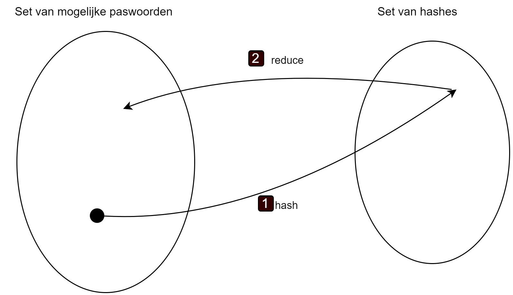
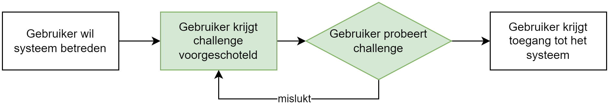
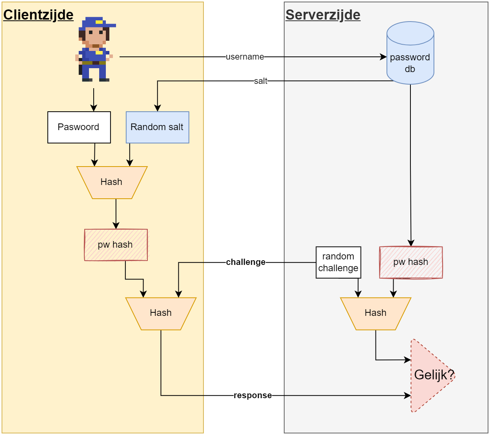
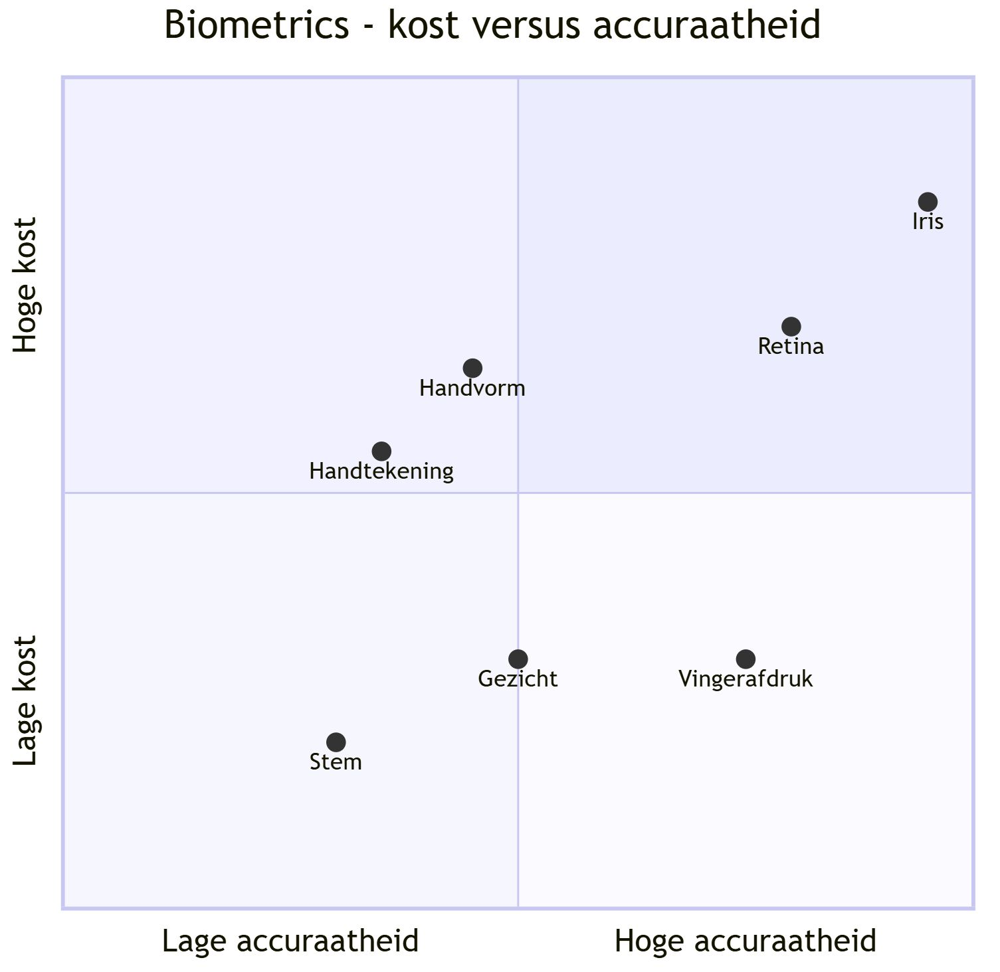
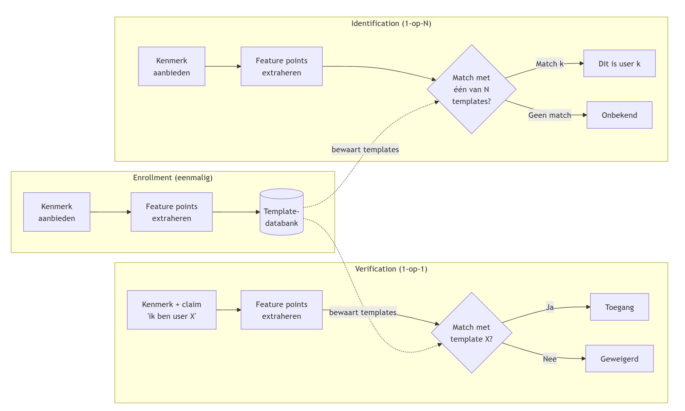
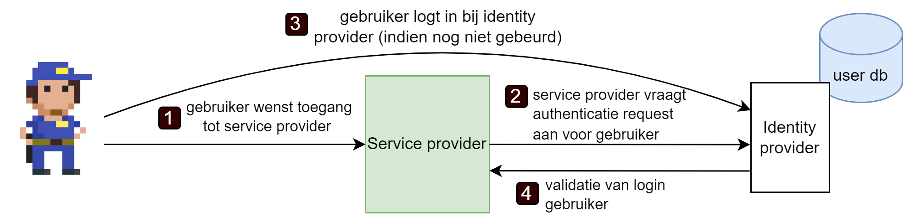
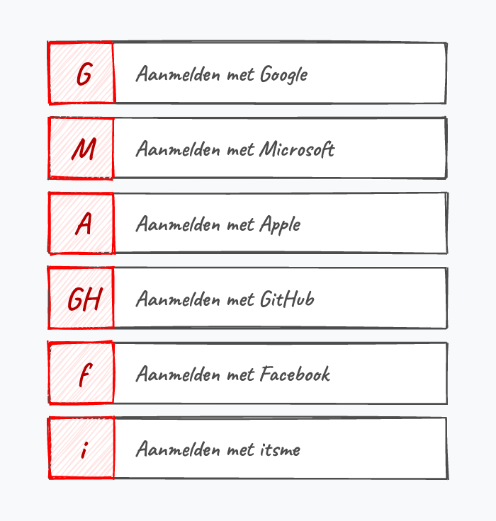
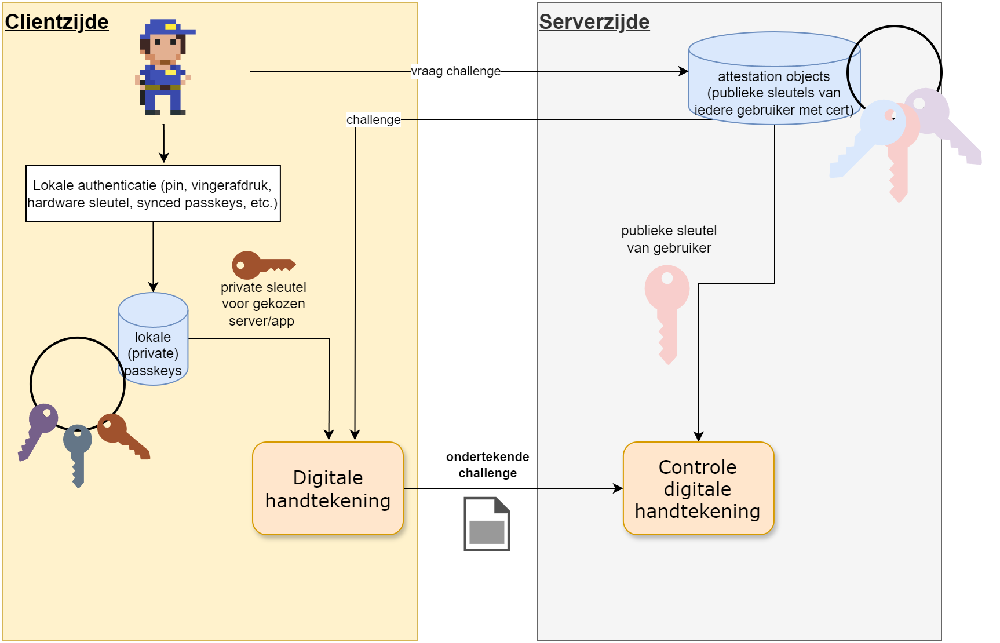

# Authenticatie

Bewijzen wie je bent om toegang te krijgen tot een website of applicatie heet **authenticatie**. Vervolgens, afhankelijk van wie je bent, zal je bepaalde rechten toegewezen krijgen die bepalen wat je wel en niet kunt doen op de website of applicatie, dit heet **autorisatie**. In dit hoofdstuk gaan we ons toespitsen op het eerste deel van dit proces: de authenticatie. Hierbij gaan we vooral kijken hoe we als web- of applicatiebeheerders op een veilige manier moeten omgaan met de login-informatie van gebruikers.

We weten al dat je geheime sleutel een belangrijk onderdeel is in heel veel aspecten van cybersecurity. Het **weten van de geheime sleutel** is een eerste vorm van authenticatie (maar uiteraard niet de beste). Je login gegevens die je gebruikt om toegang te krijgen tot een website bestaan in primaire vorm meestal uit een combinatie van gebruikersnaam en wachtwoord. Het wachtwoord in dit verhaal is kortom gewoon een ander woord voor je geheime sleutel. Als beheerder is het dan ook essentieel dat we uitermate veilig omgaan met de wachtwoorden van gebruiker. We zouden niet willen dat alle login gegevens van onze gebruikers in verkeerde handen vallen.

## Veilige wachtwoorden
Ongeacht de veiligheden die we inbouwen als cyberboswachter, veel blijft afhangen van de manier waarop eindgebruikers omgaan met hun wachtwoorden. Volgende regels worden continu niét gehanteerd, met alle gevolgen van dien:

* Hergebruik nooit een wachtwoord. In principe heb je één wachtwoord pér service (applicatie, website, etc.).
* Gebruik geen wachtwoorden die in *dictionaries* staan. Maar overweeg volledig random gegenereerde wachtwoorden.
* Zorg ervoor dat je wachtwoorden lang genoeg zijn (minimum 16 tekens).
* Zorg ervoor dat je wachtwoorden steeds een combinatie van cijfers, letters (grote én kleine) en leestekens zijn.

Trouwens, herinner je je de McCumber kubus waarin we benadrukten dat technologie maar één aspect is om CIA toe te passen op je data in z'n drie primaire vormen? Het zal je niet verbazen dat cybercriminelen niet altijd gaan proberen databanken aan te vallen om wachtwoorden van gebruikers te pakken te krijgen. Als zij een specifiek doelwit hebben dan gaan ze vaak op andere manieren te werk:

* **Password spraying**: hierbij gaat de hacker een (beperkte) lijst van veelgebruikte wachtwoorden testen op een grote groep *useraccounts* van een bepaalde website, in de hoop een *hit* te hebben (*"spray and pray"*).
* **(Spear) phishing**: bij phishing hanteert de aanvaller de goedgelovigheid of onoplettendheid van de gebruiker om een ogenschijnlijk betrouwbare mail of bericht te sturen met daarin een link naar een pagina die malware installeert of een fake login scherm toont. Bij spear phishing gebruikt de aanvaller geen massmail, maar gaat hij juist gericht één specifiek doelwit een op maat gemaakte mail of bericht sturen. Spear phishing is heden ten dage één van dé **social engineering** aanvallen bij uitstek.
* **Keyloggers**: als de aanvaller toegang heeft tot de computer (wat uiteraard van over het netwerk kan) dan kan hij een (permanente) keylogger installeren die alle toetsaanslagen op het systeem opneemt. Nadien kan de aanvaller deze logs dan analyseren in de hoop zo ook het wachtwoord of andere gevoelige informatie terug te vinden.

## Hoe wachtwoorden opslaan

De aanvallen die we zonet besproken hebben (spraying, phishing, keyloggers) zijn hoofdzakelijk **online aanvallen**: de aanvaller probeert actief in te loggen of onderschept wachtwoorden bij de bron. Daarnaast bestaan er **offline aanvallen**, waarbij de aanvaller — via een SQL injection, een insider of een datalek — (leestoegang tot) de gebruikersdatabank heeft bemachtigd. Vanaf nu plaatsen we ons in de schoenen van de *beheerder* en gaan we uit van het ergste: **ga er van uit dat jouw databank vroeg of laat zal lekken**. Hoe moet je dan als cyberboswachter de login gegevens van je gebruikers bewaren zodat zo'n lek minimale schade oplevert? We gaan een soort *bottom-up* aanpak hanteren, waarbij we beginnen met de meest naïeve oplossing en telkens verbeteringen zullen aanbrengen.

### Paswoorden als plaintext

In het prille begin van het Internet gebeurde dit quasi overal: de login-databank had twee kolommen:

1. gebruikersnaam.
2. gebruikerswachtwoord.

De wachtwoorden in kolom 2 stonden er zoals ze waren. Als een gebruiker wilde inloggen op dit soort websites dan moest hij z'n wachtwoord verzenden en dan ging de *backend* controleren of het ingezonden wachtwoord overeen kwam met het wachtwoord in de database. Het spreekt voor zich dat dit soort databanken van gigantische waarde zijn voor aanvallers: van zodra ze de databank hebben te pakken hebben ze alle wachtwoorden van alle gebruikers! Profit!

**Paswoorden mogen nooit in onbeveiligde, leesbare vorm in een databank staan!** Wanneer dit wel zo is dan kan je beter ogenblikkelijk je account bij die service deleten. Want alhoewel deze aanpak al lang bestaat en er al bijna even lang van geweten is dat deze erg onveilig is, toch zijn er nog steeds ontelbare websites en applicaties die hieraan zondigen. Als ze dus jouw wachtwoord zo behandelen, dan is de kans reëel dat ook hun andere veiligheidsdiensten niet om over naar huis te schrijven zijn. 

Een goede manier om te weten of een service op deze manier werkt is gebruik maken van de *"Ik ben m'n wachtwoord vergeten"*-knop. Als je deze knop gebruikt en je krijgt een e-mail met daarin jouw originele wachtwoord, dan kan je er zeker van zijn dat de service jouw wachtwoord op deze manier bewaart. In principe zou een service NOOIT jouw wachtwoord moeten kunnen zien. We gaan zelfs zien dat **jouw wachtwoord nooit je computer mag verlaten**, laat staan dat deze beschikbaar is als plaintext in een database.

::: {.callout-warning}
**Wie zou nu zo dom zijn?** In 2019 onthulde Facebook dat het jarenlang wachtwoorden van **honderden miljoenen gebruikers** (schattingen tussen 200 en 600 miljoen) gewoon in plaintext had bewaard. De bestanden waren toegankelijk voor zo'n 20.000 Facebook-medewerkers. Zelfs de grootste techbedrijven vallen dus soms in deze klassieke val. Meer lezen: [theverge.com](https://www.theverge.com/2019/3/21/18275837/facebook-plain-text-password-storage-hundreds-millions-users).
:::

### Paswoord hashing

Door een wachtwoord te hashen kunnen we de wachtwoorden al iets veiliger bewaren. Een gebruiker die zich wenst aan te melden bij een systeem dat met wachtwoord hashes werkt zal nu op zijn lokale systeem z'n hash moeten genereren en dit over het netwerk doorsturen. De service zal deze ontvangen hash vergelijken met de waarde die in de database staat, en indien deze gelijk is dan wordt verondersteld dat de gebruiker het juiste wachtwoord kende.

We versturen dus niet meer het wachtwoord over het netwerk, maar we zijn nu wel vatbaar voor een **pass-the-hash** aanval. Het volstaat om een geldige combinatie van gebruikersnaam en hash te capteren en deze vervolgens te gebruiken om ergens in te loggen. De aanvaller heeft hierbij geen kennis nodig van het originele wachtwoord.

::: {.callout-tip}
Door een secure hash van een wachtwoord te genereren creëren we een stuk tekst dat niet terug naar het originele wachtwoord kan omgezet worden. In theorie zal ieder wachtwoord een andere hash creëren. Uiteraard kunnen er toch twee zaken zich voordoen:

1. Twee totaal verschillende wachtwoorden genereren dezelfde hash, een zogenaamde *collision*.
2. Twee mensen kiezen hetzelfde wachtwoord en zullen dus ook dezelfde hash genereren.

Dit probleem gaan we verderop oplossen met behulp van *salting*.
:::

::: {.callout-warning}
Veel websites genereren wel degelijk de hash aan serverzijde. Het verschil hier is echter dat ze eerst een beveiligde TLS tunnel hebben opgezet waarover het wachtwoord werd verstuurd. Het laat echter de website/service toe om meer controle te hebben over de hash-generatie.
:::

### Rainbow table attack

Als de database door aanvallers gestolen wordt dan zitten we ook een tikkeltje veiliger als voorheen (de pass-the-hash aanval zal uiteraard nu zeker werken) indien de aanvaller de wachtwoorden van gebruikers nodig heeft (om bijvoorbeeld vervolgens op een ander systeem te gebruiken). De aanvaller zal een bruteforce of dictionary attack moeten uitvoeren om te ontdekken welk wachtwoord resulteert in welke hash. Dit kan een erg tijdrovend proces zijn want enkele veelgebruikte hashing algoritmen (onder andere *scrypt*, *bcrypt* en *pbkdf2*) zijn *by design* zodanig geschreven dat deze erg traag werken. Dit zorgt ervoor dat de tijd om één hash te genereren geen voelbaar verschil geeft, maar wanneer een aanvaller er duizenden per seconden wil kunnen testen, dan zal het algoritme als een stevige ***timebottleneck*** optreden. De aanvaller zou dan in de plaats vooraf alle hashes kunnen *precomputen* als alternatief. Dit heeft dan weer voor gevolg dat zo'n lijst gigantisch groot is en er dus een ***memorybottleneck*** optreedt. 

::: {.callout-tip}
**Even concreet.** Stel dat gebruikers enkel wachtwoorden van 8 kleine letters mogen kiezen. Dat geeft 26⁸ ≈ 2·10¹¹ mogelijke combinaties.

* Bij 1 miljoen hashes per seconde kost het gemiddeld **2,4 dagen** om de volledige ruimte te doorzoeken — nog te overzien, maar met een moderne GPU gaat het veel sneller (commerciële tools haalden in 2011 al **2,8 miljard** wachtwoordpogingen per seconde).
* De alternatieve piste — álle hashes vooraf precomputen — vraagt **~1,46 TB** opslag, en dat is nog enkel voor deze beperkte set van 8 kleine letters. Ter vergelijking: alle Google-servers tezamen bewaren in de orde van 10¹⁵ bytes (1 petabyte).

Conclusie: puur bruteforcen *of* puur precomputen loont nauwelijks. Rainbow tables zoeken bewust een **compromis** tussen beide uitersten.
:::

De aanvaller zit dus met het dilemma (tijd versus geheugen) tussen hashen berekenen ter plekke, wat erg traag zal gaan, oftewel alle mogelijke hashes op voorhand berekenen, wat veel geheugenplek vereist. Via een **rainbow table attack** krijgt de aanvaller echter een handig instrument in handen dat een compromis tussen beide bottlenecks aanbiedt. 

Een rainbow table is een tabel van precomputed hashes, maar waarvan we ze niet allemaal moeten bewaren om toch over een grotere set te beschikken dan die dat in de tabel bewaard worden. Je zou het kunnen vergelijken met een gecomprimeerde lijst van de getallen van 1 tot en met 101, waarbij we enkel het start (1) en eindgetal (101) bewaren, en dan erbij zeggen dat ieder volgend getal het vorige +2 is.

{ width=70% }

Een rainbow table stel je als volgt op:

* Je kiest een startpunt, zijnde één van de mogelijk wachtwoorden uit de set van wachtwoorden waarvoor je een rainbow table wilt opstellen (zie figuur hier voor)
* Je genereert de hash van dit gekozen wachtwoord.
* Je past nu op deze hash een *reduction* functie toe. Dit is een zelfgekozen mapping van de verkregen hash terug naar een wachtwoord uit de set van mogelijk wachtwoorden. 

:::tip
Als reductiefunctie zou je bijvoorbeeld kunnen beslissen om de hash om te zetten naar een getal (bv. door de som van de ASCII-waarden van de letters van de hash te nemen) en dit getal dan te gebruiken als index die bepaalt welk wachtwoord je uit de wachtwoordenset gaat kiezen.
:::

{ width=70% }

* Van dit nieuwe wachtwoord genereer je weer een hash en pas je opnieuw de reduction functie toe.
* Die combinatie hash+reductie blijf je X aantal keer herhalen tot je een lange lijst hebt (een zogenaamde *chain* van bijvoorbeeld 10000 elementen).
* Finaal hou je nu van deze lijst enkel het startpunt bij (het gekozen wachtwoord uit de set) en de allerlaatste gegenereerde hash.

{ width=70% }

, CC BY-SA 2.5.](assets/rainbow_chains.svg){ width=85% }

Wanneer de aanvaller nu van een gestolen hash terug het wachtwoord te pakken wil krijgen dan zal hij:

1. Deze hash als startpunt gebruiken en hier telkens weer de combinatie reductie+hash op toepassen.
2. **Totdat** een hash wordt gevonden die als eindpunt voor een van de lijsten werd ingesteld. 
3. De aanvaller neemt vervolgens het startpunt van deze lijst (een wachtwoord) en past daarop opnieuw de combinatie van hashing en reductie toe (als het ware opnieuw een rainbow table genereren). Uiteindelijk zal hij weer op de gestolen hash uitkomen.
4. Als hij dan één stapje terug kijkt dan zal hij daar het wachtwoord zien die bij deze gestolen hash hoort.

{ width=70% }

, CC BY-SA 4.0.](assets/rainbow_search.svg){ width=85% }


### Salting

Om bestand te zijn tegen de rainbow attack dienen we de set van mogelijke wachtwoorden gevoelig te vergroten waardoor het niet meer realistisch is om voor die set rainbow tables te genereren. We kunnen helaas niet verwachten van de eindgebruikers dat zij met véél langere, meer willekeurige, wachtwoorden op de proppen komen en zullen dus een 'oude' truc moeten gebruiken die we ook al bij wifi hebben gezien. Bij wifi hanteerden we een initialisatie vector (IV) om de WEP-sleutel met 24 bits te verlengen zodat zelfs bij dezelfde sleutel, iedere IV eigenlijk zorgt voor een unieke seed.

Wel nu, dit concept kan je ook toepassen bij wachtwoorden en heet **salting**. Een salt is een extra stuk dat je toevoegt aan het wachtwoord **voor je de hash** berekent. Dit extra stukje is een willekeurig getal dat je uiteraard mee zal moeten opslaan in de database. Wanneer twee gebruikers hetzelfde wachtwoord zouden hebben, dan zouden ze (dankzij hun unieke salt) toch beiden totaal verschillende hashes genereren. Niet alleen dat, maar de salt zorgt er dus ook voor dat de set van mogelijk wachtwoorden véél groter wordt. 

{ width=90% }

In de database bewaren we nu volgende informatie:

* Gebruikersnaam.
* Gebruikte salt (minimum 32 bits).
* Hash van het wachtwoord en de salt samen.

::: {.callout-warning}
Merk op dat ook nu we nog steeds niet beschermd zijn tegen pass-the-hash aanvallen.
:::

#### Mimikatz   

Mimikatz werd origineel ontwikkeld als demo om aan te tonen dat de authenticatieprotocollen van Microsoft onveilig waren. Helaas is de tool totaal erg snel opgenomen in het arsenaal van de digitale stropers. De tool laat toe om *authentication tickets* te tonen en hergebruiken. Zo'n authentication tickets worden door de loginserver aangemaakt na een geslaagde loginfase door de gebruiker. Dit ticket kan de gebruiker dan aan een systeem aanbieden om toegang tot het systeem te krijgen (het is letterlijk een *toegangsticketje*). Wanneer Mimikatz wordt losgelaten op een Microsoft Windows besturingssysteem zal het deze tickets op het systeem zoeken zodat de aanvaller vervolgens zonder login gegevens toch kan inloggen door technieken zoals:

* Pass-the-hash: vroeger werden Windows wachtwoorden als hash (NTLM) bewaard op het systeem waardoor deze techniek erg eenvoudig was.
* Pass-the-ticket: zoals zonet beschreven, maar dan met het Kerberos ticket (zie ook hierna)
* Kerberos Golden Ticket: **Kerberos** is een van de meest gebruikte authenticatieprotocollen. Veel systemen die Kerberos gebruiken hebben echter een verborgen account (*KRBTGT* genaamd) wiens ticket domain admin rechten geeft én dat niet vervalt. Kortom, een gouden ticket!
* Pass-the-cash: identiek aan pass-the-ticket maar deze aanval werkt ook met logindata die zowel op Mac, Unix én Linux kan worden gevonden. Kortom, dit is natuurlijk de *motherload*, daar deze niet meer afhankelijk is van enkel Microsoft Windows besturingssystemen.

Het nadeel van Mimikatz, voor ons als boswachters, is dat de tool erg goed werkt én kan geautomatiseerd worden. In 2017 onderging Oekraïne een stevige ransomware aanval van (zo goed als zeker) Russische makkelij, genaamd **NotPetya** (een variant op de WannaCry ransomware). NotPetya gebruikte een aangepaste versie van Mimikatz zodat de ransomware zichzelf kon verspreiden over het netwerk en op andere systemen in het domein kon inloggen met hashes en tickets dat de Mimikatz variant aantrof.

::: {.callout-tip}
De oorsprong van Petya en NotPetya werd getraceerd en is vermoedelijk het resultaat van een Russische hackinggroep genaamd *Sandworm* die onder de GRU werken, de Russische militaire inlichtingendienst.
:::

## CRAM en SCRAM

Om iemand te authenticeren spraken we tot nog toe enkel over een username/wachtwoord systeem. Echter, er zijn vele andere manieren om iemand te authenticeren. We spreken over "**Challenge-Response Authentication Mechanism (CRAM)** wanneer de gebruiker een vraag gesteld krijgt (de *challenge*) en hij hierop een geldig antwoord (de *response*) moet geven voor hij wordt toegelaten. Authenticeren met een wachtwoord is dus een vorm van CRAM. Er zijn er echter nog vele andere, denk maar aan de gehekelde CAPTCHA's - de ambetante vraag om te bewijzen dat je geen robot bent door alle boten in een afbeelding aan te duiden - of inloggen met behulp van je irisscan.

{}

Het mechanisme van een CRAM werkt als volgt:

1. De gebruiker stuurt z'n username met de vraag om in te loggen.
2. De server genereert een random challenge en stuurt deze terug.
3. Server en client creëren nu een hash van deze challenge met de hash van het wachtwoord (de server heeft dit bewaard, de client genereert de hash door z'n wachtwoord in te voeren)
4. De client stuurt deze hash, de response, terug naar de server.
5. De server vergelijkt of zijn gegenereerde response hash dezelfde is als die van de gebruiker.

{}

Om het probleem van *pass-the-hash* op te lossen kan je gebruiken maken van een **S**CRAM, een **Salted Challenge-Response Authentication Mechanism**. We bespreken een vereenvoudigde versie (een echte SCRAM voorziet ook *mutual authentication*) waarbij we hoofdzakelijk willen uitleggen waarom een SCRAM systeem veiliger is dan een klassieke salted wachtwoord login van daarnet. Met dit systeem zorgen we ervoor dat :

1. De salted hash van de gebruiker NOOIT moet verzonden worden.
2. Geen replay aanval m.b.v. pass-the-hash mogelijk is.

Zoals je in de afbeelding kunt zien zal in dit systeem de server ook de bewaarde salt naar de client sturen, zodat deze geen gebruik kan maken van een bewaarde password hash die hij niet zelf heeft gemaakt.

{}


## Multifactor authentication

We hebben enkel nog maar over wachtwoorden gesproken in dit hoofdstuk, maar uiteraard zijn er ook andere zaken die je kan gebruiken om je te identificeren. Er zijn verschillende **factoren** die kunnen gebruikt worden om te controleren of een persoon wel degelijk toegang mag krijgen tot een systeem:

* Iets wat je **weet**: je wachtwoord, je pincode, je rijksregisternummer, etc.
* Iets wat je **bent**: een eigenschap die uniek is per persoon en onder de noemer "*biometrics*" valt, zoals je vingerafdruk, irisscan, etc.
* Iets wat je **hebt**: een stuk hardware zoals een smartphone, USBkey, etc.
* **Waar** of **wanneer** je bent: je IP-adres , het moment van de dag dat je probeert in te loggen.

{}

We zien meer en meer systemen verschijnen die aan zogenaamde **multifactor authentication (MFA)** doen waarbij het systeem minstens twee factoren (*2FA*) wil controleren voor je toegelaten wordt. Hoe meer verschillende factoren er worden gebruikt bij de authenticatie hoe veiliger het systeem is, maar ook hoe minder gebruiksvriendelijk het wordt. Het blijft dus een afweging tussen die twee eigenschappen om in te schatten wat de ideale hoeveelheid veiligheid en gebruiksvriendelijkheid is die je wenst te hebben.

Systemen die MFA aanbieden doen dit vaak op een gecontroleerde manier: afhankelijk van de gebeurtenissen zal het systeem beslissen of meerdere factoren moeten getest worden of niet. Als je bijvoorbeeld in België woont, maar Google ziet plots dat iemand met jouw wachtwoord probeert in te loggen vanuit een IP-adres op de Azoren, dan zal Google beslissen dat "iets wat je weet" (het wachtwoord) niet genoeg controle is en extra informatie vragen (andere factoren controleren).

### Iets wat je weet: Paswoorden 

Deze factor hebben we reeds uitvoerig behandeld. Het grote probleem met *dingen weten* is dat:

* Je ze kan vergeten en daardoor niet meer kan inloggen.
* Anderen die informatie kunnen te weten komen en zich vervolgens als jou voordoen.

Kortom, alhoewel deze factor vaak vanuit technologisch standpunt het eenvoudigst te implementeren is, is het ook de minst veilige vanuit een social engineering standpunt. Biometrics en hardware zijn moeilijker door een digitale stroper te stelen dan het wachtwoord en we hoeven niet bij een fingerprint te vrezen dat de gebruiker een "zwakke vingerafdruk" kiest, iets wat bij wachtwoorden vaak hét primaire probleem is.

### Iets wat je bent: Biometrics

"We zijn allemaal uniek". Iedere mens heeft een hele hoop eigenschappen die uniek zijn per persoon. Zelfs als bepaalde van onze eigenschappen gelijkaardig zijn met andere personen dan zal zeker een combinatie van twee of meerdere eigenschappen dat niet zijn. Door dus menselijke eigenschappen van je te gebruiken als authenticatie hebben we een factor gevonden die zeer moeilijk na te bootsen valt: op voorwaarde dat je een echt unieke eigenschap kiest én deze op deze juiste manier meet.

Enkel veel gebruikte biometrieken als authenticatievorm zijn:

* Vingerafdruk.
* Iris.
* Stem.
* Gezicht (vaak met behulp van "stereo camera" voor 3D beeld).

Maar ook andere metrieken kunnen erg interessant zijn zoals de manier waarop je je wachtwoord invoert, de manier waarop je wandelt (*gait*) etc.

Niet elke biometriek is evenwaardig wat betreft accuraatheid en kost. **Iris**-scans staan bovenaan qua accuraatheid maar vereisen dure, gespecialiseerde hardware. **Retina**- en **vingerafdruk**-scanners zijn redelijk accuraat aan een midden- tot lage kost. Aan de goedkope (maar ook minder accurate) kant vind je bijvoorbeeld **stem**herkenning en **gezicht**sherkenning via een gewone webcam. Je keuze van biometriek hangt dus niet alleen af van technische vereisten, maar ook van budget en use case (een irisscan aan de grens is iets heel anders dan gezichtsherkenning om je telefoon te ontgrendelen).

<!--```{mermaid}
%%| label: fig-biometrics-cost
%%| fig-cap: "Biometrics: kost versus accuraatheid (indicatief)."
%% TIM: TTT vervangen door -- > (zonder spatie)
quadrantChart
    title Biometrics - kost versus accuraatheid
    x-axis Lage accuraatheid ttt Hoge accuraatheid
    y-axis Lage kost ttt Hoge kost
    "Iris": [0.95, 0.85]
    "Retina": [0.80, 0.70]
    "Vingerafdruk": [0.75, 0.30]
    "Handvorm": [0.45, 0.65]
    "Handtekening": [0.35, 0.55]
    "Gezicht": [0.50, 0.30]
    "Stem": [0.30, 0.20]
```
-->




::: {.callout-warning}
Paswoorden van miljoenen mensen opslaan is één ding. De biometrische gegevens is een heel ander verhaal waarbij ook **privacy** plots een erg heikel punt wordt (beeld je even in dat Hitler en zijn trawanten 80 jaar geleden toegang hadden tot biometrische data waarmee met een bepaalde zekerheid kon vastgesteld worden of iemand van Joodse origine was of niet.)

In India is de Aadhaar (Indiaas voor "basis"), hun rijksregisternummer zeg maar, een unieke code die gebaseerd is op *onder andere de irisscan en vingerafdrukken* (alle 10!) van de burger. Deze gigantische database werd in 2018 nog gehackt waardoor mogelijk de informatie van 1.1 miljard geregistreerde burgers werd gestolen. 
:::

Om een biometriek in de wachtwoord database te bewaren hebben we een manier nodig om deze te digitaliseren op een zodanige manier dat de unieke aspecten ervan bewaard worden. Voorts moet er rekening mee gehouden worden dat het "registreren" van een biometrische eigenschap nooit 100% accuraat kan. Denk maar aan een tijdelijk krasje op je vinger, je baard die anders geschoren is, etc. 

De zogenaamde *feature points* van een biometrische eigenschap worden in de database bewaard: dit zijn de unieke waarden waarvan geweten is dat deze per persoon anders zijn. We gaan deze niet per biometrische eigenschap bespreken, het volstaat te begrijpen dat in de gebruikersdatabase meestal een korte sequentie van getallen (of letters, denk maar aan een DNA-sample)  wordt bewaard die als het ware jouw unieke wachtwoord voorstelt voor die specifieke biometrische eigenschap van j. Enkel wanneer je bij het opnieuw inloggen (quasi) dezelfde feature points genereert als bij de registratie zal deze factor aanvaard worden als correct.

Een biometrisch systeem kent drie duidelijk te onderscheiden fasen:

1. **Enrollment (registratie)**: de gebruiker biedt zijn biometrisch kenmerk voor het eerst aan, het systeem extraheert de feature points en bewaart deze in de databank. Dit is het moment waarop de koppeling *user ↔ biometrie* wordt gemaakt.
2. **Verification (verificatie)**: *"Ben jij wel degelijk user X?"* — de aangeboden feature points worden vergeleken met één specifieke template in de databank (**1-op-1**). Dit is het klassieke inlog-scenario.
3. **Identification (identificatie)**: *"Wie ben jij?"* — de aangeboden feature points worden vergeleken met álle templates in de databank (**1-op-N**). Dit is een veel zwaardere operatie en wordt typisch ingezet bij bv. grenscontrole of forensisch onderzoek.



<!--```{mermaid}
%%| label: fig-biometric-phases
%%| fig-cap: "De drie fasen van een biometrisch systeem en hun interactie met de templatedatabank."
flowchart LR
    subgraph ENR["Enrollment (eenmalig)"]
        E1[Kenmerk<br/>aanbieden] ttt E2[Feature points<br/>extraheren] ttt E3[(Template-<br/>databank)]
    end
    subgraph VER["Verification (1-op-1)"]
        V1[Kenmerk + claim<br/>'ik ben user X'] ttt V2[Feature points<br/>extraheren] ttt V3{Match met<br/>template X?}
        V3 ttt|Ja| V4[Toegang]
        V3 ttt|Nee| V5[Geweigerd]
    end
    subgraph IDE["Identification (1-op-N)"]
        I1[Kenmerk<br/>aanbieden] ttt I2[Feature points<br/>extraheren] ttt I3{Match met<br/>één van N<br/>templates?}
        I3 ttt|Match k| I4[Dit is user k]
        I3 ttt|Geen match| I5[Onbekend]
    end
    E3 -.bewaart templates.-> V3
    E3 -.bewaart templates.-> I3
```
-->


::: {.callout-tip}
Biometrische eigenschappen kunnen niet alleen dienst doen als een extra factor bij het authenticeren, ze zijn uiteraard ook erg handig voor identificatie. In principe kan iemand nog steeds de gebruikersnaam van een ander persoon gebruiken. Als de biometrische eigenschappen als identificatie dienen kunnen aanvallers dat niet meer doen: ze kunnen onmogelijk aan het systeem zeggen *"ik ben persoon x"* terwijl de vingerafdrukscanner duidelijk een vingerafdruk registreert van *persoon y*.
:::

### Iets wat je hebt: Hardware 

Een fysiek object, zeker als het complex is, kan moeilijk nagemaakt worden en is dus een ideale factor. De elektronica van de 21e eeuw behoort tot de meest complexe dingen ooit die de mensheid heeft kunnen vervaardigen. Het is dan ook logisch dat we deze elektronica gebruiken als extra authenticatiefactor. In essentie zal dit stuk hardware nog steeds gewoon een wachtwoord bevatten, maar dit zal echter ongelooflijk veel langer (en dus sterker) zijn dan het gemiddelde wachtwoord dat een standaard gebruiker kan onthouden.

Er zijn twee grote families van hardware-gebaseerde authenticatie-vormen:

* Een smartphone, met daarop een *authenticator* app.
* Een USB sleutel.

Een nadeel van deze groep is dat het om een fysiek object gaat dat je kan verliezen of dat stuk kan gaan.

## Federation en Single Sign-On (SSO)

Bij cryptografie wordt het ten stelligste afgeraden om zomaar op de *wilde boef* een eigen crypto-algoritme te ontwikkelen. De kans dat je fouten met verstrekkende gevolgen maakt is te groot. Ook bij het omgaan van logindata van gebruikers en hoe je ze authenticeert is het aangeraden om even te bezinnen voor je er zelf aan begint. 

### Wat is Single Sign-On (SSO)?

**Single Sign-On (SSO)** is een authenticatiemethode waarbij een gebruiker zich **éénmaal aanmeldt** en vervolgens automatisch toegang krijgt tot **meerdere applicaties of diensten**, zonder zich bij elk systeem apart te moeten aanmelden. Je kent dit waarschijnlijk al: wanneer je inlogt op je Google-account, heb je meteen ook toegang tot Gmail, YouTube, Google Drive en tientallen andere Google-diensten — zonder telkens opnieuw je wachtwoord in te voeren. Dat is SSO in actie.

Het basisprincipe is eenvoudig: in plaats van dat elke applicatie zelf verantwoordelijk is voor authenticatie, wordt dit uitbesteed aan een centrale **identity provider** (IdP). Die identity provider bevestigt de identiteit van de gebruiker, waarna de applicatie (de **service provider**) de gebruiker vertrouwt op basis van die bevestiging.

### Federation

Dankzij het concept **federation** kan SSO ook werken **over de grenzen van organisaties heen**. Gebruikers kunnen inloggen op jouw site of app (de *service provider*) gebruik makend van hun bestaande Google, Facebook of andere accounts. Een *third-party* — die jij en je gebruiker vertrouwen — zorgt dan voor de eigenlijke authenticatie als *identity provider*. Zo hoef je als ontwikkelaar niet wakker te liggen van hoe je gebruikerswachtwoorden gaat opslaan.

{}

Federation via SSO is een onderdeel van *federated identity management*, een groep technologieën en concepten die ervoor zorgen dat de identiteit van een gebruiker over meerdere, onafhankelijke systemen wordt bewaard en gebruikt. Je zal de termen **delegation** en **federation** soms door elkaar zien tegenkomen wanneer je meer informatie over SSO opzoekt.

Samengevat gaan we bij *delegation* een gebruiker verplichten in te loggen met een bepaalde third-party die dit ondersteunt (bv. inloggen met je Facebook account). Bij *federation* gaat het breder: je website zal éénder welke third-party account aanvaarden, zolang deze maar compatibel is met het authenticatie systeem van je website (een voorbeeld hiervan is OpenID).

{ width=40% }

::: {.callout-tip}
**OAuth** (*open authorization*) is een gestandaardiseerde manier om aan authenticatie te doen.
:::

Uiteraard moeten we bij federatie benadrukken dat ook hier **privacy** een belangrijk aspect wordt. De vraag is dan ook in hoeverre je een bedrijf zoals Google of Facebook/Meta vertrouwt met jouw (login)data.

##  WebAuthn en passkeys

Een nieuwe technologie die in opmars is, is **WebAuthn**. Deze technologie laat toe om in te loggen op websites zonder dat je een wachtwoord moet ingeven. In plaats daarvan gebruik je een *authenticator* die je bij je hebt, zoals een USB-sleutel of je smartphone. Deze authenticator zal een digitale handtekening genereren die de website kan controleren.

Passkeys combineren de kracht van **asymmetrische/public-key crypto en hardware authenticatie**, met als grootste pluspunt dat gebruikers geen complexe wachtwoorden meer moeten onthouden.  

Zonder in de ontstaansgeschiedenis te duiken, is het toch nuttig even enkele termen in vet te zetten die je zeker zal tegenkomen als je meer over passkeys wilt leren:

* **FIDO Alliance**: de organisatie die de standaarden voor WebAuthn en U2F beheert. FIDO staat voor *Fast IDentity Online*.
* **WebAuthn** (*Web Authentication API*): een API die websites toelaat om met authenticators te communiceren.
* **FIDO2**: een standaard die WebAuthn ondersteunt, ontwikkel door de FIDO Alliance.
* **U2F** (*Universal 2nd Factor)*: een oudere standaard die ook door WebAuthn wordt ondersteund.

::: {.callout-tip}

Op [youtu.be/cEhc6vMFTh4](https://youtu.be/cEhc6vMFTh4) vind je een heel duidelijk overzicht van passkeys, inclusief de technische zijde ervan.

:::


### Een Passkey aanmaken: de registratie

Een passkey aanmaken is een eenvoudig proces. Je hebt een authenticator nodig, zoals een USB-sleutel of je smartphone. De authenticator zal een paar sleutels genereren: een *public key* en een *private key*. De public key wordt naar de website gestuurd, terwijl de private key (het wachtwoord met andere woorden) op de authenticator blijft.

Wanneer je dus als gebruiker registreert op een website of app, dan zal de passkey generatie van start gaan, als volgt:

1. Bij het registreren kiest de gebruiker ervoor om een passkey te gebruiken (i.p.v. het klassieke wachtwoord).
2. De gebruiker zal op zijn eigen toestel zichzelf nu eerst moeten identificeren. Dat kan op verschillende manieren: fingerprint scan, een PIN-code, een hardwaresleutel (denk aan bijvoorbeeld aan YubiKey), etc.
3. Het toestel van de gebruiker genereert een sleutelpaar. De private sleutel blijft op het toestel en wordt veilig bewaard, de public sleutel wordt naar de website gestuurd.


Stap 3 gaan we even verder uit de doeken doen: we gaan natuurlijk deze sleutel niet zomaar *over den draad* versturen. We gaan natuurlijk onze kennis van certificaten gebruiken, die ons toelaten om te bewijzen dat de publieke wel degelijk de onze. De gebruiker zal zijn publieke sleutel verpakken in een *attestation object*: de publieke sleutel, samen met een *signed challenge* (zie verder), een *credential ID* en een certificaat. Dit attestation object wordt naar de andere zijde gestuurd, die deze zal bewaren.

De tegenpartij, bijvoorbeeld de website waar je wilt registreren, heeft uiteraard nog bewijs nodig dat het jouw attestation object wel kan vertrouwen. Tijdens stap 1 van de registratie zal de server daarom een challenge sturen, die de gebruiker mee in het attestation object moet plaatsen.

In dit hele proces heeft de website nooit toegang tot de private sleutel van de gebruiker. De website kan enkel de public sleutel zien en gebruiken. Het concept "het wachtwoord verlaat nooit het apparaat" wordt hier dus erg letterlijk genomen.


::: {.callout-warning}

Doordat deze private sleutels niet meer op de website worden bewaard, wordt het gebruik van password managers nog belangrijker. De private sleutels worden immers opgeslagen op de authenticator, en als je die lange, complexe stukken data verliest, ben je al je accounts kwijt. 

Een password manager kan je helpen om je accounts te beheren en je private sleutels (je passkeys, in dit geval zijn dit **synced passkeys**, een concept dat ook mee in WebAuthn is ingebouwd) veilig te bewaren én te synchroniseren naar je andere apparaten. I

:::

### Inloggen met een Passkey

Het inloggen met een passkey is gebaseerd op wat we weten uit public key crypto: je publieke sleutel kan je aan iedereen geven, enkel de houder van de bijhorende private sleutel zal de data kunnen lezen die met deze publieke sleutel werd geëncrypteerd.

De login-fase is dan ook bijna het zelfde als de registratie. Ook nu zal de gebruiker een challenge krijgen. Deze challenge zal de gebruiker nu encrypteren met z'n private sleutel. Wanneer de server deze geëncrypteerde challenge kan decrypteren met de bewaarde publieke sleutel van de gebruiker, weet deze dat de gebruiker mag toegelaten worden.



## Authenticator apps en TOTP

Wanneer je multifactor authenticatie inschakelt op een website, krijg je vaak de keuze om een **authenticator app** te gebruiken, zoals Google Authenticator, Microsoft Authenticator of Authy. Deze apps genereren om de 30 seconden een nieuwe zescijferige code die je moet invoeren naast je wachtwoord. Maar hoe werkt dit? Hoe kan een app op jouw telefoon, die op dat moment geen internetverbinding nodig heeft, dezelfde code genereren als de server verwacht?

Het antwoord is een slim algoritme genaamd **TOTP**: *Time-based One-Time Password*. 

### De gedeelde geheime sleutel

Het hele systeem steunt, zoals zoveel in cryptografie, op een **gedeelde geheime sleutel** (*shared secret*). Wanneer je een authenticator app koppelt aan een website, gebeurt het volgende:

1. De website genereert een willekeurige geheime sleutel (typisch 160 bits).
2. Deze sleutel wordt aan jou getoond, meestal in de vorm van een **QR-code** die je scant met je authenticator app.
3. Zowel de server als jouw app bewaren nu dezelfde geheime sleutel.

Dit is het enige moment waarop de sleutel wordt uitgewisseld. Vanaf nu hoeven jouw telefoon en de server nooit meer rechtstreeks met elkaar te communiceren om geldige codes te genereren.

::: {.callout-warning}
Omdat de QR-code de volledige geheime sleutel bevat, moet je deze met de nodige voorzichtigheid behandelen. Maak er geen screenshot van die je onbeveiligd bewaart en toon de code niet aan anderen. Wie de geheime sleutel heeft, kan dezelfde codes genereren als jij.
:::

### Hoe TOTP werkt

TOTP combineert twee ingrediënten om een code te genereren:

1. **De gedeelde geheime sleutel** (die zowel de app als de server kennen).
2. **De huidige tijd**, afgerond naar blokken van 30 seconden.

Het algoritme werkt als volgt:

1. Neem de huidige Unix-tijd (het aantal seconden sinds 1 januari 1970) en deel deze door 30. Rond af naar beneden. Dit geeft een getal dat we de **tijdstap** (*time step*) noemen. Gedurende diezelfde 30 seconden zullen jouw telefoon én de server exact dezelfde tijdstap berekenen.
2. Gebruik nu een **HMAC** (Hash-based Message Authentication Code) om de geheime sleutel te combineren met deze tijdstap. Het resultaat is een lange hash.
3. Uit deze hash wordt via een vaste procedure (*dynamic truncation*) een **zescijferig getal** geëxtraheerd: de code die je op je scherm ziet.

Omdat zowel de server als jouw app dezelfde geheime sleutel en dezelfde tijd gebruiken, genereren ze onafhankelijk van elkaar dezelfde code. Na 30 seconden verandert de tijdstap en krijg je een volledig nieuwe code.

::: {.callout-tip}
Servers accepteren meestal niet enkel de code van het huidige tijdsblok, maar ook die van het vorige en het volgende blok. Dit geeft een marge van ongeveer 90 seconden en vangt kleine klokverschillen op tussen jouw telefoon en de server.
:::

### Waarom is TOTP veilig?

TOTP biedt een aantal belangrijke voordelen:

* **Eenmalig**: iedere code is slechts 30 seconden geldig. Zelfs als een aanvaller je code onderschept, is deze tegen de tijd dat hij deze wil gebruiken waarschijnlijk al vervallen.
* **Geen netwerkverbinding nodig**: de app heeft na de initiële registratie geen internet meer nodig. De tijd is het enige dat de app en server synchroniseert.
* **Niet voorspelbaar**: zonder kennis van de geheime sleutel is het onmogelijk om toekomstige codes te berekenen, zelfs als je vorige codes hebt gezien.

::: {.callout-warning}
TOTP is niet onfeilbaar. Een aanvaller die erin slaagt om tegelijkertijd je wachtwoord én een geldige TOTP-code te bemachtigen (bijvoorbeeld via een real-time phishing aanval die als *proxy* fungeert tussen jou en de echte website) kan nog steeds inloggen. Passkeys (zie eerder) zijn in dat opzicht veiliger omdat ze gebonden zijn aan het specifieke domein van de website.
:::

## Samenvatting: drie gouden regels

We hebben in dit hoofdstuk veel technieken en protocollen behandeld, maar alles valt terug te brengen tot drie kernregels die een goed authenticatiesysteem steeds moet respecteren:

1. Het wachtwoord mag nooit van de **client naar de server** gestuurd worden. *(→ hashing, CRAM, SCRAM)*
2. Het wachtwoord mag nooit van de **server naar de client** gestuurd worden. *(→ denk aan de "Ik ben m'n wachtwoord vergeten"-test)*
3. Het wachtwoord mag nooit **in leesbare vorm op de server** bewaard worden. *(→ hashing + salting)*

Moderne protocollen zoals **passkeys** gaan zelfs een stap verder: het wachtwoord (de private sleutel) verlaat zelfs de *authenticator* niet.

