# Cryptografie

In dit hoofdstuk duiken we de boeiende wereld van de cryptografie in: het versleutelen van informatie zodat enkel zender en ontvanger het bericht kunnen lezen. 

## Encryptie en decryptie

Herinner je dat we in het vorige hoofdstuk de termen CIA aanhaalden en de McCumber kubus? Een grote pijler van CIA, confidentiality, wordt opgelost met behulp van encryptie, namelijk het versleutelen van onze data met behulp van een geheime sleutel. Door deze te versleutelen wordt deze onleesbaar voor personen die de geheime sleutel niet hebben (en bijgevolg niet geautoriseerd zijn om de data te mogen lezen). De moeilijkheid van een goed cryptografisch systeem is dat de data op een zodanige manier moet versleuteld worden dat het quasi onmogelijk is om zonder sleutel de originele data terug te vinden. We spreken hierbij over de originele data als de **plaintext** en de geëncrypteerde data als **ciphertext**. De ontvanger van een ciphertext moet deze, als hij de juiste sleutel heeft, terug kunnen omzetten naar de originele plaintext.


Er zijn al veel encryptie algoritmes de revue gepasseerd doorheen de geschiedenis van de mens. Al van in de tijd van de Romeinen werd er aan cryptografie gedaan. Mensen hebben altijd gevoelige data gehad waar vertrouwelijk mee moest om gesprongen worden. Naarmate de **cryptanalyse** (dat is het proberen ontcijferen van een ciphertext zonder dat je de geheime sleutel hebt) evolueerde, moesten ook de cryptografische algoritmes verbeteren.  Ook hier zien we weer diezelfde wedloop tussen digitale stropers en cyberboswachters. Hoe sterker onze computers worden (met dank aan de wet van Moore), hoe krachtiger onze algoritmes moeten worden. De eenvoudigste vorm van cryptanalyse, *bruteforcing*, is rechtstreeks afhankelijk van de snelheid van de computer. Hoe meer sleutels per seconde een computer kan testen, hoe sneller de originele sleutel kan gevonden worden. 

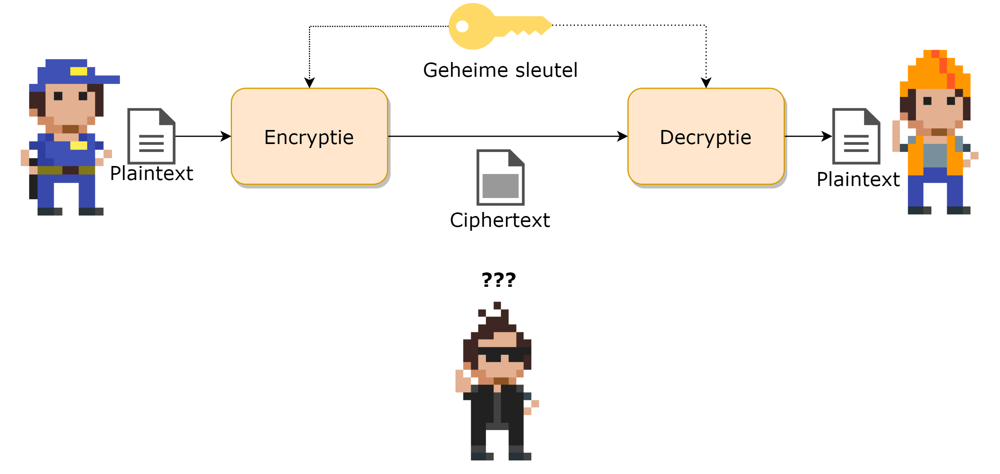{ width=90% }

::: {.callout-tip}
De volledige geschiedenis van de cryptografie hier vertellen zou ongeveer 1200 pagina's vereisen. Het briljante boek "The Codebreakers" van David Kahn is een aanrader voor eenieder die meer willen weten over deze boeiende geschiedenis. Laat de 1200 pagina's je niet afschrikken, het boek leest als een echte thriller.
:::

Alle bestaande cryptografische systemen kunnen op verschillende manieren gekarakteriseerd worden (bron Network Security Essentials, door William Stallings):

* De *acties* die op de data worden uitgevoerd om deze te encrypteren:
  * **Substitutie**: een teken door een ander teken vervangen.
  * **Transpositie**: een teken op een andere plek in de tekst zetten.
  * **Product**: een combinatie van meerdere substituties en transposities.
* Het *aantal sleutels* dat nodig zijn:
  * **1 sleutel**, ook wel "private encryption" genoemd.
  * **2 sleutels**, ook wel "public encryption" genoemd.
* De *manier* waarop de data wordt verwerkt:
  * Als een **blok** data, blok per blok.
  * Als een **stream**, teken per teken.

## Kerckhoffs principe

We gaan zo meteen bekijken hoe encryptie effectief gebeurt, maar we willen al even een mythe onderuit halen. Binnen encryptie heb je de *principes van Kerckhoff*, zes regels die in de 19e eeuw werden vastgelegd waaraan encryptie-algoritmes moeten voldoen om als veilig beschouwd te worden. Sommige principes zijn, onder ander door onze steeds krachtigere computers, niet meer relevant, maar één principe blijft ongelooflijk belangrijk: *"Het kennen van het gebruikte encryptie-algoritme door de tegenstander is geen probleem, het is enkel de geheime sleutel die ten allen tijde uit de handen van de tegenstander moet blijven."*

Dit ogenschijnlijk eenvoudige zinnetje betekent heel veel: **je sleutel (of wachtwoord) is wat je het beste moet beschermen. Zonder kennis van de sleutel zou iemand nooit toegang mogen krijgen tot versleutelde data, ongeacht dat geweten is met welk systeem de data werd vercijferd.** 

We zagen reeds dat *Security through obscurity* een dubbel snijdend zwaard binnen de security wereld is. Enerzijds is het niet aangeraden om met veel tamtam aan te kondigen hoe jij je data beveiligt. Anderzijds geeft het je mogelijk een vals gevoel van veiligheid (*snake's oil*) daar het geheimhouden van je algoritme en systemen geen garantie is dat deze ook effectief veilig zijn. In de 21e eeuw zijn de meest gebruikte encryptie-algoritmes publiek gekende algoritmes die door duizenden experts aan de tand zijn gevoeld. De kans dat er dus (bewuste) fouten in dergelijke standaarden zitten, is véél kleiner dan wanneer je met een zogenaamd proprietary systeem werkt waarvan de werking angstvallig geheim wordt gehouden.

**Finaal draait alles op het geheimhouden van je sleutel, iets dat we telkens weer in dit boek zullen herhalen!**

### Opletten met reclame

Let op met encryptiesystemen die zichzelf verkopen met zinnen zoals *"10 jaar nodig op een gewone laptop om alle sleutels te testen"*. Dit zou kunnen doen vermoeden dat je dus voor minstens tien jaar goed zit (we gaan er even vanuit dat de gemiddelde cryptanalist maar toegang heeft tot één laptop, wat uiteraard in de echte wereld niet zo is). De gemiddelde tijd van voorgaande systeem om te bruteforcen is echter vijf jaar, de helft.

Stel dat je een sleutel hebt die bestaat uit 8 karakters. Een karakter is een letter van a tot z (geen onderscheid tussen hoofd- en kleine letters en geen getallen of speciale tekens). Er zijn $26^8$ mogelijke sleutels (we gaan ervan uit dat de sleutel exact 8 karakters moet bevatten). Een computer kan één miljoen sleutels per seconde testen. De duur om alle mogelijke sleutels te testen is dus $\frac{(26^8)}{1 000 000}$, oftewel 208 827 seconden, pakweg 58 uur. Intuïtief zou je kunnen denken dat je dus meer dan twee dagen "veilig" zit, wat niet zo is. De kans dat de eerste sleutel die je test reeds de juiste is, is even groot als dat het de laatste sleutel is. Kortom, gemiddeld gezien zal de sleutel in de helft van de maximum tijd gevonden worden, oftewel 29 uur. 

Zouden we de lengte van de sleutel met één karakter verhogen, naar 9, dan stijgt de totale duur naar pakweg 1500 uur, oftewel 62 dagen. Eén karakter extra heeft dus wel degelijk een gigantische impact op de veiligheid van een sleutel!


## De eerste algoritmes

Het doel van ieder encryptie-algoritme is om data zodanig te versleutelen zodat enkel eigenaars van de gebruikte sleutel de originele tekst kunnen terugvinden. We vertelden net dat encryptie-algoritmes kunnen onderverdeeld worden volgens de actie die ze uitvoeren: substitutie, transpositie of een combinatie. We tonen van iedere variant nu een historisch voorbeeld.

::: {.callout-tip}
Volgende tool, speciaal gemaakt om crypto te leren, is een erg handig iets om de verschillende cryptografische systemen te visualiseren én testen: [link](HTTPS://www.cryptool.org/en/ct2/)
:::

### Substitutie: Caesar encryptie

De Caesar encryptie (naar Julius Caesar) bestaat uit een eenvoudig substitutie algoritme. De sleutel is een getal tussen 1 en 25 en geeft aan door welk element uit het alfabet een teken wordt aangepast, als volgt:

* Ieder element wordt voorgesteld als een cijfer. A krijgt de waarde 1, B wordt 2,... Z wordt 26.
* Als de sleutel het getal 3 is, dan zal nu iedere letter A in de tekst vervangen worden door het teken 1+3, dus D. Iedere B wordt een E, enzovoort.
* Indien er een "overflow" is achteraan komen we uiteraard terug naar voor in het alfabet. Iedere Z wordt dus een C, iedere Y een B, enzovoort.

Het Caesarcipher wordt ook wel kortweg *Rot* genoemd, naar het woord *rotatie*. Een cijfer erachter geeft dan aan welk de te gebruiken sleutel is. Rot4 wil dus zeggen dat alle elementen vier plaatsen opgeschoven moeten worden. Merk op dat Rot13 (ook wel *Caesaralfabet* genoemd) een speciale sleutel is. Als je namelijk twee maal na elkaar Rot13 toepast op een tekst (eerst op de plaintext, dan op de resulterende ciphertext) dan verkrijgt men terug de originele tekst.


Uiteraard kan iedere weldenkende mens in de 21e eeuw een Caesar encryptie bruteforcen. Het aantal mogelijke sleutels beperkt zich tot 25 mogelijkheden (sleutels 0, 26, etc. zullen resulteren in géén encryptie: je plaintext en ciphertext zullen identiek zijn) en je kan dit dus snel testen.  

Door **frequentieanalyse** op de ciphertext toe te passen kan men ook de plaintext terugvinden zonder te moeten bruteforcen. Indien de plaintext een tekst in, bijvoorbeeld, het Nederlands is, dan kunnen we gebruik maken van de statistische eigenschappen van een taal. Zo weten we dat bepaalde letters in een standaard Nederlandstalige tekst meer of minder vaak voorkomen. De letter `e` komt bijvoorbeeld veel vaker voor dan de `v`. Daar iedere letter in de encryptie door een andere wordt vervangen, is het dus voldoende om te ontdekken (a.d.h.v. frequentieanalyse) welke letter(s) het meest of minst voorkomen om je zo een vermoeden te geven van de originele letter. 


Dit verklaart ook waarom je best je te encrypteren berichten zo kort mogelijk houdt. Hoe minder tekens, hoe minder frequentieanalyse zal werken. Een andere veelvoorkomende fout (in klassiekere encryptie) was dat de verzender bijvoorbeeld voorspelbare tekst ging encrypteren. Als je weet dat de verzender altijd begint met "Geachte" in z'n berichten, dan is de kans groot dat de eerste 7 tekens in de ciphertext deze plaintext voorstellen.

Het principe van Caesar encryptie, de substitutie, blijft echter overeind staan en zal je nog zien terugkomen in de komende algoritmes. 


#### Over de modulo operator
De modulo operator (%) is nuttig bij substitutie-algoritmes zoals bij Caesar encryptie. De modulo operator geeft de rest weer wanneer we de linkse door de rechtse operator zouden delen. 19%5 geeft dus 4 als resultaat.

Je kan de operator gebruiken om snel te weten wat de waarde van een teken wordt bij Caesar-encryptie als volgt:

``(teken + sleutel) % alfabetLengte => nieuw teken``

De alfabetLengte is 26 bij Caesar-encryptie, namelijk alle letters van A tot en met Z.

Als je dus een sleutel hebt met waarde 7 en je wilt weten wat de waarde van ``Y`` (element 24, daar we vanaf 0 tellen) wordt dan schrijf je:

``(24 + 7) % 26 => 5``

Dit zal dus 5 worden, oftewel een ``F``.


### Transpositie: scytale encryptie

Bij transpositie-algoritmen gaan we de positie van de karakters veranderen. De sleutel kan hierbij bepalen op welke manier dit moet gebeuren. De Oude Grieken gebruikten een zogenaamde scytale om aan transpositie-encryptie te doen. Een scytale was een lange stok bestaande uit drie of meerdere lange zijden. De boodschap werd op een lang lint geschreven en dit lint werd dan over de scytale gedraaid. De sleutel gaf aan uit hoeveel vlakken de te gebruiken scytale moest bestaan. Ieder volgend karakter van de plaintext (op het lint) kwam op een andere zijde te liggen. Vervolgens werden alle letters op één zijde achter elkaar gezet, en dit werd herhaald voor iedere zijde: dit werd de ciphertext die werd doorgestuurd.

Om nu de ciphertext te decrypteren werd een onbeschreven lint over de juiste scytale gelegd. Vervolgens werd de verkregen ciphertext op dit lint, zijde per zijde, overgeschreven. Als de ontvanger dan het lint ontrolde kreeg hij terug de originele tekst te zien.

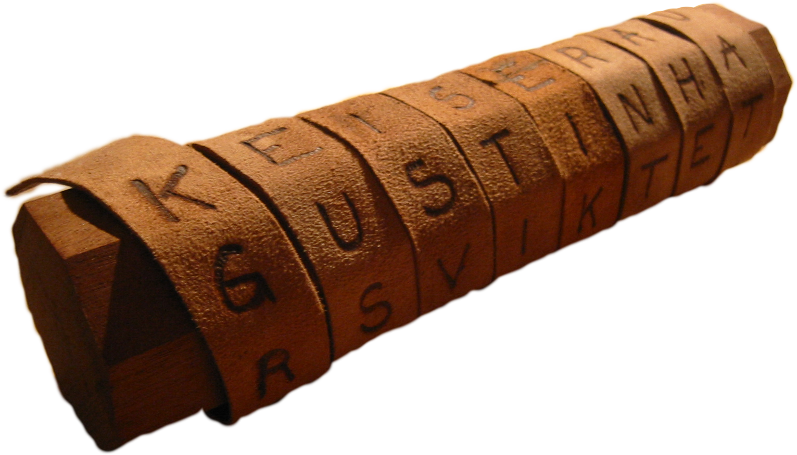{ width=50% }

Stel dat we de tekst "De perzen komen er nu aan" (bron: wikipedia) over een scytale met vier zijden wikkelen, dan krijgen we:


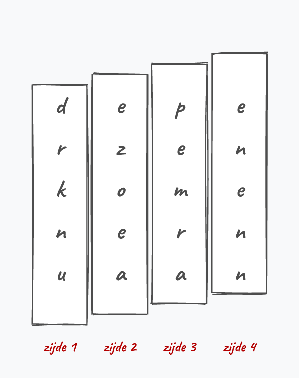{ width=40% }


De ciphertext die we vervolgens versturen (wanneer we het lint afwikkelen) wordt:

{ width=70% }

Uiteraard zijn er tal van varianten mogelijk om transpositie te doen. Eerst kan je beslissen om je plaintext in een bepaalde vorm te plaatsen: bijvoorbeeld in tien kolommen. Vervolgens kan je dan, gebaseerd op de sleutel, beslissen in welke volgorde je de kolommen achter elkaar plaatst om de originele tekst te krijgen. Dit is een zogenaamd *route cipher* wat onder andere werd gebruikt tijdens de Amerikaanse Burgeroorlog. 


### Combinatie

Het spreekt voor zich dat een combinatie van een transpositiecipher en een substitutiecipher je encryptie nog versterkt. Veel moderne algoritmen kunnen nog steeds herleid worden tot een sequentie van meerdere basisvormen na elkaar. 

De **Advanced Encryption Standard (AES)** is in de 21e eeuw zo'n beetje de de facto standaard als het aankomt op symmetrische encryptie (d.w.z. encryptie waar maar één sleutel voor nodig is, verder meer hierover). Als we echter eens het algoritme opengooien en een enkele *encryption round* bekijken (AES bestaat uit een sequentie van deze rondes) dan zien we dat de bits die bovenaan binnenkomen (*state*) vervolgens een combinatie van substituties (*sub*) en transposities (*mixcolumns* en *shiftrows*) ondergaan.

We gaan AES nog terug zien opduiken wanneer we gaan bekijken hoe draadloze netwerken worden beveiligd. Als Belg mogen we trouwens erg fier zijn op deze wereldwijd gebruikte Amerikaanse standaard. Je zal later ontdekken waarom dat zo is!

::: {.callout-tip}
Doel van dit hoofdstuk is ook aantonen dat je geen wiskundig wondertalent moet zijn om de basisconcepten van cryptografie te begrijpen. Hier en daar neem ik wat vrijheden om bepaalde stappen te vereenvoudigen, maar de essentie van de algoritmen blijft wel bewaard en daarmee, hopelijk, ook de eenvoud (en dus elegantie) ervan.
:::

## Cryptanalyse

De term cryptanalyse is nu al enkele keren gevallen: de wereld van de cryptologie bestaat uit twee delen, die elkaars tegengestelden zijn:

1. **Cryptografie**: de wetenschap van het versleutelen van informatie.
2. **Cryptanalyse**: de wetenschap van het ontcijferen van versleutelde informatie, zonder kennis van de gebruikte sleutel.

We gaan in dit boek niet te veel tijd aan de wondere wereld van cryptanalyse spenderen, daar dit ons te ver zou brengen. We vatten echter even de belangrijkste concepten hier samen.

### Sleutellengtes en bruteforcen

De term *bruteforce* dekt de lading  goed. Letterlijk vertaald wordt het: met brute kracht forceren. Kortom, je gebruikt het wanneer je niet weet wat doen tijdens de cryptanalyse en gewoonweg de minst efficiënte manier mogelijk zal toepassen, maar waarvan wel geweten is dat ze altijd zal werken. Namelijk iedere mogelijke sleutel testen die het cipher toelaat. 

Zoals je je kan inbeelden is de sleutellengte evenredig met de tijd die cryptanalysten  nodig hebben om je sleutel te bruteforcen. De maximale tijd die nodig is alle sleutels van een bepaalde lengte te berekenen kan je als volgt vinden: 

$MaximaleTijd = \frac{AantalMogelijkeTekens^{SleutelLengte}}{pogingen/seconde}$

#### Een bruteforce getalvoorbeeld

Een sleutel (of wachtwoord) bestaat uit 8 tekens, enkel kleine letters van a tot en met z zijn toegestaan. De berekeningen worden op een GeForce GTX 1080 gedaan die ongeveer 30 miljoen pogingen per seconde kan doen. We krijgen dan:

$MaximaleTijd = \frac{26^{8}}{30000000}$

Oftewel ongeveer 6960 seconden, wat neerkomt op ongeveer 1,9 uur tijd benodigd om alle mogelijke sleutels te testen (herinner je eraan dat deze tijd gehalveerd moet worden om te weten hoe lang het gemiddeld zal duren om de juiste sleutel terug te vinden.

Volgende tabel ([bron](HTTPS://uwnthesis.wordpress.com/2020/07/01/brute-force-password-how-long-will-it-take-to-brute-force-a-password/)) toont nog voorbeelden waarbij telkens dezelfde GeForce 1080 GTX kaart werd gebruikt. Het getal tussen haakjes geeft aan hoeveel mogelijke tekens er in dit type mogelijk zijn:

| # tekens  | enkel nummers (10)  | kleine letters (26)  | grote & kleine letters & nummers (62)  | eender welk teken (95)   |   
|---|---|---|---|---|
| 4  | 0,3 ms  |  15 ms | 490 ms  |  2,7 s |   
|  5 | 3 ms  |  400 ms | 31 s  | 4,3 min  |   
|  6 | 33 ms  | 10 s  | 32 min  | 6,8 uur  |   
| 7  | 330 ms  | 4,5 min  |  33 uur | 27 dagen  |   
| 8  | 3,3 s  | 1,9 uur  | 84 dagen  |  7 jaren |   
| 9  | 33 s  | 2,1 dagen  | 14 jaren  | 670 jaren  |   
| 10  | 5,6 min  | 54 dagen  | 890 jaren  | $6,3*10^{4}$ jaren  |   
| 11  | 56 min  | 3,9 jaren  | $5,5*10^{4}$ jaren  | $6*10^{6}$ jaren  |   
| 12  | 9,3 u   | 100 jaren  | $3,4*10^{6}$ jaren  |  $5,7*10^{8}$ jaren |   
| 13  | 3,9 dagen | $2,6*10^{3}$ jaren  |  $2,1*10^{8}$ jaren  | $5,4*10^{10}$ jaren  |    
| 14  | 39 dagen |$6,8*10^{4}$ jaren | $1,3*10^{10}$ jaren  | $5,1*10^{12}$ jaren  |     
| 15  | 1,1 jaar |$1,8*10^{6}$ jaren | $8,1*10^{11}$ jaren  | $4,9*10^{14}$ jaren  |     
| 16  |  11 jaar |$4,6*10^{7}$ jaren | $5*10^{13}$ jaren  |$4,7*10^{16}$ jaren   |     

::: {.callout-tip}
Per verdubbeling van het aantal GeForce-kaarten halveert de tijd.
:::

::: {.callout-note}
Om bovenstaande gigantische getallen wat te duiden: de leeftijd van ons universum wordt op 13,8 miljard jaar geschat, oftewel $1,38*10^{10}$ jaren. Onze mooie blauwe planeet is ongeveer 4,5 miljard jaar oud. De Tyrannosaurus Rex liep ongeveer 70 miljoen jaar geleden rond, oftewel $7*10^{7}$ jaren geleden. 
:::

#### Dictionary attack

Wanneer de cryptanalist vermoedt dat de te zoeken sleutel iets anders is dan volledig willekeurige tekens dan kan hij de bruteforce aanval verbeteren (denk aan "administrator2022"). In plaats van alle mogelijke combinaties (permutaties) van de sleutel te testen, zal hij een woordenboek (**dictionary**) gebruiken met daarin alle mogelijke sleutels en woorden die mogelijk de originele sleutel bevatten.

Tools zoals John The Ripper kan je *voeden* met een dergelijk woordenboek en dan vragen om sleutels te testen die gebaseerd zijn op zaken uit dat woordenboek, inclusief bijvoorbeeld door er tekens voor en na te zetten. Als in het woordenboek het woord *god* staat, dan kan Jaohn The Ripper bijvoorbeeld ook alle sleutels testen zoals *god1*, *god2*, etc. 

Er zijn tal van woordenboeken online te downloaden die gevuld zijn met de meest gebruikte wachtwoorden die cryptanalisten (en dus ook de digitale stropers) kunnen gebruiken om de sleutel sneller te vinden. Het is aangeraden om zeker geen wachtwoorden (of permutaties ervan) te gebruiken die in volgende  lijsten voorkomen: [https://github.com/danielmiessler/SecLists/tree/master/Passwords/Common-Credentials](https://github.com/danielmiessler/SecLists/tree/master/Passwords/Common-Credentials)

:::tip
Dit waren in 2020 de 10 meest gebruikte wachtwoorden:

123456, password, 12345678, qwerty, 123456789, 12345, 1234, 111111, 1234567, dragon

Dit soort lijsten worden opgesteld door gekende datalekken te analyseren op welke wachtwoorden er in voorkomen.
:::

### Soorten cryptanalytische aanvallen

Geregeld zullen we in dit boek bepaalde zwakheden beschrijven die in algoritmes misbruikt kunnen worden door een bepaald type cryptanalytische aanval. Deze aanvallen zijn afhankelijk van de informatie die de cryptanalist bezit:

* Enkel de ciphertext: vanuit het standpunt van de cyberboswachters is dit het beste soort informatie dat de aanvaller bezit. Hij heeft enkel een hoop geëncrypteerde informatie en moet proberen daar de originele plaintext uit te krijgen. Vanuit het standpunt van de cryptanalist is dit dus de minst goede situatie om vanuit te starten.
* Gekende plaintext: de cryptanalist heeft één of meerdere stukken informatie waarvan zowel de ciphertext als de bijhorende plaintext gekend is.
* Gekozen plaintext: de cryptanalist kan zelf plaintext kiezen waarvan de bijhorende ciphertext moet gemaakt worden. Dit zorgt ervoor dat de cryptanalist als het ware kan experimenteren.
* Gekozen ciphertext: het zelfde concept als *gekozen plaintext* maar deze keer kiest de cryptanalist de ciphertext waarvan hij de bijhorende plaintext wil genereren.

Er zijn nog enkele meer gespecialiseerde types, maar voor deze cursus zullen we het bij deze vier basistypes houden.

::: {.callout-note}
Er wordt in deze sectie soms over aanvaller gesproken, alsof de cryptanalist automatisch van kwade wil is. De wetenschap van de cryptanalyse is dat uiteraard verre van: enerzijds zorgt het ervoor dat bestaande en nieuwe cryptografische algoritmes op hun sterkte kunnen getest worden. Anderzijds helpen ze in tijden van oorlog om boodschappen van vijanden te onderscheppen en proberen lezen.
:::

### En wat met quantum-computers?

Al jaren houdt de crypto-wereld angstvallig de ontwikkelingen in de quantum-computer wereld in het oog. Alhoewel we nog maar in de babyfase van quantum-computers zijn, is het toch best mogelijk dat binnen afzienbare tijd (20, 30 jaar?) we effectief zodanig sterke quantum-computers zullen hebben die alle bestaande cryptografische systemen in een handomdraai kunnen "kraken". 

Daarom hanteren veiligheidsdienten al vele decenia ook het **store now, decrypt later** principe. Ze gaan ervan uit dat computers steeds krachtiger worden: berichten die in de jaren 60 werden versleuteld, kunnen nu in een handomdraai ontcijferd worden. Quantum-computers zullen dit proces nog veel sneller maken.

Hoe dit zal gebeuren snapt de auteur ook (nog) niet en zal dus niet verder uitgewerkt worden in dit handboek. Besef gewoon dat quantum-computers van de toekomst potentiële bruteforce aanvallen drastisch zullen kunnen versnellen. 

Het is om deze reden dat er nu reeds onderzoek wordt gedaan naar cryptografische ciphers die bestand zullen zijn tegen de computers van de toekomst. Dit soort ciphers worden *post-quantum cryptografische ciphers* genoemd en zullen niet in dit boek besproken worden. 

::: {.callout-note}
Trouwens, ook andere systemen die gebruik maken van cryptografische concepten zullen in één klap hun nut verliezen. Of zoals [dit artikel](https://www.uclftr.com/post/what-does-the-rise-of-quantum-computers-mean-for-encryption-technology) zegt *"And [as ]encryption is everywhere in modern day life, from e-commerce, to online payments, to passwords, everything will be vulnerable!"* 

Denk daarbij bijvoorbeeld aan *cryptocurrencies* zoals Ethereum en Bitcoin:

*Cybersecurity specialist Itan Barmes led the vulnerability study of the Bitcoin blockchain. He found the level of exposure that a large enough quantum computer would have on the Bitcoin blockchain presents a systemic risk. “If [4 million] coins are eventually stolen in this way, then trust in the system will be lost and the value of Bitcoin will probably go to zero,” he says.* [Bron](https://www.investmentmonitor.ai/tech/quantum-computing-bitcoins-crypto-encryption)

:::

## Symmetrische encryptie

Er zijn twee soorten encryptiesystemen als we kijken naar het aantal sleutels. Symmetrische systemen zijn systemen waarbij maar één sleutel nodig is: zowel ontvanger als verzender gebruiken dezelfde sleutel.  De term symmetrisch verwijst naar het feit dat het algoritme exact hetzelfde doet aan beide zijden. Het enige verschil is dat bij de verzender de plaintext in het systeem wordt gestoken, wat resulteert in een ciphertext. Terwijl de ontvanger de ciphertext in het systeem plaatst om een plaintext te krijgen.


* De symmetrische encryptiesystemen zijn de oudste vorm: alle klassieke algoritmes waren van dit principe. Asymmetrische systemen zijn pas in de 20e eeuw ontwikkeld (circa 1970).

* Voorbeelden van bestaande symmetrische encryptiesystemen zijn: AES, DES, IDEA, RC4, Blowfish, etc.

Dit type encryptie is nog steeds het meest gebruikte en wordt overal gebruikt waar data op een veilige manier (confidentiality) moet bewaard, verstuurd of verwerkt worden.

### Sleuteloverdracht

De moeilijkheid bij symmetrische systemen is de sleuteloverdracht. Daar ontvanger en verzender dezelfde sleutel hanteren is het natuurlijk belangrijk dat deze de sleutel op een veilige manier kunnen uitwisselen. Dit probleem wordt niet opgelost door symmetrische cryptosystemen. Afhankelijk van de context kan deze uitwisseling op verschillende manieren gebeuren:

* Via een asymmetrisch encryptiesysteem dat wél sleutels op een veilige manier kan uitwisselen (zie verder).
* Via een ander beveiligd kanaal, in eender welke vorm (bijvoorbeeld fysiek de sleutel aan de andere persoon geven of zeggen, deze opsturen via een reeds opgezet symmetrisch encryptiekanaal, etc.).

### Block- en streamciphers

Er zijn twee soorten symmetrische encryptieciphers als we kijken naar de manier waarop ze de te encrypteren data verwerken:

* **Streamciphers**: hierbij wordt de data letterlijk als een stroom (*stream*) van tekens beschouwd. Waarbij teken per teken individueel geëncrypteerd wordt (het bekendste voorbeeld is RC4). Voor ieder teken dat verwerkt wordt zal er exact één geëncrypteerd teken gegenereerd worden. Dit soort algoritmes zijn over het algemeen sneller dan blockciphers.
* **Blockciphers**: de data wordt in blokken (van bijvoorbeeld 128 tekens) verwerkt. Bekendste voorbeelden die we verderop behandelen zijn  AES, DES, 3DES, etc.

### Streamciphers

De werking van een symmetrisch streamcipher is verrassend eenvoudig en bestaat uit twee delen:

* Een **pseudorandom keystream generator**: deze zal de sleutel als het ware expanderen naar een sleutel met de zelfde lengte als de stream, genaamd een **keystream**. Als je 400 bytes aan data wenst te encrypteren, zal je een keystream van 400 bytes moeten genereren. Daar we met een stream werken zal deze generator teken per teken genereren. Hoe dit gebeurt, leggen we verderop uit.
* De **XOR** of "exclusieve of" functie: deze zal de plaintext naar een ciphertext omzetten door de plaintext met de keystream samen te voegen. Deze stap is de feitelijke encryptie!


Aan de ontvangerzijde gebeurt exact hetzelfde. **Enkel indien de ontvanger dezelfde sleutel gebruikt, zal deze dezelfde keystream kunnen genereren, en bijgevolg enkel dan de originele plaintext verkrijgen.**

Het hart van een symmetrisch streamcipher is dus enerzijds de XOR-functie én, belangrijker, de manier waarop de keystream wordt gemaakt. 

#### De XOR functie

De waarheidstabel van de XOR-functie is de volgende:

| Plaintext input | Keystream input | Ciphertext output |
| --------------- | --------------- | ----------------- |
| 1               | 0               | 1                 |
| 0               | 1               | 1                 |
| 0               | 0               | 0                 |
| 1               | 1               | 0                 |

De XOR-functie wordt in schema's aangeduid door een cirkel met een plusje in: $\oplus$

Beeld je in dat we het bericht `1010` willen versleutelen, en we hebben een gegenereerde keystream `1101`. Als we deze *XOR'n* dan geeft dit `0111`. Dit is dus de ciphertext. Als de ontvanger dezelfde keystream kan genereren en deze XOR'd met de verkregen ciphertext, dan krijgt deze terug de originele plaintext.


#### De keystream generator

De keystream generator heeft dus als doel om voor ieder karakter dat moet geëncrypteerd worden een bijhorend keystream karakter te maken. Deze karaktergeneratie moet onvoorspelbaar zijn (*random*) tegenover de sleutel die wordt gebruikt en het voorgaande karakter dat werd gemaakt. Echter, dit moet wel PSEUDO (*schijn*)-willekeurig zijn: dezelfde sleutel als beginpunt (**seed**) moet steeds dezelfde reeks genereren. 

De kracht (en zwakte) van een symmetrisch streamcipher ligt in de implementatie van de manier waarom deze keystream generator werkt. Mogelijke zwakheden kunnen bijvoorbeeld zijn dat de gegenereerde stroom informatie van de sleutel "lekt" naar de keystream (wat desastreuze gevolgen bleek te hebben bij de originele wifi-security (WEP), waarover later meer) of een voorspelbare "randomiteit" van de keystream.

Om aan encryptie te kunnen doen, hebben we systemen nodig die onvoorspelbaar zijn. Als de aanvaller kan voorspellen wat de uitvoer van een onderdeel van de encryptie zal zijn, dan kunnen we geen confidentiality en integrity voorzien. Kortom, we hebben algoritmes nodig die willekeurige getallen kunnen generen die 100% onvoorspelbaar zijn. Net zoals het werpen van een dobbelsteen niet voorspeld kan worden, zo ook moeten onze algoritmes een (digitale) dobbelsteen hebben.

Digitale systemen die perfect willekeurige getallen genereren noemt men **random number generators** (RNG). Uiteraard moet een RNG geprogrammeerd kunnen worden: dat behelst dus een algoritme. Een algoritme is per definitie "voorspelbaar". Alles hangt daarom af van de invoer die het algoritme gebruikt om random getallen te beginnen genereren. We spreken dan van een **pseudorandom number generator** (PRNG), pseudo (**schijnbaar**) omdat de uitvoer afhankelijk is van het startgetal, de zogenaamde **seed**. Die seed kan bijvoorbeeld de encryptiesleutel zijn: enkel met dié sleutel zal het algoritme dezelfde reeks getallen generen. Er zijn echter ook systemen die bijvoorbeeld de huidige tijd of de staat van een flipflop als startpunt gebruiken (wanneer je een flipflop aanzet kan je niet voorspellen of deze op 1 of 0 zal staan, daar deze staat beïnvloed wordt door de elektromagnetische straling). Uiteraard is een dergelijke seed voor een keystream generator nutteloos, daar zowel verzender én ontvanger dezelfde reeks getallen moeten kunnen genereren.

#### RC4 tot op het bot

Laten we eens één van de meest gebruikte streamciphers bekijken, het RC4 cipher. Dit algoritme, ontwikkeld door Ron Rivest (de afkorting staat trouwens voor *Rons Cipher 4*), wordt gebruikt onder andere om een beveiligde SSL-tunnel (zie later) op te zetten en zit in het hart van veel geëncrypteerde communicatiekanalen. 

RC4 werkt zoals we eerder verklaarden hoe een streamcipher werkt: het heeft een keystream generator en zal de keystream vervolgens XOR'n met de plaintext. Eerst zal de ingevoerde sleutel (die 40 tot 2048 bits lang mag zijn) omgezet worden naar een compatibele werksleutel met behulp van een **Key scheduling algorithm** (KSA). Deze werksleutel zal dan als seed gebruikt worden om een keystream in het **Pseudo-random generator algorithm** (PRGA) te maken.

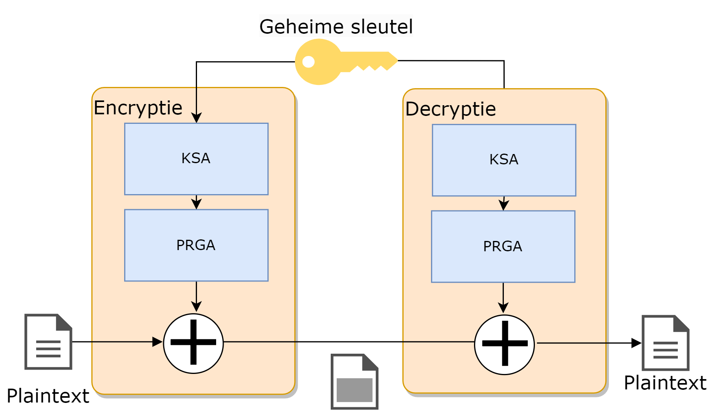

##### KSA

De **KSA** heeft als doel om de ingevoerde 40 tot 2k-bit sleutel  om te zetten naar een compatibele sleutel  voor de PRGA. Het doet dit volgens een eenvoudig algoritme:

**Stap 1**: plaats de ingevoerde sleutel in een array (**T**) van 256 karakters. Herhaal de sleutel indien nodig.

**Stap 2**: maak een sleutelarray (**S**) aan, ook van 256 karakters, en plaats er de waarden 0 tot en met 255 in.

**Stap 3**: permuteer (*transpositie*) de elementen in de array ``S`` met behulp van de array ``T`` als volgt:

```pseudocode
j = 0
for i = 0 tot 255
{ 
  j = (j + S[i] + T[i]) % 256
  Verwissel(S[i],S[j])
}
```

Deze stap zal dus de elementen in de sleutelarray ``S`` naar nieuwe posities in diezelfde array plaatsen en deze ook de hele tijd van plek wisselen. De index ``j`` is afhankelijk van de originele sleutel uit stap 1 en zorgt er dus voor dat iedere finale sleutel een unieke array ``S`` zal opleveren.

**Uitgewerkt voorbeeld van KSA**

Stel dat onze sleutel "ab" is. De decimale ASCII-waarden van a en b zijn 97 en 98 respectievelijk. Onze array T zal dus bestaan uit 128 keer de waarden 97 en 98 na elkaar aan de start:

| Index | Waarde |
| ----- | ------ |
| T[0]  | 97     |
| T[1]  | 98     |
| T[2]  | 97     |
| etc.  |        |

Stap twee genereert de tabel `S` die gewoon de waarden 0 tot en met 255 heeft in de 255 plekjes van de array (de waarde is dus in deze fase gewoon ook de index van het element)

Als we dan stap drie toepassen dan krijgen we na de eerste iteratie van de loop (``i=0``):

``j = (0 + S[0] + T[0]) % 256``

oftewel

``j= (0 + 0 + 97) % 256  => j wordt 97``

De eerste wissel die in `S` zal plaatsvinden is dan ``Verwissel(S[0],S[97])``

`S` ziet er dan als volgt uit na de eerste iteratie:

| Index | Waarde |
| ----- | ------ |
| S[0]  | 97     |
| S[1]  | 1      |
| S[2]  | 2      |
| ...   |        |
| S[97] | 0      |
| etc.  |        |

En dit herhalen we nog 255 keer. **Finaal hebben we nu in tabel `S` een sleutel die bestaat uit de getallen 0 tot en met 255 verdeeld over willekeurige plekken in de array.** Indien we een andere initiële sleutel zouden hebben gebruikt dan zou deze tabel er totaal anders uitzien.

##### PRGA

Nu we een compatibele sleutel `S` hebben kan de keystream generatie van start gaan. Deze bestaat uit een loop die blijft doorgaan telkens een nieuw plaintext karakter binnenkomt, als volgt:

```pseudocode
i = 0
j = 0
Herhaal telkens keystream karakter nodig is
{
  i = (i+1) % 256
  j = (j +S[i]) % 256
  Verwissel(S[i],S[j])
  k = S[(S[i]+S[j]) % 256]
  output k naar keystream
}
```

Telkens zal het algoritme één specifieke waarde (tussen 0 en 255) uit de array teruggeven als keystream karakter `k`. Zoals je ziet zal  de array `S` voorts de hele tijd van "gedaante" blijven veranderen. Telkens we een element `k` uitsturen zal ook de tabel `S` weer wat zijn veranderd daar we de waarden van ``S[i]`` en ``S[j]`` onderling verwisselen.


##### Uitgewerkt voorbeeld van PRGA

Als we verder werken met de tabel ``S`` van het vorige uitgewerkte KSA voorbeeld en de waarden ervan gebruiken na één iteratie dan krijgen we onderstaande berekeningen (*We veronderstellen even dat we de KSA niet verder hebben uitgevoerd en de tabel ``S`` dus dezelfde is gebleven als op het einde van het voorbeeld, wat in het echt niet zal zijn.*):

```
i = (0+1) % 256  => 1
j = (0+97) % 256 => 97
Verwissel(S[1],S[97]) => Verwissel(1,0)
k = S[ (S[1]+S[97])%256 ] => k = S[ (0 + 1) % 256] 
we outputten de waarde die op S[1] staat
```

Finaal zal de output, de waarde ``k``, ge-XOR'd worden met het huidige karakter van de plaintext stream.

::: {.callout-note}
Zo, dat viel nog mee he? Zoals al gezegd, een belangrijke motivatie van dit boek is aantonen dat je niet bang hoeft te zijn van wat er achter de schermen van de cyberwereld gebeurt. De hoeveelheid wiskunde die we bijvoorbeeld nodig hadden, is beperkt gebleven tot onze trouwe modulo (%)-operator en meer niet. Wanneer we zo meteen een blockcipher gaan uitkleden, zal je ook daar ontdekken dat je best in staat bent schijnbaar complexe technologieën te begrijpen. Hop naar de blockciphers dus!
:::

### Blockciphers

Blockciphers, de naam zegt het al, zullen eerst de plaintext in blokken karakters opdelen (bv. 128 bits) en vervolgens blok per blok encrypteren. 

:::note
Indien het aantal te encrypteren bytes aan data geen exact veelvoud is van de blokgrootte dient er **padding** te gebeuren. Hierbij zal het laatste blok opgevuld (*gepad*) worden met extra bytes tot het blok terug de juiste blokgrootte heeft. De manier waarop de padding gebeurt, is afhankelijk van het cipher dat gehanteerd worden.
:::

#### Feistel-structuren
Ook hier zullen we dezelfde soorten operaties (XOR, substituties en transposities) zien terugkomen. Echter, ook **Feistel**-structuren worden hier gebruikt: in deze operatie zal  de data steeds in twee helften worden gesplitst en wordt steeds een specifieke operatie (aangeduid met *F* van functie in de figuur), zoals een substitutie, op één helft uitgevoerd dat dan wordt ge-XOR'd met de andere helft. Dit wordt meerdere keren herhaald, waarbij de linker (*L*) en rechterzijde (*R*) steeds afwisselend door de specifieke encryptie-operatie gaan. 

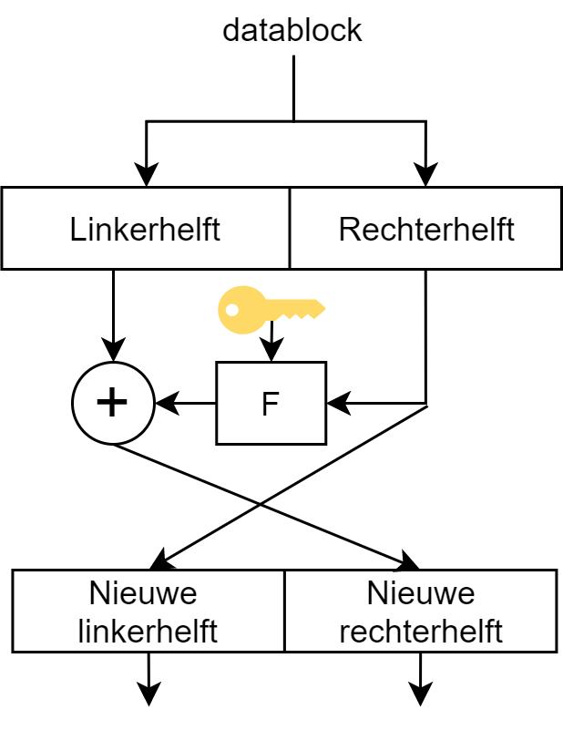{ width=30% }

Net zoals bij RC4 zullen we ook vaak met een zogenaamd key scheduling algoritme werken zodat de sleutel niet constant doorheen het hele proces dezelfde is en we met **subkeys** of *round keys* werken.

#### DES tot op het bot

Een van de oudste blockciphers is **DES** oftewel **Data Encryption Standard**. Deze standaard werd in 1977 geboren en vereiste toen blokken van 64 bits data en gebruikte een 56bit sleutel. Ondertussen is dit cipher zeer outdated, maar we gaan hem toch bekijken omdat deze enerzijds erg belangrijk was voor de wereld - grote delen van het bankwezen beschermden er hun financiële transacties mee (en nadien met de opvolger 3DES, zie verder) - en de standaard is erg duidelijk om een goed inzicht in blockciphers te verkrijgen.

Er was wel veel controverse rond deze standaard (gebaseerd op het door IBM ontwikkelde Lucifer cipher) omdat de originele versie (genaamd Lucifer) werkte met een dubbel zo grootte sleutel (128 bit) en bijgevolg dus veiliger was op lange(re) termijn. De Amerikaanse veiligheidsdienst, NSA, was niet zo happig om een dergelijk goed beveiligd algoritme commercieel te maken en zorgde er daarom voor dat de sleutellengte gehalveerd werd.


Data met DES encrypteren (en bijgevolg ook decrypteren daar het een symmetrisch cipher is) bestaat uit twee onderdelen:

1. **Versleuteling**: een reeks Feistel-structuren na elkaar (**16 rondes**) die de data blok per blok versleutelen.
2. **Subkeys maken**: een key scheduling algoritme dat 16 subkeys genereert (één voor iedere encryptieronde), gebaseerd op de 56 bit sleutel.

##### Versleuteling

Volgende schema toont de encryptie bestaande uit 16 rondes:

{width=80%}

De data wordt blok per blok doorheen dit gedeelte gestuurd. Eerst gebeurt er een *Initiële Permutatie* (*IP* in de figuur) waarbij iedere bit naar een andere plek wordt gestuurd volgens een vast patroon. Achteraan gebeurt dit nogmaals in een *Finale Permutatie* (*FP*).

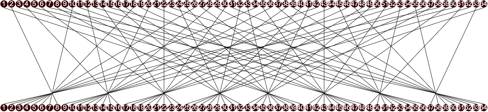{ width=90% }

Na de *IP* gaat de data door 16 Feistel-structuren die telkens hetzelfde doen. De data wordt in twee helften gesplitst waarbij de rechterzijde door de F-operatie gaat (die we zo meteen toelichten), het resultaat hiervan wordt ge-XOR'd met de linkerhelft van de data. Het resultaat van deze XOR, een 32 bit blok, wordt nu het rechterblok in de volgende ronde en omgekeerd.


{ width=60% }

In het F-blok wordt eerst het 32-bit blok uitgebreid (*E* in de figuur, van expansie) naar een 48 bit blok zodat deze even lang is als de subkey voor deze ronde. De expansie gebeurt, net als de initiële permutatie, volgens een vast patroon:

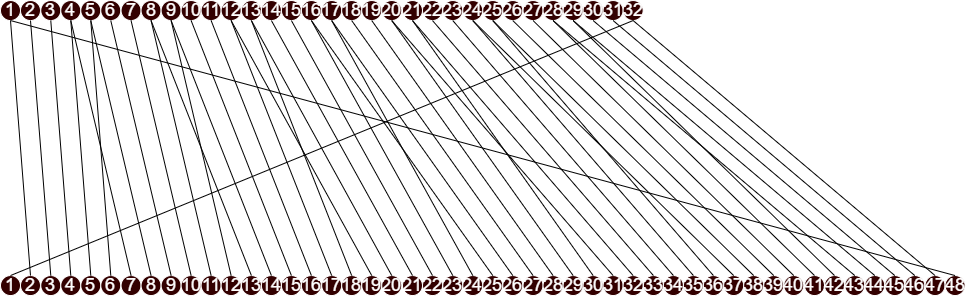{ width=90% }

Nu worden deze 48 bits ge-XOR'd met de subkey. Het resultaat wordt in blokjes van 6 bits door een *S*-blok gestuurd (zogenaamde *Selection blocks*). In dit blokje wordt 6 bit omgezet naar 4 bit. In de figuur hieronder zien we bijvoorbeeld hoe de omzetting in blok *S5* gebeurt. Ieder blokje heeft een soortgelijke tabel, maar met andere resultaten.  De 6 bits bestaan uit de 2 outer bits, namelijk de eerste en de laatste bit, alsook de 4 innerbits. De figuur toont bijvoorbeeld dat de output `1001` zou zijn indien er `011011` in het blok wordt geplaatst. 

{ width=100% }

Na 16 rondes krijgen we terug een 32 bit datablok dat nog een *Finale permutatie* ondergaat die weer de bits van plaats verandert en de output hiervan is een geëncrypteerd blok data dat kan doorgestuurd worden naar de ontvanger.

::: {.callout-tip}
Je kan de DES standaard op [web.archive.org/web/20040410171758/http://www.itl.nist.gov/fipspubs/fip46-2.htm](HTTPS://web.archive.org/web/20040410171758/http://www.itl.nist.gov/fipspubs/fip46-2.htm) nalezen en ontdekken dat deze niet zo lang is zoals je zou verwachten van een wereldwijd gebruikte standaard.
:::

##### Subkeys maken

Iedere ronde tijdens de versleuteling vereist een sleutel. Om te voorkomen dat steeds de hoofdsleutel wordt gebruikt (en er zo potentieel dezelfde keystreams worden gemaakt), wordt deze sleutel doorheen een *round-key generator algoritme* gestuurd. Dit algoritme bestaat uit 16 rondes waarbij de 56 bit sleutel (8 van de 64 bits in de originele sleutel zijn zogenaamde pariteits-bits, die dienen om te controleren of de sleutel geen fouten bevat) steeds in twee helften van 28 bits wordt *geknipt*.

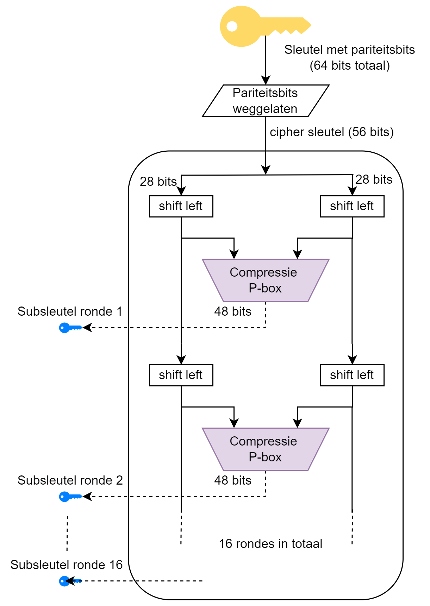{ width=60% }

Iedere ronde wordt de helft van de sleutel 2 bits *geshift* (in ronde 1,2, 9 en 16 maar 1 bit). Dat wil zeggen dat alle bits twee plekjes opschuiven en de eerste (of laatste) bits komen dan achteraan (of vooraan) te staan. Deze twee geshifte helften worden dan enerzijds doorgestuurd naar de volgende ronde, anderzijds naar een *compressie P-box* waarvan het resultaat een 48 bits subkey zal zijn van die ronde.

De naam *compressie P-box* doet al vermoeden wat er gebeurt:

* Compressie: een aantal bits zullen wegvallen (er komen 56 bits in, maar we hebben maar 48 bits nodig).
* P-box: een permutatie oftewel transpositie dat alle bits van plek zal veranderen.

{ width=100%}

In de Compression P-Box wordt een aantal bits van de sleutel "tegengehouden". Welke bits dat zijn hangt af van de P-Box. Iedere ronde wordt er een andere Compression P-Box gehanteerd. 

*En zo hebben we het einde van de werking van DES bereikt. Dat viel al bij al nog mee, niet?*

#### 3DES 

Al van bij de start gingen er stemmen op dat de originele sleutellengte voor DES (56 bits, 48 in effectiviteit vanwege de pariteitsbits) redelijk snel zou gebruteforced worden. Om die reden werd 3DES in het leven geroepen in 1995. De oplossing, 3DES, was een mooi staaltje compromisvorming: het bood een verhoogde beveiliging doordat het een lange sleutel had (tot 168 bits lang) maar bleef tegelijkertijd compatibel met de bestaande DES hardware en software.

De werking van 3DES (*tripple DES*) is verrassend eenvoudig: ieder blok data wordt drie keer doorheen een DES-cipher gestuurd. Hierbij wordt steeds een andere sleutel gebruikt. Om de bestaande DES hardware te gebruiken, wordt hierbij de data eerst door de encryptie gestuurd, dan doorheen de decryptie en terug door de encryptie. Daar we in iedere fase een andere sleutel gebruiken heeft dit (dankzij de eigenschappen van symmetrische ciphers) als effect dat we dus effectief drie maal na elkaar encrypteren met steeds een andere sleutel. Aan de ontvanger zijde gebeurt dan het omgekeerde: decryptie, encryptie, decryptie én dit dus allemaal met de bestaande DES hardware!

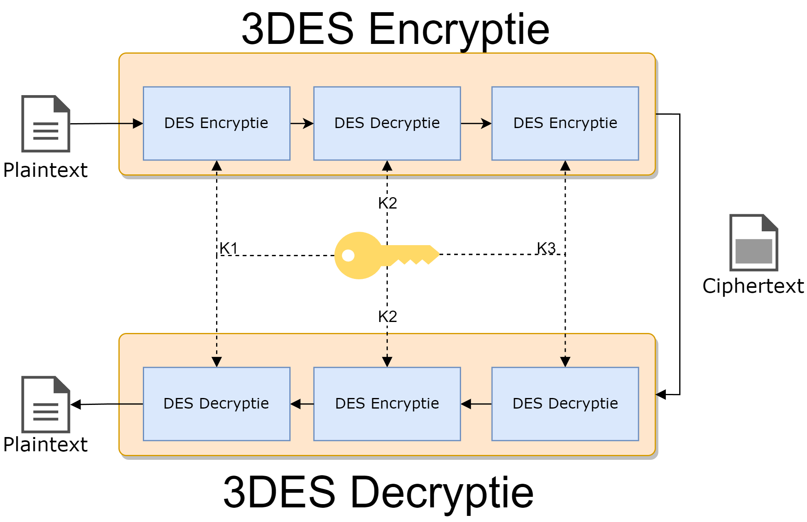{ width=60% }

::: {.callout-tip}
3DES laat dus ook (single) DES encryptie toe. Het enige dat je hiervoor moet doen is de subsleutels K2 en K3 gelijkstellen waardoor de tweede en derde fase tijdens de encryptie (en decryptie) eigenlijk niets doen, daar het gewoon de data encrypteert in ronde twee en dan ogenblikkelijk in ronde drie terug decrypteert.
:::

::: {.callout-note}
Het bankwezen gebruikt 3DES nog steeds (of varianten die erop gebaseerd) zijn om financiële transacties van onder andere Visa en Mastercard te beveiligen.
:::

#### Block cipher modes

Tot hiertoe gingen we data steeds blok per blok in het encryptiecipher sturen en het resultaat ervan doorsturen. Klaar.  Oplettende mensen hebben hier mogelijk al een hiaat in gezien: wat als twee blokken exact dezelfde data bevatten? Beiden zullen dezelfde ciphertext als resultaat genereren, daar we telkens dezelfde sleutel (en dus subkeys) gebruiken. Twee ciphertexts die identiek zijn, willen we vermijden daar het potentiële informatie over de plaintext zichtbaar maakt. Voorts laat dit soort werking ook replay attacks toe: de aanvaller kan een geëncrypteerd pakket bewaren en op een later moment terug opsturen, zonder dat hij moet weten wat de plaintext bevat.

Stel dat we een afbeelding van Tux De Pinguïn opsplitsen in ongeveer 100 bij 100 datablokken. Als we nu ieder blok individueel met een blockcipher encrypten en zouden visualiseren dan krijgen we iets dat mogelijks toch nog wat informatie van Tux *doorlekt* (zie de tweede afbeelding) daar blokken van de afbeelding met exact dezelfde informatie ook dezelfde ciperblock zullen genereren. Vergelijk dit met de derde afbeelding waarin we een andere modus gebruiken (die we zo meteen gaan uitleggen) waarin repetities in de plaintext geen invloed hebben op repetities in de ciphertext.

1

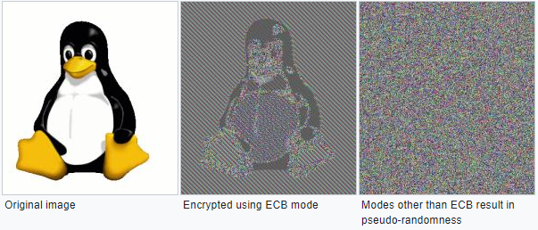{ width=75% }


Voorgaande modus, waarin we ieder blok onafhankelijk van het vorige encrypteren, noemen we de **Electronic Codebook (ECB)** modus. 

{ width=80% }

Alhoewel deze modus dus duidelijk een veiligheidsprobleem met zich mee draagt, heeft deze modus ook één voordeel:

* Ieder blok wordt onafhankelijk van andere blokken gedecrypteerd. Als er dus een blok niet gedecrypteerd kon worden door een fout, dan heeft dat geen invloed op de daaropvolgende blokken. Dit is dus voor streaming-situaties nuttig: beeld je in dat je decryptie faalt halverwege het binnenkrijgen van een film die je aan het bekijken bent. Je zou helemaal opnieuw moeten beginnen.

ECB is een niet zo veilige manier om een blockcipher toe te passen. Veel interessanter (veiliger) wordt het wanneer we extra informatie gebruiken om een blok te encrypteren. **Enkel het huidige blok en dezelfde sleutel gebruiken is namelijk niét veilig.** 

Er zijn verschillende modes om veiliger te encrypteren dan ECB:

* Cipher block chaining (CBC): de output van het vorige blok (de ciphertext) wordt mee als input voor de encryptie van het volgende blok gebruikt.
* Propagating CBC (PCBC): zelfde als CBC maar bij decryptie van een blok zijn ook alle vorige blokken vereist.
* Cipher feedback (CFB): ongeveer hetzelfde als CBC alleen wordt het vorige blok iets later in het encryptieproces van het volgende blok gebruikt.
* Output feedback (OFB): het blockcipher wordt als een streamcipher gebruikt.
* Counter-mode (CTR): een extra teller wordt gebruikt als input, genaamd een *Initialisatie vector*, bij de encryptie van een blok. Deze teller wordt steeds verhoogd. Eén van de meest gebruikte modes (in onder andere WPA2 en IPSEC).

{ width=80% }

Alle modes uit de doeken doen is hier niet aan de orde maar het moge duidelijk zijn dat ECB de minst veilige mode voorhanden is en deze wordt dan ook best vermeden.

::: {.callout-tip}
Het concept **Initialisatie Vector (IV)** zal je veel zien terugkomen in ciphers. Een IV is een getal dat men als extra seed meegeeft tijdens de encryptie, naast de sleutel. Op deze manier voorkomen we dat steeds enkel de sleutel als seed wordt gebruikt en we dus effectief steeds met een *andere* sleutel werken. Uiteraard zal ook de andere zijde over dezelfde IV moeten beschikken en zal deze dus doorgestuurd moeten worden. Dit gebeurt meestal via de header van het bijhorende pakketje en is ongeëncrypteerd. Dit lijkt contra-intuïtief - de IV onbeveiligd doorsturen - maar is geen probleem.
Uiteraard is het belangrijk dat er een goed *IV selectie algoritme* wordt gebruikt dat bepaalt hoe steeds het volgende IV moet worden berekend (bv. steeds met 1 verhogen, een willekeurig, etc.).
:::


#### AES

Alhoewel 3DES een verbetering op DES was, was er toch nood aan een nieuwe encryptie-standaard die langere tijd kon bestaan. In 2001 werd daarom de **Advanced Encryption Standard (AES)** boven het doopvont gehouden als de nieuwe de facto encryptiestandaard wereldwijd. Deze Amerikaanse standaard is gebaseerd op het **Rijndael**-algoritme waar we als Belgen fier op mogen zijn: Rijndael is ontwikkeld door twee Belgische KUL-cryptografen Vincent Rijmen en Joan Daemen.

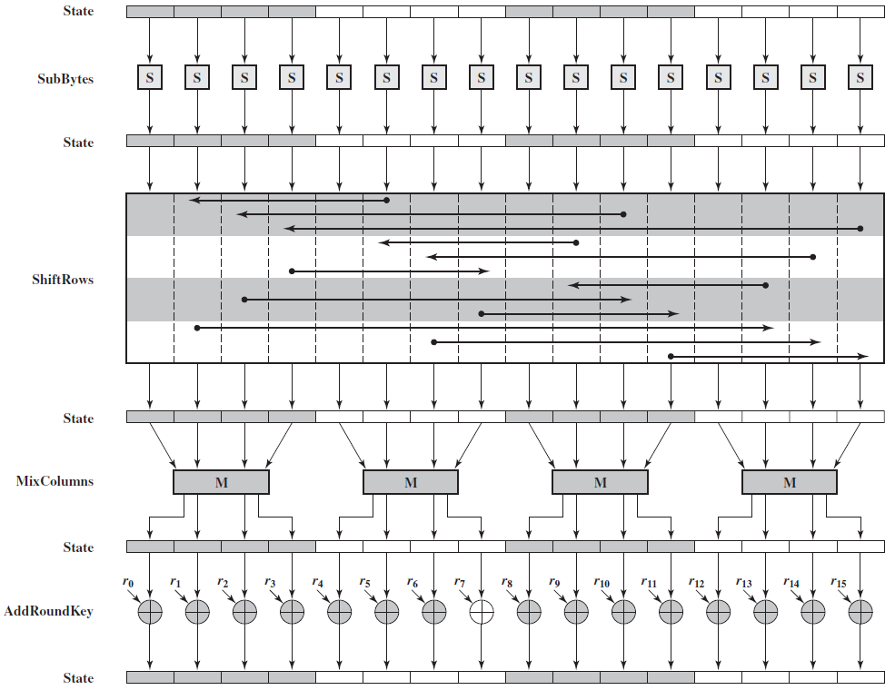{ width=80% }

AES is een symmetrisch blockcipher dat data in blokken van 128 bits zal opsplitsen en sleutels tot 256 bits lang toelaat. De volledige werking van AES gaan we hier niet uit de doeken doen, het voldoet te begrijpen dat in grote lijnen hetzelfde soort stappen worden doorlopen als DES en andere symmetrische ciphers:

* Er is een *key expansie* stap om een unieke sleutel pér ronde te hebben.
* De data wordt doorheen meerdere rondes gestuurd.
* Iedere ronde gebeuren er zaken zoals substituties en transposities, zowel van bytes als van hele rijen of kolommen data.
* Finaal vindt er een XOR-encryptie plaats.

Merk op dat ook hier, onderaan, de XOR-functie nog steeds dienst zal doen als de feitelijke encryptie van de data. Zonder deze XOR-functie zou al het voorgaande enkel maar resulteren in data die van plek verandert, volgens een patroon waar de geheime sleutel niet bij van te pas komt.


