## Asymmetrische encryptie

### Het probleem met symmetrische encryptie
Wat als je bij symmetrische encryptie met meerdere mensen wilt communiceren zonder dat iedereen elkaars berichten kan zien? Bob kan onmogelijk dezelfde sleutel gebruiken om met Alfredo te communiceren die hij al gebruikte met Alice. Kortom, je hebt per *eindpunt* een aparte sleutel nodig. Het aantal sleutels dat je nodig hebt, zeker als ook alle gebruikers onderling nog eens willen communiceren wordt snel erg groot. Je kan het aantal benodigde sleutels berekenen met de formule $n * \frac{(n - 1)}{2}$, waarbij ``n`` het aantal gebruikers voorstelt: 

* 6 gebruikers vereisen 15 sleutels.
* 7 gebruikers vereisen 21 sleutels.
* 10 gebruikers vereisen er al 45.
* 100 gebruikers vereisen er 4950!

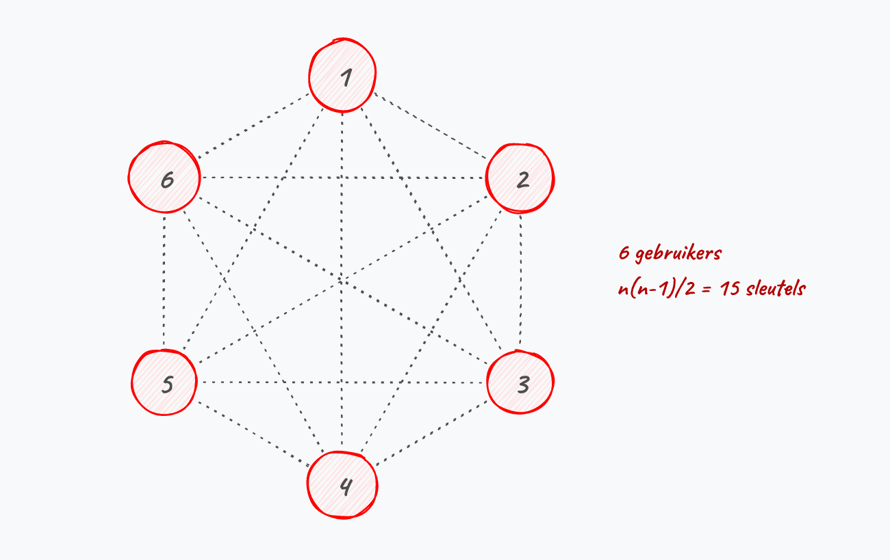{ width=40% }

Symmetrische encryptie heeft dus een *key distribution problem* wanneer er encryptie op een grote schaal nodig is. Zeker als we spreken over online communicatie, over het Internet, wordt de schaal ogenblikkelijk gigantisch groot en wordt het *sleutelmanagement* problematisch. Een andere oplossing is dus aan de orde.

### Publieke cryptografie

Publieke crypto oftewel **asymmetrische encryptie** zal het probleem met symmetrische encryptie oplossen doordat er gebruikt wordt gemaakt van twee sleutels:

* Eén publieke sleutel.
* Eén private sleutel.

Iedereen kan de publieke sleutel gebruiken om versleutelde berichten naar de eigenaar te sturen. Enkel de eigenaar van de bijhorende private sleutel kan deze berichten echter decrypteren. Kortom, we lossen nu een deel van het sleutelprobleem op: iedereen heeft z'n eigen private sleutel (**en moet deze geheim houden!**) en kan via z'n publieke sleutel berichten ontvangen.

Het concept van publieke cryptografie werd in 1976 gepubliceerd door Diffie en Hellman en had een grote impact op de manier waarop beveiligde communicatie op het Internet mogelijk werd. Hun eigen artikel beschreef meteen een sleuteluitwisselingsprotocol (Diffie-Hellman, zie verder); het eerste volwaardige asymmetrische encryptie-algoritme (RSA) volgde een jaar later, in 1977.

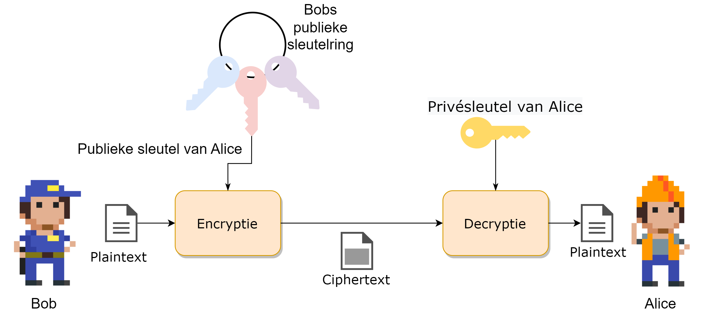

::: {.callout-tip}

Je kan publieke encryptie beschouwen als volgt: de publieke sleutel, die niet geheim is, is een openstaande kist. Iedereen kan de kist gebruiken om een geheime boodschap in te plaatsen en vervolgens deze op slot te klikken (*encrypteren*). Enkel de eigenaar van deze kist heeft de bijpassende private sleutel die echter deze kist kan opendoen en de originele boodschap kan lezen (*decrypteren*).
:::

::: {.callout-note}
Enkele van de bekendere publieke cryptosystemen zijn onder andere RSA, DSS en El Gamal.
:::

### Drie toepassingen van publieke cryptografie

Publieke cryptografie wordt in de praktijk voor drie doeleinden ingezet:

* **Asymmetrische encryptie** (bv. RSA): berichten versleutelen met de publieke sleutel van de ontvanger, die ze enkel met zijn private sleutel kan lezen.
* **Sleuteluitwisseling** (*key exchange*, bv. Diffie-Hellman): twee partijen spreken over een onveilig kanaal een gemeenschappelijke symmetrische sleutel af, die daarna voor snellere symmetrische encryptie wordt gebruikt.
* **Digitale handtekeningen**: met de private sleutel wordt een bericht "getekend", en iedereen kan met de bijhorende publieke sleutel verifiëren dat het bericht effectief van die persoon afkomstig is en onderweg niet werd aangepast.

Die laatste toepassing is een erg nuttige extra eigenschap: daar enkel de ondertekenaar de private sleutel in z'n bezit heeft, levert een geldige handtekening tegelijk **authenticatie** (de verzender is wie hij beweert te zijn) én **integriteit** (het bericht is onderweg niet gewijzigd).

In wat volgt werken we deze drie toepassingen één voor één uit, te beginnen met sleuteluitwisseling.

### Diffie-Hellman sleuteluitwisseling

We starten met **sleuteluitwisseling**, omdat dit concept mooi illustreert hoe publieke crypto in de praktijk wordt gebruikt.

Het is namelijk zo dat symmetrische crypto sneller is én dus voor (realtime) communicatie interessanter is. We weten echter dat het sleutelmanagement bij symmetrische crypto een probleem is als we met grote groepen gebruikers zitten. Het Diffie-Hellman sleuteluitwisselingsconcept helpt ons hierbij: het laat toe dat twee gebruikers over een onveilig kanaal op een veilige manier een gemeenschappelijk geheim (*shared secret*) afspreken.

Belangrijk om meteen mee te geven: de waarden die Bob en Alice bij Diffie-Hellman gebruiken zijn **sessie-specifiek** (*ephemeral*) en worden na de uitwisseling weggegooid. Ze zijn dus niet hetzelfde als een langdurig publiek/privaat sleutelpaar zoals bij RSA — DH dient louter om een gemeenschappelijke symmetrische sleutel af te spreken, niet om berichten rechtstreeks te versleutelen.

Zowel Bob als Alice kiezen eerst elk een **geheime waarde** die ze enkel voor deze sessie gebruiken. Op basis van deze geheime waarde berekenen ze elk een **publieke waarde** die ze naar de ander sturen (wat kan over een onbeveiligd kanaal). De ontvanger zal deze publieke waarde combineren met de eigen geheime waarde wat zal resulteren in een *shared secret* dat beiden nu kennen en kunnen gebruiken, bijvoorbeeld als de symmetrische sleutel om verdere communicatie te beveiligen.

De reden dat dit werkt, is met dank aan de modulo operator en de eigenschappen ervan. Een voorbeeld:

|   Stap     | Alice                                           | Bob                                            |
| ------ | ----------------------------------------------- | ---------------------------------------------- |
| 1 | Alice kiest een geheim getal A. Ze kiest A= 3   | Bob kiest ook een geheim getal B = 6.          |
| 2 | Alice berekent $7^A \bmod 11 = 343 \bmod 11 = 2$, genaamd X. | Bob berekent $7^B \bmod 11 = 117649 \bmod 11 = 4$, genaamd Y. |
| 3 | Alice stuurt X=2 naar Bob                           | Bob stuurt Y=4 naar Alice.                        |
| 4 | Alice berekent $Y^A \bmod 11 = 4^3 \bmod 11 = 9$.   | Bob berekent $X^B \bmod 11 = 2^6 \bmod 11 = 9$.     |

Zoals je merkt kunnen nu Alice en Bob het berekende getal **9** als gedeeld geheim gebruiken. Enkel zij kennen dit getal.

::: {.callout-warning}
Uiteraard zullen in de praktijk Bob en Alice véél grotere getallen kiezen dan 3 en 6.
:::

::: {.callout-note}
Dat Bob en Alice de waarden X en Y naar elkaar kunnen sturen is dankzij de eigenschappen van de modulo-berekening.  X en Y kunnen het resultaat zijn van een gigantische hoeveelheid berekeningen en een stroper zal dus veel rekenwerk nodig hebben om alle mogelijkheden te testen. 
:::

::: {.callout-tip}
## Een intuïtieve metafoor: verfkleuren mengen

Je kan Diffie-Hellman visueel begrijpen via verfkleuren:

1. Alice en Bob spreken **publiek** een gemeenschappelijke startkleur af (bijvoorbeeld geel).
2. Elk kiest daarnaast een **geheime** kleur die nooit gedeeld wordt (bijvoorbeeld Alice oranje, Bob turquoise).
3. Beiden mengen hun geheime kleur met de gemeenschappelijke kleur en sturen het mengsel naar de andere partij. Een stroper kan de mengsels onderweg zien, maar kan ze niet ontleden in de originele kleuren.
4. Alice voegt haar geheime kleur toe aan Bobs mengsel; Bob doet hetzelfde met het mengsel van Alice.
5. Beiden komen uit op exact **dezelfde eindkleur**: het gedeeld geheim.

Het principe berust erop dat *mengen* makkelijk is, maar *ontmengen* praktisch onmogelijk. In de digitale versie vervult de modulo-berekening die rol.

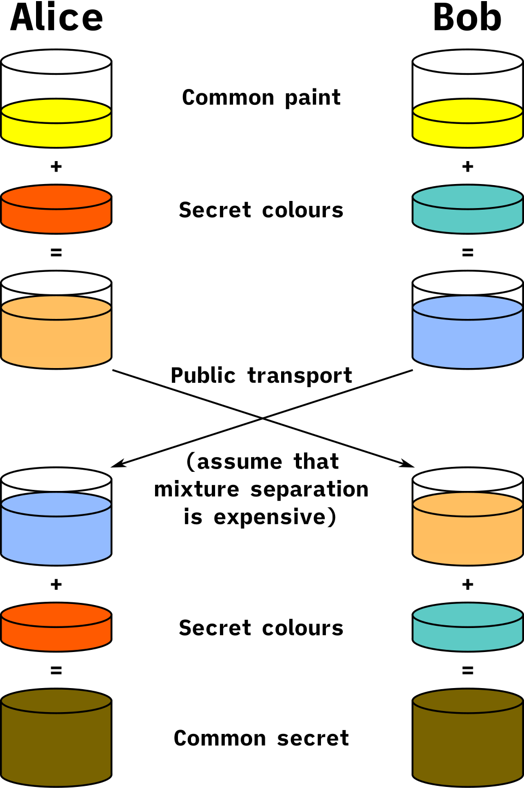{width=40%}
:::

### RSA

Eén van de oudste, maar nog steeds populairste, publieke cryptosystemen is het in 1977 ontwikkelde RSA algoritme. RSA, wat staat voor de achternamen van de drie ontwikkelaars (Rivest, Shamir en Adleman) gebruikt sleutels van 1536 tot 4096 bits lang. Het systeem is vrij traag maar heeft als voordeel dat het veilige sleuteltransmissie toestaat over een onveilig kanaal: we zien daarom vaak RSA gebruikt worden om eerst sessiesleutels uit te wisselen, vervolgens wordt overgeschakeld op een sneller symmetrisch cipher.

De exacte berekeningen die gebeuren tijdens encryptie en decryptie leiden ons iets te ver, maar volgend voorbeeld toont een vereenvoudigde wijze waarop RSA wordt toegepast:

Data encrypteren met behulp van asymmetrische versleuteling gebeurt op bijna dezelfde wijze als de Diffie-Hellman sleutel uitwisseling. Ook nu zullen beide zijden rekenen op de eigenschappen van de modulo-operator om over een onveilig kanaal veilige communicatie te kunnen doen.

Eerst dient een publieke sleutel aangemaakt te worden:

* Hiertoe dient Bob twee grote priemgetallen, ``q`` en ``p`` te kiezen, bijvoorbeeld ``p=17`` en ``q=11``. 
* Vervolgens berekent Bob ``N`` door deze priemgetallen met elkaar te vermenigvuldigen (``p*q`` geeft 17 * 11, ``N=187``). 
* Bob kiest nu nog een priemgetal ``e``, bijvoorbeeld ``7``.
* Bob kan nu zijn eigen geheime, private sleutel ``d`` maken, zodat geldt: $e \cdot d \equiv 1 \pmod{(p-1)(q-1)}$. In dit voorbeeld wordt dat $7 \cdot d \equiv 1 \pmod{16 \cdot 10}$, oftewel $7 \cdot d \equiv 1 \pmod{160}$.
* Om ``d`` te vinden zoeken we dus een getal zodat $7 \cdot d \bmod 160 = 1$. De mogelijke waarden voor $7 \cdot d$ zijn bijgevolg $1, 161, 321, \dots$. Met $7 \cdot 23 = 161$ klopt het: ``d=23``.

::: {.callout-tip}
Om $d$ te berekenen maken we gebruik van de zogenaamde *Uitgebreid Euclidisch algoritme*, een eeuwenoud algoritme gebaseerd op het *Algoritme van Euclides* dat we in het lager leerden gebruiken om de grootste gemene deler te berekenen van twee getallen.
:::

Bob heeft dus nu:

* Publieke sleutel bestaande uit $N=187$ en $e=7$.
* Private sleutel $d=23$.

Iedereen die nu naar Bob iets wilt sturen, kan dit via z'n publieke sleutel (``N`` en ``e``). 

Stel dat Alice het ASCII-karakter X naar Bob wil sturen:

* De ASCII-waarde van X is 88. 
* De encryptie door Alice gebeurt dan als volgt: $C = \text{data}^e \bmod N$. 
* De te versturen ciphertext C wordt dus: $88^7 \bmod 187$ oftewel ``C=11``.

Enkel Bob zal deze ciphertext met zijn private sleutel ``d`` kunnen decrypteren door $C^d \bmod N$ te doen, oftewel $11^{23} \bmod 187$ wat terug de plaintext ``88`` geeft!

::: {.callout-tip}
De sterkte van publieke crypto stoelt dus op het feit dat ontbinden van (grote) getallen in factoren computationeel veel moeilijker is dan de omgekeerde stap, namelijk twee getallen met elkaar vermenigvuldigen.

15621 in z'n factoren ontbinden is veel moeilijker dan de getallen 123 en 127 vermenigvuldigen (wat dus ook 15621 zal geven). 
:::

Zonder in detail te treden hoe cryptocoins en blockchains werken, is het nuttig om te vermelden dat bij cryptocoins ook de public crypto concepten worden gebruikt. Ook hier is je private sleutel uiterst belangrijk: enkel de eigenaar van de private sleutel "bezit" de bijhorende cryptocoins in de *blockchain*. Daarom is het belangrijk dat je **NOOIT** je private sleutel aan derden geeft, want zo geef je hen toegang tot jouw *coins* en kunnen ze vervolgens deze stelen door de private sleutel te vervangen.

### Elliptic Curve Cryptografie (ECC)

RSA baseert zich op de moeilijkheid van het ontbinden van grote getallen in priemfactoren. **Elliptic Curve Cryptografie** (ECC) is een modernere vorm van asymmetrische crypto die zich baseert op de wiskundige eigenschappen van **elliptische krommen over eindige velden**. Het onderliggende wiskundige probleem — het *Elliptic Curve Discrete Logarithm Problem* (ECDLP) — is nóg moeilijker op te lossen dan factorisatie, waardoor ECC met veel kleinere sleutels hetzelfde beveiligingsniveau kan bieden als RSA:

| ECC sleutellengte | RSA equivalent | Beveiligingsniveau |
|---|---|---|
| 256 bits | 3072 bits | 128 bits |
| 384 bits | 7680 bits | 192 bits |

Het **beveiligingsniveau** (*security strength*) drukt uit hoeveel rekenwerk een aanvaller nodig heeft om de encryptie te kraken, uitgedrukt in bits. Een beveiligingsniveau van 128 bits betekent dat een aanvaller $2^{128}$ bewerkingen moet uitvoeren — evenveel als nodig is om een symmetrische sleutel van 128 bits (zoals AES-128) te bruteforcen. Zo kunnen we de sterkte van verschillende cryptosystemen met elkaar vergelijken: een ECC-sleutel van 256 bits en een RSA-sleutel van 3072 bits zijn dus *even moeilijk te kraken*.

Kleinere sleutels betekenen snellere berekeningen, minder dataverkeer en lager energieverbruik. Dat maakt ECC bijzonder geschikt voor toepassingen waar rekenkracht of bandbreedte beperkt is, zoals **mobiele toestellen** en **IoT-apparaten**.

ECC wordt vandaag breed ingezet. De twee belangrijkste toepassingen zijn:

* **ECDH** (*Elliptic Curve Diffie-Hellman*): een variant van de eerder besproken Diffie-Hellman sleuteluitwisseling, maar dan gebaseerd op elliptische krommen.
* **ECDSA** (*Elliptic Curve Digital Signature Algorithm*): een digitaal handtekening-algoritme dat onder andere door Bitcoin en andere blockchains wordt gebruikt.

Moderne TLS-verbindingen (en dus HTTPS) gebruiken vrijwel altijd ECC-gebaseerde algoritmes voor de sleuteluitwisseling, omdat ze sneller en veiliger zijn dan klassiek RSA bij vergelijkbare sleutellengtes.

::: {.callout-warning}
Net als RSA is ook ECC kwetsbaar voor toekomstige **quantumcomputers**. Daarom wordt er actief gewerkt aan zogenaamde **post-quantum cryptografie**: nieuwe algoritmes die bestand zijn tegen aanvallen met quantumcomputers. In 2024 publiceerde NIST de eerste standaarden hiervoor.
:::

### Intermezzo: Hashes

Voor we de digitale handtekeningen uitwerken, slaan we even een zijtak in om het concept "hash" te bespreken. Een hash is een concept uit de informatica dat we gebruiken om te controleren of een digitaal stuk tekst werd aangepast of niet. Door de tekst in een hashfuntie te steken wordt een hash aangemaakt. Deze hash is een stuk code met een vaste lengte, ongeacht de originele input. Wanneer 1 bit of meer wordt aangepast in de originele boodschap dan zal deze in een totaal andere hash resulteren. Enkel dus wanneer een identiek stuk tekst als invoer (tot op bitniveau identiek) wordt gebruikt, zullen twee hashes gelijk zijn.

Voorgaande is uiteraard onmogelijk: daar een hash meestal veel korter is dan de originele boodschap, is het mathematisch mogelijk dat twee totaal verschillende teksten toch dezelfde hash geven. Het is de opdracht van een goede hashfunctie om dit soort **hash collisions** zo klein mogelijk te houden.

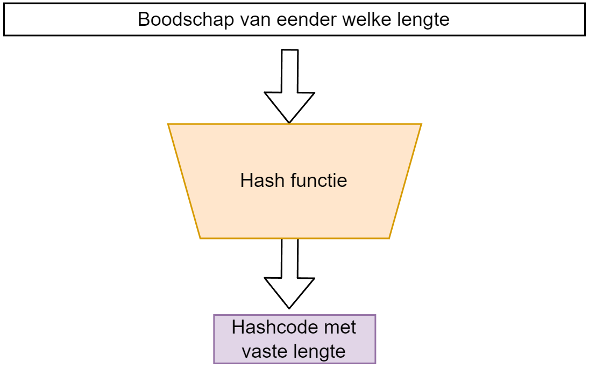{width=60%}

Een hashfunctie is niet omkeerbaar: men mag onmogelijk aan de hand van een hash (ook wel *digest* of *hashcode* genoemd) terug de originele tekst kunnen achterhalen. Een hashfunctie is dus een eenrichtingsfunctie, ook wel afbeelding genoemd in wiskundige termen.

Er bestaan veel verschillende hashfuncties. Enkele van de bekendere zijn:

* MD5, oftewel Message Digest 5: deze zal een 128-bit hashwaarde genereren. 
* SHA-X, oftewel Secure Hash Algorithms. Zo is er SHA-256 wat een 256 bits hash zal genereren.

De sterkte van een hash algoritme zit hem in de grootte van de kans waarop hash collisions kunnen optreden. Zo zijn er bij MD5 al veel meer collisions gevonden dan bijvoorbeeld bij het recenter gepubliceerde SHA3-512 algoritme.

**Een digitale hash is dus een ideaal middel om boodschappen digitaal te ondertekenen.**

### Boodschappen ondertekenen

Een probleem bij online communicatie is dat we geen zekerheid hebben dat het ontvangen bericht wel degelijk van de persoon komt van wie we verwachtten dat deze het bericht had opgesteld. We kunnen daarom het publieke crypto systeem gebruiken om berichten te ondertekenen. Daar enkel Bob de bijhorende private sleutel kan hebben die bij z'n publieke sleutel hoort, is het bezit van deze private sleutel hebben het bewijs dat hij de rechtmatige eigenaar van een bepaalde publieke sleutel is.

Onder andere RSA laat toe om een digitale handtekening (**digital signature**) te plaatsen bij een bericht om zo te bewijzen dat de verzender de rechtmatige eigenaar van een bijhorende publieke sleutel is. 

Een digitale handtekening wordt als extra bericht achteraan de te versturen boodschap geplaatst. De signature is als het ware een hash berekend aan de hand van de private sleutel. De ontvanger zal nu met de bijhorende publieke sleutel van de verzender kunnen verifiëren of de bijhorende private sleutel werd gebruikt om de handtekening te genereren.

Om een digitale handtekening te berekenen moeten we eerst een hash van het bericht berekenen. We gebruiken hier bijvoorbeeld MD5 of één van de SHA-algoritmes voor. Deze hash gaan we nu "verpakken" met de private sleutel. 

Stel dat de berekende hash van ons bericht de waarde ``35`` heeft (in werkelijkheid is een hash veel langer, maar voor dit voorbeeld houden we het klein) en we beschikken over volgend sleutelpaar ([bron](HTTPS://crypto.stackexchange.com/questions/11117/simple-digital-signature-example-with-number)):

* publieke sleutel: $e=5$ en $n=91$.
* private sleutel: $d=29$.

De handtekening wordt berekend door de hash te versleutelen met de private sleutel: $s = m^d \bmod n$, oftewel $s = 35^{29} \bmod 91 = 42$.

We versturen naar de ontvanger dus de boodschap zelf én de bijhorende handtekening ``42``.

De ontvanger kan nu controleren of de boodschap klopt. Hij berekent eerst zelf de hash van het ontvangen bericht. Vervolgens "ontsleutelt" hij de handtekening met de publieke sleutel van de verzender door $s^e \bmod n$ te berekenen, oftewel $42^5 \bmod 91 = 35$. Als de zelf berekende hash gelijk is aan dit resultaat, dan weet de ontvanger dat het bericht afkomstig is van de verwachte verzender én onderweg niet werd aangepast.

{width=80%}

#### Het probleem met digitale handtekeningen

We hebben echter een probleem. Hoe weet je eigenlijk dat je wel de juiste publieke sleutel gebruikt? Publieke sleutels zijn, wel, publiek. Iedereen kan jou een publieke sleutel geven en zeggen *"Dit is de sleutel van persoon X"* zonder dat jij kan controleren of dat zo is. 

We kunnen daarom als kwaadwillig persoon bijvoorbeeld een legaal bericht onderscheppen, aanpassen en dan vervolgens ondertekenen met onze eigen handtekening. Als we vervolgens aan de ontvanger kunnen wijsmaken dat jouw publieke sleutel zogezegd bij de originele verzender hoort, dan zal de ontvanger jouw aangepaste bericht "geloven". 

Kortom, we hebben een manier nodig om de **identiteit van de eigenaar** van een publieke sleutel te verifiëren. Kom binnen: **certificaten**.

## Digitale certificaten

Een certificaat is een (digitaal) document dat de identiteit van een gebruiker bindt aan een publieke sleutel. Dit document werd digitaal ondertekend door een vertrouwde derde partij (**trusted third party**) zodat bij twijfel van de echtheid van het certificaat men altijd bij deze derde partij terecht kan. Uiteraard is het belangrijk dat we deze derde partij kunnen vertrouwen, anders kunnen we ook niet het certificaat vertrouwen die zij onderschrijven. 

::: {.callout-tip}
Certificaten worden beschreven in de **X.509** standaard.
:::

Om een certificaat aan te maken dient Bob naar een **Registration authority** (RA) te gaan die zijn identiteit zal verifiëren. Dit gebeurt aan de hand van de typische documenten die ook buiten het Internet worden gebruikt om iemands identiteit te bewijzen: identiteitskaart, paspoort, rijbewijs, etc. In sommige gevallen zal de RA zelfs eisen dat Bob zich naar een fysiek kantoor begeeft om daar z'n identiteit *in the flesh* te bewijzen. Indien de RA de identiteit heeft bevestigd zal deze de aanvraag van Bob doorsturen naar een **Certification authority** (CA), inclusief Bobs publieke sleutel, die een certificaat zal aanmaken én ondertekenen. 

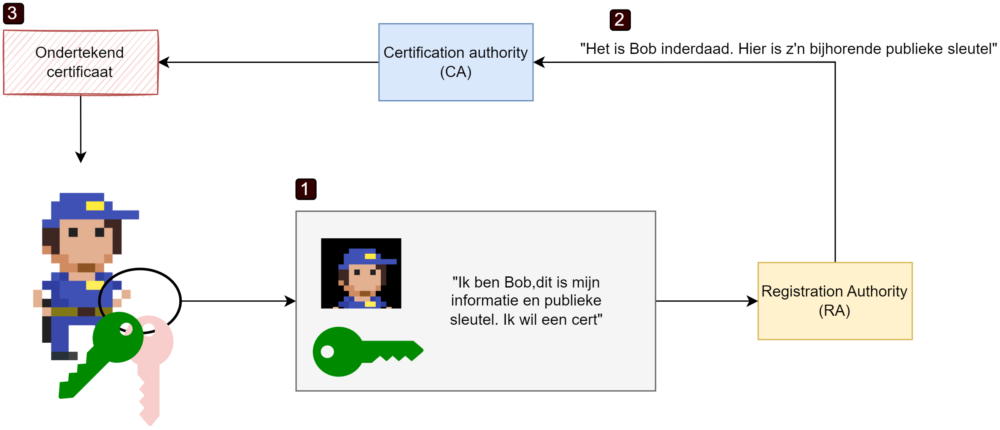

::: {.callout-tip}
Het gehele systeem van CA's, RA's, etc. dat bestaat om certificaten uit te geven, beheren en bewijzen heet een **Public Key Infrastructure** (**PKI**).
:::

De CA zal deze informatie gebruiken om een certificaat, van een bepaalde levensduur, te genereren. Hierbij zal de echtheid van het certificaat achteraf bewezen kunnen worden door de CA:

* Het certificaat bevat Bobs publieke sleutel en informatie over Bob en de CA in **leesbare vorm**. Daaraan wordt een **digitale handtekening** van de CA toegevoegd: een hash van al deze informatie, versleuteld met de private sleutel van de CA.
* Om later de echtheid van het certificaat te verifiëren, berekent de ontvanger zelf de hash van de inhoud van het certificaat en vergelijkt die met de ontsleutelde handtekening (die met de publieke sleutel van de CA wordt gedecrypteerd). Als beide hashes gelijk zijn, weten we dat het certificaat door de gegeven CA werd ondertekend — enkel de houder van de private sleutel van die CA kan zo'n geldige handtekening produceren.

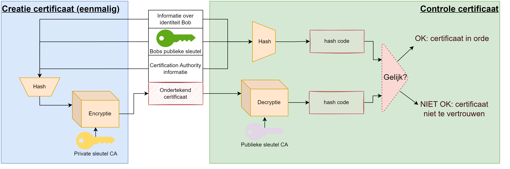

Een X.509-certificaat bevat minstens volgende velden:

* **Versie** van de X.509-standaard (vandaag doorgaans v3).
* **Serienummer**: uniek binnen de uitgevende CA.
* **Signature algorithm**: welk algoritme de CA gebruikte om te ondertekenen (bv. SHA-256 met RSA).
* **Issuer**: naam van de CA die het certificaat uitgaf.
* **Validity**: begin- en einddatum van geldigheid.
* **Subject**: naam van de eigenaar (domeinnaam of persoon).
* **Public key** van de eigenaar, met het gebruikte algoritme.
* **Extensions**: bijkomende info zoals gebruiksbeperkingen of alternatieve domeinnamen.
* **Signature**: de digitale handtekening van de CA over al het bovenstaande.

Voorgaande proces zal bijvoorbeeld plaatsvinden wanneer je browser via een **HTTPS** verbinding surft naar een website en zo wil controleren of wel degelijk met de website wordt gecommuniceerd en niet met een imposter. Indien de browser (of de gebruiker) twijfelt aan de echtheid van de publieke sleutel van de CA die het certificaat van de website ondertekent, dan zal het voorgaande proces zich herhalen, maar deze keer om het certificaat van de CA te controleren met behulp van een bovenliggende CA. Op die manier kan het dus zijn dat een keten van CA's ontstaan die telkens CA's onder zich bewijzen. Uiteraard zal er steeds bovenaan zo'n ketting een **root CA** staan. Als je die vertrouwt, dan kan je al de CA's er onder dus ook vertrouwen...maar ook vice versa! 

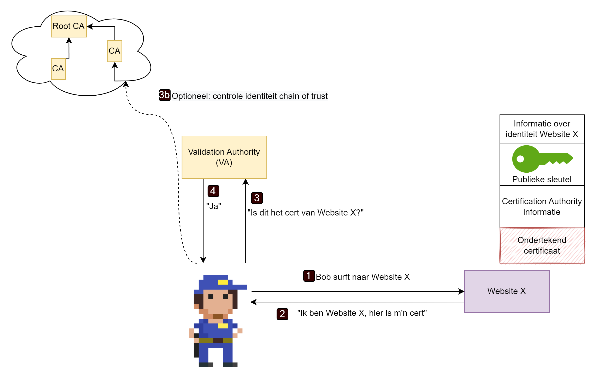{width=80%}

::: {.callout-note}
Alhoewel **HTTPS** al sinds 1995 bestond, werd het tot voor kort amper door websites aangeboden. Nochtans geeft HTTPS een extra defensielaag tijdens de communicatie van jouw computer met die waar een website op *gehost* staat. HTTPS zal namelijk je communicatie versleutelen zodat enkel zender en ontvanger kunnen lezen wat er gezegd wordt. Met HTTP is dat niet: al je communicatie kan door eender wie gelezen worden die zich tussen jouw computer en je eindbestemming nestelt. Het helpt echter niet dat je data versleuteld wordt als je niet kan bevestigen dat de ontvangende website ook effectief diegene is die je nodig hebt, vandaar dat dus certificaten en HTTPS in tandem werken om gebruikers een veiliger Internet aan te bieden.

Pas in 2017 boden meer dan de helft van de websites wereldwijd HTTPS aan. In 2021 gebruikt ongeveer 70% van alle websites HTTPS als standaard communicatiemiddel aan (vroeger waren er al websites met HTTPS, maar HTTP was de standaard oplossing).
:::

Het ergste dat voor een CA kan voorvallen is dat de betrouwbaarheid van de CA in het gedrang komt. Als een CA bijvoorbeeld weet heeft van een potentiële inbraak op zijn systemen dan bestaat er de kans dat aanvallers de private sleutel van de CA hebben bemachtigd en dus zelf certificaten *op naam van de CA* kunnen genereren, met alle gevolgen van dien! Indien dus deze kans bestaat, is er een *breach of trust* en zullen alle certificaten van deze CA als ongeldig worden bestempeld, inclusief alle certificaten van sub-CA's! Dit kan verregaande gevolgen hebben.

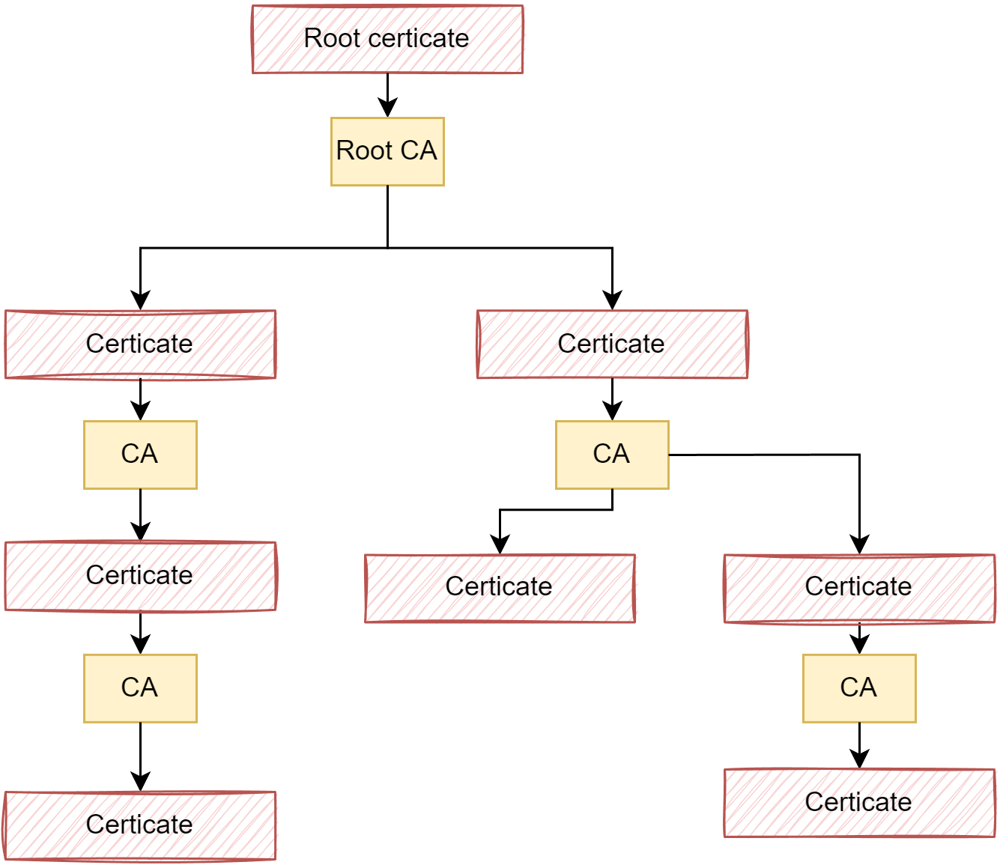{width=60%}

::: {.callout-note}
## Case: de val van DigiNotar (2011)

In 2011 werd de Nederlandse CA **DigiNotar** gehackt. De aanvallers konden valse certificaten uitgeven voor onder andere `google.com`, die vervolgens werden ingezet om Iraanse Gmail-gebruikers te bespioneren. Zodra de inbraak publiek werd, verwijderden browserfabrikanten DigiNotar uit hun lijst van vertrouwde root-CA's. **Alle** certificaten van DigiNotar werden daarmee in één klap ongeldig — ook die van de Nederlandse overheid, die DigiNotar gebruikte voor DigiD en andere diensten. DigiNotar zelf ging binnen enkele weken failliet. Het incident toont hoe fragiel de chain of trust is: één gecompromitteerde CA kan het vertrouwen voor duizenden sites kapotmaken.
:::

### Certificaten bekijken

In iedere moderne browser kan je snel bekijken hoe zo'n certificaat er juist uitziet. Als je via een HTTPS verbinding naar een website surft, dan op het slotje naast de URL in de adresbalk klikt kan je doorklikken om het certificaat te openen. Als je naar *HTTPS://www.belgium.be* surft en dit doet dan krijg je eerst wat samenvattende informatie:

Zo zien we onder andere de geldigheidsduur, alsook de CA die dit certificaat heeft gegenereerd.  Onder details kunnen we onder andere de publieke sleutel zien van de website alsook de gebruikte algoritmes voor de hash, e.d.

En op de laatste tab, Certificeringspad, zien we de chain of trust. We kunnen vervolgens hier de bovenliggende certificaten bekijken.

Het certificaat van Sectigo is uiteraard een **selfsigned certificate**, daar zij "bovenaan de hiërarchie staan". Als we Sectigo niet vertrouwen dan kunnen we ook de communicatie met *belgium.be* niet vertrouwen.
 
{width=40%}

### Persoonlijke certificaten

Naast certificaten voor webservers (zogenaamde **SSL certificaten**) kan je ook een persoonlijk certificaat aankopen om je eigen identiteit aan derden te bewijzen tijdens bijvoorbeeld e-mail-communicatie. Voorts heb je ook **code signing** certificaten die de echtheid van een applicatie bewijzen zodat je zeker bent dat je geen malware installeert als je programma X hebt gedownload. 

Persoonlijke certificaten worden ook gebruikt voor **mutual TLS** (mTLS), een uitbreiding op gewone HTTPS waarbij niet alleen de server, maar ook de **client** zich met een certificaat authenticeert. Dit wordt vaak gebruikt in bankomgevingen, e-government, bedrijfs-VPN's en communicatie tussen backend-servers, waar de server zeker wil zijn dat de client effectief is wie die beweert te zijn. Bij gewone HTTPS gebeurt dit niet omdat een website in principe elke bezoeker welkom heet.

{width=70%}

Als je in Windows 10 of nieuwer een applicatie of installer probeert uit te voeren dan zal de ingebouwde *SmartScreen* service ogenblikkelijk de echtheid (of ontbreken van) het certificaat controleren, net zoals dit ook in de browser zou gebeuren.

{width=40%}

Wil dat dan zeggen dat je applicaties niet kunt vertrouwen die door Smart Screen als onveilig worden aangeduid? Neen, dat niet. Je mag niet vergeten dat een certificaat geld kost en dat niet alle software-ontwikkelaars de middelen hebben om een officieel certificaat te kopen. Het loont dus altijd om extra waakzaam te zijn wanneer Smart Screen een waarschuwing geeft, maar het is dus niet zo dat de software automatisch als onveilig moet gehanteerd worden.

::: {.callout-tip}
Je kan via de Certification Manager van Windows bekijken welke certificaten je lokaal hebt geïnstalleerd, welke worden vertrouwd, etc. Je kan de GUI-versie van deze tool opstarten door "certlm.msc" uit te voeren.

{width=40%}

:::

### Web of Trust: een alternatief voor PKI

Het PKI-model steunt op **gecentraliseerde** Certificate Authorities die de identiteit van sleuteleigenaars garanderen. Er bestaat echter ook een **gedecentraliseerd** alternatief: het **Web of Trust** (WoT), dat bekend werd door **PGP** (Pretty Good Privacy) en de open-source variant **GPG** (GNU Privacy Guard).

In een Web of Trust zijn er geen centrale autoriteiten. In plaats daarvan ondertekenen gebruikers *elkaars* publieke sleutels. Als Alice de publieke sleutel van Bob persoonlijk heeft geverifieerd (bijvoorbeeld door zijn *key fingerprint* te vergelijken tijdens een ontmoeting), kan zij zijn sleutel ondertekenen met haar eigen private sleutel. Hiermee verklaart Alice: *"Ik bevestig dat deze publieke sleutel effectief van Bob is."*

<!--{width=60%}-->

Stel nu dat Carol de sleutel van Bob nodig heeft maar hem niet persoonlijk kent. Als Carol wél Alice vertrouwt en ziet dat Alice de sleutel van Bob heeft ondertekend, dan kan Carol via dat **vertrouwenspad** besluiten om ook Bobs sleutel te aanvaarden. Zo ontstaat een netwerk — een *web* — van onderlinge vertrouwensrelaties.

| Eigenschap           | PKI                                       | Web of Trust                                |
| -------------------- | ----------------------------------------- | ------------------------------------------- |
| Vertrouwensmodel     | Hiërarchisch (top-down via CA's)          | Gedecentraliseerd (peer-to-peer)            |
| Wie valideert?       | Certificate Authorities                   | De gebruikers zelf                          |
| Zwak punt            | Eén gecompromitteerde CA treft iedereen   | Vergt actieve deelname van gebruikers       |
| Typisch gebruik      | HTTPS, e-mail (S/MIME), code signing      | PGP/GPG e-mailencryptie, softwarepakketten  |

::: {.callout-note}
Het Web of Trust werd jarenlang gebruikt door de PGP/GPG-gemeenschap, onder andere via zogenaamde **key signing parties** waar mensen fysiek samenkwamen om elkaars sleutels te verifiëren en te ondertekenen. In de praktijk bleek het model echter moeilijk schaalbaar: het vergt veel moeite van individuele gebruikers en het is lastig om een betrouwbaar vertrouwenspad te vinden naar iemand die je niet kent. Daarom wordt voor de meeste toepassingen op het Internet vandaag het PKI-model met Certificate Authorities gebruikt.
:::

## HTTPS en TLS

Certificaten vormen het hart van een veilige manier van surfen. HTTPS, "HTTP-Secure", zorgt ervoor dat de communicatie tussen je browser en de website via een beveiligde, geëncrypteerde tunnel gebeurt. Tegenwoordig is HTTPS de default manier om een website te benaderen, maar dat is maar recent. Vroeger gebeurde alles via HTTP, waardoor iedereen die jouw trafiek kon sniffen, kon zien welke informatie je met de website uitwisselde. 

HTTPS is een protocol dat een beveiligde encryptietunnel opzet tussen jou en de website waarover vervolgens gewoon HTTP-verkeer kan verlopen (dit gebeurt over poort 443 in plaats van de klassieke poort 80 waarover HTTP verloopt). Deze tunnel wordt opgezet door het **TLS**-protocol, het *Transport Layer Security* protocol, dat de opvolger is van **SSL** (*Secure Sockets Layer*). TLS gebruikt certificaten om te vergewissen dat de website aan de andere zijde wel degelijk de website is die de gebruiker verwacht. Het doet dit door de publieke sleutel van de website eerst te controleren voor het vervolgens deze sleutel gebruikt om een gemeenschappelijke sleutel af te spreken die zal dienst doen als de encryptie-sleutel voor de gemeenschappelijke tunnel. Vanaf dit punt kunnen derden de trafiek van en naar de website niet meer sniffen.

Samengevat: **HTTPS is de combinatie van HTTP en een veilige encryptietunnel die met behulp van het TLS protocol wordt opgezet.**

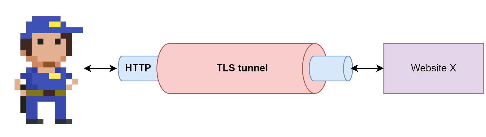{}

Samengevat zal dus TLS twee zaken doen:

1. Door middel van een certificaat (asymmetrische crypto) wordt de identiteit (de publieke sleutel) van de website gecontroleerd.
2. Door middel van een afgesproken algoritme (Diffie-Hellman, Forward Secrecy, Elliptic Curve, etc.) een gemeenschappelijke sleutel(s) afspreken en uitwisselen.

::: {.callout-tip}
Zoals reeds eerder vermeld is asymmetrische crypto trager, waardoor het altijd aanbevolen is om de trafiek tussen 2 punten finaal via een symmetrische crypto verbinding te laten plaatsvinden. TLS/HTTPS combineert met andere woorden de sterktes van beide soorten crypto om zo de zwaktes van beiden te neutraliseren.
:::

De manier waarop een TLS-verbinding wordt opgezet is vrij uitgebreid. Volgende briljante website ([tls.ulfheim.net/](HTTPS://tls.ulfheim.net/)) visualiseert de berichten die server en client uitwisselen om zo'n verbinding te starten, onderhouden en eindigen.

::: {.callout-warning}
Alhoewel HTTPS onze verbinding een pak veiliger maakt, heeft het voor je ISP (Internet Service Provider, bijvoorbeeld Telenet of Proximus) en de website ook enkele nadelen. Omdat alle informatie geëncrypteerd wordt heeft de ISP geen enkel idee wat voor informatie je aan het uitwisselen bent, waardoor caching ook niet meer mogelijk is. In een normale HTTP-omgeving kan een ISP trafiek over het Internet uitsparen door een reeds bewaarde versie van hetgeen jij nodig hebt uit de cache te halen en naar je te sturen. Ook de website naar waar je surft, ondervindt dit nadeel: het zal met HTTPS veel meer trafiek genereren dan wanneer de tussenliggende ISP een deel van het werk via zijn caching overnemen. 
:::

### End-to-end encryptie onder druk: Apple en de UK

End-to-end encryptie (E2EE) zorgt ervoor dat enkel de zender en ontvanger de inhoud van berichten of data kunnen lezen — zelfs de dienstverlener (zoals Apple of Google) heeft geen toegang. Dit principe is een directe toepassing van de publieke cryptografie die we in dit hoofdstuk bespraken: data wordt versleuteld met de publieke sleutel van de ontvanger en kan enkel met diens private sleutel worden ontsleuteld.

In 2025 werd Apple door de Britse overheid gedwongen om **Advanced Data Protection** (ADP), de end-to-end encryptie van iCloud-data, uit te schakelen voor alle gebruikers in het Verenigd Koninkrijk. De overheid eiste namelijk een *backdoor*: een manier voor opsporingsdiensten om toegang te krijgen tot versleutelde gegevens. Apple weigerde een backdoor in te bouwen — omdat dit de beveiliging voor **alle** gebruikers zou verzwakken — en koos er in plaats daarvan voor om de E2EE-functionaliteit in het VK volledig te verwijderen. iMessage, FaceTime en iCloud Keychain behielden wel hun end-to-end encryptie.

::: {.callout-warning}
Dit voorbeeld illustreert een fundamenteel spanningsveld in cryptografie: **een backdoor die enkel voor "de goeden" werkt, bestaat niet**. Zodra er een achterpoortje in een encryptiesysteem zit, is het slechts een kwestie van tijd voordat ook kwaadwillige actoren deze ontdekken of misbruiken. Dit gaat recht in tegen Kerckhoffs principe: de veiligheid van het systeem mag enkel afhangen van de geheimhouding van de sleutel, niet van het verbergen van zwakheden in het systeem zelf.
:::

#### Chat Control: ook in de EU

Dit debat speelt niet enkel in het Verenigd Koninkrijk. De Europese Commissie stelde in 2022 de **Child Sexual Abuse Regulation** voor, beter bekend als **Chat Control**. Dit voorstel zou chatdiensten zoals WhatsApp en Signal verplichten om berichten van alle gebruikers automatisch te scannen op illegale inhoud — ook berichten die end-to-end versleuteld zijn. Critici, waaronder cryptografen en organisaties als de EFF en EDRi, waarschuwen dat dit technisch neerkomt op het inbouwen van een backdoor of het installeren van *client-side scanning* (spyware op het toestel zelf), wat de facto end-to-end encryptie onmogelijk maakt.

Na jarenlange controverse en tegenstand vanuit het Europees Parlement, werd het meest omstreden onderdeel — het verplicht scannen van versleutelde berichten — in 2025 afgezwakt. Het voorstel wordt echter nog steeds onderhandeld en de uiteindelijke impact op E2EE blijft onzeker.

::: {.callout-note}
De kern van het probleem is telkens hetzelfde: je kan niet tegelijk **echte** end-to-end encryptie garanderen én een manier voorzien om berichten te lezen. Of de sleutel is geheim, of hij is het niet — er is geen tussenweg.
:::

### Mitmproxy

*Mitmproxy* is een krachtige linux-tool die een man-in-the-middle aanval op HTTPS toelaat. Het zal ervoor zorgen dat een aanvaller zich tussen jou en het Internet kan nestelen en vervolgens doen alsof al je HTTPS-verbindingen veilig blijven. In de praktijk zorgt mitmproxy ervoor dat alle HTTPS-verbindingen van de client naar de aanvaller gebeuren, die op zijn beurt TLS tunnels zal opzetten met de website waar het slachtoffer naar surft. Hierdoor kan de aanvaller enerzijds alle trafiek lezen, maar bijvoorbeeld ook ongezien aanpassen.

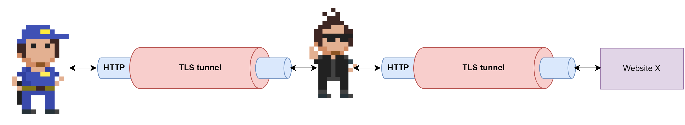{width=90%}

De aanvaller zal echter nog steeds geen geldige certificaten kunnen genereren waardoor moderne browsers normaal gezien hier een waarschuwing zouden moeten geven.

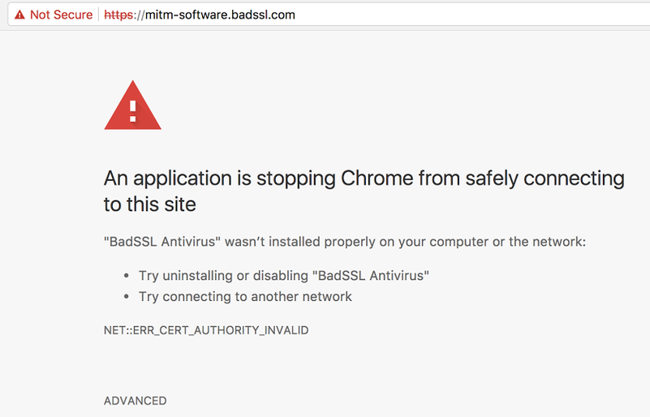{width=70%}

## Samenvatting

Cryptografie is de gereedschapskist waarmee we CIA realiseren. De centrale inzichten uit dit hoofdstuk:

* **Kerckhoffs** is de kern: alleen de **sleutel** moet geheim blijven, nooit het algoritme. *Security through obscurity* is een valstrik.
* Oude technieken (Caesar, Vigenère, scytale) combineren **substitutie** en **transpositie** — dezelfde bouwstenen die AES nog steeds gebruikt.
* **Symmetrische encryptie** is snel (AES als de-facto standaard, gebaseerd op het Belgische Rijndael) maar kent het **sleuteloverdrachtsprobleem**.
* De **blockcipher-mode** is even kritiek als de cipher zelf: **ECB lekt patronen**, **CBC/CTR** niet — mits correcte IV/nonce.
* **Asymmetrische encryptie** (RSA, ECC) lost het sleuteloverdrachtsprobleem op via een publiek/privé-sleutelpaar. **Diffie-Hellman** laat twee partijen zonder vooraf gedeeld geheim een gezamenlijke sleutel afspreken.
* **Hashes** zorgen voor *integrity*, **digitale handtekeningen** voegen daar authenticiteit en *non-repudiation* aan toe.
* **Digitale certificaten en PKI** lossen het vertrouwensprobleem op — maar enkel zolang de CA betrouwbaar blijft (cfr. de val van DigiNotar).
* **HTTPS/TLS** combineert al deze bouwstenen, en toch blijft het kwetsbaar zonder goede certificaatvalidatie, zoals *mitmproxy* aantoont.
* **Cryptanalyse** dwingt sleutels steeds langer te maken; **quantum-computers** bedreigen RSA/ECC op lange termijn — *store now, decrypt later* is een realistische dreiging.

In het volgende hoofdstuk zien we hoe authenticatie op deze crypto-bouwstenen steunt.
