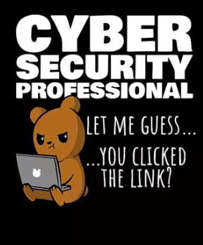

#  Cybersecurity Awareness creëren

In dit hoofdstuk bekijken we de belangrijke rol die **cybersecurity-awareness** speelt binnen organisaties. Als cybersecrurity-professionals zijn we ons bewust van de risico's, maar hoe zorgen we ervoor dat ook onze collega's deze risico's begrijpen en ernaar handelen? Dit hoofdstuk biedt inzicht in de noodzaak van awareness, de rol van medewerkers, en praktische tips om een cultuur van cybersecurity te bevorderen.

## Waarom awareness?

De voorbije hoofdstukken hebben hopelijk al heel duidelijk gemaakt dat er zich nog te vaak cybersecurity-incidenten voordoen. Veel van die incidenten hadden eenvoudig kunnen worden voorkomen als werknemers (en gevers!) ook maar enige, minimale cybersecurity-awareness-training hadden gehad. Uit onderzoek blijkt dat ongeveer **90% van alle beveiligingsincidenten veroorzaakt wordt door menselijke fouten**, bewust of onbewust. Denk hierbij aan het klikken op phishing-links, het gebruiken van zwakke wachtwoorden, of het verbinden met onveilige wifi-netwerken. Deze menselijke factor maakt awareness onmisbaar binnen een robuust beveiligingsbeleid. Die laatste zin willen we nog even benadrukken: **bewustzijn is onmisbaar binnen een robuust beveiligingsbeleid**. Het is niet voldoende om alleen technische maatregelen te nemen; medewerkers moeten ook begrijpen waarom deze maatregelen belangrijk zijn en hoe ze deze kunnen toepassen in hun dagelijkse werkzaamheden.

### Jouw rol binnen een organisatie

Jouw taak als cybersecurity expert gaat verder dan enkel systemen te configureren en onderhouden. Jij vormt ook de brug tussen IT en bedrijfsbeleid. Jij bent als het ware een **bewustzijnsambassadeur** die complexe technische informatie vertaalt naar begrijpelijke taal voor collega's.

Daarnaast heb je ook een signalerende rol:

* Identificeren van potentiële risico's.
* Rapporteren van afwijkingen of verdachte gebeurtenissen, en dit op een snelle en duidelijke manier.

### Bescherm de hele keten: McCumber Cube

In hoofdstuk 2 bespraken we reeds de McCumber cube. Deze visualisatie helpt ons om in te zien dat we cybersecurity vanuit al z'n dimensies en facetten moeten bekijken. Hierbij waren de voorbije hoofdstukken vooral gericht op het technologie-aspect in functie van C.I.A en de staat van de data (processing, storage, transmission). In dit hoofdstuk gaan we daarom dieper in op de **menselijke** dimensie van cybersecurity. Dit is een cruciaal aspect dat vaak over het hoofd wordt gezien, maar dat net zo belangrijk is als de technische maatregelen die we nemen. De menselijke factor is immers de zwakste schakel in de beveiligingsketen. Daarom is het essentieel dat we ons richten op het creëren van een cultuur van cybersecurity-awareness binnen onze organisatie. 

## Awareness-campagnes

Om de medewerkers in een bedrijf te trainen in cybersecurity, zijn er verschillende methoden en technieken beschikbaar. Het doel van deze trainingen is om medewerkers bewust te maken van de risico's en hen te leren hoe ze veilig kunnen werken. Dit kan door middel van e-learning, workshops, of zelfs gamification. Het is belangrijk dat deze trainingen regelmatig worden herhaald, zodat medewerkers op de hoogte blijven van de laatste ontwikkelingen en trends op het gebied van cybersecurity. 

Meestal gaan we dit doen aan de hand van, terugkerende, **awareness-campanges**. 

### Gebruikersverwarring voorkomen

Losse technische maatregelen zijn niet voldoende. We moeten ook zorgen dat medewerkers begrijpen waarom deze maatregelen belangrijk zijn en hoe ze deze kunnen toepassen in hun dagelijkse werkzaamheden. Dit vereist een combinatie van technische kennis, communicatievaardigheden en leiderschap.

Medewerkers hebben namelijk vaak vragen zoals:

* "Waarom mag ik geen publiek wifi gebruiken?"
* "Waarom moet ik steeds opnieuw inloggen met multifactor-authenticatie (MFA)?"
* "Waarom moet ik mijn laptop vergrendelen?"

Het doel van awareness-campagnes is medewerkers zelfstandig antwoorden op deze vragen te laten geven. Niet door ze regels op te leggen, maar door ze inzicht te geven in de risico's en gevolgen van bepaalde gedragingen. Deze aanpak geldt trouwens eender waar in een omgeving waar er regels, wetten en procedures zijn. Het is niet voldoende om enkel te zeggen "dat mag niet". We moeten ook uitleggen waarom iets niet mag en wat de gevolgen zijn van het negeren van deze regels. 

Effectieve awareness-campagnes leggen dus niet enkel uit **wat** je moet doen, maar vooral ook **waarom**:

* Gebruikers leggen zelfstandig de link tussen risicogedrag en de mogelijke gevolgen.
* Ze maken bewust de keuze voor veilige werkmethoden.
* Veilig handelen wordt een routine, intrinsiek gemotiveerd door begrip.

Uiteindelijk willen we dat medewerkers autonoom zijn:

* Ze herkennen en rapporteren nieuwe risico’s zelfstandig.
* Ze kunnen geleerde principes toepassen op onbekende situaties.

### Succesvolle awareness-methoden

De mate waarin een campagne werkt hangt van vele factoren af. Het is belangrijk dat de campagne dan ook binnen de context van het bedrijf past: er is geen "one size fits all". Hoe beter de campagne is afgestemd op het bedrijf en de medewerkers, hoe effectiever de campagne zal zijn. Gebruik met andere woorden realistische scenario's en voorbeelden die aansluiten bij de dagelijkse werkzaamheden van de medewerkers. Dit maakt het makkelijker voor hen om de informatie te begrijpen en toe te passen in hun eigen werk.

Alhoewel er tal van bedrijven zijn die awareness-campagnes aanbieden, zijn er ook een aantal goede gratis bronnen beschikbaar. Denk hierbij aan de website van de **SANS Institute** of de **Cybersecurity & Infrastructure Security Agency (CISA)**. Deze organisaties bieden gratis materialen en trainingen aan die bedrijven kunnen gebruiken om hun medewerkers bewust te maken van cybersecurity-risico's.

Enkele effectieve methodes voor cybersecurity-awareness zijn:

* **Regelmatige micro-trainingen**: korte, frequente sessies. Dit voorkomt dat medewerkers overweldigd worden door informatie en zorgt ervoor dat ze de informatie beter onthouden.
* **Phishing-simulaties**: directe feedback op acties zorgt voor snelle leerprocessen. Dit kan bijvoorbeeld door medewerkers te testen met nep-phishing-e-mails. Dit helpt hen om verdachte e-mails te herkennen en voorkomt dat ze in de val lopen van echte phishing-aanvallen. 
* **Gamification**: quizzen en uitdagingen verhogen motivatie en betrokkenheid. Je zou bijvoorbeeld via een dashboard kunnen tonen welke dienst binnen het bedrijf het beste presteert op het gebied van cybersecurity-awareness. Dit kan medewerkers motiveren om beter op te letten en hun kennis te vergroten. 
* **Posters en nieuwsbrieven met impact**: visuele reminders in de werkomgeving. Dit kan bijvoorbeeld door posters op te hangen met tips voor veilig werken of door het gebruik van stickers op laptops en andere apparaten. Dit zorgt ervoor dat medewerkers regelmatig worden herinnerd aan de belangrijkste principes van cybersecurity. Als deze posters op de koop toe grappig, of zelfs uitdagend zijn, zullen medewerkers ze sneller opmerken en onthouden.

{ width=30% }

* **Leiderschap**: het management moet het goede voorbeeld geven. Dit kan bijvoorbeeld door zelf ook regelmatig deel te nemen aan trainingen of door openlijk te praten over cybersecurity-risico's. Dit laat zien dat cybersecurity een prioriteit is binnen de organisatie en dat iedereen verantwoordelijk is voor het waarborgen van de veiligheid.

:::tip
Gedragsverandering is vaak de moeilijkste uitdaging binnen cybersecurity. Positieve gedragsverandering bereik je niet door medewerkers te straffen of te bedreigen, maar door ze te motiveren en te inspireren. 
:::

## Praktische best practices

Doorheen het handboek hebben we al tal van praktische "best practices" aangereikt. We vatten ze hier nog eens samen, daar zij de *backbone* zullen vormen van de inhoud van je awareness-campagnes. Dit zijn de basisprincipes die elke medewerker moet kennen en toepassen in zijn of haar dagelijkse werkzaamheden. Deze principes zijn niet alleen van toepassing op cybersecurity, maar ook op andere gebieden binnen een organisatie. Ze helpen medewerkers om veilig en efficiënt te werken, ongeacht hun functie of verantwoordelijkheden.

**Wachtwoordhygiëne**

* Gebruik sterke, unieke wachtwoorden.
* Maak gebruik van een wachtwoordmanager.
* Zet altijd multifactor-authenticatie aan.

**Secuur apparaatbeheer**

* Installeer automatische updates.
* Gebruik antivirussoftware.
* Vergrendel je laptop wanneer je weggaat.

**Veilig werken met documenten en netwerken**

* Vermijd onbekende USB-sticks en kabels.
* Gebruik enkel vertrouwde wifi-netwerken.
* Maak regelmatig backups van documenten, zowel fysiek als digitaal.

**Blijf alert en leer verder**

* Deel kennis actief binnen je team.
* Blijf bij met nieuwe ontwikkelingen op het gebied van cybersecurity.

## Incident response

Awareness is ook cruciaal in incidentbeheer. Indien je medewerkers bewust zijn van de risico's en weten hoe ze moeten reageren op incidenten, kunnen ze sneller en effectiever handelen. Dit kan de impact van een incident aanzienlijk verminderen.

Incident response is een gestructureerde aanpak voor het afhandelen van beveiligingsincidenten. Het doel is om de schade te minimaliseren, de oorzaak van het incident te begrijpen, en herhaling in de toekomst te voorkomen. Een goed **incident response-plan** omvat duidelijke procedures, verantwoordelijkheden, en communicatiekanalen. Dergelijk plan bestaat uit verschillende stappen, die vaak worden weergegeven in een cyclus. De stappen zijn als volgt:

1. **Prepare**: Voorbereiden op incidenten vóór ze gebeuren. In deze fase worden alle procedures en verantwoordelijkheden gedefinieerd. Dit omvat ook het trainen van medewerkers in hoe ze moeten reageren op incidenten. Dit is waar awareness-campagnes een belangrijke rol spelen. Het incident response-plan moet meer zijn dan een document dat in de kast ligt. Het moet een levend document zijn dat regelmatig wordt bijgewerkt en waar medewerkers actief mee aan de slag gaan.
2. **Identify**: Incidenten snel herkennen. Dit kan door middel van monitoring, logging, en rapportage. Het is belangrijk dat medewerkers weten hoe ze verdachte activiteiten kunnen herkennen en rapporteren. Dit kan bijvoorbeeld door het gebruik van een meldingsformulier of een speciaal meldpunt binnen de organisatie.
3. **Contain**: Beperk de schade direct na detectie. Dit kan door het isoleren van getroffen systemen of het blokkeren van verdachte accounts. Het is belangrijk dat medewerkers weten hoe ze snel kunnen handelen om verdere schade te voorkomen.
4. **Eradicate**: Verwijder het incident volledig. Vanaf deze, of de vorige stap zal meestal de IT-afdeling de verantwoordelijkheid nemen. Het is belangrijk dat medewerkers weten dat ze niet alleen verantwoordelijk zijn voor het melden van incidenten, maar ook voor het helpen bij het oplossen ervan. Dit kan bijvoorbeeld door het verzamelen van informatie over het incident of door het uitvoeren van bepaalde taken binnen de organisatie.
5. **Recover**: Herstel systemen en data. 
6. **Follow Up**: Analyseer wat er is gebeurd en verbeter processen.

{ width=85% }

Awareness helpt vooral bij de **Identify** stap:

* Goede meldprocedures zijn dan ook cruciaal (wie, wat, hoe snel).
* Maak meldkanalen toegankelijk en laagdrempelig.
* Snelheid van identificatie bepaalt vaak de impact van een incident.

:::tip
Het heeft geen nut om uiterst complexe incident response-plannen te maken, als medewerkers niet weten hoe ze deze moeten toepassen. Daarom is het belangrijk dat medewerkers goed op de hoogte zijn van de procedures en verantwoordelijkheden binnen het incident response-plan. 
:::

:::tip
Het internet staat vol van nuttige hulpmiddelen om awareness campagnes uit te voeren. Gaande van toffe posters, tot *fullblown* phishing simulators (kijk zeker eens naar **GoPhish**). Met dank aan de immer krachtiger wordende mogelijkheden van ChatGPT en friends wordt het ook steeds eenvoudiger om succesvolle campagnes uit te werken en te visualiseren.
:::

## Social engineering en phishing

De eenvoudigste manier om medewerkers te hacken is door middel van social engineering. De aanvaller heeft hier namelijk geen tools of technieken voor nodig, enkel een goed verhaal. Social engineering is het manipuleren van mensen om vertrouwelijke informatie te verkrijgen of toegang te krijgen tot systemen. Dit kan bijvoorbeeld door middel van phishing-e-mails, waarbij de aanvaller zich voordoet als een vertrouwde bron om medewerkers te misleiden. Het is belangrijk dat medewerkers zich bewust zijn van deze risico's en weten hoe ze verdachte e-mails kunnen herkennen en rapporteren.

Omdat het leuk is om lijstjes te maken, hebben we hier een lijstje met de meest voorkomende social engineering technieken. Meestal zullen de digitale stropers een combinatie van deze technieken gebruiken om hun doel te bereiken.

* **Pretexting**: De aanvaller doet zich voor als iemand anders, bijvoorbeeld een collega of een IT-medewerker, om vertrouwelijke informatie te verkrijgen. Dit kan bijvoorbeeld door middel van een telefoongesprek of een e-mail. Meestal kan je dit herkennen aan de vraag om gevoelige informatie, zoals wachtwoorden of persoonlijke gegevens. Door een **challenge** te stellen, kan je de aanvaller vaak ontmaskeren. Vraag bijvoorbeeld om een bevestiging van de identiteit van de persoon die je aan de lijn hebt. Dit kan bijvoorbeeld door middel van een terugbelprocedure of door het controleren van hun e-mailadres.
* **Tailgating**: De aanvaller volgt een medewerker naar binnen in een beveiligd gebied. Dit kan bijvoorbeeld door zich voor te doen als een medewerker of door simpelweg achter iemand aan te lopen. Dit kan je voorkomen door altijd je toegangspas te gebruiken en nooit iemand anders binnen te laten zonder hun identiteit te verifiëren. Het voelt soms lastig aan om een wildvreemde te vragen om zich te identificeren, maar het is beter om voorzichtig te zijn dan om een beveiligingsrisico te creëren.
* **Vishing**: Voice phishing, waarbij de aanvaller zich voordoet als iemand anders via de telefoon. Dit kan bijvoorbeeld door zich voor te doen als een IT-medewerker of een bankmedewerker. Dit kan je herkennen aan verdachte vragen of verzoeken om persoonlijke informatie. Wees altijd voorzichtig met het delen van gevoelige informatie via de telefoon en verifieer altijd de identiteit van de persoon die je aan de lijn hebt. Doordat A.I. steeds beter wordt, is het ook mogelijk dat de aanvaller je stem kan imiteren. Dit maakt het nog moeilijker om te bepalen of je met een echte persoon of een nep persoon aan de lijn hebt. Meestal kan je de aanvaller ontmaskeren door ook nu weer een **challenge** te stellen. Je zou bijvoorbeeld een vraag uit het verleden kunnen stellen die enkel jij en de andere persoon kan weten. Als de persoon per ongeluk het juiste antwoord geeft dan kan je nog steeds doen alsof dit niet juist is om te zien of de aanvaller z'n correcte antwoord aanpast ("Uw bank is KBC", "Neem hoor (ook al is het dat wel)", "Oh excuses, ik bedoelde Argenta".) Deze vorm van challenge wordt ook wel **reverse social engineering" genoemd.
* **Baiting**: Deze techniek zal het slachtoffer lokken met iets dat hij echt wilt. Denk maar aan een USB-stick van het bedrijf, gratis een maand toegang tot Spotify Premium, etc. Van zodra je de *bait* aanvaardt, zal via deze weg meestal de aanval verder gezet worden (denk maar een virus dat op de USB-stick staat, of de link naar de gratis Spotify blijkt een link naar een malware server te zijn.) Het paard van Troje is een mooi voorbeeld van social engineering met behulp van *baiting*.
* **Quid Pro Quo**: 'Voor wat hoort wat'. De aanvaller zal een iets aanbieden (*bait*) maar dat enkel geven in ruil voor iets anders. Om bijvoorbeeld de bait te krijgen moet je eerst een vragenlijst invullen, maar in de vragenlijst staan ook vragen die je gevoelige informatie zullen ontfutselen ("Hoe heette je eerste huisdier"). Dit kan ook door bijvoorbeeld een gratis softwarepakket aan te bieden in ruil voor je e-mailadres of andere persoonlijke informatie.

Het is niet altijd eenvoudig om social engineering-aanvallen te herkennen, maar er zijn een aantal signalen waar je op kunt letten. Dit zijn enkele tips om verdachte e-mails of telefoontjes te herkennen:
* Controleer altijd het e-mailadres of telefoonnummer van de afzender. Dit kan je doen door het e-mailadres of telefoonnummer te vergelijken met eerdere communicatie of door het op te zoeken op de website van het bedrijf.
* Let op verdachte links of bijlagen in e-mails. Dit kan je doen door de muisaanwijzer boven de link te houden zonder erop te klikken. Dit toont je waar de link naartoe leidt. Als de link er verdacht uitziet, klik er dan niet op.
* Wees voorzichtig met het delen van persoonlijke informatie. Dit kan je doen door altijd te vragen waarom de informatie nodig is en hoe deze zal worden gebruikt. Als je twijfelt, deel de informatie dan niet.
* Let op verdachte verzoeken of vragen. Dit kan je doen door altijd te vragen waarom de informatie nodig is en hoe deze zal worden gebruikt. Als je twijfelt, deel de informatie dan niet.

Bij twijfel kan je altijd een challenge stellen. En als je nog steeds twijfelt, doe dan een extra challenge, tot je overtuigd bent. Je zal verrassend vaak merken dat de aanvaller niet voorbereid is op deze extra vragen. En als blijkt dat de tegenpartij wel degelijk legitiem is, dan kan je altijd nog excuses aanbieden. Dit is een kleine prijs om te betalen voor de veiligheid van jezelf en je organisatie.

