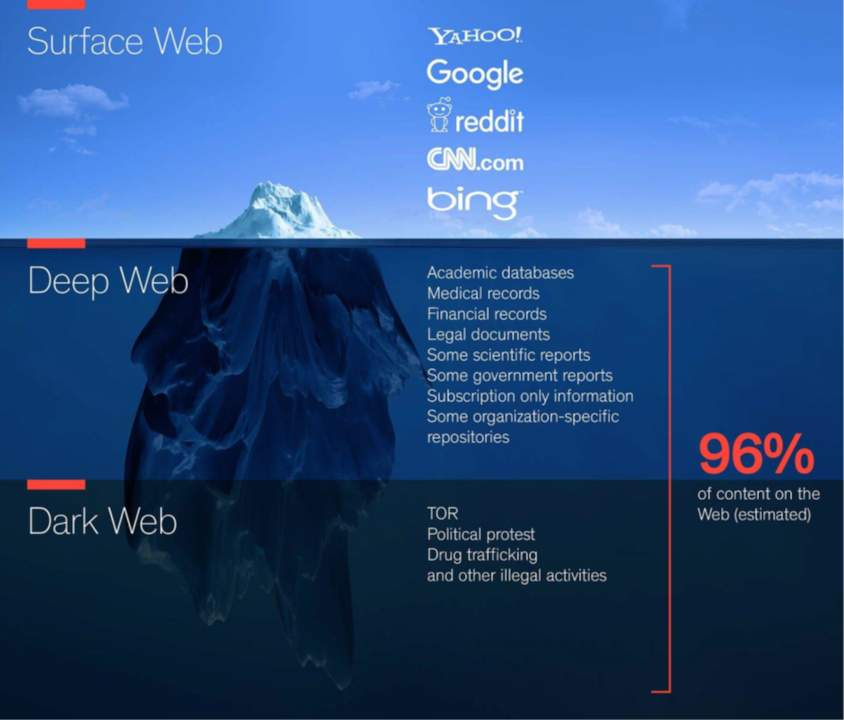
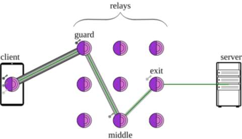

#  Dark web

Het internet is vergelijkbaar met de echte wereld: het heeft goed verlichte plekken die iedereen kan zien, maar ook verborgen achterbuurten. Het Darkweb is zo'n verborgen gedeelte van het internet. Het maakt deel uit van het zogenaamde "Deep Web", dat gedeelte van het internet dat niet via standaard zoekmachines zoals Google te vinden is. Denk hierbij aan databanken, afgeschermde websites en persoonlijke accounts die niet publiek toegankelijk zijn.

Binnen dat Deep Web bestaat een extra verborgen deel, het Darkweb, bekend om anonimiteit en privacy. Dit deel van het internet is alleen toegankelijk via speciale software zoals TOR (The Onion Router).

{ width=70% }

## Kenmerken van het Darkweb

Het Darkweb onderscheidt zich van het reguliere internet door een aantal belangrijke kenmerken:

**Anoniem:**
Gebruikers blijven anoniem doordat hun verbinding via meerdere tussenliggende servers loopt. Hierdoor is het zeer moeilijk te achterhalen wie een bepaalde website bezoekt of een bepaalde boodschap heeft verzonden.

**Beveiligd:**
Communicatie en verkeer op het Darkweb zijn versleuteld met sterke encryptie. Dit voorkomt dat derden kunnen meekijken of informatie onderscheppen.

**Gedecentraliseerd:**
Er is geen centrale autoriteit of punt van controle op het Darkweb. Dit maakt het moeilijk voor overheden en instanties om toezicht te houden, te censureren of sites uit de lucht te halen.

Zoals elke technologie kan ook het Darkweb gebruikt worden voor goede én slechte doeleinden:

* Slecht: 
    * Handel in illegale goederen zoals drugs, wapens en gestolen informatie.
    * Verhuur van criminele diensten ("rent-a-hacker").
* Goed:
    * Bescherming van privacy en anonieme communicatie.
    * Platforms voor journalisten, klokkenluiders en activisten om veilig te communiceren.

## Waarom bestaat het Darkweb?

Een belangrijk uitgangspunt: **het gewone internet is niet anoniem**. Via je IP-adres, cookies, logs van providers en talloze trackers ben je bijna altijd traceerbaar. Voor de meeste mensen is dat geen probleem — maar voor sommigen wél.

Er zijn immers landen die het hele internet in de gaten houden of censureren, zoals China, Saudi-Arabië, Iran, Egypte, Noord-Korea en Cuba. Dat toezicht kent verschillende vormen:

* **Volledige controle**: de overheid monitort al het verkeer en logt wie wat doet.
* **Blacklisting**: bepaalde sites of diensten (sociale media, nieuwssites, messengers) worden gewoon geblokkeerd.

In die context biedt het Darkweb een veilige ruimte voor journalisten, activisten en klokkenluiders om zich vrij en anoniem te uiten. Denk aan het belang van een **schuilnaam** (*nom-de-plume*): niet iedereen — en zeker niet de overheid — moet weten wat jij in je vrije tijd leest, schrijft of bespreekt. Anonimiteit is zo een cruciaal hulpmiddel voor vrije meningsuiting en democratie.

Aan de andere kant trekt anonimiteit ook mensen aan die het internet gebruiken voor illegale activiteiten, zoals handel in drugs, wapens, gehackte gegevens, of gestolen creditcardgegevens. Belangrijk om te onthouden: **anonimiteit is geen vrijgeleide**. Als je iets illegaal doet op het Darkweb, ben je sowieso strafrechterlijk vervolgbaar — politiediensten hebben wel degelijk middelen om criminelen op het Darkweb op te sporen.

Het Darkweb is dus niet per definitie illegaal, maar wat je erop doet kan dat wel zijn. In sommige landen, zoals Rusland en China, is het gebruik van het Darkweb zelf al strafbaar.

Het vinden van een evenwicht tussen privacy en vrijheid enerzijds, en opsporing en veiligheid anderzijds, blijft een **moeilijke afweging** die onze samenleving voortdurend opnieuw moet maken.

## Toegang tot het Darkweb: TOR

De meest voorkomende manier om het Darkweb te bezoeken is via het zogenaamde TOR-netwerk (The Onion Router). Dit netwerk leidt jouw internetverkeer via meerdere relais-servers om jouw identiteit te verhullen. Een website op het Darkweb herken je aan het ".onion"-adres, wat alleen via een TOR-browser te openen is.

{ width=70% }

## TOR heeft ook nadelen:

**Snelheid**: Het TOR-netwerk is relatief traag door de vele tussenstations.

**Blokkades**: Sommige websites blokkeren verkeer vanaf TOR-servers.

**Firewall**: Veel bedrijfsnetwerken en firewalls blokkeren verkeer van en naar het TOR-netwerk.

Er bestaan ook browsers, zoals Brave Browser, die TOR al geïntegreerd hebben, waardoor het gebruik eenvoudiger wordt.

## Waarom moet je dit nu weten?

Het is belangrijk om inzicht te hebben in de risico’s en kansen die het Darkweb biedt. Denk hierbij aan:

* Het begrijpen van criminele fenomenen zoals online drugshandel, cybercrime en mensenhandel.
* Het analyseren van bedreigingen en risico's voor organisaties en individuen.
* Het begrijpen van het belang van privacy, vrije meningsuiting, en de complexiteit van online toezicht en censuur.

Het Darkweb maakt dus deel uit van het bredere veiligheidsvraagstuk binnen de samenleving.

::: {.callout-note}
Vanwege tijdsgebrek werd deze appendix over het Darkweb grotendeels gegenereerd m.b.v. ChatGPT, gebaseerd op de slidedeck.
:::
