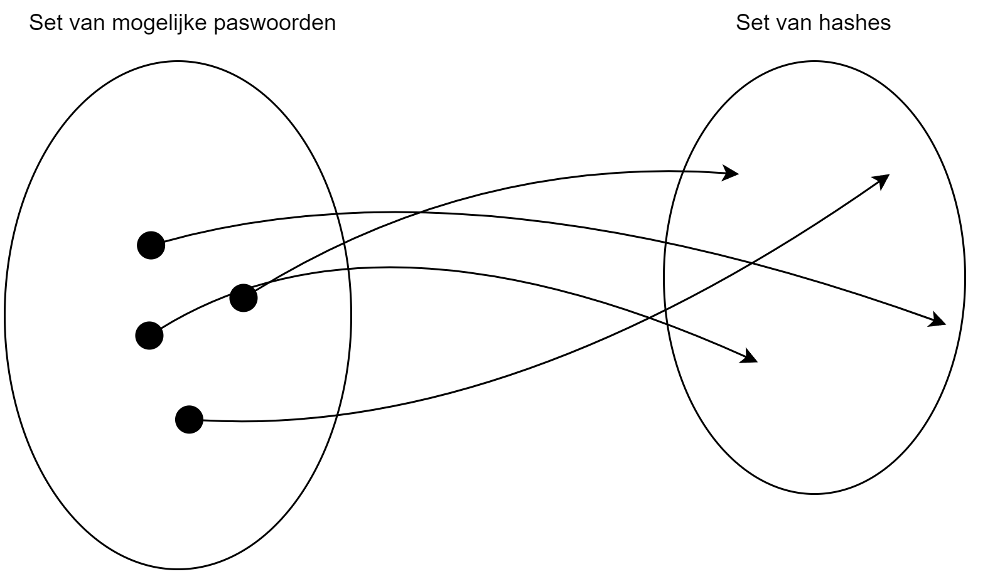
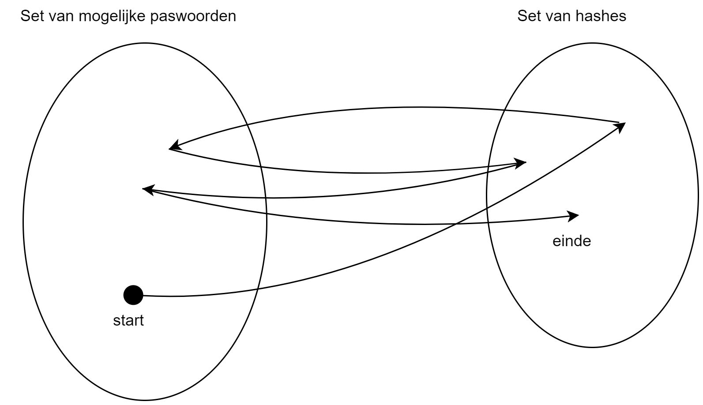
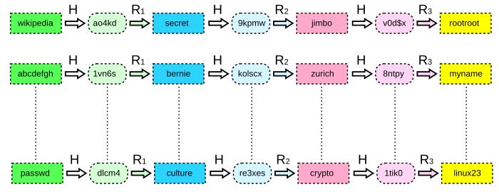
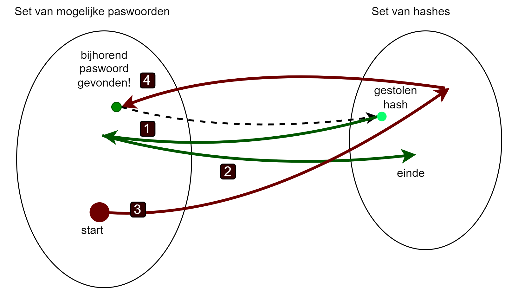
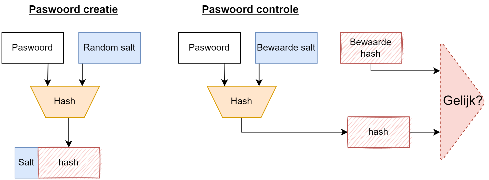
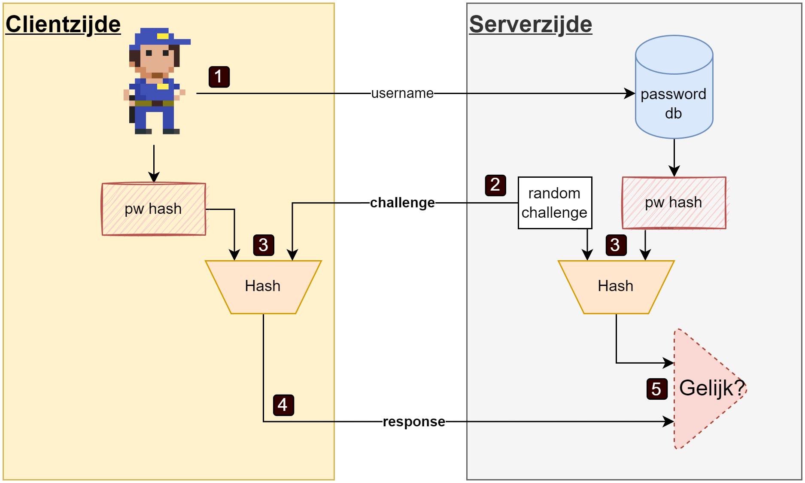
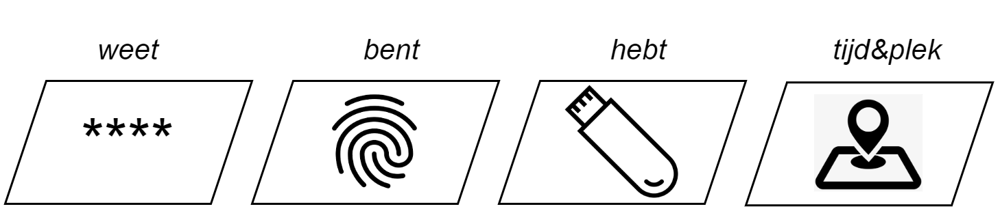
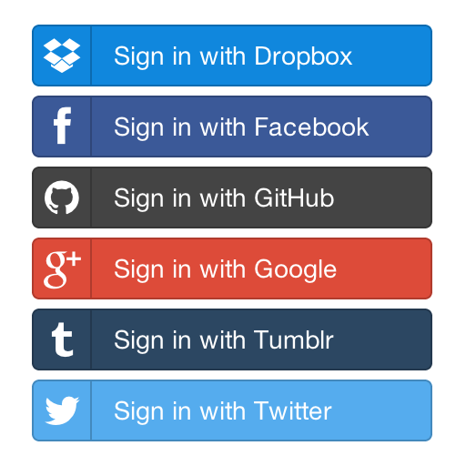

## Wat leer je in dit hoofdstuk?

Na dit hoofdstuk kan je:

* de **drie gouden regels** van wachtwoordbeheer toepassen
* **hashing, salting en rainbow tables** uitleggen — en waarom salting beschermt
* **CRAM, SCRAM en passkeys** onderling situeren
* de vier **MFA-factoren** (weten/hebben/zijn/waar-wanneer) combineren
* **TOTP** uitleggen + waarom **passkeys** veiliger zijn tegen real-time phishing

---

## Authenticatie vs Autorisatie

| Concept | Vraag |
|---|---|
| **Authenticatie** | *Wie ben je?* — Bewijs van identiteit |
| **Autorisatie** | *Wat mag je?* — Toekennen van rechten |

::: {.callout-tip .fragment}
Dit hoofdstuk: focus op **authenticatie** — hoe gaan we als beheerders veilig om met login-informatie?
:::

---

## De geheime sleutel als authenticatie

* **Weten van de geheime sleutel** = eerste vorm van authenticatie
* Login = combinatie **gebruikersnaam + wachtwoord**
* Wachtwoord = in essentie je **geheime sleutel**

::: {.callout-important .fragment}
Als beheerder is het **essentieel** om uitermate veilig om te gaan met de wachtwoorden van gebruikers!
:::

---

## Veilige wachtwoorden: de regels

Regels die continu **niét** gehanteerd worden:

* **Hergebruik nooit** een wachtwoord — één per service
* Gebruik geen wachtwoorden uit **dictionaries** — overweeg random gegenereerde wachtwoorden
* Minimum **16 tekens** lang
* Combinatie van **cijfers, letters** (groot + klein) **en leestekens**

---

## Hoe stropers aan wachtwoorden komen

Niet altijd via de database! Denk aan de McCumber kubus: **technologie is maar één aspect**.

| Aanval | Werkwijze |
|---|---|
| **Password spraying** | Veelgebruikte wachtwoorden testen op veel accounts (*"spray and pray"*) |
| **(Spear) phishing** | Nep-mail/bericht → malware of fake login. Bij spear phishing: gericht op één doelwit |
| **Keyloggers** | Alle toetsaanslagen opnemen en later analyseren |

::: {.callout-warning .fragment}
Spear phishing is heden ten dage één van **dé** social engineering aanvallen bij uitstek.
:::

---

## Online vs. offline aanvallen

:::: {.columns}

::: {.column width="50%"}
**Online aanvallen**

* Actief inloggen of wachtwoord bij de bron onderscheppen
* Password spraying, phishing, keyloggers
:::

::: {.column width="50%"}
**Offline aanvallen**

* Aanvaller heeft (read-only) toegang tot de **wachtwoord-databank**
* Via SQL injection, insider, datalek, ...
:::

::::

::: {.callout-important .fragment}
**Ga er van uit dat het gebeurt!** De komende slides tonen hoe we als beheerder de schade bij zo'n lek tot een minimum beperken.
:::

---

## Hoe wachtwoorden opslaan?

We gaan **bottom-up**: van naïef naar veilig.

```{mermaid}
%%{init: {"theme": "base", "flowchart": {"useMaxWidth": true}} }%%
graph LR
    A("Plaintext 🚫") --> B("Hashing")
    B --> C("Hashing + Salting")
    C --> D("CRAM / SCRAM")

    style A fill:#ff4444,stroke:#333,color:#fff
    style D fill:#44aa44,stroke:#333,color:#fff
```

---

## Stap 1: Paswoorden als plaintext

:::: {.columns}

::: {.column width="60%"}
* Database met twee kolommen: gebruikersnaam + wachtwoord
* Wachtwoord staat er **zoals het is**
* Aanvaller steelt database → **alle wachtwoorden** in handen!
:::

::: {.column width="40%"}
| User | Password |
|---|---|
| alice | `welcome123` |
| bob | `qwerty` |
| carol | `password1` |
:::

::::

::: {.callout-important .fragment}
**Paswoorden mogen NOOIT als plaintext in een databank staan!**
:::

---

## Hoe herken je plaintext-opslag?

* Gebruik de *"Ik ben m'n wachtwoord vergeten"*-knop
* Krijg je een e-mail met **jouw originele wachtwoord**? → plaintext opslag!

::: {.callout-warning .fragment}
Een service zou **NOOIT** jouw wachtwoord moeten kunnen zien. Uiteindelijk mag **je wachtwoord nooit je computer verlaten**.
:::

---

## Wie zou nu zo dom zijn?!

**Facebook, 2019**: wachtwoorden van honderden miljoenen gebruikers in **plaintext** bewaard

* **200 – 600 miljoen** gebruikers getroffen
* ~**20.000** Facebook-medewerkers hadden toegang
* Jarenlang onopgemerkt gebleven

::: {.callout-warning .fragment}
Zelfs de grootste techbedrijven vallen in deze klassieke val. [Bron: The Verge (2019)](https://www.theverge.com/2019/3/21/18275837/facebook-plain-text-password-storage-hundreds-millions-users)
:::

---

## Stap 2: Paswoord hashing

* Gebruiker genereert **hash** van wachtwoord op lokaal systeem
* **Hash** wordt verstuurd (niet het wachtwoord zelf)
* Server vergelijkt ontvangen hash met hash in database

---

## Hashing flow

```{mermaid}
%%{init: {"theme": "base", "sequence": {"useMaxWidth": true}} }%%
sequenceDiagram
    participant U as 👤 Gebruiker
    participant C as 💻 Client
    participant S as 🖥️ Server
    participant DB as 🗄️ Database

    U->>C: typt wachtwoord
    C->>C: hash(wachtwoord)
    C->>S: gebruikersnaam + hash
    S->>DB: zoek opgeslagen hash
    DB-->>S: opgeslagen hash
    S->>S: vergelijk hashes
    S-->>C: ✅ Toegang (indien gelijk)
```

---

## Paswoord hashing gevaar

Vatbaar voor **pass-the-hash** aanval!

* Aanvaller hoeft enkel een geldige **gebruikersnaam + hash** te capteren
* Geen kennis van het originele wachtwoord nodig


---

## Pass-the-hash aanval

```{mermaid}
%%{init: {"theme": "base", "sequence": {"useMaxWidth": true}} }%%
sequenceDiagram
    participant A as 😈 Aanvaller
    participant V as 💻 Slachtoffer-PC
    participant S as 🖥️ Server

    Note over V,S: Normale login
    V->>S: gebruikersnaam + hash(wachtwoord)
    S-->>V: ✅ Toegang

    Note over A,V: Compromittering
    A->>V: Steelt hash uit geheugen / SAM
    V-->>A: hash(wachtwoord)

    Note over A,S: Pass-the-hash
    A->>S: gebruikersnaam + gestolen hash
    S-->>A: ✅ Toegang (zonder paswoord te kennen!)
```

::: {.callout-warning .fragment}
De aanvaller hoeft het **originele wachtwoord nooit te kraken** — de hash zelf is genoeg om zich aan te melden.
:::

---

## Probleem met hashing

::: {.callout-tip}
Door een *secure hash* te genereren creëren we tekst die **niet omkeerbaar** is. Maar:

1. **Collisions**: twee verschillende wachtwoorden → dezelfde hash
2. **Hergebruik**: twee gebruikers met hetzelfde wachtwoord → dezelfde hash

Oplossing: **salting** (zie verder)
:::

::: {.callout-warning .fragment}
Veel websites genereren de hash **aan serverzijde**, maar dan wel over een beveiligde **TLS tunnel**.
:::

---

## Rainbow table attack: het dilemma

Als een database gestolen wordt, moet de aanvaller hashes kraken:

:::: {.columns}

::: {.column width="50%"}
**Optie 1: Ter plekke hashen**

* Algoritmes zoals *bcrypt*, *scrypt* en *pbkdf2* zijn **by design traag**
* → **Timebottleneck**
:::

::: {.column width="50%"}
**Optie 2: Vooraf precomputen**

* Alle mogelijke hashes op voorhand berekenen
* Lijst wordt **gigantisch** groot
* → **Memorybottleneck**
:::

::::

::: {.callout-note .fragment}
Een **rainbow table** biedt een compromis tussen beide bottlenecks.
:::

---

## Even concreet: 8 kleine letters

| Aspect | Waarde |
|---|---|
| Mogelijke wachtwoorden | 26⁸ ≈ 2·10¹¹ |
| Bruteforce @ 1 miljoen/s | ~2,4 dagen |
| Bruteforce @ 2,8 miljard/s (GPU, 2011) | **minuten** |
| Opslag alle hashes | ~1,46 TB |


::: {.callout-note .fragment}
Puur bruteforcen *of* puur precomputen loont nauwelijks. Rainbow tables zoeken bewust een **compromis** tussen beide uitersten.
:::

---

## Rainbow table: het concept

{ width=70% }

* Rainbow table: Een **gecomprimeerde** tabel van precomputed hashes
* Niet alle hashes bewaren, maar toch een grote set bestrijken
* Vergelijk: oneven getallen 1 tot 101 bewaren als *"start=1, eind=101, stap=2"*


---

## Rainbow table: opbouwen

1. Kies een **startpunt** (wachtwoord uit de set)
2. Genereer de **hash**
3. Pas een **reduction functie** toe → terug naar een wachtwoord

{ width=70% }

::: {.callout-tip .fragment}
Reductiefunctie: bv. som van ASCII-waarden → index in de wachtwoordenset.
:::

---

## Rainbow table: de chain

* Herhaal hash + reductie **duizenden keren** → een *chain*
* Bewaar enkel het **startpunt** en de **laatste hash**

{ width=70% }

---

## Meerdere chains met verschillende reducties

{ width=90% }

---

## Rainbow table: kraken

:::: {.columns}

::: {.column width="55%"}
0. Start met de **gestolen hash** (waarvan we het wachtwoord willen weten)
1. Pas reductie + hash toe tot je een **bekend eindpunt** vindt (om te weten in welke chain je zit)
2. Neem het **startpunt** van die chain
3. Herhaal hash + reductie tot je de gestolen hash bereikt
4. Één stap terug = het **wachtwoord**!
:::

::: {.column width="45%"}
{ width=100% }
:::

::::


---

# Rainbow tables conclusie

* Rainbow tables zijn een **efficiënte** manier om grote sets wachtwoorden te kraken
  * Ze bieden een compromis tussen tijd en opslag
  * Maar enkel bij dictionary-based wachtwoorden

* Wat als we manier hadden om **identieke wachtwoorden** verschillende hashes te geven? → **Salting!**

---


## Stap 3: Salting

* **Salt** = random extra stuk dat je toevoegt aan het wachtwoord **vóór** het hashen
* Unieke salt per gebruiker → zelfs identieke wachtwoorden geven **andere hashes**
* Rainbow tables worden **onbruikbaar** (set wordt te groot)

{ width=80% }

---

## Salting: de database

| Veld | Beschrijving |
|---|---|
| **Gebruikersnaam** | Identificatie |
| **Salt** | Random waarde (min. 32 bits) |
| **Hash** | Hash van wachtwoord + salt |

::: {.callout-warning .fragment}
Merk op: ook nu zijn we nog steeds **niet beschermd** tegen pass-the-hash aanvallen!
:::

::: {.callout-tip .fragment}
Dit is identiek wat we de Initialisatie Vector (IV) noemen bij symmetrische encryptie: een random waarde die ervoor zorgt dat dezelfde plaintext verschillende ciphertexts oplevert (zie onder andere ECB block modus)
:::

---

## Mimikatz

:::: {.columns}

::: {.column width="60%"}
* Origineel: demo dat Microsoft authenticatie **onveilig** was
* Snel overgenomen door digitale **stropers**
* Vindt en hergebruikt *authentication tickets* op Windows
:::

::: {.column width="40%"}

| Aanval | Wat? |
|---|---|
| **Pass-the-hash** | Windows NTLM hashes |
| **Pass-the-ticket** | Kerberos tickets |
| **Golden Ticket** | KRBTGT account (vervalt niet!) |
| **Pass-the-cache** | Mac, Unix, Linux tickets |

:::

::::

---

## Mimikatz en NotPetya

* Mimikatz is **automatiseerbaar** → gevaarlijk op schaal
* **NotPetya** (2017): ransomware-aanval op Oekraïne
  * Aangepaste Mimikatz-variant om zichzelf te **verspreiden** over het netwerk
  * Kon inloggen op andere systemen via gestolen hashes en tickets

::: {.callout-tip .fragment}
Petya en NotPetya werden getraceerd naar **Sandworm**, een Russische hackinggroep onder de GRU (militaire inlichtingendienst).
:::

---

## CRAM

**Challenge-Response Authentication Mechanism**

* Gebruiker krijgt een **challenge** (vraag) en moet een geldig **response** (antwoord) geven
* Wachtwoord-login = een vorm van CRAM
* Andere voorbeelden: CAPTCHA's, irisscan, ...


---

## CRAM:  flow bij een password login

1. Gebruiker stuurt **username** → "ik wil inloggen"
2. Server genereert **random challenge** → stuurt terug
3. Beiden berekenen: **hash(challenge + password hash)**
4. Client stuurt zijn **response** naar server
5. Server vergelijkt → **match = toegang**



---

## SCRAM: Salted Challenge-Response Authentication Mechanism


:::: {.columns}

::: {.column width="50%"}


Voegt **salting** toe aan CRAM. Twee eigenschappen:

1. De gesalte hash wordt **NOOIT** verzonden
2. Salt bemoeilijkt **offline brute-force / rainbow tables**


Server stuurt de **bewaarde salt** naar de client → client moet telkens zelf de hash uit wachtwoord + salt afleiden.
:::

::: {.column width="50%"}

:::

::::

---

## SCRAM

::: {.callout-warning }
Deze vereenvoudigde SCRAM voorkomt **geen** pass-the-hash bij een gelekte databank — de échte SCRAM (RFC 5802) doet dat wel via `StoredKey = H(ClientKey)`: de server bewaart enkel de hash van de inlogsleutel, niet de sleutel zelf.
:::

---

## Multifactor authentication (MFA)

Vier **factoren** om identiteit te controleren:

| Factor | Voorbeeld |
|---|---|
| Iets wat je **weet** | Wachtwoord, pincode, rijksregisternummer |
| Iets wat je **bent** | Vingerafdruk, irisscan (*biometrics*) |
| Iets wat je **hebt** | Smartphone, USB-key |
| **Waar/wanneer** je bent | IP-adres, tijdstip van login |

{ width=50% }

---

## MFA in de praktijk

* **2FA** = minstens twee factoren vereist
* Meer factoren = **veiliger**, maar ook **minder gebruiksvriendelijk**
* Systemen passen MFA **dynamisch** aan:
   * Je woont in België maar iemand logt in vanuit de Azoren met jouw wachtwoord? → Google vraagt **extra verificatie** (andere factor).


---

## Factor 1: Iets wat je weet (paswoorden)

Het grote probleem met *dingen weten*:

* Je kan ze **vergeten** → niet meer inloggen
* Anderen kunnen ze **te weten komen** → identiteitsdiefstal

::: {.callout-warning .fragment}
Technologisch het **eenvoudigst** te implementeren, maar de **minst veilige** factor vanuit social engineering standpunt.
:::

---

## Factor 2: Iets wat je bent (biometrics)

*"We zijn allemaal uniek"*

Veelgebruikte biometrieken:

* **Vingerafdruk**
* **Iris**scan
* **Stem**
* **Gezicht** (3D stereo camera)
* Maar ook: typsnelheid, manier van wandelen (*gait*), ...

---

## Biometrics: opslag

* **Feature points** = unieke waarden per persoon
* Opgeslagen als korte sequentie van getallen in de database
* Bij login: (quasi) dezelfde feature points → **match**

::: {.callout-warning .fragment}
**Privacy** is een heikel punt! In India werd de **Aadhaar**-database (irisscan + 10 vingerafdrukken van 1.1 miljard burgers) in 2018 gehackt.
:::

::: {.callout-tip .fragment}
Biometrics dienen niet alleen als extra **authenticatie**factor, maar ook als **identificatie**: een aanvaller kan niet zomaar een andere identiteit claimen als een vingerafdrukscanner wordt gebruikt.
:::

::: {.callout-tip .fragment}
Identification is véél zwaarder: vergelijking met **elke** template in de databank (grenscontrole, forensisch onderzoek).
:::

---

## Biometrics: drie fasen

```{mermaid}
%%{init: {"flowchart": {"useMaxWidth": true}} }%%
flowchart LR
    classDef box fill:#ffffff,stroke:#333,color:#000,stroke-width:1px
    classDef db fill:#fff3cd,stroke:#333,color:#000,stroke-width:1px
    classDef good fill:#d4edda,stroke:#333,color:#000,stroke-width:1px
    classDef bad fill:#f8d7da,stroke:#333,color:#000,stroke-width:1px
    classDef cluster color:#ffffff,stroke:#ffffff
    subgraph ENR["① Enrollment (eenmalig)"]
        E1[Kenmerk]:::box --> E2[Features]:::box --> E3[(DB)]:::db
    end
    subgraph VER["② Verification (1-op-1)"]
        V1["+ 'ik ben X'"]:::box --> V3{Match X?}:::box
        V3 -->|Ja| V4[Toegang]:::good
        V3 -->|Nee| V5[Geweigerd]:::bad
    end
    subgraph IDE["③ Identification (1-op-N)"]
        I1[Kenmerk]:::box --> I3{Match 1/N?}:::box
        I3 -->|Match k| I4[User k]:::good
        I3 -->|Geen| I5[Onbekend]:::bad
    end
    E3 -.-> V3
    E3 -.-> I3
    class ENR,VER,IDE cluster
```


---

## Biometrics: kost vs. accuraatheid

Keuze hangt af van **use case** en **budget**: irisscan aan de grens ≠ gezichtsherkenning via webcam.


```{mermaid}
%%{init: {"theme": "base"} }%%
quadrantChart
    title Biometrics - kost versus accuraatheid
    x-axis Lage accuraatheid --> Hoge accuraatheid
    y-axis Lage kost --> Hoge kost
    quadrant-1 Duur en accuraat
    quadrant-2 Duur en minder accuraat
    quadrant-3 Goedkoop en minder accuraat
    quadrant-4 Goedkoop en accuraat
    "Iris": [0.95, 0.85]
    "Retina": [0.80, 0.70]
    "Vingerafdruk": [0.75, 0.30]
    "Handvorm": [0.45, 0.65]
    "Handtekening": [0.35, 0.55]
    "Gezicht": [0.50, 0.30]
    "Stem": [0.30, 0.20]
```


---

## Factor 3: Iets wat je hebt (hardware)

* Fysiek object = **moeilijk** na te maken
* In essentie: bevat een **veel langer wachtwoord** dan een mens kan onthouden

Twee grote families:

| Type | Voorbeeld |
|---|---|
| **Smartphone** | Authenticator app (Google Authenticator, ...) |
| **USB-sleutel** | YubiKey, Titan Key, ... |

::: {.callout-warning .fragment}
Nadeel: fysiek object kan je **verliezen** of het kan **stuk gaan**.
:::

---

## Single Sign-On (SSO)

* **SSO** = éénmaal inloggen → toegang tot **meerdere** applicaties
* Voorbeeld: inloggen bij Google → meteen toegang tot Gmail, YouTube, Drive, ...
* Authenticatie wordt uitbesteed aan een centrale **identity provider** (IdP)
* De applicatie = **service provider**, vertrouwt op de bevestiging van de IdP

---

## Federation

* Zelf logindata beheren? → grote **kans op fouten**
* **Federation**: SSO over de grenzen van organisaties heen
* Gebruikers loggen in via bestaand account (Google, Facebook, ...)
  * Jouw site = **service provider**
  * Google/Facebook = **identity provider**

{ width=80% }

---

## Delegation vs Federation


:::: {.columns}

::: {.column width="70%"}
| Concept | Beschrijving |
|---|---|
| **Delegation** | Verplicht inloggen met **één specifieke** third-party (bv. Facebook) |
| **Federation** | Éénder welke compatibele third-party (bv. via **OpenID**) |
:::

::: {.column width="30%"}
{ width=30% }

:::

::::

::: {.callout-tip .fragment}
**OAuth** (*open authorization*) is een gestandaardiseerde manier om aan authenticatie te doen.
:::

::: {.callout-warning .fragment}
Bij federatie: in hoeverre **vertrouw** je Google of Meta met jouw (login)data? → **privacy**!
:::


---

## WebAuthn en Passkeys

* **WebAuthn**: inloggen **zonder wachtwoord** via een *authenticator* (USB-sleutel, smartphone)
* **Passkeys** = combinatie van **asymmetrische crypto** + **hardware authenticatie**

Belangrijke termen:

| Term | Beschrijving |
|---|-------|
| **FIDO Alliance** | Organisatie achter de standaarden (*Fast IDentity Online*) |
| **WebAuthn** | Web Authentication API |
| **FIDO2** | Standaard die WebAuthn ondersteunt |
| **U2F** | Universal 2nd Factor (oudere standaard) |


::: {.callout-tip .fragment}
Duidelijke uitleg over passkeys: [youtu.be/cEhc6vMFTh4](https://youtu.be/cEhc6vMFTh4)
:::


---

## Passkey registratie

1. Gebruiker kiest **passkey** i.p.v. wachtwoord
2. Gebruiker identificeert zich lokaal (fingerprint, PIN, YubiKey, ...)
3. Toestel genereert **sleutelpaar**:
   * **Private sleutel** → blijft op het toestel
   * **Public sleutel** → naar de website

::: {.callout-important .fragment}
De website heeft **nooit** toegang tot de private sleutel! *"Het wachtwoord verlaat nooit het apparaat."*
:::

---

## Passkey registratie: het attestation object

De publieke sleutel gaat niet *zomaar* over de draad:

* Verpakt in een **attestation object**:
  * Publieke sleutel
  * **Signed challenge** (bewijs van authenticiteit)
  * Credential ID
  * Certificaat

::: {.callout-warning .fragment}
Private sleutels worden opgeslagen op de authenticator. Verlies je die? → **accounts kwijt!** Gebruik een **password manager** met **synced passkeys**.
:::

---

## Inloggen met een Passkey


:::: {.columns}

::: {.column width="50%"}
Gebaseerd op **public key crypto**:

1. Server stuurt een **challenge**
2. Gebruiker encrypteert de challenge met zijn **private sleutel**
3. Server decrypteert met de bewaarde **publieke sleutel**
4. Lukt dit? → gebruiker is **geauthenticeerd**!
:::

::: {.column width="50%"}


:::

::::
---

## Authenticator apps en TOTP

* Apps zoals **Google Authenticator**, Microsoft Authenticator, Authy
* Genereren om de **30 seconden** een nieuwe **zescijferige code**


::: {.callout-note .fragment}
Hoe kan een app op jouw telefoon dezelfde code genereren als de server verwacht? → **TOTP** (*Time-based One-Time Password*)
:::

---

## TOTP: de gedeelde geheime sleutel

Bij het koppelen van de authenticator app (**Dit is het enige moment waarop de sleutel wordt uitgewisseld. Daarna communiceren app en server nooit meer rechtstreeks**):

1. Website genereert een **willekeurige geheime sleutel** (typisch 160 bits)
2. Sleutel wordt getoond als **QR-code** → je scant deze met de app
3. Zowel server als app bewaren nu **dezelfde sleutel**


::: {.callout-warning .fragment}
De QR-code bevat de **volledige geheime sleutel**. Geen screenshots maken! Wie de sleutel heeft, kan jouw codes genereren.
:::

---

## TOTP: het algoritme

Twee ingrediënten: **gedeelde sleutel** + **huidige tijd**

1. Neem de **Unix-tijd** (seconden sinds 1 jan 1970), deel door **30**, rond af naar beneden → de **tijdstap**
2. Bereken **HMAC**(geheime sleutel, tijdstap) → lange hash
3. Extraheer via *dynamic truncation* een **zescijferig getal** → de code op je scherm

```{mermaid}
%%{init: {"theme": "base", "flowchart": {"useMaxWidth": true}} }%%
graph LR
    A("Geheime sleutel 🔑") --> C("HMAC")
    B("Unix-tijd ÷ 30 ⏱️") --> C
    C --> D("Hash")
    D --> E("Truncation")
    E --> F("847 293")

    style F fill:#44aa44,stroke:#333,color:#fff
```

---

## TOTP: waarom is het veilig?

| Eigenschap | Uitleg |
|---|---|
| **Eenmalig** | Code is slechts **30 seconden** geldig — onderschepte code is snel vervallen |
| **Offline** | Na registratie is **geen internet** meer nodig — enkel de tijd synchroniseert |
| **Onvoorspelbaar** | Zonder de geheime sleutel zijn toekomstige codes **onmogelijk** te berekenen |

::: {.callout-warning .fragment}
TOTP is **niet onfeilbaar**: een real-time phishing aanval (proxy tussen jou en de echte site) kan wachtwoord + TOTP-code tegelijk onderscheppen. **Passkeys** zijn hiertegen beter beschermd (domeingebonden).
:::

::: {.callout-tip .fragment}
Servers accepteren meestal ook de code van het **vorige en volgende** tijdsblok (~90 sec marge) om klokverschillen op te vangen.
:::


---

## Drie gouden regels

Alles in dit hoofdstuk valt terug te brengen tot:

1. Het wachtwoord mag nooit **client → server** gestuurd worden
2. Het wachtwoord mag nooit **server → client** gestuurd worden
3. Het wachtwoord mag nooit **in leesbare vorm op de server** bewaard worden

::: {.callout-tip .fragment}
**Passkeys** gaan nog een stap verder: het wachtwoord (de private sleutel) verlaat zelfs de *authenticator* niet!
:::

---

## Conclusie

* **Authenticatie** = bewijzen wie je bent; **autorisatie** = wat mag je
* Wachtwoorden: nooit plaintext → **hashing + salting** als minimum
* **CRAM/SCRAM** versturen het wachtwoord nooit over de draad; de échte SCRAM beschermt ook tegen pass-the-hash bij een DB-lek
* **MFA** combineert meerdere factoren (weten, zijn, hebben, waar/wanneer)
* **TOTP** (authenticator apps): gedeelde sleutel + tijd → eenmalige codes
* **Passkeys** (WebAuthn) = de toekomst: asymmetrische crypto zonder wachtwoorden

::: {.callout-important}
Hoe meer factoren, hoe veiliger. Maar de **gebruiksvriendelijkheid** blijft altijd een afweging!
:::
