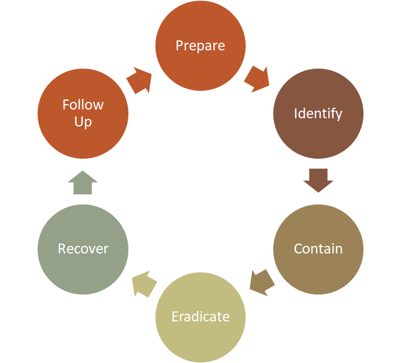

## Waarom awareness?

> **90% van alle beveiligingsincidenten wordt veroorzaakt door menselijke fouten.**

::: {.fragment}
Voorbeelden:

* Klikken op een phishing-link
* Zwak wachtwoord gebruiken
* Verbinden met onveilig wifi-netwerk
:::

::: {.callout-important .fragment}
Technische maatregelen alleen zijn **niet voldoende**.

Medewerkers moeten begrijpen *waarom* regels bestaan — niet alleen *wat* de regels zijn.
:::

---

## Jouw rol als cybersecurity-professional

Je bent meer dan een technicus — je bent een **bewustzijnsambassadeur**:

:::: {.columns}

::: {.column width="50%"}
**Vertalen**

Complexe technische risico's omzetten naar begrijpelijke taal voor collega's en management.
:::

::: {.column width="50%"}
**Signaleren**

* Potentiële risico's identificeren
* Afwijkingen en verdachte gebeurtenissen snel en duidelijk rapporteren
:::

::::

::: {.callout-tip .fragment}
Denk aan de **McCumber kubus**: de menselijke dimensie is even belangrijk als technologie en procedures.
:::

---

## Het doel van awareness-campagnes

Niet: *"je mag dit niet"*

Wel: *"hier is waarom dit gevaarlijk is"*

::: {.fragment}
**Einddoel**: autonome medewerkers die...

* Zelfstandig de link leggen tussen gedrag en risico
* Bewust kiezen voor veilige werkmethoden
* Nieuwe risico's herkennen en melden — ook in onbekende situaties
* Veilig handelen als **routine** beschouwen, niet als verplichting
:::

---

## Veelgestelde vragen van medewerkers

| Vraag | Antwoord dat ze zelf moeten kunnen geven |
|---|---|
| *"Waarom geen publiek wifi?"* | Onversleuteld → aanvallers kunnen meekijken (sniffing) |
| *"Waarom MFA bij iedere login?"* | Wachtwoord gestolen? Account toch veilig |
| *"Waarom laptop vergrendelen?"* | Collega of bezoeker kan anders toegang krijgen |

::: {.callout-note .fragment}
Een goed geïnformeerde medewerker stelt deze vragen niet meer — en helpt ze te beantwoorden voor anderen.
:::

---

## Effectieve awareness-methoden

| Methode | Waarom het werkt |
|---|---|
| **Micro-trainingen** | Kort en frequent → betere retentie, geen overload |
| **Phishing-simulaties** | Directe feedback op eigen gedrag |
| **Gamification** | Quizzen en dashboards verhogen motivatie |
| **Posters & nieuwsbrieven** | Visuele herinnering in de werkomgeving |
| **Leiderschap** | Management geeft het goede voorbeeld |

::: {.callout-tip .fragment}
Geen "one size fits all": een campagne werkt beter naarmate ze aansluit bij de **dagelijkse context** van de medewerkers.

Nuttige gratis bronnen: **SANS Institute**, **CISA**, **GoPhish** (phishing simulator).
:::

---

## Less is more

{width=30%}

::: {.callout-tip}
Grappige of uitdagende posters worden sneller opgemerkt én onthouden.

Gedragsverandering bereik je niet door te straffen — maar door te **motiveren en inspireren**.
:::

---

## Praktische best practices

:::: {.columns}

::: {.column width="50%"}
**Wachtwoorden & toegang**

* Sterke, unieke wachtwoorden
* Gebruik een **wachtwoordmanager**
* Altijd **MFA** inschakelen

**Apparaatbeheer**

* Automatische updates inschakelen
* Antivirussoftware actief houden
* Laptop vergrendelen bij weggaan
:::

::: {.column width="50%"}
**Documenten & netwerken**

* Geen onbekende USB-sticks of kabels
* Alleen vertrouwde wifi-netwerken
* Regelmatige **backups** (fysiek én digitaal)

**Blijf leren**

* Kennis actief delen binnen het team
* Op de hoogte blijven van nieuwe dreigingen
:::

::::

---

## Incident Response

Een goed **incident response-plan** minimaliseert schade en voorkomt herhaling.

```{mermaid}
%%{init: {"theme": "base", "flowchart": {"useMaxWidth": true}} }%%
graph LR
    A("Prepare") --> B("Identify")
    B --> C("Contain")
    C --> D("Eradicate")
    D --> E("Recover")
    E --> F("Follow Up")
    F --> A

    style B fill:#e74c3c,stroke:#333,color:#fff
```

::: {.callout-important .fragment}
Het is een **cyclus**: de *Follow Up* voedt de *Prepare*-fase zodat we leren uit elke incident.
:::

---

## De 6 stappen in detail

| Stap | Actie |
|---|---|
| **Prepare** | Procedures definiëren, medewerkers trainen, plan up-to-date houden |
| **Identify** | Verdachte activiteiten herkennen en melden |
| **Contain** | Getroffen systemen isoleren, verdachte accounts blokkeren |
| **Eradicate** | Incident volledig verwijderen |
| **Recover** | Systemen en data herstellen |
| **Follow Up** | Oorzaak analyseren, processen verbeteren |

::: {.callout-tip .fragment}
Awareness speelt vooral bij **Identify**: medewerkers die weten wat verdacht is, melden sneller.

Snelheid van detectie bepaalt de **omvang van de schade**.
:::

---

## Incident response: in de praktijk

{width=85%}

---

## Incident response: meldcultuur

* Goede meldprocedures zijn cruciaal: **wie meldt wat, aan wie, hoe snel?**
* Meldkanalen moeten **laagdrempelig en toegankelijk** zijn
* Niemand mag bang zijn om een incident te melden

::: {.callout-warning .fragment}
Een complex incident response-plan dat niemand kent is nutteloos.

Oefen het plan regelmatig — en zorg dat medewerkers weten wat **hun** rol is.
:::

---

## Social engineering: de 5 technieken

| Techniek | Hoe het werkt |
|---|---|
| **Pretexting** | Aanvaller doet zich voor als collega of IT-medewerker om info te ontfutselen |
| **Tailgating** | Volgt een medewerker een beveiligd gebied binnen |
| **Vishing** | Voice phishing via telefoon — AI maakt stemimitatie steeds realistischer |
| **Baiting** | Lokt met iets aantrekkelijks (gratis USB, Spotify, ...) dat malware bevat |
| **Quid Pro Quo** | Biedt iets aan in ruil voor gevoelige informatie |

---

## Pretexting & Vishing: de challenge-techniek

* Bij twijfel: stel een **challenge** die enkel de echte persoon kan beantwoorden
* Geeft de aanvaller het juiste antwoord? Stel een **tweede challenge**
  * Geef aan dat het eerste antwoord fout was — kijkt de aanvaller of het antwoord wordt aangepast?
  * Dit heet **reverse social engineering**

::: {.callout-tip .fragment}
Als blijkt dat de persoon legitiem was: maak je excuses.

Een kleine verlegenheid is een kleine prijs voor de veiligheid van je organisatie.
:::

---

## Phishing herkennen: signalen

::: {.incremental}
* **Controleer het afzenderadres** — vergelijk met eerdere communicatie of de website
* **Hover over links** zonder te klikken — zie je het echte doel-URL?
* **Bijlagen van onbekenden** nooit openen zonder verificatie
* **Gevoel van urgentie** ("Onmiddellijk actie vereist!") is een klassiek manipulatiemiddel
* **Vraag om gevoelige info** via e-mail of telefoon is bijna altijd verdacht
* **Bij twijfel**: bel de afzender terug via een gekend nummer — niet via het nummer in de mail
:::

::: {.callout-important .fragment}
**Bij twijfel: niet klikken.**

Melden is altijd beter dan niets doen — ook als het uiteindelijk vals alarm blijkt.
:::

---

## Conclusie

* **90%** van de incidenten is menselijk — awareness is geen optie maar noodzaak
* Goede campagnes leggen uit **waarom**, niet alleen wat
* Gebruik gevarieerde methoden: trainingen, simulaties, gamification, posters
* Een **incident response-plan** werkt alleen als medewerkers het kennen
* Social engineering herken je door **te challengen en te verifiëren**

::: {.callout-important}
Cybersecurity is een **gedeelde verantwoordelijkheid** — van de IT-afdeling tot de receptionist.
:::
