## Wat leer je in dit hoofdstuk?

Na dit hoofdstuk kan je:

* het **CIA-model** en de **McCumber-kubus** toepassen op een scenario
* **soorten aanvallers** onderscheiden (motivatie, middelen, doelwit)
* **passieve vs actieve aanvallen** toelichten en herkennen
* malware-families en social engineering-technieken illustreren
* uitleggen wat een **zero day** en **window of vulnerability** zijn

---

## Wat is cybersecurity?

> *"Cybersecurity is the practice of protecting systems, networks, and programs from digital attacks."*
> — Cisco

::: {.fragment}
Alles draait rond het beschermen van **informatie** — op een server, in een document, of in iemands hoofd.
:::

::: {.callout-note .fragment}
Er zijn nu meer **verbonden apparaten** dan mensen, en aanvallers worden steeds innovatiever.
:::

---

## &hellip; en de formele NIST-definitie

> *"The protection afforded to an automated information system in order to attain the applicable objectives of preserving the **integrity**, **availability** and **confidentiality** of information system resources."*

::: {.fragment}
Waarover praten we dan juist? &rarr; de *resources*:
:::

::: {.incremental}
* Hardware
* Software &amp; firmware
* Information / data
* Telecommunications
:::

::: {.callout-tip .fragment}
NIST = *National Institute of Standards and Technology* (VS). Hun definitie introduceert meteen **CIA** én de scope van de **McCumber kubus**.
:::

---

## CIA-model

| Pijler | Betekenis | Oplossingen |
|---|---|---|
| **Confidentiality** | Enkel bevoegde partijen kunnen data lezen | Encryptie, wachtwoorden |
| **Integrity** | Data is ongewijzigd en betrouwbaar | Hashing, digitale handtekeningen |
| **Availability** | Data is bereikbaar wanneer nodig | Back-ups, firewalls, redundantie |

::: {.callout-tip .fragment}
**DoS-aanvallen** richten zich specifiek op de *Availability*-pijler.
:::

---

## CIA gaat dieper: elk met twee gezichten

:::: {.columns}

::: {.column width="50%"}
**Confidentiality**

* *Data confidentiality*: de **inhoud** is afgeschermd
  * → Encryptie
* *Privacy*: het feit **dát er data over jou bestaat**
  * → GDPR, access logs

**Integrity**

* *Data integrity*: de **data zelf** is niet aangepast
  * → Hashes
* *System integrity*: het **systeem** werkt zoals bedoeld
  * → Anti-rootkit, secure boot
:::

::: {.column width="50%"}
**Availability** + bonus:

* *Non-repudiation*: onweerlegbaarheid
  * → Digitale handtekeningen

::: {.callout-warning .fragment}
Een rootkit kan je **data** ongemoeid laten &mdash; en toch je **systeem** overnemen.

Data integer ≠ systeem integer.
:::
:::

::::

---

## McCumber kubus

:::: {.columns}

::: {.column width="55%"}
* Ontwikkeld door **John McCumber** (1991)
* Framework om niets over het hoofd te zien:
  * **Informatiestatus**: opslag, verzenden, verwerken
  * **Beveiligingsmaatregel**: technologie, beleid, mensen
  * **Doel**: C.I.A.

::: {.callout-important .fragment}
**Technologie alleen is niet genoeg.** Een werknemer die z'n wachtwoord op een post-it plakt, vernietigt de beste firewall.
:::
:::

::: {.column width="45%"}
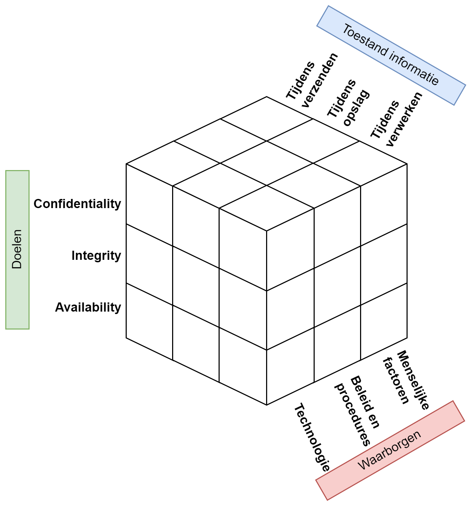{ width=100% }
:::

::::

---

## McCumber in actie: Twitter's hash-bug (2018)

:::: {.columns}

::: {.column width="60%"}
Twitter deed **alles goed**:

* Wachtwoorden werden met **bcrypt** gehasht in de database (status: *opslag*) ✅

&hellip; maar door een bug werden wachtwoorden **vóór** het hashen in een interne log geschreven (status: *verwerking*) ❌

::: {.fragment}
Resultaat: miljoenen wachtwoorden in **plaintext** in logs waar medewerkers bij konden.
:::
:::

::: {.column width="40%" .fragment}
::: {.callout-warning}
**Eén vergeten hoekje** van de McCumber kubus volstaat om alle andere verdedigingen te omzeilen.
:::
:::

::::

::: aside
Bron: Twitter Blog, mei 2018.
:::

---

## ISO 27001

::: {.callout-warning}
De **ISO 27001** norm is dé internationale standaard voor informatiebeveiliging.

* Bedrijven tonen hiermee aan dat ze serieus omgaan met security
* Een **externe auditor** controleert of aan alle eisen voldaan is
* Certificaat moet **elke 3 jaar** hernieuwd worden
* Dekt alle dimensies van de McCumber kubus
:::

---

## Een ongelijke strijd

De cyberboswachter van de 21e eeuw heeft het moeilijker dan ooit:

::: {.incremental}
* **Snelheid**: aanvallers kunnen miljoenen systemen tegelijk aanvallen
* **Attack surface**: netwerken zijn veel groter en complexer dan 20 jaar geleden
* **Lage drempel**: een krachtige aanval = IP invullen + één klik
* **Zero-day snelheid**: nieuwe kwetsbaarheden worden sneller gevonden dan gepatcht
* **Botnets**: gigantische legers aan gecompromitteerde machines
* **Gebruikers**: klikken sneller dan ooit op phishing-links
:::

---

## De scheve grafiek

```{mermaid}
%%{init: {"theme": "base"} }%%
timeline
    title Evolutie van aanvalstools
    1980 : Password guessing : Self-replicating code
    1990 : Sniffers : Session hijacking : Packet spoofing
    2000 : WWW attacks : DoS : Automated probes
    2010 : Botnets : DDoS : Morphing malware
    2020 : Ransomware-as-a-Service : AI-aanvallen
```

::: {.callout-important .fragment}
Aanvalstools worden steeds **krachtiger** — terwijl de vereiste **kennis** van de aanvaller alleen maar **daalt**. Dit verklaart waarom scriptkiddies zo'n reëel probleem zijn.
:::

---

## Zero days en patching

* **Zero day** = kwetsbaarheid die nog onbekend is bij de softwarefabrikant
  * Gegarandeerd werkzaam — er bestaat nog geen patch

::: {.callout-warning .fragment}
**Window of vulnerability**: de periode tussen het ontdekken van een zero day en de release van een patch.

In dit *window* heeft de aanvaller vrij spel.
:::

::: {.fragment}
Zelfs **ná de patch**: niet elk systeem wordt meteen bijgewerkt → één niet-gepatcht systeem = het gaatje in de linie.
:::

---

## Patch Tuesday &amp; Exploit Wednesday

:::: {.columns}

::: {.column width="55%"}
**Patch Tuesday** (sinds 2003):

* Microsoft rolt updates uit op **2<sup>de</sup> dinsdag** van de maand
* Voordeel: voorspelbaar voor IT-beheerders
:::

::: {.column width="45%"}
**Exploit Wednesday**:

* Aanvallers doen *reverse-engineering* van de patch
* &rarr; Achterhalen welke kwetsbaarheid gedicht werd
* &rarr; Jagen op alle nog niet gepatchte systemen
:::

::::

::: {.callout-warning .fragment}
Het *window of vulnerability* is hierdoor vaak **verrassend voorspelbaar**. Wie na dinsdag niet patcht, is woensdag doelwit.
:::

---

## Zero days: een markt

:::: {.columns}

::: {.column width="55%"}
* Zero days worden verhandeld op een **schimmige markt**
* Prijzen kunnen oplopen tot **meer dan 1 miljoen dollar**
* Fabrikanten zoals Apple en Microsoft brengen patches uit op **vaste dagen**
  * Voordelig voor aanvallers: ze kunnen de *windows* voorspellen
:::

::: {.column width="45%"}
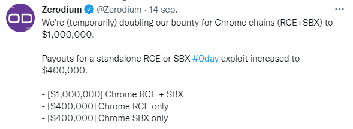{ width=100% }
:::

::::

::: {.callout-tip .fragment}
*"How They Tell Me the World Ends"* van Nicole Perlroth (NYT, 2021) geeft een griezelig inzicht in de zero-day markt.
:::

---

## Wie zijn de stropers?

```{mermaid}
%%{init: {"theme": "base", "flowchart": {"useMaxWidth": true}} }%%
graph LR
    A("Stropers") --> B("Hackers")
    A --> C("Scriptkiddies")
    A --> D("Werknemers")
    A --> E("Cybercriminelen")
    A --> F("Cyberterroristen\n& Overheden")
```

Elke groep heeft **eigen motivaties, middelen en methodes**.

---

## Hackers: de kleurcode

| Kleur | Type | Beschrijving |
|---|---|---|
| ⬜ **Whitehat** | Ethisch hacker | Legaal pentesten, bug bounty |
| 🩶 **Greyhat** | Grijs gebied | Goede intenties, niet altijd legaal |
| ⬛ **Blackhat** | Crimineel (*cracker*) | Illegale toegang, eigenbelang |
| 🟥 **Redhat** | Vigilante | Vecht terug tegen blackhats — middelen niet altijd legaal |
| 🟦 **Bluehat** | Wraaklustig | Eén doel: wraak nemen |
| 🟩 **Greenhat** | Beginner | Scriptkiddie in opleiding |

---

## Scriptkiddies

* Weinig tot geen kennis — maar gebruiken **krachtige, gebruiksvriendelijke tools**
* Beseffen vaak **niet** dat hun acties strafbaar zijn
* Gevolgen kunnen even ernstig zijn als bij doorgewinterde aanvallers

::: {.callout-warning .fragment}
Veiligheidsdiensten kunnen niet zien wie er achter een aanval zit — ze reageren altijd op dezelfde manier.

Een politie-inval + zware boetes als gevolg van "gewoon een knopje indrukken".
:::

---

## Scriptkiddies: Low Orbit Ion Cannon

:::: {.columns}

::: {.column width="55%"}
* Gratis DDOS-tool, eenvoudig in gebruik
* In **2010** gebruikt om Visa, MasterCard en PayPal urenlang lam te leggen
  * Reden: protest tegen blokkering WikiLeaks-betalingen
* Wanneer voldoende gebruikers tegelijk aanvallen → massale impact
:::

::: {.column width="45%"}
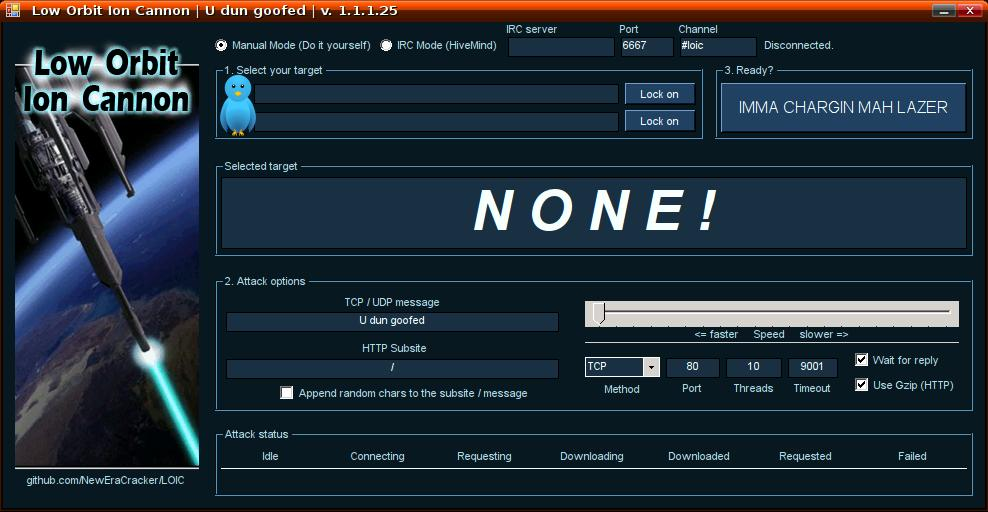{ width=100% }
:::

::::

---

## Werknemers: de vergeten bedreiging

:::: {.columns}

::: {.column width="55%"}
**Bewust** (insider threats):

* Ontevreden of ontslagen werknemers
* Sabotage, datadiefstal, losgeld eisen
* Zitten *aan de binnenkant* van je beveiliging

**Onbewust** (menselijke fouten):

* Wachtwoord op post-it
* Onbekenden binnenlaten (*piggybacking*)
* Eigen access point installeren voor betere wifi
:::

::: {.column width="45%" .fragment}
**BYOD-risico**:

Eigen apparaten = potentieel geïnfecteerde apparaten die het bedrijfsnetwerk binnenkomen.

De "veilige burcht" werkt niet meer als je iedereen met hun eigen sleutel naar binnen laat.
:::

::::

::: {.callout-tip .fragment}
**Identity management**: verwijder accounts van ex-werknemers **onmiddellijk** na ontslag.
:::

---

## `DROP DATABASE;` &mdash; de gebroeders Akhter (2025)

:::: {.columns}

::: {.column width="60%"}
* Tweelingbroers, IT-contractors voor een D.C.-bedrijf met **45+ federale agentschappen** als klant
* **18 feb 2025**: ontslagen tijdens online meeting — strafblad ontdekt
* Diezelfde dag nog, in enkele uren:
  * databases *write-protected* &rarr; collega's konden niets redden
  * **96 federale databases gedropt** (FOIA, DHS&hellip;)
  * **AI-assistent** gevraagd hoe systeemlogs te wissen
:::

::: {.column width="40%" .fragment}
::: {.callout-warning}
**Recidive**: in 2016 al veroordeeld voor inbraak op het US State Department &mdash; en daarna gewoon **opnieuw aangeworven** als overheidscontractor. Geen background check.
:::
:::

::::

::: {.callout-important .fragment}
Muneeb: **39 maanden cel** (schuldbekentenis). Sohaib: schuldig bevonden door jury op 8 mei 2026 &mdash; riskeert tot **21 jaar** (strafmeting 9 sept 2026).
:::

::: aside
Bron: Ars Technica, *Drop database: what not to do after losing an IT job* (mei 2026).
:::

---

## Cybercriminelen

* **Geld** is de enige motivatie
* Meer dan **$700 miljard schade** in 2021 (schatting)
* Werken als moderne bedrijven:
  * Helpdesks voor ransomware-betalingen
  * **RaaS**: Ransomware-as-a-Service
  * Botnets verhuren op het darkweb

::: {.callout-warning .fragment}
Het "bedrijfsmodel" van cybercriminelen zorgt ervoor dat aanvallers zelf geen technische kennis meer nodig hebben.
:::

---

## Max Butler, alias *"Iceman"*

* **2006**: vanuit een appartement in San Francisco neemt Butler de **wereldmarkt voor gestolen creditcards** over
* Zijn truc: concurrenten *hacken* en hun databases overnemen
* **13 jaar cel** &mdash; maar het verhaal stopt daar niet&hellip;

::: {.callout-note .fragment}
**2018**: vanuit de gevangenis aangeklaagd voor een poging om via een **drone** een smartphone binnen te smokkelen — om zijn criminele business te heropstarten.
:::

::: aside
Bronnen: Wired (2008), Washington Times (2018).
:::

---

## Money mules: *de zichtbare schakel*

```{mermaid}
%%{init: {"theme": "base", "flowchart": {"useMaxWidth": true}} }%%
graph LR
    S("🎣 Slachtoffer") -->|phishing| P("Paswoord &amp; userid")
    P --> C("💀 Crimineel")
    C -->|"bankoverschrijving"| M("🫏 Money Mule")
    M -->|"Western Union"| C2("💰 Crimineel cashout")
    style S fill:#aed6f1,stroke:#333,color:#000
    style C fill:#e74c3c,stroke:#333,color:#fff
    style C2 fill:#e74c3c,stroke:#333,color:#fff
    style M fill:#f39c12,stroke:#333,color:#000
```

* Criminelen werken zelden direct met gestolen geld
* *Money mules* zijn mensen met een *"leuk bijverdienstje"* als **financial manager**
* Ze zetten hun eigen rekening ter beschikking

::: {.callout-warning .fragment}
**Nov 2017**: Europese opsporingsdiensten arresteerden in één actie **159 geldezels**. Als een vacature te mooi klinkt om waar te zijn&hellip;
:::

---

## Cyberterroristen, spionnen & overheden

* De scheidslijn tussen **terrorist**, **spion** en **staatshacker** is vaag en politiek
* Financiële en technische middelen zijn **immens** groter dan andere groepen

::: {.callout-note .fragment}
Het **Mossad/Non-Mossad principe**:

Maak een realistische inschatting van je tegenstander. Een staatsactor *zal* binnenkomen ongeacht je budget. Focus op de dreigingen die relevant zijn voor jou.
:::

::: {.fragment}
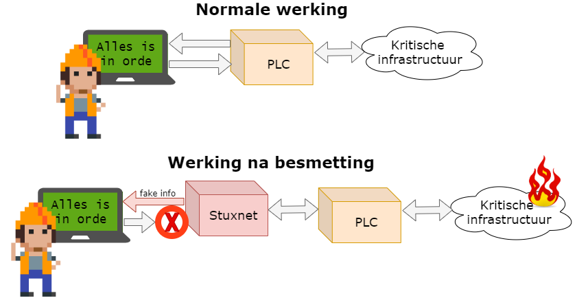{ width=50% }
:::

---

## Een (onvolledige) geschiedenis

| Jaar | Operatie | Wat |
|---|---|---|
| **2005** | *Titan Rain* 🇨🇳 | Chinese inbraak in honderden Amerikaanse defensiesystemen |
| **2007** | *Estonia* 🇷🇺 | DDoS legt Estland plat — "de eerste cyberoorlog" |
| **2008** | *Georgia* 🇷🇺 | Cyberaanval synchroon met militaire invasie |
| **2009** | *Operation Aurora* 🇨🇳 | Google, Adobe, Juniper, Yahoo gehackt voor broncode |
| **2010** | *Stuxnet* 🇺🇸🇮🇱 | Iraanse centrifuges gesaboteerd |
| **~2015** | *Nitro Zeus* 🇺🇸 | Geheim plan B tegen Iran |

::: {.callout-tip .fragment}
*"The Perfect Weapon"* (David Sanger, NYT 2018) &mdash; cyberoorlog als vast instrument van moderne diplomatie.
:::

---

## Hacktivisme in de Oekraïne-oorlog

:::: {.columns}

::: {.column width="55%"}
Sinds **februari 2022**: tienduizenden hacktivisten aan **beide** kanten:

* *IT Army of Ukraine* viseert Russische banken, media, overheidswebsites
* Pro-Russische groepen verstoren Oekraïense infrastructuur

::: {.callout-warning .fragment}
Ongecoördineerd: "goedbedoelde" aanvallen raken soms neutrale partijen. Bedrijven kunnen geen onderscheid meer maken tussen staatsactoren en individuele activisten.
:::
:::

::: {.column width="45%"}
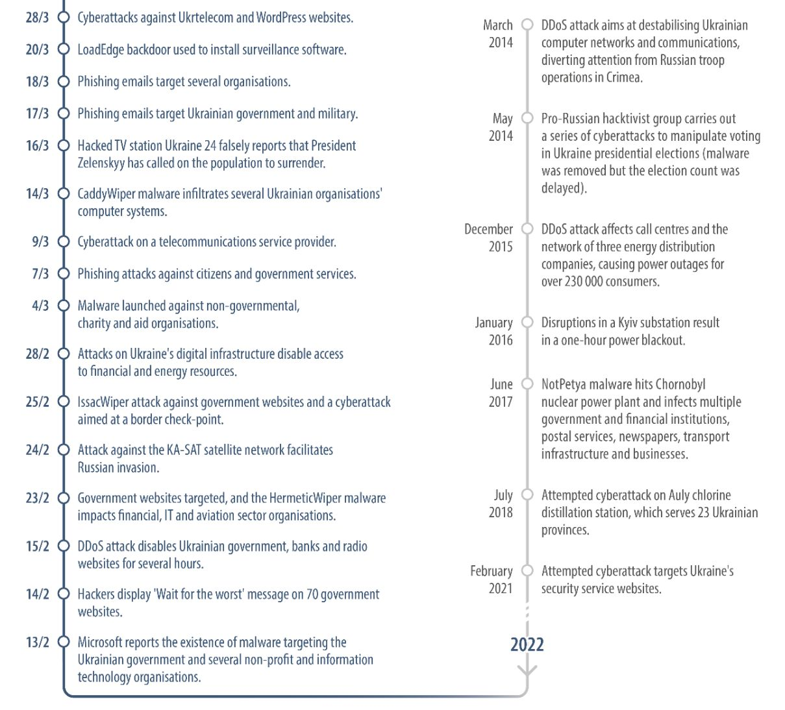{ width=100% }
:::

::::

::: aside
Bron: Wired, *"Hacktivists Stoke Pandemonium Amid Russia's War in Ukraine"*.
:::

---

## De 5 fasen van een aanval

```{mermaid}
%%{init: {"theme": "base", "flowchart": {"useMaxWidth": true}} }%%
graph LR
    A("1. Verkennen\npassief") --> B("2. Scannen\nactief")
    B --> C("3. Toegang\nverkrijgen")
    C --> D("4. Toegang\nbestendigen")
    D --> E("5. Sporen\nwissen")

    style A fill:#aed6f1,stroke:#333,color:#000
    style B fill:#aed6f1,stroke:#333,color:#000
    style C fill:#e74c3c,stroke:#333,color:#fff
    style D fill:#e74c3c,stroke:#333,color:#fff
    style E fill:#2ecc71,stroke:#333,color:#000
```

---

## De 5 fasen: detail

| Fase | Activiteit |
|---|---|
| **1. Verkennen** | Google, sociale media, dumpster diving — *onzichtbaar voor het slachtoffer* |
| **2. Scannen** | Port scanners, vulnerability scanners — *detecteerbaar* |
| **3. Toegang** | Kwetsbaarheid uitbuiten, phishing, privilege escalation |
| **4. Bestendigen** | Backdoor installeren, laterale beweging in netwerk |
| **5. Sporen wissen** | Logs aanpassen of verwijderen, backdoors opruimen |

::: {.callout-tip .fragment}
**Red team / Blue team**: bij legale pentests speelt het *red team* de aanvallers, het *blue team* de verdedigers.
:::

---

## Dwell time: de stille meerderheid

Aanvallers zijn er snel in, maar blijven vaak **maandenlang** onopgemerkt:

| Overgang | Min. | Dagen | Weken | Maanden |
|---|---|---|---|---|
| Aanval &rarr; inbraak | **75%** | 2% | 0% | 1% |
| Inbraak &rarr; **ontdekking** | 0% | 13% | 29% | **54%** |

```{mermaid}
%%{init: {"theme": "base"} }%%
pie showData
    "Maanden" : 54
    "Weken" : 29
    "Dagen" : 13
    "Uren" : 2
    "Jaren" : 2
```

::: {.callout-important .fragment}
In **54%** van de gevallen merkt een organisatie pas **na maanden** dat er iemand in haar netwerk zit. *Detectie* is minstens even kritisch als *preventie*.
:::

::: aside
Bron: Verizon Data Breach Investigation Report.
:::

---

## Alice, Bob en Eve

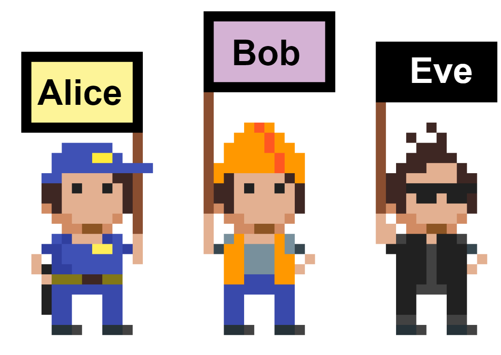{ width=75% }

* **Alice en Bob**: willen veilig communiceren
* **Eve**: wil hun communicatie onderscheppen, aanpassen of blokkeren

::: {.callout-warning .fragment}
Alice en Bob zijn eender welk start- en eindpunt van informatie: ook CPU → RAM, database → schijf, server → gebruiker.
:::

---

## Actieve vs. passieve aanvallen

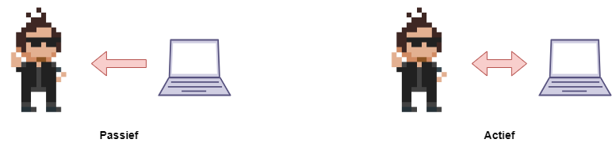{ width=100% }

| | Passief | Actief |
|---|---|---|
| **Eve's rol** | Luisteren en wachten | Ingrijpen in communicatie |
| **Detecteerbaarheid** | Zeer moeilijk | Groter risico op detectie |
| **Controle** | Afhankelijk van slachtoffer | Meer controle voor Eve |

---

## Passieve aanval 1: Sniffing

{ width=70% }

* Eve gebruikt een **sniffer** (bv. Wireshark) om netwerktrafiek af te luisteren
* Zelfs geëncrypteerde trafiek lekt **metadata**: MAC-adressen, timing, gebruikersinfo
* Slecht beveiligde third-party apps sturen soms credentials **onversleuteld** → goudmijn voor Eve

---

## Passieve aanval 2: Trafiekanalyse

{ width=70% }

* Eve registreert **wanneer en hoe** het slachtoffer communiceert
* Laat toe actieve periodes te kennen → aanvallen beter plannen
* Onthult type activiteit: e-mail, VoIP, bestandsoverdracht, ...

---

## Actieve aanval 1: Masquerading & Spoofing

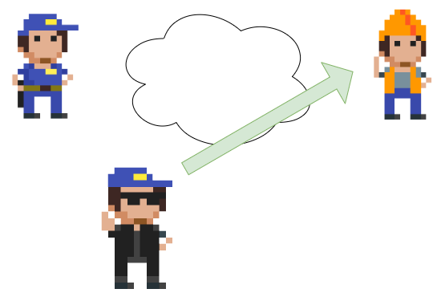{ width=70% }

* Eve neemt de **digitale identiteit** van een legitieme gebruiker over
* Bv. **MAC-spoofing**: hardware-adres van een netwerkkaart overnemen
* Doel: anonimiteit én toegang tot afgeschermde bronnen

---

## Actieve aanval 2: Replay attack

{ width=70% }

* Eve bewaart een legitiem communicatiepakket (bv. een login)
* Later verstuurt ze dit opnieuw → systeem denkt dat het Alice is
* Gevaarlijk bij systemen zonder **session tokens** of **tijdstempels**

---

## Actieve aanval 3: Man-in-the-Middle (MitM)

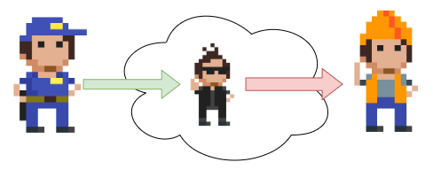{ width=70% }

* Eve nestelt zich **tussen** Alice en Bob
* Kan communicatie **lezen, aanpassen of blokkeren** — volledig onzichtbaar
* Vereist vaak ook masquerading naar beide kanten tegelijk

---

## Actieve aanval 4: Denial-of-Service (DoS)

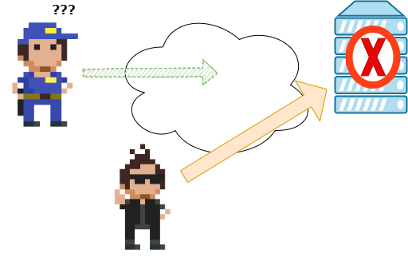{ width=70% }

* Doel: systeem of gebruiker **onbereikbaar maken**
* Vormen: trafiek overstromen, signaalstoring, fysiek de stekker uittrekken
* **DDOS** = *Distributed* DoS via botnet van duizenden zombies tegelijk

---

## Hoe verdedigen? De 4+1 principes

| Principe | Beschrijving |
|---|---|
| **Layering** | Meerdere beveiligingslagen rondom je data (als een ui) |
| **Limiting** | Enkel de rechten die iemand echt nodig heeft |
| **Diversity** | Verscheidenheid aan beveiligingen → één faling ≠ totale neergang |
| **Simplicity** | KISS: *Keep It Simple, Stupid* — complexiteit introduceert fouten |

::: {.callout-warning .fragment}
**+1 — Obscurity**: verberg hoe je verdediging is opgebouwd. Maar gebruik dit **nooit** als vervanging voor echte beveiliging. Gebruik standaarden en vertrouwde producten — heruitvind het wiel niet!
:::

---

## Social Engineering: het hacken van mensen

* Mensen zijn de **zwakste schakel** in elk securitymodel
* Social engineering misbruikt menselijke eigenschappen: **vertrouwen, nieuwsgierigheid, angst, hebzucht**

::: {.fragment}
Voorbeelden van fysieke social engineering:

* Verkleden als pizzakoerier → werknemers houden deur open
* Bij rokers naar binnen meelopen (*piggybacking*)
* Bellen als "Telenet-technieker" en wachtwoord opvragen
:::

::: {.callout-tip .fragment}
Je hoeft niet eens aanwezig te zijn: **phishing via e-mail** is de meest gebruikte techniek.
:::

---

## Phishing vs. Spear Phishing

| | Phishing | Spear Phishing |
|---|---|---|
| **Doelgroep** | Zoveel mogelijk mensen | Één specifiek persoon of groep |
| **Aanpak** | Generieke e-mail | Op maat gemaakt bericht |
| **Slaagkans** | Laag per persoon | Veel hoger |
| **Voorbeeld** | Nep-ING mail naar iedereen | Gerichte mail naar de CEO van bedrijf X |

::: {.callout-note .fragment}
De naam *phishing* is afgeleid van *fishing* — hengelen naar slachtoffers.
:::

---

## Phishing-varianten: meer dan e-mail

| Techniek | Hoe het werkt |
|---|---|
| **Vishing** | Voice phishing — via de telefoon (bv. MGM Resorts, 2023) |
| **Smishing** | Phishing via SMS / WhatsApp (bv. *"Bpost-pakketje"* SMS) |
| **Whaling** | Spear phishing op de "grote vissen": CEO, CFO, C-levels |
| **CEO-fraude (BEC)** | Aanvaller doet zich voor als CEO → dringende overschrijving |

::: {.callout-warning .fragment}
**Business Email Compromise** (BEC) richtte tussen 2013 en 2022 wereldwijd voor **>50 miljard dollar** schade aan (FBI).
:::

---

## Andere social engineering-technieken

::: {.incremental}
* **Pretexting**: een verzonnen, geloofwaardig scenario opbouwen (bv. *"Telenet-technieker aan de lijn"*)
* **Baiting**: lokaas uitleggen — een USB-stick *"salarissen 2025"* op de parking
* **Tailgating** (*piggybacking*): meelopen met een geautoriseerd persoon door een veilige deur
* **MFA fatigue** (*prompt bombing*): slachtoffer spammen met MFA-prompts tot die uit frustratie op *"Accepteren"* drukt — door **Lapsus$** ingezet bij Uber, Microsoft, Rockstar
:::

---

## Waarom werkt social engineering zo goed?

Cialdini's **6 beïnvloedingsprincipes** (uit *Influence*, 1984):

:::: {.columns}

::: {.column width="50%"}
* **Autoriteit**: gezag dwingt af
* **Urgentie**: tijdsdruk schakelt kritisch denken uit
* **Schaarste**: *"nog 3 plaatsen vrij"*
:::

::: {.column width="50%"}
* **Wederkerigheid**: voor wat hoort wat
* **Sympathie**: ja zeggen tegen wie je leuk vindt
* **Sociale bewijskracht**: *"iedereen doet het"*
:::

::::

::: {.callout-tip .fragment}
**Kevin Mitnick** (*"America's Most Wanted Hacker"*) wandelde simpelweg zelfverzekerd door deuren van grote bedrijven alsof hij er werkte — en niemand stelde vragen.

Z'n boek *The Art of Deception* is een aanrader.
:::

---

## SE in het AI-tijdperk

::: {.fragment}
**Deepfakes** = AI-gegenereerde audio of video van bestaande personen.
:::

::: {.incremental}
* Live videocall met een *fake* CFO (Hong Kong, 2024 → **25 miljoen \$** verlies)
* Stem van een familielid klonen voor nep-noodgevallen
* AI-vishing op grote schaal
:::

::: {.callout-important .fragment}
Klassieke detectie-tips (*"let op tikfouten in de mail"*) volstaan niet meer wanneer de aanvaller met de stem van je baas belt.

Volledige bespreking: zie hoofdstuk 1, *"A.I. is here to stay"*.
:::

---

## Verdedigen: het is een mens-probleem

Social engineering los je niet op met technologie alleen.

::: {.incremental}
* Trainen, trainen, trainen — **awareness-campagnes** zijn cruciaal
* **Phishing-simulaties** geven directe feedback
* Procedures voor helpdesks (vooral bij wachtwoordresets!)
* Cultuur waarin werknemers durven *"nee"* of *"laat me even checken"* zeggen tegen de "CEO"
:::

::: {.callout-tip .fragment}
De volledige aanpak voor het opzetten van een awareness-cultuur staat in de **appendix *Cybersecurity Awareness creëren***.
:::

---

## Social Engineering Toolkit (SET)

:::: {.columns}

::: {.column width="55%"}
* Open source toolkit in **Kali Linux**
* Mogelijkheden:
  * (Spear) phishing campagnes opzetten
  * Bestaande websites klonen
  * Malware injecteren in afbeeldingen
* Integreert met **Metasploit** voor complexe aanvallen
:::

::: {.column width="45%"}
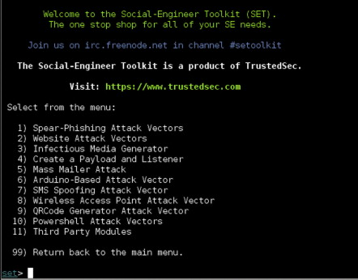{ width=100% }
:::

::::

---

## OSINT: Open Source Intelligence

:::: {.columns}

::: {.column width="55%"}
* Informatie verzamelen via **publiek beschikbare bronnen**
* Cruciale stap bij spear phishing (reconnaissance-fase)

Technieken:

* Geavanceerde zoekopdrachten (`site:`, `filetype:`, `+`)
* **Reverse image search** (Google Lens)
* **EXIF-data** uit foto's (locatie, toestelinfo, tijdstip)
:::

::: {.column width="45%"}
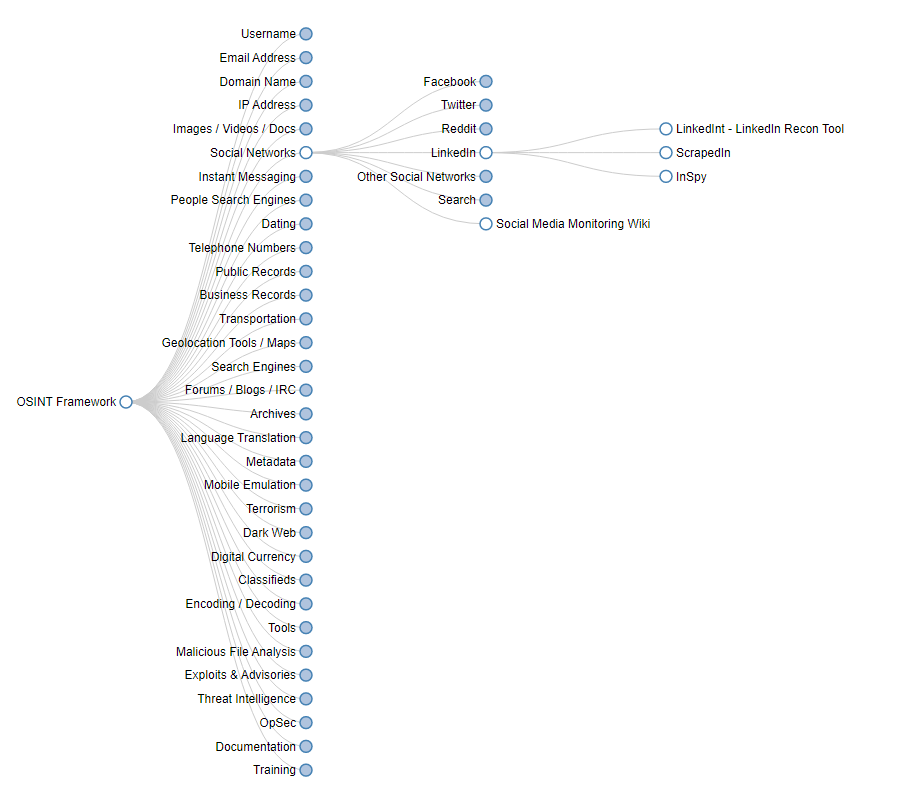{ width=100% }
:::

::::

::: {.callout-tip .fragment}
[osintframework.com](https://osintframework.com/) toont hoe véél publieke informatie er over iemand beschikbaar is — zonder één illegale stap te zetten.
:::

---

## Malware: overzicht

```{mermaid}
%%{init: {"theme": "base", "flowchart": {"useMaxWidth": true}} }%%
graph TD
    A("Malware") --> B("Virus")
    A --> C("Worm")
    A --> D("Trojan")
    A --> E("Spyware /\nAdware")
    A --> F("Rootkit")
    A --> G("Ransomware")
    A --> H("Botnet")
```

::: {.callout-note}
**CVE** (*Common Vulnerabilities and Exposures*): publieke database van alle gekende kwetsbaarheden — essentieel hulpmiddel voor elke cyberboswachter.
:::

---

## Virus

* Nestelt zich in een **uitvoerbaar bestand** (.exe, .bat, .com) — heeft een hostfile nodig
* Verspreidt zich via gebruikershandeling: bestand openen, download, diskette
* Vroeger: bootsector infecteren, bestanden verwijderen
* Nu: geëvolueerd naar gevaarlijkere varianten (wormen, ransomware)

::: {.callout-tip .fragment}
*Don't pirate, kids* — gepirateerde software was (en is) een klassieke virusdrager.
:::

---

## Mikko Hyppönen

:::: {.columns}

::: {.column width="55%"}
De **levende encyclopedie** van malware-geschiedenis (F-Secure):

* Spoorde persoonlijk de auteurs van de eerste DOS-virussen op in Pakistan
* Analyseerde Stuxnet, Flame, Regin &hellip;

::: {.callout-tip .fragment}
**Hyppönen's wet**:

> *"If it's smart, it's vulnerable."*
:::

TED-talk: [*Fighting viruses, defending the net*](https://www.youtube.com/watch?v=cf3zxHuSM2Y)
:::

::: {.column width="45%"}
{ width=100% }
:::

::::

---

## Worm

* Zoals een virus, maar **verspreidt zichzelf** via netwerken, e-mail, Bluetooth, ...
* **Geen hostfile** nodig — actiever en gevaarlijker dan een virus
* Kan zichzelf **vervormen** (*polymorfisme*) om virusscanners te misleiden
* Groei is **exponentieel** tot quasi alle kwetsbare systemen besmet zijn

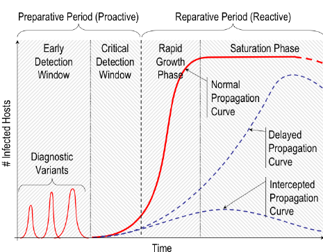{ width=65% }

---

## Hoe reist een worm? — 5 replication paths

| Pad | Hoe het werkt | Voorbeeld |
|---|---|---|
| **E-mail / IM** | Zichzelf mailen als bijlage | ILOVEYOU (2000) |
| **File sharing** | Kopiëren naar USB / shared folder | Stuxnet |
| **Remote execution** | Exploit &rarr; directe uitvoering elders | WannaCry, Conficker |
| **Remote file access** | Schrijven via SMB / FTP / NFS | Duqu |
| **Remote login** | Inloggen met default creds (SSH, Telnet) | Mirai |

::: {.callout-warning .fragment}
Gevaarlijke wormen combineren **meerdere paden tegelijk** &mdash; blokkeer één route en de andere blijven actief.
:::

---

## Trojan

:::: {.columns}

::: {.column width="60%"}
* Verbergt zich binnenin een **legitieme applicatie**
* Gebruiker installeert bewust → trojan wordt mee geactiveerd

Mogelijke payloads:

* Backdoor installeren
* Computer zombie maken (botnet)
* Keylogger activeren
* Spyware droppen
:::

::: {.column width="40%"}
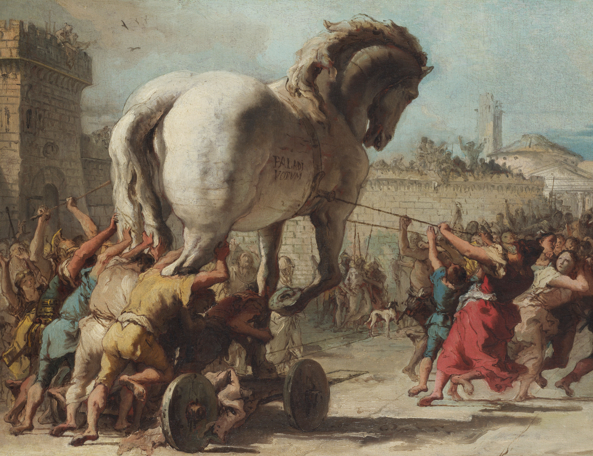{ width=100% }
:::

::::

::: {.callout-note .fragment}
De naam is gebaseerd op de legende van *Het Paard van Troje* uit de Aeneid van Vergilius.
:::

---

## Supply-chain trojan: CIA &amp; Xcode

Onthulling uit de **Snowden-lekken (2015)**:

* CIA ontwikkelde een eigen variant van Apple's **Xcode** (officiële dev-tool voor iOS/macOS)
* Developers bouwden hun apps met die *gemanipuleerde* Xcode
* Elke app die ermee gebouwd werd, bevatte ongemerkt een **CIA-backdoor**

::: {.callout-warning .fragment}
Een trojan hoeft niet in jóuw software te zitten &mdash; ze kan zich veel eerder in de **keten** hebben genesteld.
:::

::: {.callout-tip .fragment}
Moderne variant: supply-chain attacks zoals **SolarWinds (2020)** en **XZ Utils (2024)**.
:::

::: aside
Bron: The Intercept / Tweakers.net
:::

---

## Spyware & Adware

| | Spyware | Adware |
|---|---|---|
| **Doel** | Informatie stelen (logins, bankgegevens) | Reclame tonen |
| **Zichtbaarheid** | Verborgen | Soms zichtbaar |
| **Installatie** | Via trojan | Via gratis software of browser-extensies |

::: {.callout-warning .fragment}
Sommige adware gebruikt **rootkit-technieken** en is bijzonder moeilijk te verwijderen.
:::

---

## Rootkit

* Nestelt zich op **kernel-niveau** — dieper dan een gewoon virus
* Kan bepalen **wat het besturingssysteem aan de gebruiker toont** → volledig onzichtbaar
* Systeembestanden worden aangepast → verwijderen veroorzaakt systeemschade
* Enige zekere oplossing: **harde schijf formatteren**

::: {.callout-important .fragment}
Zelfs een OS herinstallatie via aanwezige installatiebestanden biedt geen garantie — de rootkit kan al in die bestanden zitten!
:::

---

## Ransomware

:::: {.columns}

::: {.column width="55%"}
* **Gijzelt data** door ze te versleutelen met een sleutel die enkel de crimineel kent
* Slachtoffer krijgt betaalinstructies (crypto)
* Zelfs ziekenhuizen en havens werden getroffen (WannaCry, Petya — 2017)

::: {.callout-tip .fragment}
Back-ups helpen — maar enkel als ze **buiten het bereik van de ransomware** staan!
:::
:::

::: {.column width="45%"}
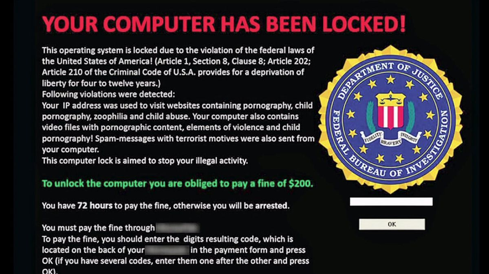{ width=100% }
:::

::::

---

## Betalen = geen garantie

Onderzoek van Hive Systems op **24.000** Amerikaanse bedrijven:

```{mermaid}
%%{init: {"theme": "base"} }%%
pie showData title Uitkomst na ransomware-aanval
    "Betaald + data terug" : 38
    "Niet betaald + data terug (back-ups)" : 36
    "Betaald + data tóch verloren" : 19
    "Niet betaald + data verloren" : 7
```

::: {.callout-warning .fragment}
**1 op 5** die betaalt, krijgt **niets terug**. Totale kost VS 2021: **$7.9 miljard** &mdash; waarvan $1.4 miljard aan losgeld.
:::

::: {.callout-important .fragment}
Betalen is russische roulette &mdash; én het financiert de volgende aanval. **Offline** back-ups zijn de enige echte verzekering.
:::

::: aside
Bron: hivesystems.com
:::

---

## Botnet: zombie-legers

:::: {.columns}

::: {.column width="55%"}
* Aanvaller besmet computers met **zombie-malware**
* Zombies verbinden met de **C&C-server** van de *herder*
* Herder stuurt bevelen: DDOS, cryptomining, spam, app store-ratings, ...
* Botnets worden **verhuurd of verkocht** op het darkweb

::: {.callout-important .fragment}
Oplossing: **C&C-server uit de lucht halen** → de zombies worden nutteloos.
:::
:::

::: {.column width="45%"}
{ width=100% }
:::

::::

---

## Mirai (2016): het IoT-botnet

* Jaagt niet op computers, maar op **IoT**: routers, camera's, DVR's, babyfoons
* Verspreidingstruc: lijst van **64 default logins** uitproberen (admin/admin, root/root&hellip;)
* Piek: **600.000 besmette toestellen**

::: {.callout-warning .fragment}
**21 oktober 2016**: DDoS op DNS-provider **Dyn** &rarr; Twitter, Netflix, Reddit, GitHub, Spotify urenlang offline.
:::

::: {.callout-note .fragment}
Broncode publiek gemaakt &rarr; dozijnen varianten nog steeds actief.
:::

---

## Mantis (2022): kwaliteit &gt; kwantiteit

* Geen IoT-apparaten, maar **gekaapte VM's en servers**
* Elke bot heeft enorm veel rekenkracht

::: {.callout-important .fragment}
Cloudflare registreerde in juni 2022:

**26 miljoen HTTPS-requests per seconde** &mdash; een record.
:::

::: {.callout-tip .fragment}
De evolutie van botnets: niet *meer* zombies, maar **sterkere** zombies.
:::

::: aside
Bron: Cloudflare blog.
:::

---

## BYOB: *Build Your Own Botnet*

* Open-source op **GitHub** (malwaredllc/byob)
* *"Educatief"* framework, in enkele klikken:
  * Command &amp; Control-server met webinterface
  * Payload generator voor Windows, Linux, macOS
  * 12+ kant-en-klare post-exploitation modules (keylogger, webcam, persistentie&hellip;)

::: {.callout-warning .fragment}
Malware maken is **laagdrempeliger dan ooit**. De scheve grafiek in actie.
:::

---

## *"DDoS à la carte"* &mdash; echte afpersingsbrief

> *"If you want to continue having your site operational, you must pay us 10 000 rubles monthly.*
>
> *Starting [DATE] your site will be subject to a DDoS attack. The first attack will involve 2,000 bots. If the companies involved in DDoS protection begin to block our bots, we will increase to **50,000 bots**.*
>
> ***You will also receive several bonuses:***
>
> *1. **30% korting** als je een DDoS op je concurrenten bestelt.*
>
> *2. Als je concurrenten óns inhuren om jou aan te vallen &mdash; weigeren we."*

::: {.callout-warning .fragment}
RaaS in z'n meest cynische vorm: koop bescherming én aanvalswapen tegelijk.
:::

---

## Hardware-based aanvallen

| Aanval | Beschrijving |
|---|---|
| **USB stick** | Gevuld met malware → autorun bij aansluiten |
| **USB of death** | Stuurt 220V door computer → directe hardwareschade |
| **BIOS rootkit** | Nestelt zich in UEFI-chip (bv. Moonbounce) — overleeft formattering |
| **Warshipping** | Raspberry Pi in postpakket → belt terug naar aanvaller |
| **Keylogger** | Registreert toetsaanslagen → wachtwoorden stelen |
| **Juice hacking** | Valse USB-oplaadpunt steelt data of installeert malware |

---

## De Russische USB's van Kabul (2008)

* **Airgapped** Amerikaans militair netwerk &mdash; niet verbonden met het internet
* Russische spionnen leveren **goedkope USB-sticks vol malware** aan retailkiosken vlak bij het NATO-HQ in Kaboel
* Pure wiskundige gok: vroeg of laat steekt een Amerikaanse militair er één in een veilige computer&hellip;

::: {.callout-warning .fragment}
**Dat gebeurde ook**. Tienduizenden bestanden gestolen: hardware-designs, troepenconfiguraties, kaarten van bases.
:::

::: {.callout-important .fragment}
De eerste grootschalige staats-inbraak in een gerubriceerd Amerikaans netwerk. Directe aanleiding voor het Pentagon-verbod op USB-sticks in gevoelige omgevingen.
:::

::: aside
Bron: Fred Kaplan, *Dark Territory: The Secret History of Cyber War* (2016).
:::

---

## Hacking hardware

:::: {.columns}

::: {.column width="55%"}
* **USB Ninja**: gewone USB-kabel met ingebouwde RF-zender → stuurt data draadloos door
* **RFID cloners**: kopieer toegangsbadges voor een habbekrats
* **Warshipping**: Raspberry Pi verstopt in postpakket → belt terug naar de aanvaller

Beschikbaar op [lab401.com](https://lab401.com) en [hak5.org](https://hak5.org)
:::

::: {.column width="45%"}
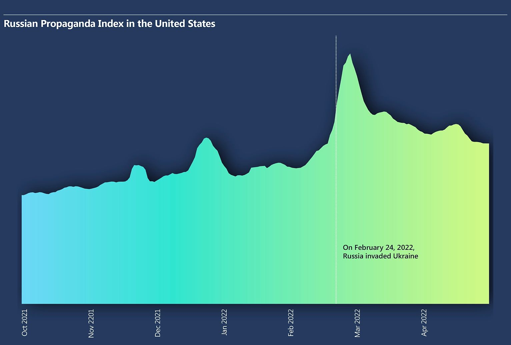{ width=100% }
:::

::::

::: {.callout-note .fragment}
In 2026 werd een Bluetooth-tracker van **€5** verstopt in een briefkaart en verstuurd naar een Nederlands marineschip van **€585 miljoen**. De tracker zond **24 uur lang** ongemerkt de locatie van het oorlogsschip uit. [Bron: Tom's Hardware](https://www.tomshardware.com/tech-industry/cyber-security/bluetooth-tracker-hidden-in-a-postcard-and-mailed-to-a-warship-exposed-its-location-a-eur5-gadget-put-a-eur500-million-dutch-ship-at-risk-for-24-hours)
:::

---

## Juice jacking: verdedigen

Publieke USB-oplaadpunten zijn **nooit echt te vertrouwen**:

::: {.incremental}
* Gebruik je **eigen oplader** in een gewoon stopcontact
* Neem een **power bank** mee op reis
* Koop een **charge-only cable** of **USB data blocker** (€5) &rarr; datapinnen fysiek afgesloten
* Schakel *"data transfer bij aansluiting"* uit op je telefoon
:::

::: {.callout-tip .fragment}
Kostprijs van een data blocker: **minder dan een koffie**. Kostprijs van een gecompromitteerde smartphone: onbetaalbaar.
:::

---

## Mobiele aanvallen

Je smartphone = je **primaire** digitale apparaat:

* Permanent verbonden
* Bomvol persoonlijke data
* Camera, microfoon, GPS
* Bank-app &amp; 2FA-tokens

&rarr; **Een droomdoelwit voor stropers.**

---

## Clickjacking op Android

:::: {.columns}

::: {.column width="50%"}
**Overlay-aanval**:

* Kwaadaardige app toont een **onzichtbare laag** over andere apps
* Je klikt op *"Confirm bank payment"*&hellip; maar raakt eigenlijk *"Claim your prize"* in de verborgen app
* Misbruikt de Android **Accessibility Service**

::: {.callout-warning .fragment}
De app kan andere apps besturen &mdash; zonder dat je iets ziet.
:::
:::

::: {.column width="50%"}
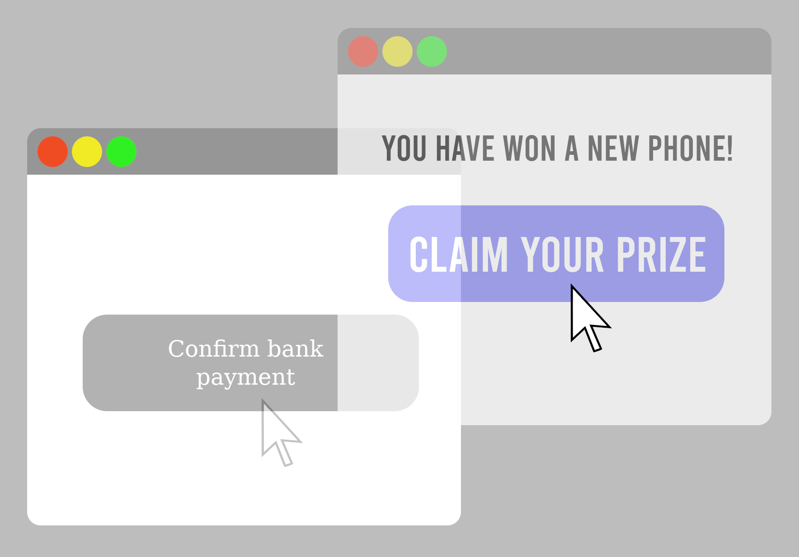{ width=100% }
:::

::::

::: {.callout-tip .fragment}
Android 12+ beperkt dit &mdash; maar wees steeds voorzichtig met apps die *Accessibility*-rechten vragen.
:::

---

## Android/PowerOffHijack (2015)

Je telefoon **uitzetten** &hellip; of toch niet?

* Malware neemt de **shutdown-procedure** over
* Animatie *"Shutting down&hellip;"* speelt gewoon af
* Toestel **lijkt** uit &mdash; maar blijft volledig actief:
  * Telefoneert
  * Maakt foto's met de camera
  * Verstuurt data

::: {.callout-warning .fragment}
Ontdekt na ~**10.000 besmettingen** via Chinese alternatieve app-stores.
:::

::: {.callout-important .fragment}
Wil je écht zeker zijn dat je toestel uit is? **Haal de batterij eruit** (als dat nog kan).
:::

---

## Xenomorph (2022+): Android banking trojan

* Verkleed als **"performance booster"** of **"pdf reader"** in de Play Store
* Eens geïnstalleerd: toont een nep-inlogscherm bovenop bank-apps &rarr; credentials gestolen
* Viseert **400+ banken &amp; crypto-wallets** wereldwijd (ook BE / NL)

::: {.callout-warning .fragment}
**Automated Transfer System (ATS)**: Xenomorph kan automatisch geld overboeken &mdash; zonder dat de gebruiker iets moet invullen.
:::

::: aside
Bron: BleepingComputer, maart 2023.
:::

---

## Side-channel aanvallen

Informatie stelen via een **onverwachte weg** — niet via het protocol zelf.

::: {.callout-tip}
Vergelijking: je wil inbreken in een bank, maar enkel als de bewaker slaapt. Je volgt hem op Goodreads. Zodra hij zijn leesvoortgang post → tijd om in te breken. Dat is een side-channel aanval.
:::

::: {.fragment}
Reële voorbeelden:

* **Strava + militairen**: workouts in de woestijn onthulden een geheime basis
* **Power consumption**: data uit een computer lezen via stroomverbruik
* **Rowhammer / Spectre**: geheugendata lezen zonder de juiste rechten
* **Heartbleed**: OpenSSL antwoordsnelheid onthulde geheugeninhoud
:::

---

## Heartbleed: uitgelegd

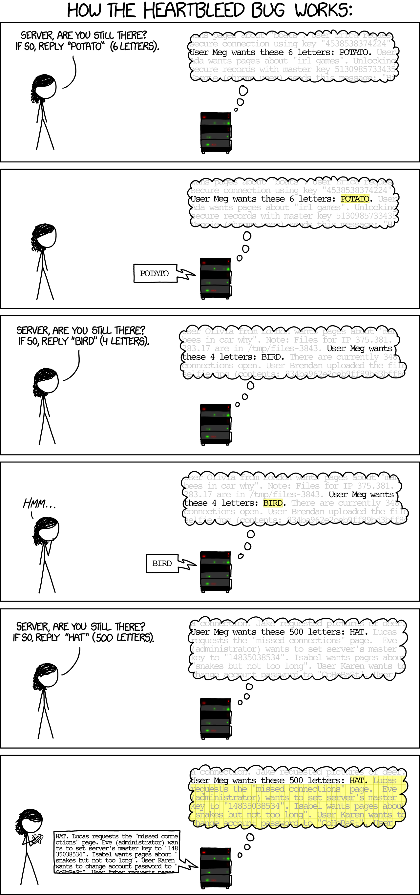

---

## Side-channel: bonus

::: {.callout-note}
**Janet Jackson's "Rhythm Nation"** heeft een officieel **CVE-nummer** gekregen.

Het liedje bevat frequenties die resoneren met de harde schijf van bepaalde oude laptops, waardoor ze crashen als het nummer wordt afgespeeld.

Dit is een echte, gedocumenteerde side-channel DoS-aanval!
:::

---

## KNOB Attack (2019): Bluetooth op 1 byte

**K**ey **N**egotiation **o**f **B**luetooth:

* Twee Bluetooth-toestellen onderhandelen over de sleutelsterkte: normaal **16 bytes** (128 bit)
* Een MitM-aanvaller dwingt de onderhandeling naar **1 byte** (8 bit)
* Die sleutel is in **minder dan een seconde** te bruteforcen

::: {.callout-warning .fragment}
**Bijna elk Bluetooth-toestel van vóór 2019** was kwetsbaar: telefoons, koptelefoons, toetsenborden, auto's.
:::

::: aside
Meer info: [knobattack.com](https://knobattack.com/)
:::

---

## Whisper Leak (nov 2025): LLM-gesprekken lekken

Versleutelde ChatGPT/Claude/Gemini-gesprekken zijn **toch niet privé**:

* Een LLM *streamt* antwoorden woord per woord
* **Grootte** en **timing** van elk pakketje zijn zichtbaar over het netwerk &mdash; ook mét TLS
* Een ML-classifier leidt uit die metadata het **onderwerp** af

::: {.callout-warning .fragment}
Microsoft's proof-of-concept voorspelt met **92% zekerheid** of een gebruiker over een *"gevoelig onderwerp"* (bv. *money laundering*) aan het praten is.
:::

::: {.callout-important .fragment}
Een passieve aanvaller (ISP, wifi-mede-gebruiker, router-operator) ziet mee &mdash; zonder één bit encryptie te breken.
:::

::: aside
Bron: Microsoft Defender Security Research, nov 2025.
:::

---

## Bitsquatting: DNS-hijacking zonder hack

RAM-chips zijn **niet perfect**: heel af en toe flipt een bit spontaan.

* `microsoft.com` in RAM = een reeks bytes
* Eén bit flip &rarr; `micrnsoft.com` of `licrosoft.com`
* Registreer die *look-alike* domeinen &hellip;

::: {.callout-warning .fragment}
&hellip; en ontvang gratis verkeer van gebruikers wiens RAM een foutje maakte. **Zonder** iets te hacken.
:::

::: {.callout-tip .fragment}
Dinaburg's experiment (2011): **honderdduizenden** onterechte DNS-queries per dag. Pure passieve side-channel.
:::

::: aside
Bron: [dinaburg.org/bitsquatting.html](http://dinaburg.org/bitsquatting.html)
:::

---

## Conclusie

* **CIA-model** is het fundament van alle cybersecurity
* De **McCumber kubus** helpt om niets over het hoofd te zien — inclusief mensen
* Aanvallers zijn divers: van scriptkiddies tot staatshackers
* Aanvallen volgen **5 fasen**: verkennen → scannen → toegang → bestendigen → wissen
* **Social engineering** is de meest effectieve aanvalsvector
* Malware heeft vele vormen: virus, worm, trojan, ransomware, botnet, ...
* Hardware-, mobile- en side-channel aanvallen zijn reëel en vaak onderschat
* **Supply-chain** compromise is de nieuwste grote bedreiging

::: {.callout-important}
De sterkste firewall ter wereld helpt niet als een werknemer z'n wachtwoord op een post-it plakt.
:::
