## Wat leer je in dit hoofdstuk?

Na dit hoofdstuk kan je:

* het **principe van Kerckhoffs** uitleggen
* **symmetrisch vs asymmetrisch** duiden (snelheid ↔ sleuteldistributie)
* voor ECB/CBC/CTR uitleggen waarom **ECB onveilig** is + rol van **IV/nonce**
* **hashing, digitale handtekeningen en certificaten** situeren
* de werking van **HTTPS/TLS** beschrijven + impact van een MITM-aanval inschatten

---

## Cryptografie

> Cryptografie: het versleutelen van informatie zodat enkel zender en ontvanger het bericht kunnen lezen.

::: {.callout-tip .fragment}
Meer weten? Lees "The Codebreakers" van David Kahn — 1200 pagina's die lezen als een thriller.
:::

---

## CIA

| Aspect | Beschrijving |
|---|---|
| **Confidentiality** | Informatie is alleen leesbaar voor geautoriseerde partijen |
| **Integrity** | Informatie is niet gewijzigd tijdens overdracht |
| **Availability** | Informatie is toegankelijk wanneer nodig |

Dit hoofdstuk: focus op **Confidentiality** via encryptie.

::: {.callout-tip .fragment}
Integrity wordt ook vaak opgelost m.b.v. cryptgrafische technieken, zoals **hashing** en **digitale handtekeningen**. 
:::

---


## Encryptie en decryptie


* Data versleutelen (**encrypteren**) met een **geheime sleutel**
  * Data is onleesbaar zonder sleutel

{ width=90% }


---

## Enkele termen

* **Plaintext** : originele data
* **Ciphertext** : versleutelde data


* **Cryptanalyse**: ontcijferen zonder de sleutel
* **Cryptografie**: ontwerpen van encryptiesystemen
* **Cryptologie**: combinatie cryptografie + cryptanalyse

---

## Encryptie doorheen de tijd

* Al sinds de **Romeinen** wordt er aan cryptografie gedaan

* Wedloop tussen stropers en boswachters
  * Sterkere computers → sterkere algoritmes nodig

---

## Crypto volgens m'n kids

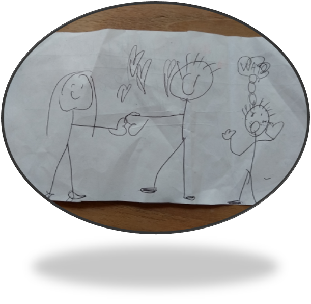

---

## Crypto volgens m'n kids, deel 2

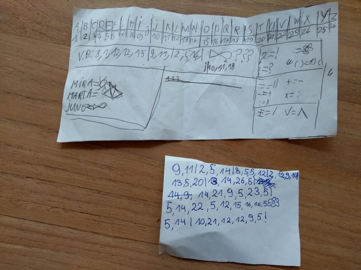

---

## Classificatie van cryptosystemen

* **Acties** op de data:
  * **Substitutie**: teken door ander teken vervangen
  * **Transpositie**: teken op andere plek zetten
  * **Product**: combinatie van beiden
* **Aantal sleutels**:
  * **1 sleutel** → symmetrisch / private encryption
  * **2 sleutels** → asymmetrisch / public encryption
* **Verwerking**:
  * **Blok**: blok per blok
  * **Stream**: teken per teken

---

## Kerckhoffs principe

:::: {.columns}

::: {.column width="15%"}

:::

::: {.column width="85%"}
> *"Het kennen van het algoritme door de tegenstander is geen probleem. Enkel de geheime sleutel moet uit diens handen blijven."*


* De **sleutel** moet geheim blijven (sleutel == wachtwoord)
* Het **algoritme** mag publiek zijn
  * Publieke algoritmes worden door duizenden experts getest → veiliger
  * *Security through obscurity* == **vals gevoel van veiligheid**


:::
::: {.callout-warning .fragment}

**Alles draait dus om het geheimhouden van je sleutel!**

:::
::::
---

## Sleutellengtes en bruteforcen

* **Bruteforce** = alle mogelijke sleutels testen
* Gemiddelde kraaktijd = is maar de **helft** van de maximale tijd

---

## Sleutellengtes en bruteforcen, deel 2


$$MaximaleTijd = \frac{AantalMogelijkeTekens^{SleutelLengte}}{pogingen/seconde}$$

**Voorbeeld**: 8 tekens (a-z), 1M pogingen/s:

$$\frac{26^8}{1\,000\,000} = 208\,827 \text{ sec} \approx 58 \text{ uur}$$

Gemiddeld gevonden in **~29 uur**. 

Eén teken extra → **62 dagen**!

---

## Bruteforce: de tabel

GeForce GTX 1080 (~30M pogingen/s):

| # tekens | nummers (10) | kleine letters (26) | alle tekens (95) |
|---|---|---|---|
| 6 | 33 ms | 10 s | 6,8 uur |
| 8 | 3,3 s | 1,9 uur | **7 jaren** |
| 10 | 5,6 min | 54 dagen | $6,3 \times 10^{4}$ jaren |
| 12 | 9,3 u | 100 jaren | $5,7 \times 10^{8}$ jaren |
| 16 | 11 jaar | $4,6 \times 10^{7}$ jaren | $4,7 \times 10^{16}$ jaren |

::: {.callout-note}
Leeftijd universum: $1,38 \times 10^{10}$ jaar. Per verdubbeling GPU's halveert de tijd.
:::

---

## Dictionary attack

* Bruteforce verbeteren door een **woordenboek** te gebruiken
* Tools zoals **John The Ripper** testen variaties: *god1*, *god2*, ...
* Meest [gebruikte wachtwoorden](https://www.passwordrandom.com/most-popular-passwords): `123456`, `password`, `qwerty`, `master`, ...

::: {.callout-tip}
Gebruik nooit wachtwoorden uit bekende lijsten! Zie: [SecLists](https://github.com/danielmiessler/SecLists/tree/master/Passwords/Common-Credentials)
:::

---

## Soorten cryptanalytische aanvallen

| Type | Beschrijving |
|---|---|
| **Enkel ciphertext** | Alleen geëncrypteerde data beschikbaar (beste scenario voor cyberboswachters) |
| **Gekende plaintext** | Zowel ciphertext als bijhorende plaintext gekend |
| **Gekozen plaintext** | Analist kiest plaintext en ziet resulterende ciphertext |
| **Gekozen ciphertext** | Analist kiest ciphertext en ziet resulterende plaintext |

---

## De beste "cryptanalyse" is géén cryptanalyse

* Veel makkelijker dan sleutels kraken: **vraag** de sleutel gewoon aan de gebruiker
  * Phishing, helpdesk-scams, post-its onder toetsenbord, ...
* *"There is no patch for human stupidity"*
* → Hoofdstuk **Social Engineering** behandelt dit uitgebreid

::: {.callout-important .fragment}
Cryptografie is **noodzakelijk** maar zelden **voldoende** voor veiligheid.
:::

---

## Quantum-computers en crypto

* Quantum-computers kunnen bruteforce **drastisch versnellen**
  * Veel veiligheidsdiensten hanteren al jaren **"Store now, decrypt later"** strategie
* Alle huidige encryptie potentieel kwetsbaar
* Impact op **cryptocurrencies**, e-commerce, wachtwoorden, ...
* Onderzoek naar **post-quantum cryptografie** is bezig

::: {.callout-note .fragment}
*"Encryption is everywhere in modern day life — everything will be vulnerable!"*
:::

---

## De eerste algoritmes

Encryptie-algoritmes onderverdeeld naar actie:

1. **Substitutie** (bv. Caesar)
2. **Transpositie** (bv. Scytale)
3. **Combinatie** van beiden (bv. AES)

::: {.callout-tip}
Handige tool om crypto te leren: [CrypTool](HTTPS://www.cryptool.org/en/ct2/)
:::

---

## Caesar encryptie (substitutie)

* Sleutel = getal 1-25 → iedere letter schuift op
  * A=1, B=2, ... Z=26
  * Sleutel 3: A→D, B→E, ... Z→C (overflow)
* Ook wel **Rot** (rotatie) genoemd: Rot4, Rot13, ...
  * **Rot13** is speciaal: 2x toepassen = originele tekst

**Formule**: ``(teken + sleutel) % 26 = nieuw teken``

Voorbeeld: Y (24) met sleutel 7: ``(24+7) % 26 = 5`` → **F**

---

## Caesar voorbeeld

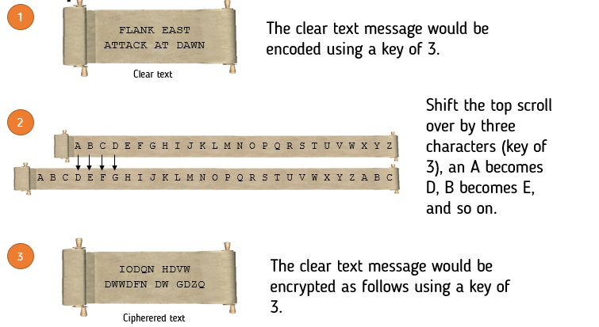{ width=80% }

---

## Caesar wiel 

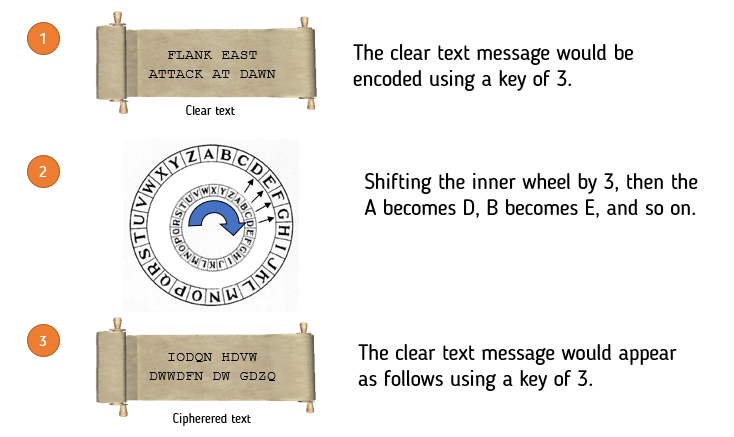{ width=80% }

---


## Caesar kraken

* Via bruteforce: Slechts **25 mogelijke sleutels** 
* Via **Frequentieanalyse**: statistische verdeling van letters in een taal
  * Letter `e` komt veel vaker voor dan `v` in NL
  * Meest voorkomende letter in ciphertext → waarschijnlijk `e`

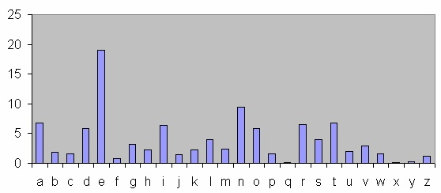

---

## Vigenère: substitutie 2.0

* Zwakte Caesar: iedere letter → **zelfde** shift → frequentieanalyse werkt
* **Vigenère** (16e eeuw): gebruik een **sleutelwoord** i.p.v. één getal
  * Iedere letter van de sleutel = shift voor bijhorende plaintext-letter
  * Sleutelwoord wordt herhaald over de tekst
* = "Combinatie van meerdere Caesars na elkaar"

::: {.callout-tip .fragment}
Eeuwenlang **onkraakbaar** genoemd: *le chiffre indéchiffrable*
:::

---

## Vigenère: voorbeeld

:::: {.columns}

::: {.column width="55%"}
Sleutel: `COUNTON`, plaintext: `vigenerecipher`

```
C O U N T O N C O U N T O N
v i g e n e r e c i p h e r
X W A R G S E G Q C C A S E
```

* `v` + sleutel `C` (shift 2) → `X`
* Iedere `e` → *andere* letter (R, S, G, S, E)
* → frequentieanalyse werkt **niet meer**
:::

::: {.column width="45%"}
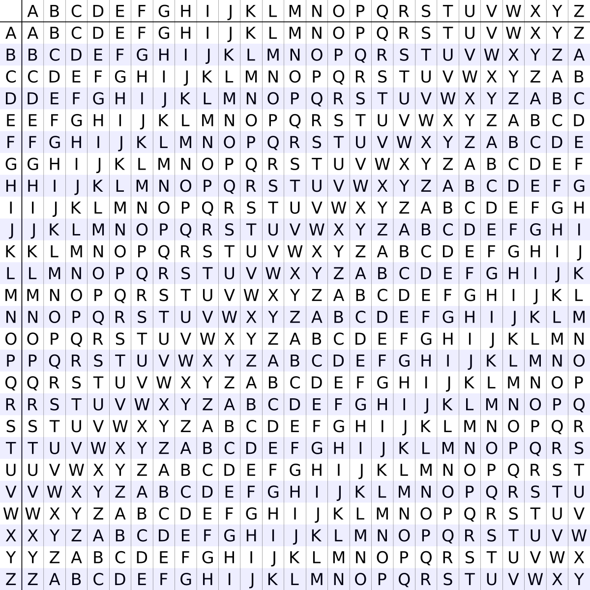{ width=100% }
:::

::::

::: {.callout-note .fragment}
19e eeuw: Kasiski kraakte het. Sleutellengte bekend → meerdere parallelle Caesars.
:::

---

## Scytale encryptie (transpositie)

* Oude Grieken: lint wikkelen rond stok met meerdere zijden
* **Sleutel** = aantal vlakken van de scytale
* Letters komen op verschillende zijden → per zijde uitlezen = ciphertext

{ width=50% }

---


## Scytale: voorbeeld

:::: {.columns}

::: {.column width="50%"}
"De perzen komen er nu aan" op scytale met 4 zijden:

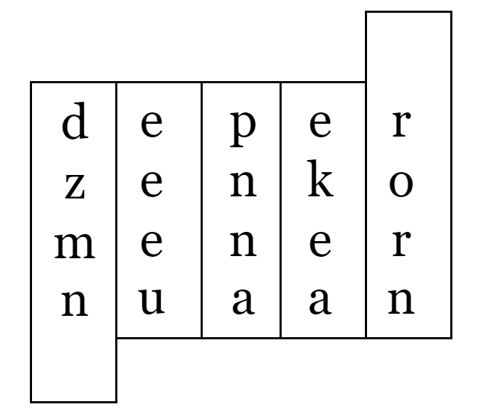{ width=100% }
:::

::: {.column width="50%"}
Ciphertext na afwikkelen:

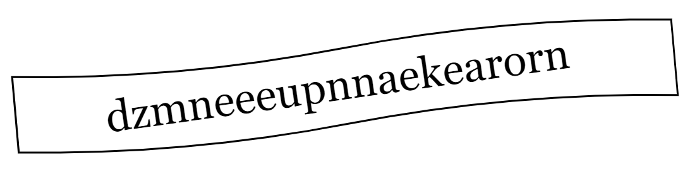{ width=100% }
:::

::::

## Combinatie: substitutie + transpositie

* Combinatie versterkt encryptie
* Moderne algoritmen = sequentie van basisvormen
  * **AES** (de facto standaard): substituties (*sub*) + transposities (*mixcolumns*, *shiftrows*) in meerdere rondes (zien we later)


---

## Moderne cryptosystemen


```{mermaid}
%%{init: {"theme": "base", "flowchart": {"useMaxWidth": true}} }%%
graph TD
    A("Encryption/Decryption") --> B("Symmetric: 1-key,<br/>to en- and decrypt")
    A --> C("Asymmetric: 2 keys,<br/>Public key to encrypt<br/>Private key to decrypt")

    style B fill:#ff9900,stroke:#333,color:#000
```

---

## Symmetrische encryptie

* **Eén sleutel** voor zowel encryptie als decryptie
  * Zender en ontvanger gebruiken **dezelfde sleutel**
* Oudste vorm van encryptie
* Voorbeelden: **AES**, DES, 3DES, RC4, Blowfish, IDEA

---

## Symmetrische encryptie basismodel


---

## Sleuteloverdracht == moeilijk in symmetric crypto

Het grote probleem: hoe wissel je de sleutel **veilig** uit?

* Via **asymmetrisch** encryptiesysteem (zie later)
* Via een **ander beveiligd kanaal** (fysiek, ander kanaal, ...)

---

## Block- en streamciphers

| | Streamcipher | Blockcipher |
|---|---|---|
| **Verwerking** | Teken per teken | Blok per blok (bv. 128 bits) |
| **Snelheid** | Sneller | Trager |
| **Voorbeelden** | RC4 | AES, DES, 3DES |

---

## Streamciphers

```{mermaid}
%%{init: {"theme": "base", "flowchart": {"useMaxWidth": true}} }%%
graph TD
    A("Encryption/Decryption") --> B("Symmetric: 1-key,<br/>to en- and decrypt")
    A --> C("Asymmetric: 2 keys,<br/>Public key to encrypt<br/>Private key to decrypt")
    B --> D("Stream:<br/>Bit-wise")
    B --> E("Block:<br/>Block-wise")

    style D fill:#ff9900,stroke:#333,color:#000
```

---


## Streamciphers: werking

Twee onderdelen:

1. **Keystream generator**: expandeert sleutel naar keystream (zelfde lengte als data)
2. **XOR-functie**: plaintext $\oplus$ keystream = ciphertext

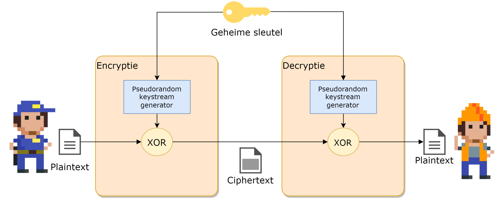

::: {.callout-important }

Ontvanger met **zelfde sleutel** → zelfde keystream → originele plaintext

:::

---

## De XOR functie : hart van cryptografie!

| Plaintext | Keystream | Ciphertext |
|---|---|---|
| 1 | 0 | **1** |
| 0 | 1 | **1** |
| 0 | 0 | **0** |
| 1 | 1 | **0** |

Voorbeeld: `1010` $\oplus$ `1101` = `0111` (ciphertext)

**Dezelfde XOR met keystream decrypteert weer!**

---

## Keystream generator

* Genereert **pseudo-random** keystream
* Zelfde sleutel (**seed**) → zelfde reeks (reproduceerbaar)

* Onvoorspelbaar voor buitenstaanders
* Zwakke generator → **kwetsbare encryptie** (bv. WEP!)
* Gebaseerd op **PRNG** (Pseudo-Random Number Generator)

---

## Middle-square: de eerste PRNG

Von Neumann (1946): eenvoudig maar krachtig idee

1. Start met **seed**
2. **Kwadrateer**
3. Neem **middelste cijfers** → nieuw getal
4. Herhaal

**Voorbeeld** (seed = 1111):

```
1111² = 01234321  →  2343
2343² = 05489649  →  4896
4896² = 23970816  →  9708
```

Reeks: `2343, 4896, 9708, ...`

::: {.callout-note .fragment}
Ondertussen onveilig (korte cycli), maar basis van alle moderne PRNGs!
:::

---

## PRNG in de praktijk: Random() in C#

```csharp
int key = 666;

Random s = new Random(key);    // Zender
Random r = new Random(key);    // Ontvanger
Random e = new Random(123);    // Eve (andere seed)
```

| Partij | Output (10 getallen) |
|---|---|
| Zender | `6337963648` |
| Ontvanger | `6337963648` |
| Eve | `9978711226` |

**Zelfde seed → zelfde reeks.** Andere seed → totaal andere reeks.

::: {.callout-warning .fragment}
C# `Random` is **niet** cryptografisch veilig! Gebruik `RandomNumberGenerator` uit `System.Security.Cryptography`.
:::

---

## RC4: streamcipher

* Ontwikkeld door Ron Rivest (*Ron's Cipher 4*)
* Sleutel: 40 tot 2048 bits
* Eén van de meest gebruikte streamciphers ooit (WEP, SSL/TLS)
  * Nu verouderd en onveilig, maar nog steeds een goed voorbeeld van een streamcipher

---

## RC4 in actie

* Twee fasen:
  1. **KSA** (Key Scheduling Algorithm): sleutel → werksleutel
  2. **PRGA** (Pseudo-Random Generation Algorithm): werksleutel → keystream


---


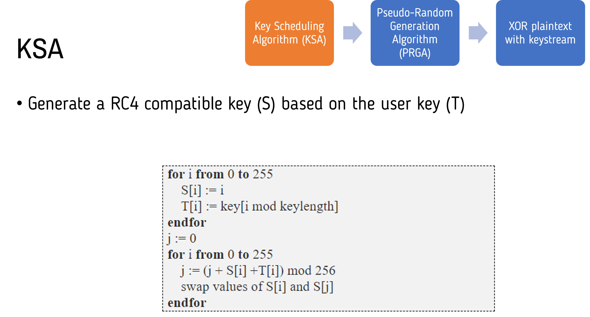

---


---


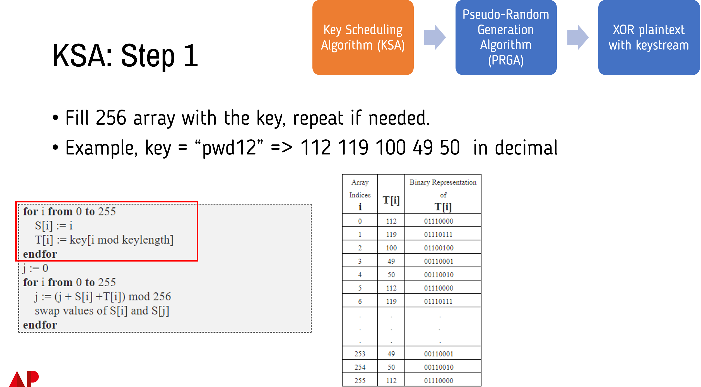

---


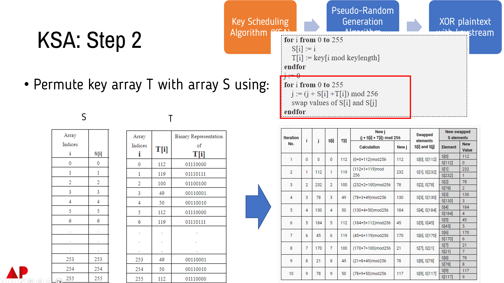

---


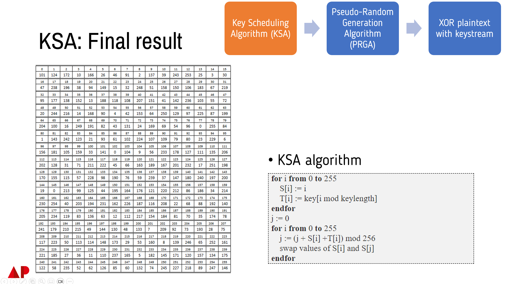

---


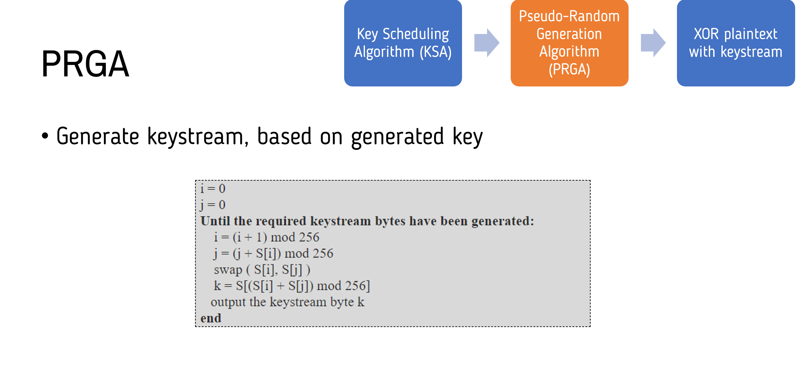


---


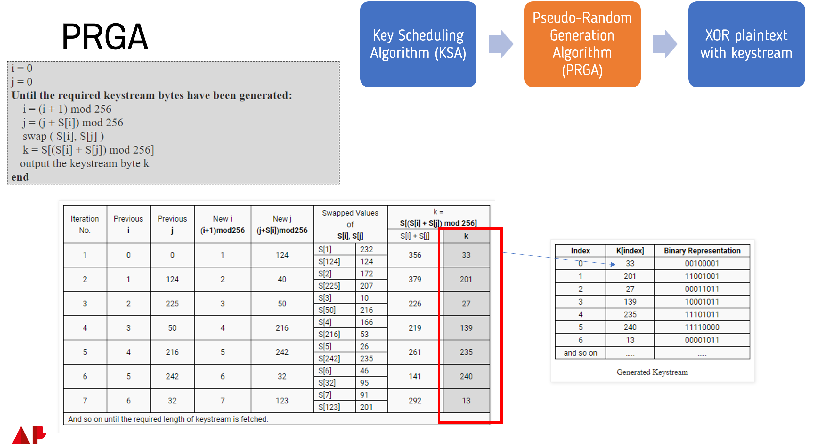

---


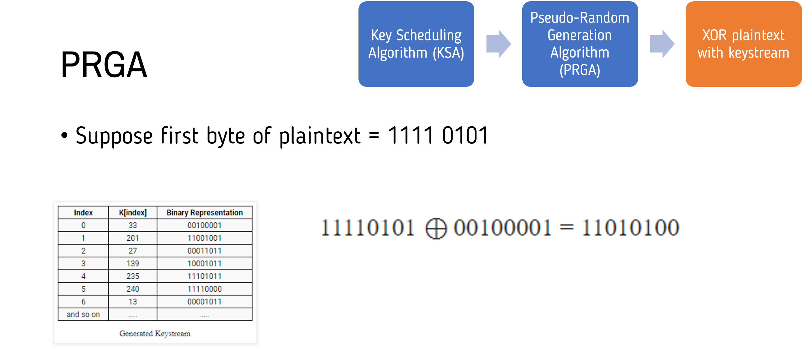

---

## Blockciphers

```{mermaid}
%%{init: {"theme": "base", "flowchart": {"useMaxWidth": true}} }%%
graph TD
    A("Encryption/Decryption") --> B("Symmetric: 1-key,<br/>to en- and decrypt")
    A --> C("Asymmetric: 2 keys,<br/>Public key to encrypt<br/>Private key to decrypt")
    B --> D("Stream:<br/>Bit-wise")
    B --> E("Block:<br/>Block-wise")

    style E fill:#ff9900,stroke:#333,color:#000
```

---

## Blockciphers

* Plaintext opdelen in **blokken** (bv. 128 bits)
* Blok per blok encrypteren
* Laatste blok eventueel **padding** nodig

---

## Intermezzo: Feistel-structuren

:::: {.columns}

::: {.column width="70%"}
* Nieuwe soort operatie (naast XOR, substitutie, transpositie): **Feistel-structuur**

* Data splitsen in **twee helften** (L en R)
* F-operatie op één helft → XOR met andere helft
* **Meerdere rondes** herhalen
* Elke ronde een andere **subkey** (via key scheduling)
:::

::: {.column width="30%"}
{ width=100% }
:::

::::

---

## DES (Data Encryption Standard)

* **1977**, blokken van 64 bits, sleutel van 56 bits
* Outdated maar belangrijk voor begrip
* Gebruikt in **bankwezen** (financiële transacties)
* Gebaseerd op IBM's Lucifer cipher (NSA halveerde sleutellengte!)

Twee onderdelen:

1. **Versleuteling**: 16 Feistel-rondes
2. **Subkey generatie**: 16 subkeys uit 56-bit sleutel

---

## DES: versleuteling

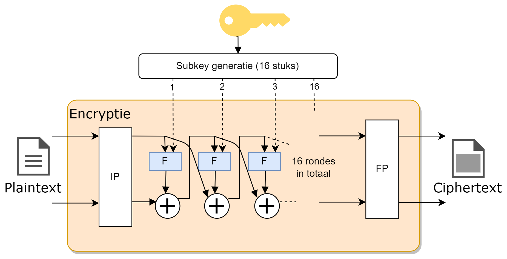{width=80%}

---

## DES: stappen per ronde

1. **Initiële Permutatie** (IP): bits herschikken
2. **16 Feistel-rondes**: splitsen, F-operatie, XOR
3. **Finale Permutatie** (FP)

---


## DES: De Initiële Permutatie.

{ width=90% }

---


## DES

{width=80%}

---

## DES: de F-operatie

:::: {.columns}

::: {.column width="50%"}
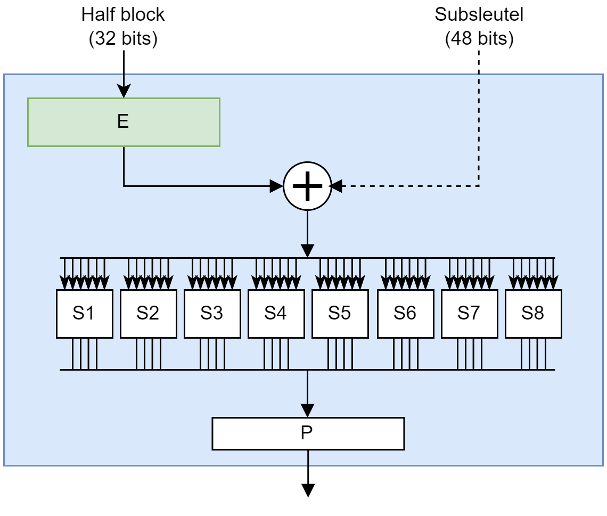{ width=100% }
:::

::: {.column width="50%"}
1. **Expansie**: 32 bits → 48 bits 
{ width=100% }
2. **XOR** met subkey (48 bits)
3. **S-boxen**: 6 bits → 4 bits (substitutie) (zie volgende slide)
4. **P-box**: permutatie


:::

::::

---

## DES: S-boxen

* 8 S-boxen, elk 6 bits in → 4 bits uit
* 2 outer bits = rij, 4 inner bits = kolom

Voorbeeld: **0**1101**1** → 1001

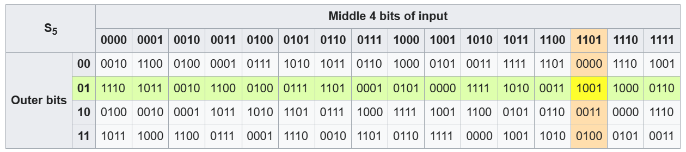{ width=100% }

---


## DES

{width=80%}


---


## DES: subkeys maken

:::: {.columns}

::: {.column width="60%"}
* 56-bit sleutel → splitsen in 2×28 bits
* Per ronde: **bit-shift** + **compressie P-box** → 48-bit subkey
* 16 rondes = 16 unieke subkeys
:::

::: {.column width="40%"}
{ width=100% }
:::

::::

---


## DES: P-boxen

* **Compressie**: 56 bits → 48 bits (bits vallen weg)
* **Permutatie**: bits van plek veranderen

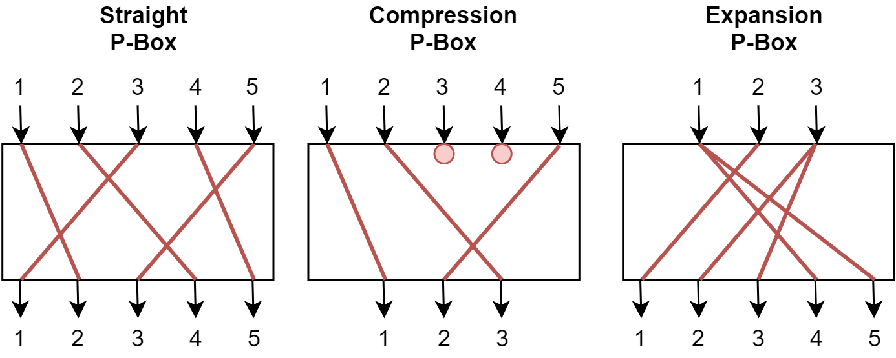{ width=100%}

---


## 3DES

* DES sleutel (56 bit) te kort → 3DES (1995)
* Sleutel tot **168 bits**, compatibel met bestaande DES hardware
* 3x DES: **Encrypt → Decrypt → Encrypt** (met 3 verschillende sleutels)
* Verlengde de levensduur van DES, maar is nu ook verouderd


::: {.callout-note}
Het bankwezen gebruikt 3DES nog steeds voor o.a. Visa en Mastercard transacties.
:::

---

## "Tripple DES"

{ width=60% }

---

## DES gekraakt in de praktijk

:::: {.columns}

::: {.column width="55%"}
* **1998**: *Electronic Frontier Foundation* bouwt **Deep Crack**
  * Kostprijs: **$250.000**
  * **1.856 custom chips**
  * DES-sleutel gekraakt in **dagen**
  * Later (+distributed.net): **< 24 uur**

* DES is **dood** voor gevoelige data
* Bevestigt 3DES (1995) als juiste keuze
:::

::: {.column width="45%"}
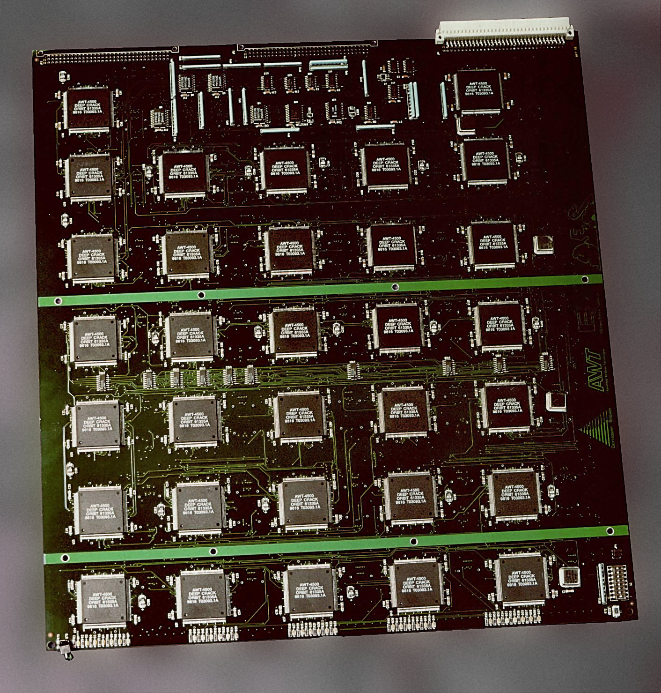{ width=100% }
:::

::::

::: {.callout-note .fragment}
Eerste gekraakte bericht (56u): *"It's time for those 128-, 192-, and 256-bit keys."* → 3 jaar later kwam AES er inderdaad.
:::

---

## Block cipher modes

* Hoe decryptie toepassen op data groter dan 1 blok?
* Zelfde plaintext-blok + zelfde sleutel = **zelfde ciphertext**
* Lekt informatie! Maakt **replay attacks** mogelijk
* Verschillende **modes of operation** bedenkt om dit probleem te verhelpen.

---


## Block cipher modes: overzicht

| Mode | Werking |
|---|---|
| **ECB** | Blokken onafhankelijk (onveilig!) |
| **CBC** | Output vorig blok als extra input |
| **CFB** | Vergelijkbaar met CBC |
| **OFB** | Blockcipher als streamcipher |
| **CTR** | Teller (IV) als extra input (veel gebruikt: WPA2, IPSEC) |


---

## Block cipher modes: ECB

**Electronic Codebook (ECB)**: elk blok onafhankelijk encrypteren

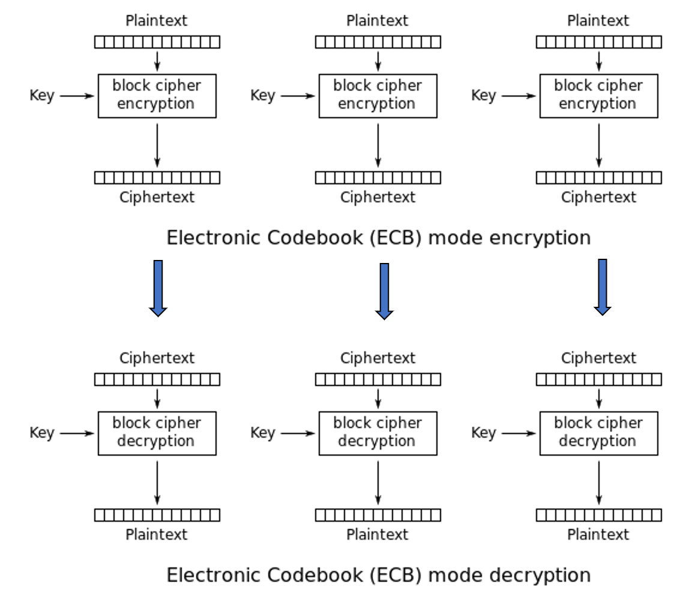

---

## Probleem met ECB


{ width=75% }

---

## Block cipher modes: CBC

**Cipher Block Chaining**: output van vorig blok als extra input voor volgende blok

{ width=80% }

---

## CBC werkt met een "Initialisatie Vector" (IV)

* **Extra seed** naast de sleutel → effectief steeds andere sleutel
* Wordt **ongeëncrypteerd** meegestuurd (in header)
* Goede IV-selectie algoritme is cruciaal

---

## CBC uitgewerkt

Mini-cipher (2 bits/blok): `00→01, 01→10, 10→11, 11→00`

Plaintext: `00 01 10 11`, IV: `10`

| Blok | Plaintext | XOR met | Resultaat | Cipher → |
|------|-----------|---------|-----------|----------|
| 1    | `00`      | IV=`10` | `10`      | **`11`** |
| 2    | `01`      | `11`    | `10`      | **`11`** |
| 3    | `10`      | `11`    | `01`      | **`10`** |
| 4    | `11`      | `10`    | `01`      | **`10`** |

Ciphertext: `11 11 10 10`

::: {.callout-tip .fragment}
4 **verschillende** plaintext-blokken → toch herhalingen in ciphertext. Patronen zijn **doorgeknipt**.
:::

---

## Block cipher modes: CTR

:::: {.columns}

::: {.column width="50%"}
* **Counter (CTR)**: teller (IV) als extra input voor blockcipher ("we encrypten de teller")
  * Nuttig voor parallelle verwerking (encryptie van blokken onafhankelijk van elkaar)
  * Gebruikt in WPA2, IPSEC, ... (bv Netflix streaming)
:::

::: {.column width="50%"}
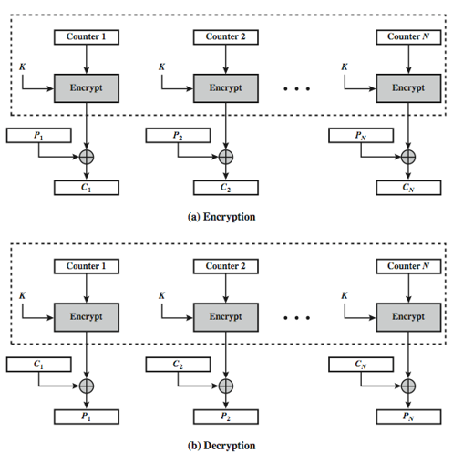{ width=100% }
:::

::::

---

## AES (Advanced Encryption Standard)


* Meest recente en meest gebruikte symmetric block cipher
* **2001**: nieuwe wereldwijde standaard
* Gebaseerd op **Rijndael** (Belgisch! Door Vincent Rijmen & Joan Daemen)
* Blokken van **128 bits**, sleutels tot **256 bits**


---


## AES: werking in het kort

* **Key expansie**: unieke sleutel per ronde
* **Meerdere rondes** met:
  * Substituties (bytes)
  * Transposities (rijen/kolommen)
  * XOR met round key
* XOR = wederom de feitelijke encryptie

---


## AES encryptie

{ width=80% }

---

## Conclusie

* **Cryptografie** beschermt vertrouwelijkheid (CIA) via encryptie met geheime sleutels
* **Kerckhoffs' principe**: de sleutel is het geheim, niet het algoritme
* **Symmetrische encryptie**: één sleutel, snel, maar sleuteluitwisseling is moeilijk
* **Stream-** (RC4) vs **blockciphers** (DES, AES) met verschillende modes (ECB, CBC, CTR)
* **AES** is de huidige standaard — Belgisch en ongebroken!

::: {.callout-important}
Langere sleutels + sterke algoritmes = betere bescherming. Maar sleuteluitwisseling blijft het grote probleem → **asymmetrische crypto** biedt de oplossing!
:::

---

## Up next?
```{mermaid}
%%{init: {"theme": "base", "flowchart": {"useMaxWidth": true}} }%%
graph TD
    A("Encryption/Decryption") --> B("Symmetric: 1-key,<br/>to en- and decrypt")
    A --> C("Asymmetric: 2 keys,<br/>Public key to encrypt<br/>Private key to decrypt")

    style C fill:#ff9900,stroke:#333,color:#000
```