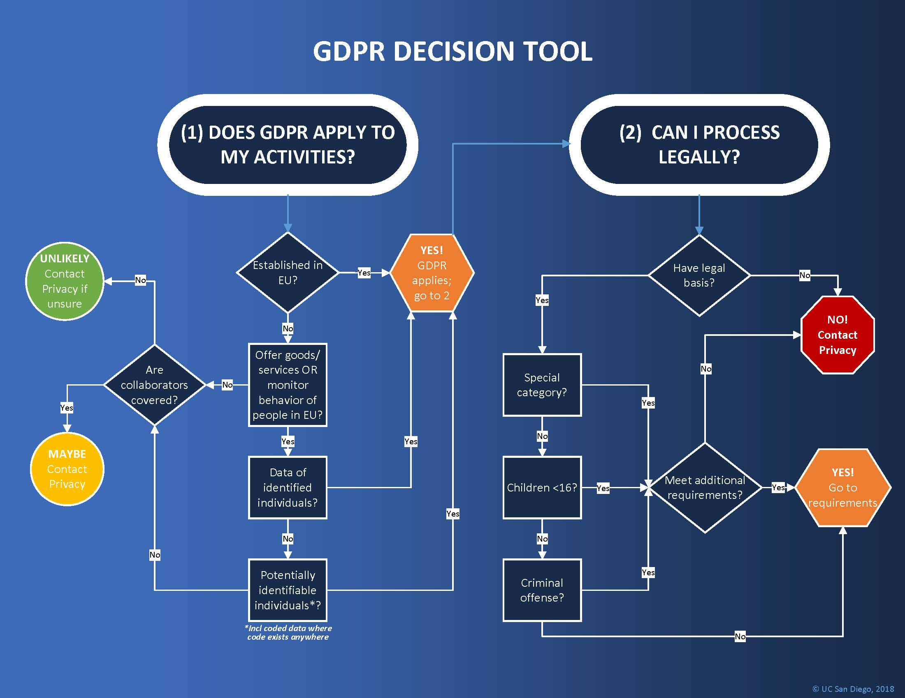

## Wat is GDPR?

**General Data Protection Regulation** (2018)

*Algemene Verordening Gegevensbescherming*

> *"The toughest privacy and security law in the world."* — Europese Unie

::: {.fragment}
* Beschermt de privacy van **EU-burgers**, eender waar ter wereld
* **Ieder bedrijf** dat data van EU-burgers bewaart, valt eronder — ook buiten Europa
* 99 artikels over rechten van burgers en **plichten van bedrijven**
:::

::: {.callout-tip .fragment}
GDPR gaat over de verplichtingen van **bedrijven** — niet van personen.
:::

---

## De 7 rechten van de burger

| Recht | Beschrijving |
|---|---|
| **Inzage** | Je mag weten welke data een bedrijf over jou heeft |
| **Rectificatie** | Je mag foute data laten corrigeren |
| **Vergeten worden** | Je mag vragen alle data over jou te wissen |
| **Beperking** | Je mag eisen dat een bedrijf stopt met verwerking |
| **Verzet** | Je mag je verzetten tegen gebruik van jouw data |
| **Portabiliteit** | Je data in een leesbaar, overdraagbaar formaat |
| **Gegevensminimalisatie** | Bedrijven mogen enkel bewaren wat ze écht nodig hebben |

---

## Recht om vergeten te worden

* Je kan elk bedrijf verplichten om **alle of specifieke data** over jou te verwijderen
* Geldt ook voor zoekmachines: je kan Google verplichten resultaten te verwijderen

::: {.callout-note .fragment}
Google kreeg een stevige boete omdat het niet inging op de vraag van een EU-burger om *vergeten te worden*.

Sindsdien zijn ze een stuk behulpzamer.
:::

---

## Recht op overdraagbaarheid

* Van provider veranderen was vroeger een helse opdracht — elk bedrijf had eigen dataformaten
* GDPR verplicht nu een **vast, gestandaardiseerd formaat** voor overdracht van persoonsgegevens
* Overdracht moet **transparant en zo geautomatiseerd mogelijk** verlopen

::: {.callout-note .fragment}
De voorganger van GDPR was de **DPD** (*Data Protection Directive*) — een aanbeveling, geen wet.

GDPR zorgt ervoor dat burgers geen speelbal meer zijn van bedrijven die data als nieuw goud verzamelen.
:::

---

## Welke data beschermt GDPR?

::: {.incremental}
* **Persoonlijk identificeerbare informatie**: naam, adres, geboortedatum, rijksregisternummer
* **Online gegevens**: locatie, IP-adres, cookies
* **Gezondheids- en genetische gegevens**
* **Biometrische gegevens**: irisscan, vingerafdruk
* **Raciale of etnische gegevens**
* **Politieke meningen**
* **Seksuele geaardheid**
:::

---

## Persoonlijke data buiten de EU

---

## Meldplicht bij datalekken

::: {.callout-note}
**Datalek** = *"Een inbreuk op de beveiliging die per ongeluk of op onrechtmatige wijze leidt tot de vernietiging, het verlies, de wijziging of de ongeoorloofde verstrekking van of ongeoorloofde toegang tot persoonsgegevens."*
:::

::: {.fragment}
Bij een datalek moet het bedrijf **binnen 72 uur** melden aan:

1. De **toezichthoudende autoriteit** — in België: de **CBPL** (*Commissie voor de Bescherming van de Persoonlijke Levenssfeer*)
2. **Elk individu** wiens data betrokken is bij het lek
:::

::: {.callout-tip .fragment}
De 72 uur gaan in op het moment van **ontdekking** — niet van het moment dat het lek plaatsvond. Een lek dat maanden geleden gebeurde telt dus pas vanaf het moment dat het bedrijf het ontdekt.
:::

---

## Uitzonderingen meldplicht

Het bedrijf hoeft het individu **niet** te verwittigen als:

::: {.fragment}
**1. Data onbruikbaar is:**
De gestolen data was geëncrypteerd → aanvallers kunnen er niets mee doen.

*(Kanttekening: encryptie is nooit 100% waterdicht — decryptie in de toekomst blijft mogelijk.)*
:::

::: {.fragment}
**2. Data niet tot persoon te herleiden is:**
Persoonlijke voorkeuren en identificeerbare gegevens staan in **aparte databases**.

Enkel de niet-identificeerbare database is gelekt → geen privacy-schending.
:::

::: {.callout-tip .fragment}
**"Don't put all your eggs in one basket"**: bewaar data verspreid over meerdere databases. Een lek treft dan nooit alles tegelijk.
:::

---

## Boetes

| Ernst | Maximale boete |
|---|---|
| **Minder ernstig** | € 10 miljoen of **2%** van wereldwijde jaaromzet |
| **Meer ernstig** | € 20 miljoen of **4%** van wereldwijde jaaromzet |

*Altijd het hoogste bedrag van de twee.*

::: {.callout-warning .fragment}
"Meer ernstig" = inbreuken op de **kernprincipes** van GDPR: recht op privacy, recht om vergeten te worden.
:::

---

## Criteria voor boetes

Of er een boete volgt en hoe groot, hangt af van:

:::: {.columns}

::: {.column width="50%"}
* Ernst en aard van de overtreding
* **Intentie**: slordigheid of opzet?
* Schadebeperkende maatregelen
* Genomen voorzorgen
* Geschiedenis van overtredingen
:::

::: {.column width="50%"}
* **Medewerking** met autoriteiten
* Gegevenscategorie
* **Meldplicht** nageleefd?
* Certificering (ISO 27001, ...)
* Verzwarende of verzachtende factoren
:::

::::

::: {.callout-tip .fragment}
Een boete is **niet automatisch**: bedrijven die aantoonbaar alles in het werk hebben gesteld om data correct te bewaren, kunnen vrijuit gaan.
:::

---

## GDPR in de praktijk: boetes

::: {.callout-note}
Mei 2018 → eind 2020: reeds **272 miljoen euro** aan boetes geïnd.
:::

::: {.callout-tip .fragment}
**TikTok (lente 2025)**: **530 miljoen euro** boete.

Reden: TikTok kon niet aantonen dat data van Europese gebruikers adequaat beveiligd was op servers in China.

*(De boete heeft betrekking op de situatie vóór 2023.)*
:::

::: {.callout-warning .fragment}
Bij een groot datalek waarbij veel mensen moeten worden verwittigd, mag een bedrijf ook kiezen voor een **publieke aankondiging**.

Dat is echter altijd een PR-nachtmerrie.
:::

---

## Conclusie

* **GDPR** is de strengste privacywet ter wereld
* Stelt de Europese burger voorop, niet het bedrijf
* Dwingt bedrijven wereldwijd om zorgvuldig om te gaan met persoonsdata
* Dient als **voorbeeld voor de rest van de wereld**

::: {.callout-important .fragment}
De kracht van GDPR zit in de **handhaving**: boetes zijn hoog genoeg om bedrijven serieus te nemen.
:::

---

## Toekomst: meer Europese regelgeving

| Wet | Doel |
|---|---|
| **DSA** — Digital Services Act | Aanpakken van illegale content en grote platforms |
| **DMA** — Digital Markets Act | Inperken van de macht van grote techbedrijven (Google, Meta, Amazon) |
| **AI Act** (augustus 2024) | Reguleren van artificiële intelligentie in Europa |

::: {.callout-tip .fragment}
Europa zet de toon wereldwijd op het gebied van digitale regulering.

Of het werkt, hangt af van de **uitvoering en handhaving** — en de concurrentiepositie ten opzichte van de rest van de wereld.
:::
