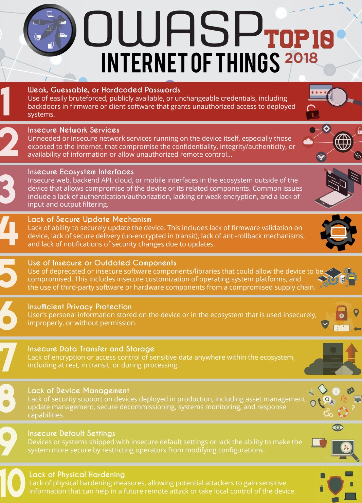
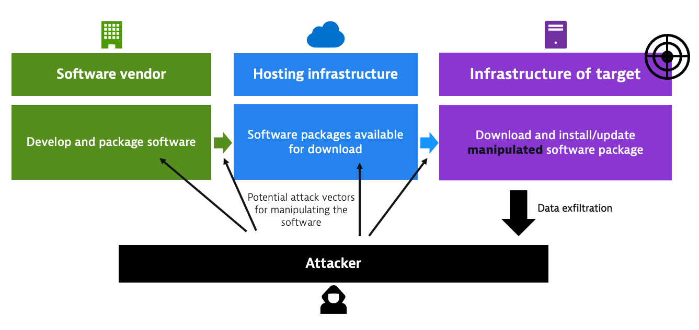

## Wat leer je in dit hoofdstuk?

Na dit hoofdstuk kan je:

* de **specifieke uitdagingen van IoT-security** benoemen (low-power, long-life, firmware, defaults)
* met **Mirai** illustreren waarom zwakke IoT een systemisch risico vormt
* de rol van **TPM** en andere hardware-mitigaties situeren
* de **McCumber-kubus** toepassen op een IoT-case (rust / transport / verwerking)
* de **wet van diminishing returns** gebruiken bij security-prioritering

---

## IoT Security: alles komt samen

* We zagen al hoe Mirai (2016) aantoonde hoe krachtig een botnet van IoT-apparaten kan zijn
* IoT-netwerken beveiligen vereist **alles** wat we al leerden — én meer

::: {.callout-important .fragment}
Ieder IoT-apparaat in je netwerk is een potentiële **toegangspoort** tot de rest van je infrastructuur.
:::

---

## Waarom is IoT moeilijker te beveiligen?

| Beperking | Gevolg voor security |
|---|---|
| **Low-power** | Security protocols mogen geen extra batterij kosten |
| **Lage bandbreedte** | Zware encryptie of updates zijn vaak niet haalbaar |
| **Beperkte hardware** | Weinig CPU en opslag → minder beveiligingsmogelijkheden |
| **Moeilijk te updaten** | Patches uitrollen is omslachtig of fysiek vereist |
| **Onbeschermde locaties** | Fysieke toegang voor aanvallers is reëel |

::: {.callout-note .fragment}
**Enterprise IoT** vs **consumer IoT**: een industriële sensor heeft vaak een doordachte update-strategie. Een slimme koelkast thuis vermoedelijk niet.
:::

---

## OWASP IoT Top 10

**OWASP** (*Open Web Application Security Project*) is een open-source platform voor cybersecurity kennis.

* Publiceert **Top 10** lijsten van meest voorkomende kwetsbaarheden
* Gerangschikt van meest voorkomend → minst voorkomend
* Praktische tools, best practices en gidsen beschikbaar

::: {.callout-tip .fragment}
**IoTGoat** ([github.com/OWASP/IoTGoat](https://github.com/OWASP/IoTGoat/)): een bewust onveilige firmware om de OWASP IoT Top 10 te leren kennen door ze zelf uit te buiten.

Ook de Belgische OWASP-tak organiseert (gratis) workshops en events.
:::

---

## OWASP IoT Top 10: overzicht



---

## #1 — Zwakke of hardcoded wachtwoorden

* Default wachtwoorden zijn publiek bekend — aanvallers kennen ze
* Wachtwoord aanpassen is vaak **omslachtig** op IoT-apparaten
  * Geen webinterface → via fysieke knoppen of vreemde tools
  * Resultaat: gebruikers laten het default wachtwoord staan

::: {.callout-warning .fragment}
*"Wat kan een hacker nu met mijn digitale thermometer?"*

Een cybercrimineel gebruikt de thermometer niet als doel — maar als **springplank** naar de rest van je netwerk.
:::

::: {.callout-important .fragment}
**Mirai (2016)** besmette honderdduizenden apparaten puur door default wachtwoorden te proberen. Het resulteerde in één van de grootste DDOS-aanvallen ooit.
:::

---

## #2 — Ongebruikte of onveilige netwerkservices

* IoT-apparaten draaien vaak **meerdere netwerkservices** waar de gebruiker niets van weet
  * Printers, routers, camera's: vaak Telnet, FTP, SNMP, ... actief
* Sommige services zijn **inherent onveilig**: bv. Telnet communiceert **onversleuteld**

::: {.callout-tip .fragment}
Bekijk welke services actief zijn op je systemen: `services.msc` op Windows.
:::

::: {.callout-note .fragment}
In 2017 bereikte een grayhat hacker **150.000 printers** in Nederland via poort 9100.

Hij printte waarschuwingsbriefjes om gebruikers te wijzen op de onveiligheid van hun apparaat.
:::

---

## #2 — Printer hack (2017)

{ width=60% }

::: {.callout-warning}
Controleer altijd welke netwerkservices actief zijn op een nieuw apparaat — en zet onnodige services **uit**.
:::

---

## #3 — Onveilig ecosysteem

IoT-apparaten zijn zelden alleen — ze maken deel uit van een **ecosysteem**:

* Cloud-dashboards (fitbit.com, Google Nest, ...)
* Smartphone-apps
* Third-party koppelingen (IFTTT, Alexa, ...)

::: {.callout-warning .fragment}
De veiligheid van je apparaat is even sterk als de **zwakste schakel** in het hele ecosysteem.

Als fitbit.com gehackt wordt → kans dat aanvallers ook bij jouw data of apparaten kunnen.
:::

::: {.callout-tip .fragment}
Gebruikers vergeten welke third-party diensten toegang hebben tot hun accounts.

Controleer geregeld via je **Google** of **Apple** accountinstellingen welke apps en services gekoppeld zijn.
:::

---

## #4 — Geen of onveilig updatemechanisme

* Updates zijn cruciaal om beveiligingslekken te dichten
* Maar bij IoT is updaten vaak **niet vanzelfsprekend**:

::: {.incremental}
* Apparaat heeft geen remote update-mogelijkheid → fysiek ter plaatse gaan
* Update mislukt → apparaat *gebrickt* → nog meer problemen
* Fabrikant brengt patches uit voor *x* jaar, daarna: niets meer
* Fabrikant bestaat niet meer → patches komen nooit meer
* Bug zit in een **externe chip** → wie is verantwoordelijk?
:::

::: {.callout-tip .fragment}
Abonneer je als cyberboswachter op **CVE-feeds** en RSS-feeds van fabrikanten om tijdig op de hoogte te zijn van nieuwe kwetsbaarheden.
:::

---

## #4 — BrakTooth (2021)

:::: {.columns}

::: {.column width="65%"}
* Kritieke Bluetooth-kwetsbaarheid in **miljoenen** IoT-apparaten
* Bug zit in de **Bluetooth-chip**, niet in de software van de fabrikant
* Sommige chipfabrikanten: *"we patchen alleen als er genoeg vraag naar is"*

Mogelijke aanvallen:

* **DoS**: apparaat crashen
* **ACE** (Arbitrary Code Execution): eigen code uitvoeren op het apparaat
:::

::: {.column width="35%"}
{ width=100% }
:::

::::

---

## #5 — Oude of onveilige componenten

* Een IoT-apparaat bevat **tientallen onderdelen** van verschillende fabrikanten
* Hardware: chips, radio-modules, sensoren
* Software: bibliotheken, protocollen, besturingssysteem

::: {.callout-warning .fragment}
Een bug in een gedeelde component (bv. een Bluetooth-chip of een open-source bibliotheek) treft **alles** wat die component gebruikt.

**Log4J (2021)** en **Heartbleed (2014)**: kleine bugs in veel gebruikte bibliotheken met wereldwijde impact.
:::

---

## #5 — SolarWinds: de supply chain attack

{ width=75% }

::: {.callout-note}
Hackers kraakten de FTP-server van SolarWinds (wachtwoord: *solarwinds123*).

Ze voegden een backdoor toe aan de Orion-software-update → duizenden klanten, waaronder de Amerikaanse overheid, werden automatisch besmet.
:::

---

## #6 — Onvoldoende privacybescherming

* IoT-fabrikanten verzamelen vaak persoonlijke data van gebruikers
* **GDPR** verplicht een veilige omgang met die data
* Probleem: data staat beveiligd in de cloud, maar **onversleuteld op het apparaat zelf**

::: {.callout-warning .fragment}
Een ultra-beveiligde database bij de fabrikant helpt niets als diezelfde data als *plaintext* op het IoT-apparaat wordt bewaard.

Denk aan: fitness-trackers, slimme luidsprekers, bewakingscamera's.
:::

---

## #7 — Onveilige datatransfer en opslag

Herinner je de **McCumber kubus**: C.I.A. moet gelden voor data in **alle** vormen:

| Fase | Risico |
|---|---|
| **Opslag** | Data onversleuteld op het apparaat |
| **Overdracht** | Communicatie onversleuteld (Telnet, HTTP, ...) |
| **Verwerking** | Data tijdelijk onbeveiligd in geheugen |

::: {.callout-important .fragment}
Encryptie enkel tijdens overdracht geeft een **vals gevoel van veiligheid**.

Als de data onversleuteld op het apparaat staat, is de encryptie tijdens verzending nutteloos.
:::

---

## #8 — Gebrek aan apparaatbeheer

In een enterprise IoT-omgeving: **honderden tot duizenden apparaten** beheren.

Waarom is robuust device management essentieel?

::: {.incremental}
* Te veel apparaten om manueel te bedienen
* Apparaten bevinden zich op **moeilijk bereikbare of gevaarlijke plaatsen**
* **Alarmen** nodig bij storingen of afwijkende metingen
* Efficiënt gebruik van personeel
* Deel van **mission-critical systemen**: elke downtime = verlies of boetes
:::

::: {.callout-warning .fragment}
Een goed device management systeem is duur — maar een gecompromitteerd IoT-netwerk is duurder.
:::

---

## #9 — Onveilige standaardinstellingen

* Apparaten komen *uit de doos* met **standaardinstellingen** die aanvallers kennen
* Niet alleen wachtwoorden — ook:
  * Open poorten en services
  * Onveilige protocollen ingeschakeld
  * Debugmodus actief

::: {.callout-note .fragment}
**Windows XP urban legend**: computers die rechtstreeks aan het internet werden gehangen tijdens de installatie werden soms al besmet voordat de installatie klaar was.

Artikels bevestigen dat dit effectief mogelijk was.
:::

::: {.callout-important .fragment}
Gezonde gewoonte: controleer **alle instellingen** van een nieuw apparaat vóór je het in productie neemt. Zet alles uit wat je niet nodig hebt.
:::

---

## #10 — Gebrek aan fysieke hardening

:::: {.columns}

::: {.column width="60%"}
* IoT-apparaten staan op **publiek toegankelijke plaatsen**
* Werken weken/maanden zonder dat iemand er naar omkijkt
* Aanvallers kunnen rustig en ongezien knoeien (*tamperen*)

Risico's:

* **UART / debug-interfaces** toegankelijk → eigen firmware flashen
* **Geen Secure Boot** → ongeautoriseerde software laden
* **Geen TPM** → data uitlezen van het apparaat
:::

::: {.column width="40%"}
::: {.callout-tip}
TPM-chips vinden steeds meer hun weg naar nieuwe IoT-apparaten.

De kost valt in het niets bij de potentiële schade van een gecompromitteerd apparaat.
:::
:::

::::

::: {.callout-important .fragment}
Bewaar data **versleuteld** op het apparaat — ook als het fysiek gestolen of gemanipuleerd wordt.
:::

---

## Conclusie: de wet van diminishing returns

```{mermaid}
%%{init: {"theme": "base", "xyChart": {"useMaxWidth": true}} }%%
xychart-beta
    title "Impact vs inspanning bij IoT security"
    x-axis ["Stap 1: Wachtwoord", "Stap 2: Updates", "Stap 3: Services", "Stap 4: Encryptie", "Stap 5: Hardening"]
    y-axis "Veiligheidswinst" 0 --> 100
    bar [60, 20, 10, 6, 4]
```

---

## Conclusie

* **Basismaatregelen** leveren de grootste veiligheidswinst op:
  * Goede wachtwoorden, geen defaults, updates, onnodige services uitschakelen
* Elk volgend niveau is **belangrijk maar incrementeel**
* OWASP IoT Top 10 is een praktisch raamwerk om niets te vergeten

::: {.callout-tip}
Als we er samen in slagen de basis correct toe te passen én aan anderen te leren, maken we het digitale stropers al een pak moeilijker.
:::

::: {.callout-important .fragment}
Cybersecurity is geen eindbestemming — het is een voortdurend proces van **leren, aanpassen en verbeteren**.
:::
