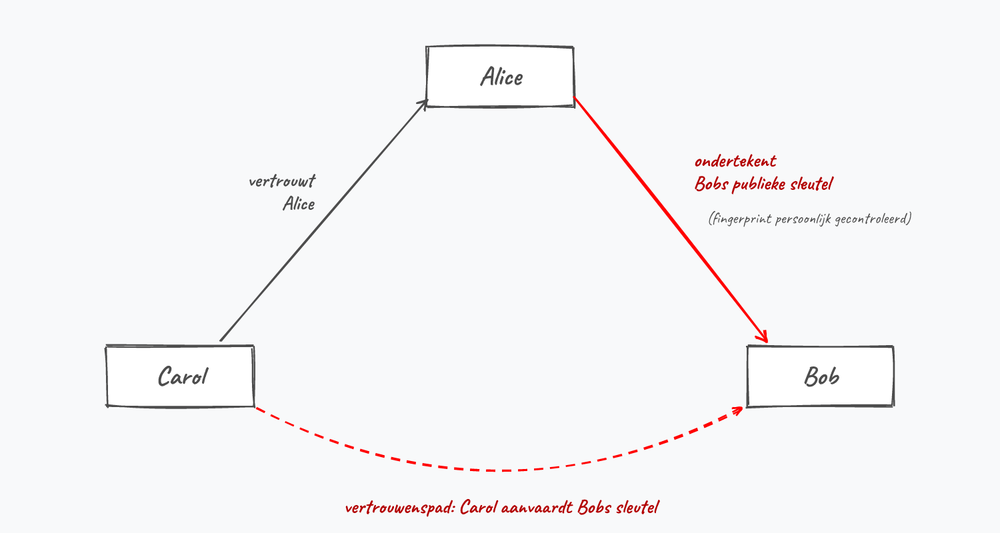
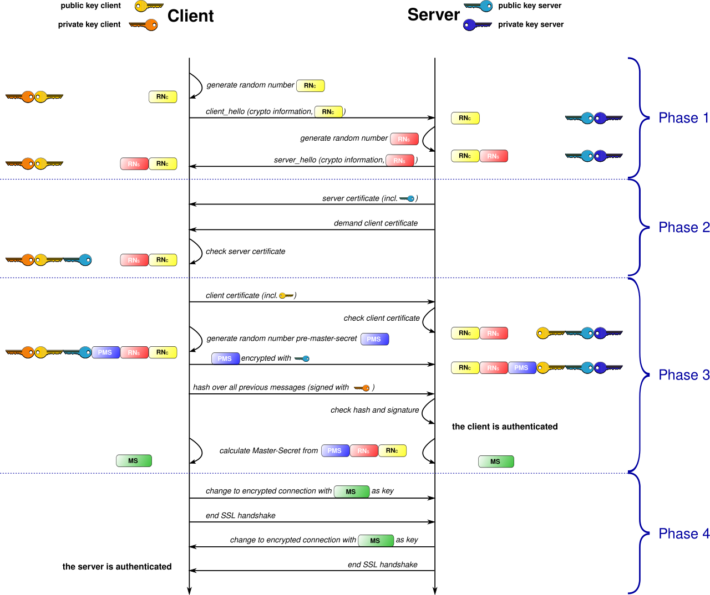

## Het sleutelprobleem bij symmetrische encryptie

:::: {.columns}

::: {.column width="70%"}
* Per **eindpunt** een aparte sleutel nodig
* Aantal sleutels: $n \times \frac{(n - 1)}{2}$

| Gebruikers | Sleutels |
|---|---|
| 6 | 15 |
| 10 | 45 |
| 100 | 4950! |
:::

::: {.column width="30%" .fragment}
{ width=40% }

:::

::::


::: {.callout-warning .fragment}
**Key distribution problem**: op grote schaal (Internet) wordt sleutelmanagement onmogelijk!

:::

---


## Asymmetrische encryptie

```{mermaid}
%%{init: {"theme": "base", "flowchart": {"useMaxWidth": true}} }%%
graph TD
    A("Encryption/Decryption") --> B("Symmetric: 1-key,<br/>to en- and decrypt")
    A --> C("Asymmetric: 2 keys,<br/>Public key to encrypt<br/>Private key to decrypt")

    style C fill:#ff9900,stroke:#333,color:#000
```

---

## Asymmetrische encryptie: twee sleutels

* **Publieke sleutel**: iedereen mag deze gebruiken om te encrypteren
* **Private sleutel**: enkel de eigenaar kan decrypteren

::: {.callout-important .fragment}
**De private sleutel moet altijd geheim blijven! (cfr Kerkhoff)**
:::

---

## Asymmetrische encryptie: werking

* Ontwikkeld in de **jaren 70** door Diffie en Hellman
* Enorme impact op beveiligde communicatie via Internet


---

## De kist-metafoor

::: {.callout-tip}


De **publieke sleutel** = een openstaande kist. 

Iedereen kan er een boodschap in leggen en op slot klikken (*encrypteren*). 

Enkel de eigenaar heeft de **private sleutel** om de kist te openen (*decrypteren*).
:::


---

## Dualiteit van publieke cryptografie

Asymmetrische crypto lost **twee** problemen op:

1. **Encryptie**: publieke sleutel om berichten te versleutelen
2. **Digitale handtekening**: private sleutel om identiteit te bewijzen

::: {.callout-tip .fragment}
Private sleutel = uniek voor eigenaar → bewijs van identiteit (**authenticatie**)
:::

---

## Digitale handtekening: concept


---

## Diffie-Hellman sleuteluitwisseling

* Publieke crypto heeft 3 toepassingen: **encryptie**, **digitale handtekeningen**, **key exchange**
* Symmetrische crypto is **sneller** → beter voor realtime communicatie
* Maar: sleutelmanagement is problematisch bij grote groepen
* **Diffie-Hellman** lost dit op: veilige sleuteluitwisseling over een **onveilig kanaal**

---

## Diffie-Hellman: werkwijze

1. Alice en Bob kiezen elk een **geheime waarde** (enkel voor deze sessie)
2. Ze berekenen elk een **publieke waarde** en sturen die naar de ander (mag onbeveiligd)
3. Elk combineert ontvangen publieke waarde met eigen geheime waarde
4. Resultaat: een **shared secret** dat beiden kennen

::: {.callout-note .fragment}
Deze waarden zijn **geen sleutelparen** zoals bij RSA — ze worden na de uitwisseling weggegooid.
:::

---

## Diffie-Hellman: rekenvoorbeeld

|   Stap     | Alice                                           | Bob                                            |
| ------ | ----------------------------------------------- | ---------------------------------------------- |
| 1 | Kiest geheim getal A = 3   | Kiest geheim getal B = 6          |
| 2 | Berekent $7^A\%11 = 343\%11 = 2$ (= X) | Berekent $7^B\%11 = 11764\%11 = 4$ (= Y) |
| 3 | Stuurt X=2 naar Bob                           | Stuurt Y=4 naar Alice                        |
| 4 | Berekent $Y^A\%11 = 4^3\%11 = 9$             | Berekent $X^B\%11 = 2^6\%11 = 9$               |

**Shared secret = 9** → enkel Alice en Bob kennen dit getal!

---

## Diffie-Hellman: waarom werkt dit?

* Dankzij de eigenschappen van de **modulo-operator**
* X en Y kunnen het resultaat zijn van gigantische berekeningen
* Een stroper heeft **veel rekenwerk** nodig om alle mogelijkheden te testen

::: {.callout-warning .fragment}
In de praktijk kiezen Alice en Bob **véél** grotere getallen dan 3 en 6!
:::

---

## Diffie-Hellman: de verfkleurenmetafoor

:::: {.columns}

::: {.column width="55%"}
1. Alice en Bob spreken **publiek** een startkleur af (geel)
2. Elk kiest een **geheime** kleur (nooit gedeeld)
3. Ze mengen beide en sturen het mengsel naar elkaar
4. Elk voegt bij het ontvangen mengsel de eigen geheime kleur toe
5. Beiden komen uit op **dezelfde eindkleur** → gedeeld geheim

::: {.callout-tip .fragment}
Verf mengen is makkelijk, *ontmengen* praktisch onmogelijk. In de digitale versie vervult de modulo-berekening die rol.
:::
:::

::: {.column width="45%"}
{width=80%}
:::

::::

---

## RSA

* **1977**, door Rivest, Shamir en Adleman
* Sleutels van **1536 tot 4096 bits**
* Relatief **traag** → vaak gebruikt voor sleuteluitwisseling
  * Daarna overschakelen op sneller symmetrisch cipher
* Gebaseerd op **modulo-operator** (net als Diffie-Hellman)

---

## RSA: sleutels aanmaken

Stap 1: publieke sleutel genereren

* Kies twee priemgetallen: ``p=17`` en ``q=11``
* Bereken ``N = p × q = 187``
* Kies priemgetal ``e = 7``

Stap 2: private sleutel berekenen

* Vind ``d`` zodat $e \times d = 1\%((p-1) \times (q-1))$
* $7 \times d = 1\%160$ → **``d = 23``**

---

## RSA: het sleutelpaar

* **Publieke sleutel**: $N=187$ en $e=7$ (openbaar)
* **Private sleutel**: $d=23$ (geheim!)

::: {.callout-tip .fragment}
Om $d$ te berekenen gebruiken we het *Uitgebreid Euclidisch algoritme*, gebaseerd op het *Algoritme van Euclides* voor de grootste gemene deler.
:::

---

## RSA: encryptie voorbeeld

Alice wil ASCII-karakter **X** (waarde 88) naar Bob sturen:

**Encryptie** (met publieke sleutel): $C = data^e\%N$

$$C = 88^7\%187 = 11$$

**Decryptie** (met private sleutel): $P = C^d\%N$

$$P = 11^{23}\%187 = 88$$ = ASCII van X → bericht is correct ontvangen!

---

## RSA: waarom is dit veilig?

::: {.callout-tip}
De sterkte zit in het feit dat **factorisatie** computationeel veel moeilijker is dan vermenigvuldigen.

* $123 \times 127 = 15621$ → makkelijk
* $15621$ ontbinden in factoren → **veel moeilijker**
:::

---

## RSA en cryptocurrencies

* Cryptocoins gebruiken dezelfde **public crypto** concepten
* Je **private sleutel** = bewijs van eigendom van je coins
* **NOOIT** je private sleutel aan derden geven!
  * Wie je private sleutel heeft, kan je coins stelen

---

## Elliptic Curve Cryptografie (ECC)

* **Modernere** asymmetrische crypto, gebaseerd op **elliptische krommen**
* Veel **kleinere sleutels** voor hetzelfde beveiligingsniveau:

| ECC | RSA equivalent |
|---|---|
| 256 bits | 3072 bits |
| 384 bits | 7680 bits |

::: {.callout-tip .fragment}
Kleiner = **sneller**, minder data, minder energie → ideaal voor **mobiel** en **IoT**
:::

---

## ECC: toepassingen

* **ECDH**: Diffie-Hellman sleuteluitwisseling via elliptische krommen
* **ECDSA**: digitale handtekeningen (o.a. gebruikt door **Bitcoin**)
* Moderne **TLS/HTTPS** gebruikt vrijwel altijd ECC voor sleuteluitwisseling

::: {.callout-warning .fragment}
Net als RSA is ECC kwetsbaar voor **quantumcomputers**. Daarom werkt men aan **post-quantum cryptografie** — NIST publiceerde in 2024 de eerste standaarden.
:::

---

## Intermezzo: Hashes

* **Hashfunctie**: zet data om naar code met **vaste lengte**
  * Ongeacht de grootte van de input
  * **1 bit** wijzigen → **totaal andere hash**
* Identieke input → identieke hash

{width=60%}

---

## Hashes: eigenschappen

* **Niet omkeerbaar**: van hash → originele tekst is onmogelijk
  * Eenrichtingsfunctie
* **Hash collisions**: twee verschillende inputs → zelfde hash
  * Theoretisch onvermijdelijk (hash is korter dan input)
  * Goede hashfunctie minimaliseert dit

---

## Bekende hashfuncties

| Algoritme | Hashlengte | Status |
|---|---|---|
| **MD5** | 128 bits | Verouderd, veel collisions |
| **SHA-256** | 256 bits | Veilig |
| **SHA3-512** | 512 bits | Nieuwste standaard |

::: {.callout-important .fragment}
**Een digitale hash is een ideaal middel om boodschappen digitaal te ondertekenen (integrity).**
:::

---

## Digitale handtekeningen

* Probleem: hoe weet je dat een bericht **echt** van de afzender komt?

:::{.fragment}
* Oplossing: **digital signature** via publieke crypto
  * Private sleutel = bewijs van identiteit
  * Handtekening = hash geëncrypteerd met private sleutel
  * Ontvanger verifieert met bijhorende publieke sleutel
:::

---

## Digitale handtekeningen


---

## Digitale handtekeningen: hele process

{width=80%}

---

## Digitale handtekeningen: rekenvoorbeeld


:::: {.columns}

::: {.column width="50%"}
Gegeven sleutelpaar:

* Publieke sleutel: $e=5$, $n=91$
* Private sleutel: $d=29$

**Ondertekenen** van boodschap $m=35$:

$$s = m^d\%n = 35^{29}\%91 = 42$$

::: {.fragment}
**Verstuur**: 

boodschap ``35`` + handtekening ``42``
:::
:::

::: {.column width="50%" .fragment}
Ontvanger verifieert met publieke sleutel $e,n$:

$$42^e\%n = 42^5\%91 = 35$$

Hash komt overeen → bericht is **authentiek**!

:::

::::


---

## Het probleem met digitale handtekeningen

* Publieke sleutels zijn... **publiek**
* Hoe weet je dat een publieke sleutel **echt** bij persoon X hoort?
* Een aanvaller kan:
  1. Bericht onderscheppen en aanpassen
  2. Ondertekenen met **eigen** private sleutel
  3. Ontvanger wijsmaken dat zijn publieke sleutel van de originele afzender is

---

## Man-in-the-middle bij handtekeningen


::: {.callout-warning .fragment}
We hebben een manier nodig om de **identiteit van de eigenaar** van een publieke sleutel te verifiëren!
:::

---

## Digitale certificaten

* **Certificaat** = digitaal document dat identiteit bindt aan publieke sleutel
* Ondertekend door een **trusted third party** (vertrouwde derde partij)
* Als je de derde partij vertrouwt → vertrouw je het certificaat

::: {.callout-tip .fragment}
Certificaten worden beschreven in de **X.509** standaard.
:::

---

## Certificaat aanmaken: het proces

:::: {.columns}

::: {.column width="50%"}
1. Bob gaat naar een **Registration Authority** (RA)
   * Identiteit verifiëren (ID-kaart, paspoort, ...)
   * Soms fysiek kantoor vereist
2. RA stuurt aanvraag + Bobs publieke sleutel naar **Certification Authority** (CA)
3. CA maakt certificaat aan én **ondertekent** het
:::

::: {.column width="50%"}


:::

::::


---

## Certificaat: inhoud en verificatie

* Certificaat = **geëncrypteerde hash** van:
  * Bobs publieke sleutel
  * Info over Bob en de CA
  * Geëncrypteerd met **private sleutel** van de CA

::: {.callout-tip}
Het gehele systeem van CA's, RA's, etc. voor het uitgeven, beheren en bewijzen van certificaten heet een **Public Key Infrastructure** (**PKI**).
:::

---

## Verificatie van certificaten

Zelfde hash genereren → vergelijken met certificaat na decryptie met **publieke sleutel** van CA


---

## X.509: inhoud van een certificaat

Een X.509-certificaat bevat minstens:

* **Versie** van de standaard (doorgaans v3)
* **Serienummer** (uniek binnen de CA)
* **Signature algorithm** (bv. SHA-256 met RSA)
* **Issuer**: de CA die het certificaat uitgaf
* **Validity**: geldigheidsperiode
* **Subject**: eigenaar (domeinnaam of persoon)
* **Public key** van de eigenaar
* **Extensions**: gebruiksbeperkingen, alternatieve domeinnamen, ...
* **Signature**: de digitale handtekening van de CA

---

## Chain of Trust

* Browser controleert certificaat van website via CA
* Twijfel aan CA? → certificaat van CA controleren bij **bovenliggende CA**
* Zo ontstaat een **keten van CA's**
* Bovenaan: **root CA**

::: {.callout-important .fragment}
Vertrouw je de root CA? → dan vertrouw je de hele keten. **En vice versa!**
:::

---

## Certificaat in de browser

{width=80%}

::: {.callout-note .fragment}
HTTPS + certificaten werken in tandem: encryptie **én** identiteitsverificatie. 

Pas sinds ~2017 biedt >50% van websites HTTPS aan.
:::

---

## Breach of Trust

:::: {.columns}

::: {.column width="50%"}

* Ergste scenario: **private sleutel van CA** wordt gestolen
* Aanvallers kunnen dan certificaten genereren **op naam van de CA**
* **Alle** certificaten van die CA (en sub-CA's!) worden ongeldig
:::

::: {.column width="50%"}


{width=60%}

:::

::::


---

## Case: DigiNotar (2011)

* Nederlandse CA, gehackt in 2011
* Aanvallers gaven valse certificaten uit voor o.a. `google.com`
* Ingezet om Iraanse Gmail-gebruikers te bespioneren
* Browsers verwijderden DigiNotar als vertrouwde root-CA
* **Alle** DigiNotar-certificaten werden ongeldig — ook die van DigiD en de Nederlandse overheid
* DigiNotar ging binnen enkele weken failliet

::: {.callout-warning .fragment}
Eén gecompromitteerde CA kan het vertrouwen voor duizenden sites kapotmaken.
:::

---

## Certificaten bekijken in de browser

* Klik op het **slotje** naast de URL → certificaat openen
* Je ziet: geldigheidsduur, CA, publieke sleutel, algoritmes, ...
* Tab **Certificeringspad** = de chain of trust


---

## Self-signed certificaten

:::: {.columns}

::: {.column width="50%"}
* Root CA's hebben een **self-signed certificate**
  * *Verleend aan* == *Verleend door*
* Als je de root CA niet vertrouwt → hele keten niet te vertrouwen
:::

::: {.column width="50%"}


{width=40%}

:::

::::


---

## Soorten certificaten

| Type | Doel |
|---|---|
| **SSL certificaat** | Identiteit webserver bewijzen |
| **Persoonlijk certificaat** | Eigen identiteit bewijzen (bv. e-mail) |
| **Code signing certificaat** | Echtheid van software bewijzen |

---

## Windows SmartScreen

* Controleert automatisch het **certificaat** van applicaties
* Geen certificaat? → waarschuwing!

{width=40%}

::: {.callout-note .fragment}
Geen certificaat ≠ automatisch onveilig. Certificaten kosten geld — niet alle ontwikkelaars kunnen dit betalen.
:::

---

## Windows Certificate Manager

::: {.callout-tip}
Bekijk lokaal geïnstalleerde certificaten via ``certlm.msc``

{width=40%}
:::

---

## Web of Trust: alternatief voor PKI

* PKI = **gecentraliseerd** (vertrouwen via CA's)
* **Web of Trust** (WoT) = **gedecentraliseerd** alternatief (bekend van **PGP/GPG**)
* Geen centrale autoriteiten — gebruikers ondertekenen **elkaars** publieke sleutels

::: {.callout-tip .fragment}
Alice verifieert Bobs sleutel persoonlijk → ondertekent deze met haar private sleutel → *"Ik bevestig dat deze sleutel van Bob is."*
:::

---

## Web of Trust: vertrouwenspaden

* Carol kent Bob niet, maar **vertrouwt Alice**
* Alice heeft Bobs sleutel ondertekend
* Carol kan via dat **vertrouwenspad** Bobs sleutel aanvaarden
* Zo ontstaat een **web** van onderlinge vertrouwensrelaties

{width=60%}

---

## PKI vs. Web of Trust

| | **PKI** | **Web of Trust** |
|---|---|---|
| Vertrouwen | Hiërarchisch (top-down) | Peer-to-peer |
| Wie valideert? | Certificate Authorities | Gebruikers zelf |
| Zwak punt | 1 CA gehackt = iedereen getroffen | Vergt actieve deelname |
| Gebruik | HTTPS, S/MIME, code signing | PGP/GPG e-mail, softwarepakketten |

::: {.callout-note .fragment}
WoT bleek moeilijk **schaalbaar**: key signing parties, moeilijk vertrouwenspaden vinden. Daarom domineert PKI op het Internet.
:::

---

## HTTPS en TLS

* **HTTPS** = HTTP + beveiligde encryptietunnel
  * Poort **443** (i.p.v. poort 80 voor HTTP)
* Tunnel opgezet door **TLS** (*Transport Layer Security*)
  * Opvolger van **SSL** (*Secure Sockets Layer*)

---

## TLS: twee taken

1. **Identiteitscontrole**: certificaat (asymmetrische crypto) verifieert de website
2. **Sleuteluitwisseling**: gemeenschappelijke sleutel afspreken (Diffie-Hellman, Elliptic Curve, ...)


---

## TLS: het beste van beide werelden

::: {.callout-tip}
**Asymmetrisch** = veilige sleuteluitwisseling (traag)

**Symmetrisch** = snelle data-encryptie

TLS/HTTPS combineert de **sterktes** van beide soorten crypto!
:::

::: {.callout-note .fragment}
Meer weten? Bekijk de briljante visualisatie op [tls.ulfheim.net](HTTPS://tls.ulfheim.net/)
:::

---

## Mutual TLS (mTLS)

:::: {.columns}

::: {.column width="50%"}
* Normaal HTTPS: **enkel de server** heeft een certificaat
* Bij mTLS: **ook de client** authenticeert met een certificaat
* Typisch gebruikt in:
  * Bankomgevingen, e-government
  * Bedrijfs-VPN's
  * API-verkeer tussen backend-servers

::: {.callout-tip .fragment}
De server weet dan zeker dat de client effectief is wie die beweert te zijn.
:::
:::

::: {.column width="50%"}
{width=100%}
:::

::::

---

## HTTPS: nadelen

::: {.callout-warning}
* ISP kan **geen caching** meer doen (alles is geëncrypteerd)
* Website genereert **meer trafiek** (geen tussenliggende cache)
* Maar: de **veiligheid** weegt ruimschoots op tegen deze nadelen
:::

---

## E2E encryptie onder druk: Apple en de UK

* **End-to-end encryptie** (E2EE): enkel zender en ontvanger kunnen data lezen
* 2025: Britse overheid eist **backdoor** in Apple's iCloud-encryptie
* Apple weigert backdoor → schakelt E2EE (**Advanced Data Protection**) uit in het VK
* iMessage, FaceTime en iCloud Keychain behouden wel E2EE

::: {.callout-warning .fragment}
**Een backdoor die enkel voor "de goeden" werkt, bestaat niet.** Een achterpoortje verzwakt de beveiliging voor **alle** gebruikers — in strijd met Kerckhoffs principe.
:::

---

## Chat Control: ook in de EU

* EU stelde in 2022 de **Child Sexual Abuse Regulation** ("Chat Control") voor
* Verplicht scannen van **alle** chatberichten — ook E2E-versleutelde
* Critici: dit is technisch een **backdoor** of *client-side scanning* (spyware)
* Na jarenlange controverse werd verplicht scannen van E2EE afgezwakt (2025)

::: {.callout-note .fragment}
Je kan niet tegelijk **echte** E2E-encryptie garanderen én berichten laten meelezen. Of de sleutel is geheim, of hij is het niet.
:::

---

## Man-in-the-middle: mitmproxy

* **mitmproxy**: Linux-tool voor MITM-aanval op HTTPS
* Aanvaller nestelt zich tussen client en website
* Zet **eigen TLS tunnels** op naar beide kanten
* Kan alle trafiek **lezen en aanpassen**

{width=90%}

---

## Mitmproxy: verdediging

* Aanvaller kan **geen geldige certificaten** genereren
* Browser geeft **waarschuwing** bij ongeldig certificaat

{width=70%}

::: {.callout-important .fragment}
**Negeer nooit certificaatwaarschuwingen in je browser!**
:::

---

## Conclusie

* **Asymmetrische crypto** lost het sleuteldistributieprobleem op
* Twee sleutels: **publiek** (encryptie) en **privaat** (decryptie + handtekening)
* **Digitale handtekeningen** + **certificaten** bewijzen identiteit
* **TLS/HTTPS** combineert asymmetrisch en symmetrisch voor snelle, veilige communicatie
* De **chain of trust** (CA's) is de ruggengraat van vertrouwen op het Internet

::: {.callout-important}
Bescherm je **private sleutel**, verifieer **certificaten**, en negeer nooit browserwaarschuwingen!
:::

