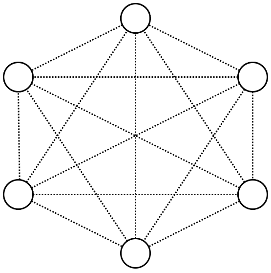
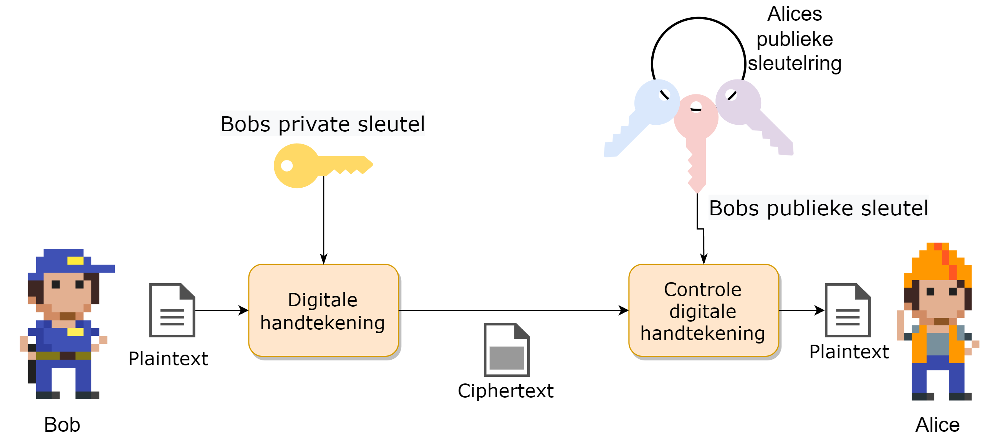
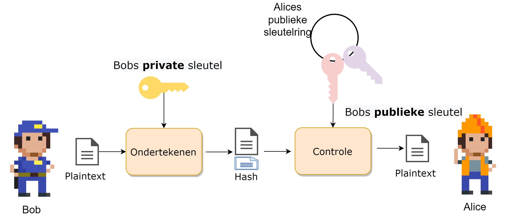
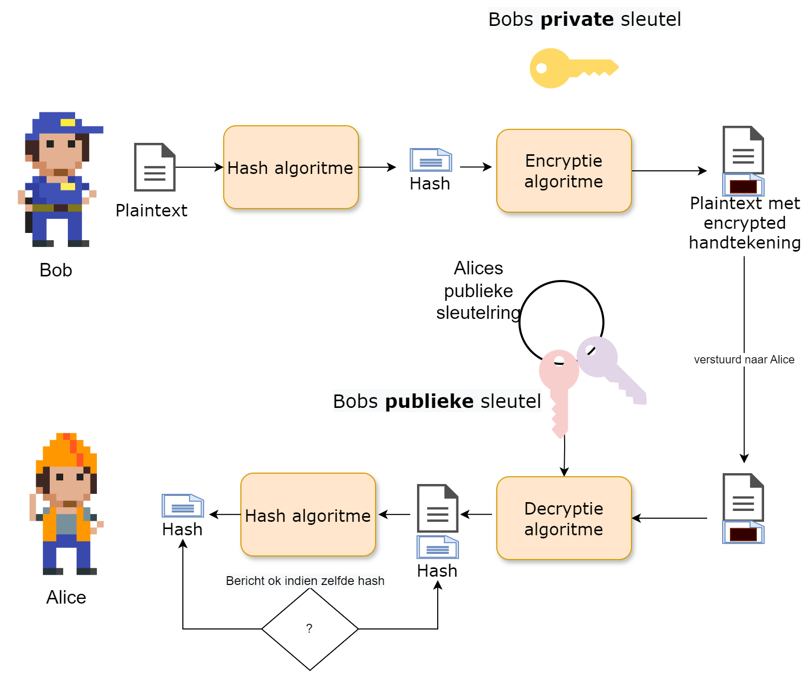
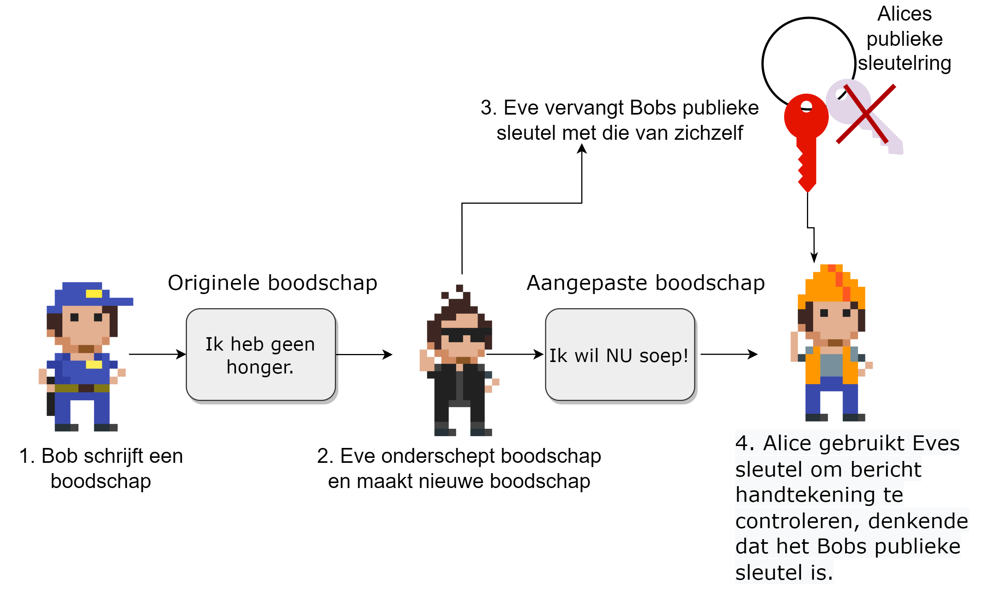
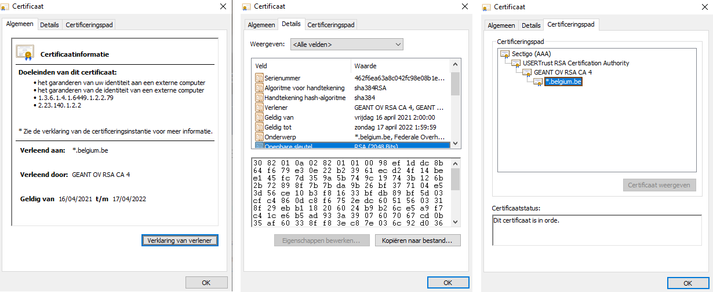
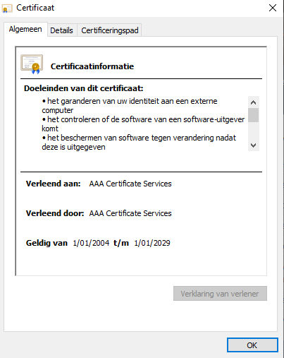
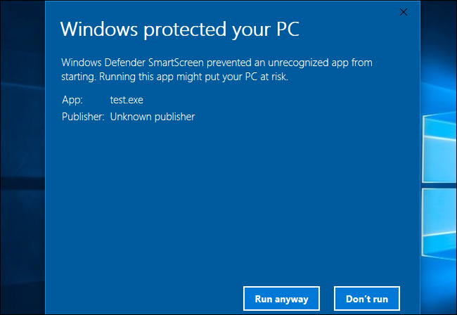
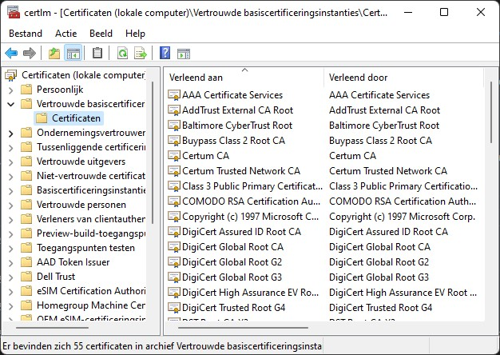

## Het probleem met symmetrische encryptie

Wat als je bij symmetrische encryptie met meerdere mensen wilt communiceren zonder dat iedereen elkaars berichten kan zien? Bob kan onmogelijk dezelfde sleutel gebruiken om met Alfredo te communiceren die hij al gebruikte met Alice. Kortom, je hebt per *eindpunt* een aparte sleutel nodig. Het aantal sleutels dat je nodig hebt, zeker als ook alle gebruikers onderling nog eens willen communiceren wordt snel erg groot. Je kan het aantal benodigde sleutels berekenen met de formule $n * \frac{(n - 1)}{2}$, waarbij ``n`` het aantal gebruikers voorstelt:

* 6 gebruikers vereisen 15 sleutels.
* 7 gebruikers vereisen 21 sleutels.
* 10 gebruikers vereisen er al 45.
* 100 gebruikers vereisen er 4950!

---

## Het probleem met symmetrische encryptie (vervolg)

{ width=40% }

Symmetrische encryptie heeft dus een *key distribution problem* wanneer er encryptie op een grote schaal nodig is. Zeker als we spreken over online communicatie, over het Internet, wordt de schaal ogenblikkelijk gigantisch groot en wordt het *sleutelmanagement* problematisch. Een andere oplossing is dus aan de orde.

---

## Publieke cryptografie

Publieke crypto oftewel **asymmetrische encryptie** zal het probleem met symmetrische encryptie oplossen doordat er gebruikt wordt gemaakt van twee sleutels:

* Eén publieke sleutel.
* Eén private sleutel.

---

## Publieke cryptografie (vervolg)

De publieke sleutel kan iedereen, vrij, gebruiken om versleutelde berichten mee aan te maken. Echter, enkel de eigenaar van de bijhorende private sleutel zal deze berichten kunnen decrypteren. Kortom, we lossen nu een deel van het sleutelprobleem op: iedereen heeft z'n eigen private sleutel (**en moet deze geheim houden!**) en kan via z'n publieke sleutel berichten krijgen.

---

## Publieke cryptografie (vervolg)

De techniek werd in de jaren 70 door Diffie en Hellman ontwikkeld en had een grote impact op de manier waarop beveiligde communicatie op het Internet mogelijk werd maakt.

---

## Publieke cryptografie (vervolg)

::: {.callout-tip}

Je kan publieke encryptie beschouwen als volgt: de publieke sleutel, die niet geheim is, is een openstaande kist. Iedereen kan de kist gebruiken om een geheime boodschap in te plaatsen en vervolgens deze op slot te klikken (*encrypteren*). Enkel de eigenaar van deze kist heeft de bijpassende private sleutel die echter deze kist kan opendoen en de originele boodschap kan lezen (*decrypteren*).
:::

::: {.callout-note}
Enkele van de bekendere publieke cryptosystemen zijn onder andere RSA, DSS en El Gamal.
:::

---

## Dualiteit van publieke cryptografie

Asymmetrische crypto zal niet alleen het sleutel-probleem oplossen, het heeft als extra eigenschap dat het publiek/private sleutelpaar ook dienst kan doen als **digitale handtekening** om te controleren of een boodschap wel degelijk afkomstig is van een specifiek persoon. Hierbij zal een private sleutel gebruikt worden om het digitale bericht te ondertekenen. Daar de ondertekenaar de enige persoon kan zijn die deze private sleutel in z'n bezit heeft, kan men zijn identiteit bevestigen door de bijhorende publieke sleutel te gebruiken. Enkel de bijhorende publieke sleutel zal hiervoor gebruikt kunnen worden en zo hebben we een vorm van integriteit of data authenticatie.

---

## Dualiteit van publieke cryptografie (vervolg)

We zullen dit concept verderop uitwerken, maar eerst gaan we bekijken hoe publieke crypto juist werkt.

---

## Diffie-Hellman sleuteluitwisseling

Dankzij public crypto hebben we nu een systeem om sleutels op een veilige manier uit te wisselen. Het is namelijk zo dat symmetrische crypto sneller is én dus voor (realtime) communicatie interessanter is. We weten echter dat het sleutelmanagement bij symmetric crypto een probleem is als we met grote groepen gebruikers zitten. Het Diffie-Helman sleuteluitwisselingsconcept helpt ons hierbij: het laat toe dat twee gebruikers sleutels over een onveilig kanaal kunnen uitwisselen op een veilige manier.

---

## Diffie-Hellman sleuteluitwisseling (vervolg)

Zowel Bob als Alice genereren eerst een publiek/private sleutelpaar dat ze voor deze sessie wensen te gebruiken voor communicatie. Vervolgens stuurt ieder z'n publieke sleutel naar de ander (wat kan over een onbeveiligd kanaal). De ontvanger zal deze publieke sleutel combineren met de eigen private sleutel wat zal resulteren in een nieuw *shared secret* dat beiden nu kennen en kunnen gebruiken, bijvoorbeeld, als de symmetrische sleutel om verdere communicatie te bestendigen.

---

## Diffie-Hellman sleuteluitwisseling (vervolg)

De reden dat dit werkt, is met dank aan de modulo operator en de eigenschappen ervan. Een voorbeeld:

|   Stap     | Alice                                           | Bob                                            |
| ------ | ----------------------------------------------- | ---------------------------------------------- |
| 1 | Alice kiest een geheim getal A. Ze kiest A= 3   | Bob kiest ook een geheim getal B = 6.          |
| 2 | Alice berekent $7^A\%11$ => $343\%11 = 2$ , genaamd X. | Bob berekent $7^B\%11$ => $11764\%11 = 4$, genaamd Y. |
| 3 | Alice stuurt X=2 naar Bob                           | Bob stuurt Y=4 naar Alice.                        |
| 4 | Alice berekent $Y^A\%11 = 4^3\%11 = 9$.             | Bob berekent $X^B\%11 = 2^6\%11 = 9$.               |

---

## Diffie-Hellman sleuteluitwisseling (vervolg)

Zoals je merkt kunnen nu Alice en Bob het berekende getal **9** als gedeeld geheim gebruiken. Enkel zij kennen dit getal.

::: {.callout-warning}
Uiteraard zullen in de praktijk Bob en Alice véél grotere getallen kiezen dan 3 en 6.
:::

::: {.callout-note}
Dat Bob en Alice de waarden X en Y naar elkaar kunnen sturen is dankzij de eigenschappen van de modulo-berekening.  X en Y kunnen het resultaat zijn van een gigantische hoeveelheid berekeningen en een stroper zal dus veel rekenwerk nodig hebben om alle mogelijkheden te testen.
:::

---

## RSA

Eén van de oudste, maar nog steeds populairste, publieke cryptosystemen is het in 1977 ontwikkelde RSA algoritme. RSA, wat staat voor de achternamen van de drie ontwikkelaars (Rivest, Shamis en Adleman) gebruikt sleutels van 1536 tot 4096 bits lang. Het systeem is vrij traag maar heeft als voordeel dat het veilige sleuteltransmissie toestaat over een onveilig kanaal: we zien daarom vaak RSA gebruikt worden om eerst sessiesleutels uit te wisselen, vervolgens wordt overgeschakeld op een sneller symmetrisch cipher.

---

## RSA (vervolg)

De exacte berekeningen die gebeuren tijdens encryptie en decryptie leiden ons iets te ver, maar volgend voorbeeld toont een vereenvoudigde wijze waarop RSA wordt toegepast:

Data encrypteren met behulp van asymmetrische versleuteling gebeurt op bijna dezelfde wijze als de Diffie-Hellman sleutel uitwisseling. Ook nu zullen beide zijden rekenen op de eigenschappen van de modulo-operator om over een onveilig kanaal veilige communicatie te kunnen doen.

---

## RSA (vervolg)

Eerst dient een publieke sleutel aangemaakt te worden:

* Hiertoe dient Bob twee grote priemgetallen, ``q`` en ``p`` te kiezen, bijvoorbeeld ``p=17`` en ``q=11``.
* Vervolgens berekent Bob ``N`` door deze priemgetallen met elkaar te vermenigvuldigen (``p*q`` geeft 17 * 11, ``N=187``).
* Bob kiest nu nog een priemgetal ``e``, bijvoorbeeld ``7``.
* Bob kan nu zijn eigen geheime, private sleutel ``d`` maken, namelijk $e*d = 1\%((p-1)*(q-1))$ wat dus $7*d=1\%(16*10)$ geeft of  $7*d=1\%160$ .
* Om nu ``d`` te vinden moeten we een getal vinden zodat $7*d$ een veelvoud van $1\%160$ geeft, dus bijvoorbeeld 1, 161, etc. In dit geval vinden we ``d=23``.

---

## RSA (vervolg)

::: {.callout-tip}
Om $d$ te berekenen maken we gebruik van de zogenaamde *Uitgebreid Euclidisch algoritme*, een eeuwenoud algoritme gebaseerd op het *Algoritme van Euclides* dat we in het lager leerden gebruiken om de grootste gemene deler te berekenen van twee getallen.
:::

Bob heeft dus nu:

* Publieke sleutel bestaande uit $N=187$ en $e=7$.
* Private sleutel $d=23$.

Iedereen die nu naar Bob iets wilt sturen, kan dit via z'n publieke sleutel (``N`` en ``e``).

---

## RSA (vervolg)

Stel dat Alice het ASCII-karakter X naar Bob wil sturen:

* De ASCII-waarde van X is 88.
* De encryptie door Alice gebeurt dan als volgt: $C = data^e\%N$.
* De te versturen ciphertext C wordt dus: $(88^7)\%187$ oftewel ``C=11``.

Enkel Bob zal deze ciphertext met zijn private sleutel ``d`` kunnen decrypteren door $C^d(\%N)$ te doen, oftewel $11^{23}\%187$ wat terug de plaintext ``88`` geeft!

---

## RSA (vervolg)

::: {.callout-tip}
De sterkte van publieke crypto stoelt dus op het feit dat ontbinden van (grote) getallen in factoren computationeel veel moeilijker is dan de omgekeerde stap, namelijk twee getallen met elkaar vermenigvuldigen.

15621 in z'n factoren ontbinden is veel moeilijker dan de getallen 123 en 127 vermenigvuldigen (wat dus ook 15621 zal geven).
:::

---

## RSA (vervolg)

Zonder in detail te treden hoe cryptocoins en blockchains werken, is het nuttig om te vermelden dat bij cryptocoins ook de public crypto concepten worden gebruikt. Ook hier is je private sleutel uiterst belangrijk: enkel de eigenaar van de private sleutel "bezit" de bijhorende cryptocoins in de *blockchain*. Daarom is het belangrijk dat je **NOOIT** je private sleutel aan derden geeft, want zo geef je hen toegang tot jouw *coins* en kunnen ze vervolgens deze stelen door de private sleutel te vervangen.

---

## Intermezzo: Hashes

We gaan nu even een zijtak inslaan om het concept "hash" te bespreken. Een hash is een concept uit de informatica dat we gebruiken om te controleren of een digitaal stuk tekst werd aangepast of niet. Door de tekst in een hashfuntie te steken wordt een hash aangemaakt. Deze hash is een stuk code met een vaste lengte, ongeacht de originele input. Wanneer 1 bit of meer wordt aangepast in de originele boodschap dan zal deze in een totaal andere hash resulteren. Enkel dus wanneer een identiek stuk tekst als invoer (tot op bitniveau identiek) wordt gebruikt, zullen twee hashes gelijk zijn.

---

## Intermezzo: Hashes (vervolg)

Voorgaande is uiteraard onmogelijk: daar een hash meestal veel korter is dan de originele boodschap, is het mathematisch mogelijk dat twee totaal verschillende teksten toch dezelfde hash geven. Het is de opdracht van een goede hashfunctie om dit soort **hash collisions** zo klein mogelijk te houden.

{width=60%}

---

## Intermezzo: Hashes (vervolg)

Een hashfunctie is niet omkeerbaar: men mag onmogelijk aan de hand van een hash (ook wel *digest* of *hashcode* genoemd) terug de originele tekst kunnen achterhalen. Een hashfunctie is dus een eenrichtingsfunctie, ook wel afbeelding genoemd in wiskundige termen.

---

## Intermezzo: Hashes (vervolg)

Er bestaan veel verschillende hashfuncties. Enkele van de bekendere zijn:

* MD5, oftewel Message Digest 5: deze zal een 128-bit hashwaarde genereren.
* SHA-X, oftewel Secure Hash Algorithms. Zo is er SHA-256 wat een 256 bits hash zal genereren.

De sterkte van een hash algoritme zit hem in de grootte van de kans waarop hash collisions kunnen optreden. Zo zijn er bij MD5 al veel meer collisions gevonden dan bijvoorbeeld bij het recenter gepubliceerde SHA3-512 algoritme.

**Een digitale hash is dus een ideaal middel om boodschappen digitaal te ondertekenen.**

---

## Boodschappen ondertekenen

Een probleem bij online communicatie is dat we geen zekerheid hebben dat het ontvangen bericht wel degelijk van de persoon komt van wie we verwachtten dat deze het bericht had opgesteld. We kunnen daarom het publieke crypto systeem gebruiken om berichten te ondertekenen. Daar enkel Bob de bijhorende private sleutel kan hebben die bij z'n publieke sleutel hoort, is het bezit van deze private sleutel hebben het bewijs dat hij de rechtmatige eigenaar van een bepaalde publieke sleutel is.

---

## Boodschappen ondertekenen (vervolg)

Onder andere RSA laat toe om een digitale handtekening (**digital signature**) te plaatsen bij een bericht om zo te bewijzen dat de verzender de rechtmatige eigenaar van een bijhorende publieke sleutel is.

Een digitale handtekening wordt als extra bericht achteraan de te versturen boodschap geplaatst. De signature is als het ware een hash berekend aan de hand van de private sleutel. De ontvanger zal nu met de bijhorende publieke sleutel van de verzender kunnen verifiëren of de bijhorende private sleutel werd gebruikt om de handtekening te genereren.

---

## Boodschappen ondertekenen (vervolg)

---

## Boodschappen ondertekenen (vervolg)

Om een digitale handtekening te berekenen moeten we eerst een hash van het bericht berekenen. We gebruiken hier bijvoorbeeld MD5 of één van de SHA-algoritmes voor. Deze hash gaan we nu "verpakken" met de private sleutel.

Stel dat we willen versturen ``35`` is en we hebben reeds volgende sleutelpaar berekend ([bron](HTTPS://crypto.stackexchange.com/questions/11117/simple-digital-signature-example-with-number)):

* publieke sleutel: $e=5$ en $n=91$.
* private sleutel: $d=29$.

---

## Boodschappen ondertekenen (vervolg)

De handtekening wordt berekend door: $s=m^d\%n$ oftewel $s=35^{29}\%91$ wat ``42`` geeft.

We versturen dus naar de ontvanger de boodschap zelf en de bijhorende handtekening: ``35,42``.

---

## Boodschappen ondertekenen (vervolg)

De ontvanger kan nu controleren of de ontvangen boodschap klopt of niet. Hij zal zijn eigen hash genereren van de ontvangen boodschap. Als deze overeen komt met de hash die bij de boodschap zat, is alles in orde. Om de handtekening te decrypteren gebruikt de ontvanger ``e`` en berekent: $42^e == 35^n$, als dit overeenkomt dan weet de ontvanger dat hij het bericht kan vertrouwen.

{width=80%}

---

## Het probleem met digitale handtekeningen

We hebben echter een probleem. Hoe weet je eigenlijk dat je wel de juiste publieke sleutel gebruikt? Publieke sleutels zijn, wel, publiek. Iedereen kan jou een publieke sleutel geven en zeggen *"Dit is de sleutel van persoon X"* zonder dat jij kan controleren of dat zo is.

---

## Het probleem met digitale handtekeningen (vervolg)

We kunnen daarom als kwaadwillig persoon bijvoorbeeld een legaal bericht onderscheppen, aanpassen en dan vervolgens ondertekenen met onze eigen handtekening. Als we vervolgens aan de ontvanger kunnen wijsmaken dat jouw publieke sleutel zogezegd bij de originele verzender hoort, dan zal de ontvanger jouw aangepaste bericht "geloven".

---

## Het probleem met digitale handtekeningen (vervolg)

Kortom, we hebben een manier nodig om de **identiteit van de eigenaar** van een publieke sleutel te verifiëren. Kom binnen: **certificaten**.

---

## Digitale certificaten

Een certificaat is een (digitaal) document dat de identiteit van een gebruiker bindt aan een publieke sleutel. Dit document werd digitaal ondertekend door een vertrouwde derde partij (**trusted third party**) zodat bij twijfel van de echtheid van het certificaat men altijd bij deze derde partij terecht kan. Uiteraard is het belangrijk dat we deze derde partij kunnen vertrouwen, anders kunnen we ook niet het certificaat vertrouwen die zij onderschrijven.

::: {.callout-tip}
Certificaten worden beschreven in de **X.509** standaard.
:::

---

## Digitale certificaten (vervolg)

Om een certificaat aan te maken dient Bob naar een **Registration authority** (RA) te gaan die zijn identiteit zal verifiëren. Dit gebeurt aan de hand van de typische documenten die ook buiten het Internet worden gebruikt om iemands identiteit te bewijzen: identiteitskaart, paspoort, rijbewijs, etc. In sommige gevallen zal de RA zelfs eisen dat Bob zich naar een fysiek kantoor begeeft om daar z'n identiteit *in the flesh* te bewijzen. Indien de RA de identiteit heeft bevestigd zal deze de aanvraag van Bob doorsturen naar een **Certification authority** (CA), inclusief Bobs publieke sleutel, die een certificaat zal aanmaken én ondertekenen.

---

## Digitale certificaten (vervolg)

::: {.callout-tip}
Het gehele systeem van CA's, RA's, etc. dat bestaat om certificaten uit te geven, beheren en bewijzen heet een **Public Key Infrastructure** (**PKI**).
:::

---

## Digitale certificaten (vervolg)

De CA zal deze informatie gebruiken om een certificaat, van een bepaalde levensduur, te genereren. Hierbij zal de echtheid van het certificaat achteraf bewezen kunnen worden door de CA:

* Het certificaat is een geëncrypteerde hash van Bobs publieke sleutel, informatie over de CA en over Bob. De encryptie van de hash gebeurt aan de hand van de private sleutel van de CA.
* Om later de echtheid van een certificaat te testen voldoet het om dezelfde hash te genereren (publieke sleutel, info over Bob en CA) en deze te vergelijken met het certificaat na decryptie met de publieke sleutel van de CA. Als deze gelijk zijn weten we dat het certificaat door de gegeven CA werd ondertekend (enkel hun publiek/private sleutelpaar zal terug de originele hash geven).

---

## Digitale certificaten (vervolg)

Voorgaande proces zal bijvoorbeeld plaatsvinden wanneer je browser via een **HTTPS** verbinding surft naar een website en zo wil controleren of wel degelijk met de website wordt gecommuniceerd en niet met een imposter. Indien de browser (of de gebruiker) twijfelt aan de echtheid van de publieke sleutel van de CA die het certificaat van de website ondertekent, dan zal het voorgaande proces zich herhalen, maar deze keer om het certificaat van de CA te controleren met behulp van een bovenliggende CA. Op die manier kan het dus zijn dat een keten van CA's ontstaan die telkens CA's onder zich bewijzen. Uiteraard zal er steeds bovenaan zo'n ketting een **root CA** staan. Als je die vertrouwt, dan kan je al de CA's er onder dus ook vertrouwen...maar ook vice versa!

---

## Digitale certificaten (vervolg)

{width=80%}

::: {.callout-note}
Alhoewel **HTTPS** al sinds 1995 bestond, werd het tot voor kort amper door websites aangeboden. Nochtans geeft HTTPS een extra defensielaag tijdens de communicatie van jouw computer met die waar een website op *gehost* staat. HTTPS zal namelijk je communicatie versleutelen zodat enkel zender en ontvanger kunnen lezen wat er gezegd wordt. Met HTTP is dat niet: al je communicatie kan door eender wie gelezen worden die zich tussen jouw computer en je eindbestemming nestelt. Het helpt echter niet dat je data versleuteld wordt als je niet kan bevestigen dat de ontvangende website ook effectief diegene is die je nodig hebt, vandaar dat dus certificaten en HTTPS in tandem werken om gebruikers een veiliger Internet aan te bieden.

Pas in 2017 boden meer dan de helft van de websites wereldwijd HTTPS aan. In 2021 gebruikt ongeveer 70% van alle websites HTTPS als standaard communicatiemiddel aan (vroeger waren er al websites met HTTPS, maar HTTP was de standaard oplossing).
:::

---

## Digitale certificaten (vervolg)

Het ergste dat voor een CA kan voorvallen is dat de betrouwbaarheid van de CA in het gedrang komt. Als een CA bijvoorbeeld weet heeft van een potentiële inbraak op zijn systemen dan bestaat er de kans dat aanvallers de private sleutel van de CA hebben bemachtigd en dus zelf certificaten *op naam van de CA* kunnen genereren, met alle gevolgen van dien! Indien dus deze kans bestaat, is er een *breach of trust* en zullen alle certificaten van deze CA als ongeldig worden bestempeld, inclusief alle certificaten van sub-CA's! Dit kan verregaande gevolgen hebben.

{width=60%}

---

## Certificaten bekijken

In iedere moderne browser kan je snel bekijken hoe zo'n certificaat er juist uitziet. Als je via een HTTPS verbinding naar een website surft, dan op het slotje naast de URL in de adresbalk klikt kan je doorklikken om het certificaat te openen. Als je naar *HTTPS://www.belgium.be* surft en dit doet dan krijg je eerst wat samenvattende informatie:

---

## Certificaten bekijken (vervolg)

Zo zien we onder andere de geldigheidsduur, alsook de CA die dit certificaat heeft gegenereerd.  Onder details kunnen we onder andere de publieke sleutel zien van de website alsook de gebruikte algoritmes voor de hash, e.d.

En op de laatste tab, Certificeringspad, zien we de chain of trust. We kunnen vervolgens hier de bovenliggende certificaten bekijken.

---

## Certificaten bekijken (vervolg)

Het certificaat van Sectigo is uiteraard een **selfsigned certificate**, daar zij "bovenaan de hiërarchie staan". Als we Sectigo niet vertrouwen dan kunnen we ook de communicatie met *belgium.be* niet vertrouwen.

{width=40%}

---

## Persoonlijke certificaten

Naast certificaten voor webservers (zogenaamde **SSL certificaten**) kan je ook een persoonlijk certificaat aankopen om je eigen identiteit aan derden te bewijzen tijdens bijvoorbeeld e-mail-communicatie. Voorts heb je ook **code signing** certificaten die de echtheid van een applicatie bewijzen zodat je zeker bent dat je geen malware installeert als je programma X hebt gedownload.

---

## Persoonlijke certificaten (vervolg)

Als je in Windows 10 of nieuwer een applicatie of installer probeert uit te voeren dan zal de ingebouwde *SmartScreen* service ogenblikkelijk de echtheid (of ontbreken van) het certificaat controleren, net zoals dit ook in de browser zou gebeuren.

{width=40%}

---

## Persoonlijke certificaten (vervolg)

Wil dat dan zeggen dat je applicaties niet kunt vertrouwen die door Smart Screen als onveilig worden aangeduid? Neen, dat niet. Je mag niet vergeten dat een certificaat geld kost en dat niet alle software-ontwikkelaars de middelen hebben om een officieel certificaat te kopen. Het loont dus altijd om extra waakzaam te zijn wanneer Smart Screen een waarschuwing geeft, maar het is dus niet zo dat de software automatisch als onveilig moet gehanteerd worden.

---

## Persoonlijke certificaten (vervolg)

::: {.callout-tip}
Je kan via de Certification Manager van Windows bekijken welke certificaten je lokaal hebt geïnstalleerd, welke worden vertrouwd, etc. Je kan de GUI-versie van deze tool opstarten door "certlm.msc" uit te voeren.

{width=40%}

:::

---

## HTTPS en TLS

Certificaten vormen het hart van een veilige manier van surfen. HTTPS, "HTTP-Secure", zorgt ervoor dat de communicatie tussen je browser en de website via een beveiligde, geëncrypteerde tunnel gebeurt. Tegenwoordig is HTTPS de default manier om een website te benaderen, maar dat is maar recent. Vroeger gebeurde alles via HTTP, waardoor iedereen die jouw trafiek kon sniffen, kon zien welke informatie je met de website uitwisselde.

---

## HTTPS en TLS (vervolg)

HTTPS is een protocol dat een beveiligde encryptietunnel opzet tussen jou en de website waarover vervolgens gewoon HTTP-verkeer kan verlopen (dit gebeurt over poort 443 in plaats van de klassieke poort 80 waarover HTTP verloopt). Deze tunnel wordt opgezet door het **TLS**-protocol, het *Transport Layer Security* protocol, dat de opvolger is van **SSL** (*Secure Sockets Layer*). TLS gebruikt certificaten om te vergewissen dat de website aan de andere zijde wel degelijk de website is die de gebruiker verwacht. Het doet dit door de publieke sleutel van de website eerst te controleren voor het vervolgens deze sleutel gebruikt om een gemeenschappelijke sleutel af te spreken die zal dienst doen als de encryptie-sleutel voor de gemeenschappelijke tunnel. Vanaf dit punt kunnen derden de trafiek van en naar de website niet meer sniffen.

---

## HTTPS en TLS (vervolg)

Samengevat: **HTTPS is de combinatie van HTTP en een veilige encryptietunnel die met behulp van het TLS protocol wordt opgezet.**

{}

---

## HTTPS en TLS (vervolg)

Samengevat zal dus TLS twee zaken doen:

1. Door middel van een certificaat (asymmetrische crypto) wordt de identiteit (de publieke sleutel) van de website gecontroleerd.
2. Door middel van een afgesproken algoritme (Diffie-Hellman, Forward Secrecy, Elliptic Curve, etc.) een gemeenschappelijke sleutel(s) afspreken en uitwisselen.

::: {.callout-tip}
Zoals reeds eerder vermeld is asymmetrische crypto trager, waardoor het altijd aanbevolen is om de trafiek tussen 2 punten finaal via een symmetrische crypto verbinding te laten plaatsvinden. TLS/HTTPS combineert met andere woorden de sterktes van beide soorten crypto om zo de zwaktes van beiden te neutraliseren.
:::

---

## HTTPS en TLS (vervolg)

De manier waarop een TLS-verbinding wordt opgezet is vrij uitgebreid. Volgende briljante website ([tls.ulfheim.net/](HTTPS://tls.ulfheim.net/)) visualiseert de berichten die server en client uitwisselen om zo'n verbinding te starten, onderhouden en eindigen.

::: {.callout-warning}
Alhoewel HTTPS onze verbinding een pak veiliger maakt, heeft het voor je ISP (Internet Service Provider, bijvoorbeeld Telenet of Proximus) en de website ook enkele nadelen. Omdat alle informatie geëncrypteerd wordt heeft de ISP geen enkel idee wat voor informatie je aan het uitwisselen bent, waardoor caching ook niet meer mogelijk is. In een normale HTTP-omgeving kan een ISP trafiek over het Internet uitsparen door een reeds bewaarde versie van hetgeen jij nodig hebt uit de cache te halen en naar je te sturen. Ook de website naar waar je surft, ondervindt dit nadeel: het zal met HTTPS veel meer trafiek genereren dan wanneer de tussenliggende ISP een deel van het werk via zijn caching overnemen.
:::

---

## Mitmproxy

*Mitmproxy* is een krachtige linux-tool die een man-in-the-middle aanval op HTTPS toelaat. Het zal ervoor zorgen dat een aanvaller zich tussen jou en het Internet kan nestelen en vervolgens doen alsof al je HTTPS-verbindingen veilig blijven. In de praktijk zorgt mitmproxy ervoor dat alle HTTPS-verbindingen van de client naar de aanvaller gebeuren, die op zijn beurt TLS tunnels zal opzetten met de website waar het slachtoffer naar surft. Hierdoor kan de aanvaller enerzijds alle trafiek lezen, maar bijvoorbeeld ook ongezien aanpassen.

{width=90%}

---

## Mitmproxy (vervolg)

De aanvaller zal echter nog steeds geen geldige certificaten kunnen genereren waardoor moderne browsers normaal gezien hier een waarschuwing zouden moeten geven.

{width=70%}
