## Wat leer je in dit hoofdstuk?

Na dit hoofdstuk kan je:

* **beveiligingsproblemen** van draadloos vs bedraad uitleggen
* concreet beschrijven waarom **WEP fundamenteel gebroken is**
* de evolutie **WEP → WPA1 → WPA2 → WPA3** technisch motiveren
* **personal vs enterprise mode** (802.1X) kiezen voor een gegeven context
* de impact van **KRACK** kaderen + uitleggen waarom **forward secrecy** telt

---

## Wifi: vrijheid met een prijskaartje

* **IEEE 802.11b** (1999) → revolutie in draadloos werken
* Vrijheid voor gebruikers = **nachtmerrie** voor cyberboswachters
* Netwerkkabel = intrinsieke beveiliging (fysieke toegang nodig)
* Wifi = bedrijfsnetwerk beschikbaar in een straal van **tientallen meters**

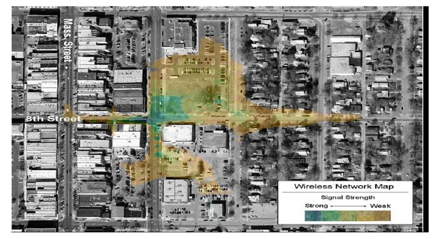{ width=60% }

---

## Wardriving

:::: {.columns}

::: {.column width="70%"}
* Rondrijden en scannen naar draadloze netwerken
* Focus op netwerken met **geen of zwakke** beveiliging
* Term komt van *wardialing* (film **Wargames**, 1983)
:::

::: {.column width="30%"}
{ width=100% }
:::

::::

---

## Problemen met wifi

| Probleem | Beschrijving |
|---|---|
| **Eavesdropping** | Iedereen kan "zien" wat door de lucht vliegt |
| **Invasion** | Eenvoudig verbinden zonder beveiliging |
| **MITM** | Man-in-the-middle aanvallen |
| **Backdoor** | **Rogue access points** door goedbedoelde werknemers |
| **DoS** | Frequentieband vullen met ruis → niemand kan communiceren |

---

## Rogue access points

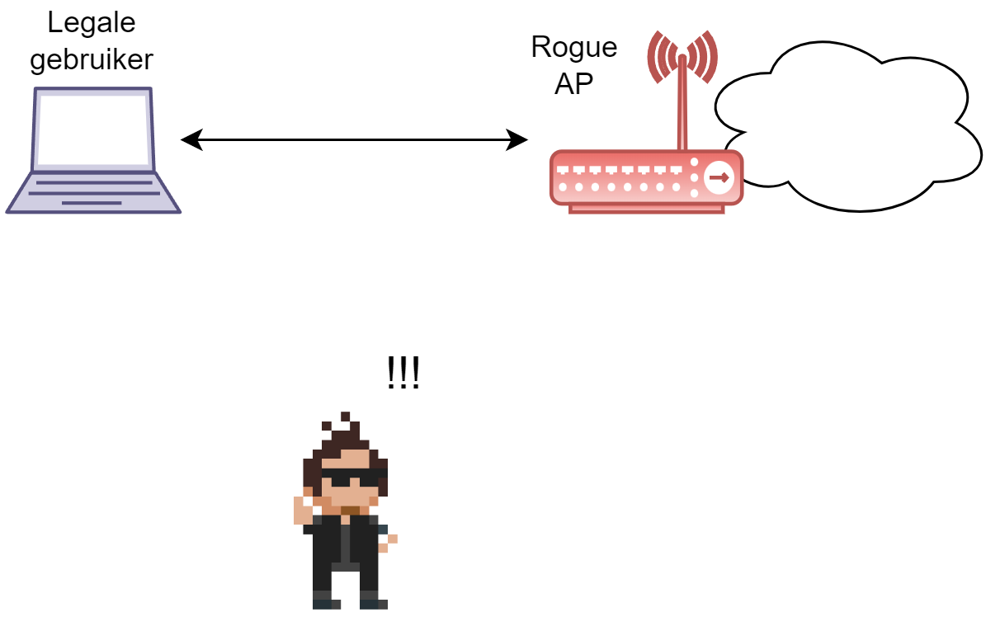{ width=60% }

::: {.callout-warning .fragment}
Eén zwak beveiligd AP tussen tientallen goed beveiligde → de aanvaller kiest het **zwakste punt**.
:::

---

## DoS op fysiek niveau

* Wifi = communicatie over **frequentiebanden** (2.4 GHz / 5 GHz)
* Apparaten gebruiken **CSMA/CA** (Collision Avoidance): eerst luisteren, dan zenden
* Aanvaller vult de frequentieband met **ruis** → legale gebruikers geblokkeerd

::: {.callout-note .fragment}
Bedraad: **CSMA/CD** (Collision Detection). Draadloos: botsingen in de lucht zijn **ondetecteerbaar** → daarom Collision **Avoidance**.
:::

---

## Onbeveiligde managementframes

* Management frames = frames voor netwerkcommunicatie-beheer
  * Verbinding maken, SSID broadcasten, handover, ...
* In de 802.11 standaard: **zonder enige beveiliging** (geen CIA!)
* Overgenomen van bedrade netwerken waar fysieke beveiliging volstond

---

## Aanvallen via managementframes

| Aanval | Werkwijze |
|---|---|
| **Disassociation flooding** | Fake "verlaat het netwerk" frames → DoS |
| **Identity spoofing** | MAC-adres spoofen → sessie overnemen |
| **Impersonation** | Fake AP opzetten → **MITM-aanval** |

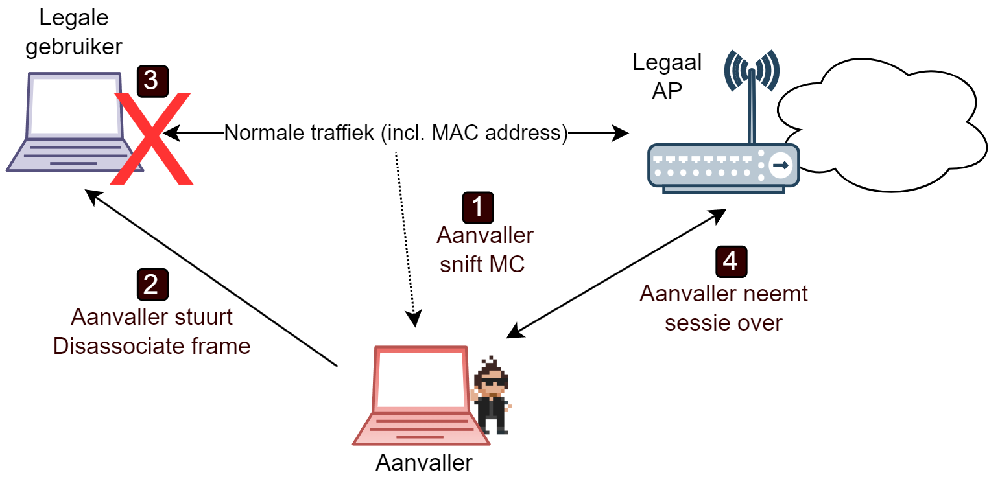{ width=60% }

---

## Fake access points

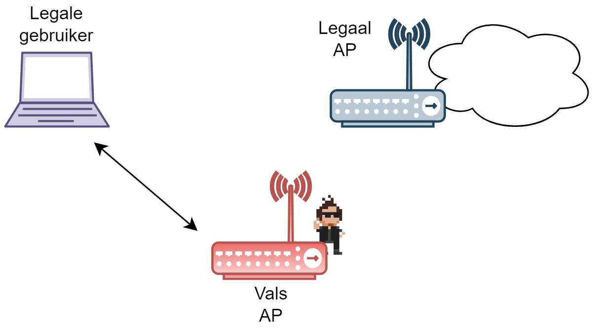{ width=60% }

::: {.callout-tip .fragment}
De Linux-tool *AirSnarf* laat toe om fake hotspots op te zetten. Klassiek voorbeeld: een fake **Telenet Wi-Free** hotspot met geclonede loginpagina → wachtwoorden stelen!
:::

---

## Verbinden met een wifi-netwerk

Vier stappen:

1. **Scannen**: netwerken in de buurt ontdekken (**SSID** = netwerknaam)
2. **Verbinden** (*joining*): fysieke parameters instellen (kanaal, snelheid)
3. **Authenticatie**: bewijzen dat je toegang hebt
4. **Associatie**: association ID toewijzen → netwerk is bruikbaar

::: {.callout-warning .fragment}
SSID-broadcasting uitschakelen = **snake oil**! Het SSID zit in vele andere pakketjes. Een wifi-hacker plukt het er zo uit.
:::

---

## Authenticatie-methoden (802.11)

| Methode | Werkwijze |
|---|---|
| **Open-system** | Geen authenticatie: client vraagt → AP zegt "welkom" |
| **Shared-key** | Challenge-response met WEP-sleutel |
| **MAC-ACL** | Whitelist van MAC-adressen (niet in standaard) |

::: {.callout-note .fragment}
Origineel: **geen mutual authentication** → gebruiker kan verbinden met een fake AP!
:::

---

## Shared-key authentication

1. AP stuurt random **challenge** (plaintext)
2. Client encrypteert met **WEP-sleutel** → stuurt **response** terug
3. AP decrypteert en vergelijkt → match = toegang

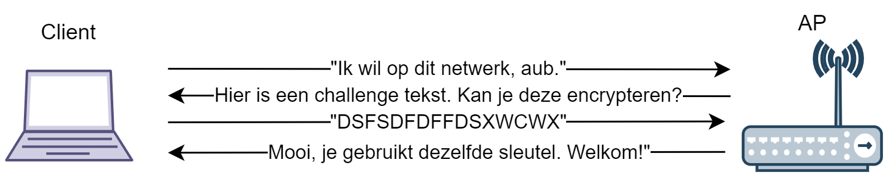

::: {.callout-warning .fragment}
Aanvaller die dit snifft ziet **plaintext + ciphertext** → *gekende plaintext aanval*!  Ironisch genoeg is open-system authentication **veiliger**.
:::

---

## WEP: Wired Equivalent Privacy

:::: {.columns}

::: {.column width="55%"}
* Belofte: even veilig als een bedraad netwerk
* Hart: **RC4** streamcipher
* WEP-sleutel = seed voor keystream
* Keystream $\oplus$ frame = ciphertext
* **Optioneel** — veel netwerken gebruikten het niet eens
:::

::: {.column width="45%"}
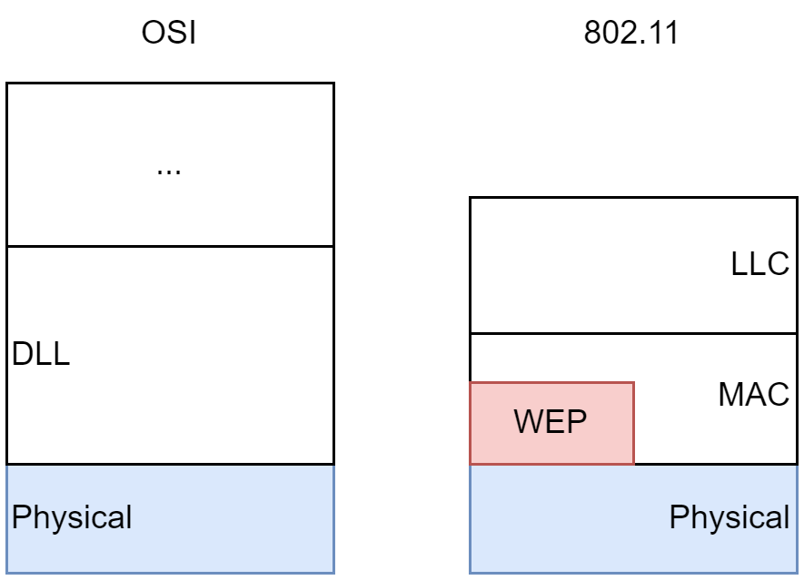{ width=100% }
:::

::::

---

## WEP: encryptie en integriteit

:::: {.columns}

::: {.column width="50%"}
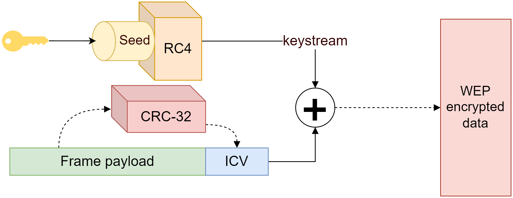{ width=100% }
:::

::: {.column width="50%"}
* **CRC-32** genereert een **ICV** (Integrity Check Value)
* ICV wordt mee geëncrypteerd door RC4
* Aanpassen van frame → ICV ongeldig (in theorie...)
:::

::::

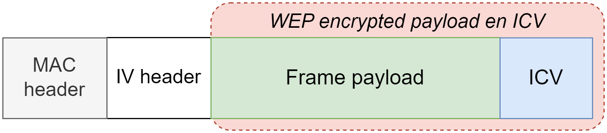{ width=70% }

---

## De Initialisatie Vector (IV)

* Probleem: zelfde sleutel → zelfde keystream voor elk frame
* Oplossing: **24-bit IV** als extra seed per frame
  * **WEP-sleutel + IV** = nieuwe seed per frame
* IV wordt als **plaintext** in de header meegestuurd (ontvanger moet hem kennen)

::: {.callout-tip .fragment}
Dit concept van een sleutel verlengen met een getal heet **salting** — kennen we ook van het authenticatie-hoofdstuk.
:::

---

## WEP: encryptie en decryptie

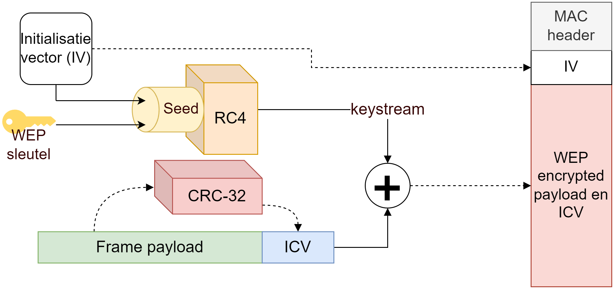

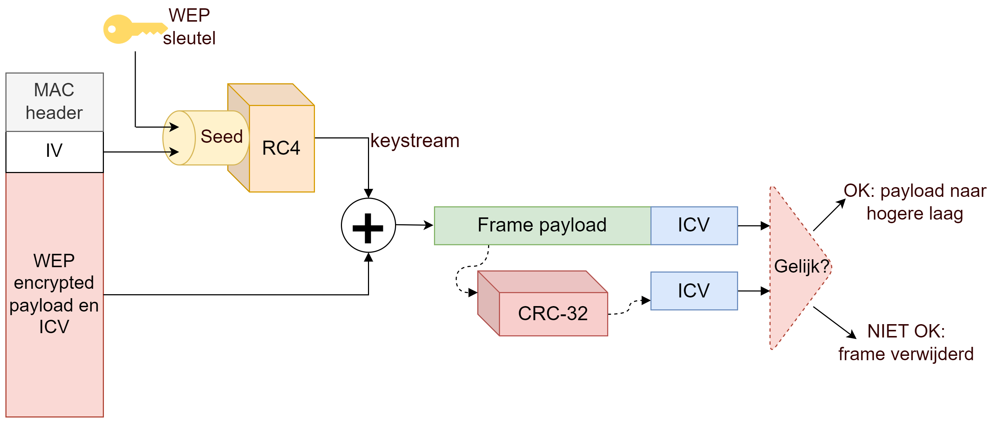

---

## Hoe WEP faalde: 5 problemen

| # | Probleem | Gevolg |
|---|---|---|
| 1 | **RC4** niet geschikt voor datagramnetwerk | Geen random access, geen sleutelhergebruik |
| 2 | **IV** te klein en slecht gespecificeerd | Weak keys, collisions |
| 3 | **CRC-32** is lineair | Bitflip aanvallen mogelijk |
| 4 | **Geen sleutelmanagement** | Geen re-keying, geen centraal beheer |
| 5 | **Geen replay protection** | Aanvaller kan pakketjes onbeperkt heruitzenden |

---

## Probleem 1: RC4 in een datagramnetwerk

**Geen random access:**

* Verlies van 1 bit → **alle bits erna ook verloren** (streamcipher!)
* Beide zijden moeten resetten → inefficiënt
* AES heeft dit probleem **niet** (blockcipher = random access)

---

## Probleem 1: geen sleutelhergebruik

**Dezelfde sleutel 2x gebruiken bij een streamcipher is fataal!**

Twee ciphertexts met dezelfde keystream:

$(p_i \oplus k_i) \oplus (q_i \oplus k_i) = p_i \oplus q_i$

* De **sleutel valt weg**!
* Als één plaintext gekend is → de andere is triviaal te berekenen

::: {.callout-important .fragment}
WEP probeert dit op te lossen met de IV... maar ook dat gaat fout.
:::

---

## Probleem 2: IV — Weak keys (FMS-aanval)

* Paper van Fluhrer, Mantin & Shamir (2001):
  * Sommige IV's zorgen voor **sleutel-lekkage** naar de keystream
  * ~60 weak keystreams capteren → **WEP-sleutel achterhalen**
* Eerste 2 bytes plaintext altijd gekend (LLC header begint met **0xAA**)
  * $k_i = c_i \oplus p_i$ → keystream is gekend!

::: {.callout-tip .fragment}
Tools: **Airsnort** en **WEPCrack** implementeren de FMS-aanval.
:::

---

## Probleem 2: IV — Collisions

* 24-bit IV → $2^{24}$ = 16.777.216 mogelijke waarden

Bij 11 Mbps en 1500-byte frames:

$$\frac{16.777.216}{916\;pakketten/s} \approx 18.302\;s \approx 5\;uur$$

::: {.callout-warning .fragment}
Na **~5 uur** zijn alle IV's op → collisions gegarandeerd!
:::

---

## IV collisions misbruiken

:::: {.columns}

::: {.column width="50%"}
**Passieve aanval:**

* Meeluisteren tot IV collision
* Twee pakketten met zelfde IV XOR'n
* $\Rightarrow$ XOR van beide plaintexts
* IP trafiek is voorspelbaar → cryptanalyse
:::

::: {.column width="50%"}
**Actieve aanval:**

* Gekende plaintext van buitenaf naar AP sturen (bv. ping)
* Ciphertext sniffen
* $k_i = c_i \oplus p_i$ → keystream!
:::

::::

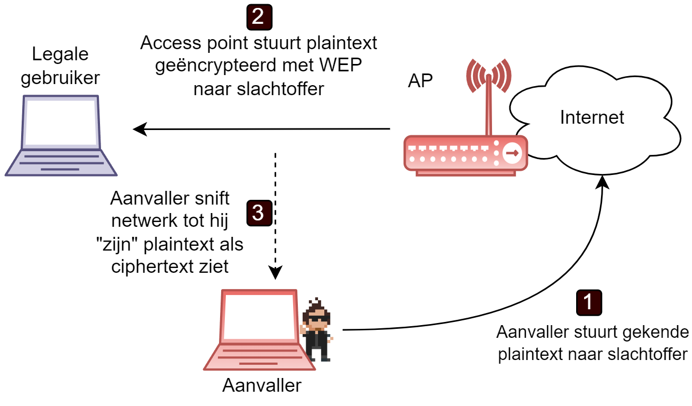{ width=60% }

---

## Keystreams laten groeien

* Geen replay protection → aanvaller kan keystreams **byte per byte groeien**
* Ping met 1 byte extra + willekeurige byte achter de keystream
* Reactie? → juiste byte gevonden! Geen reactie? → volgende byte proberen

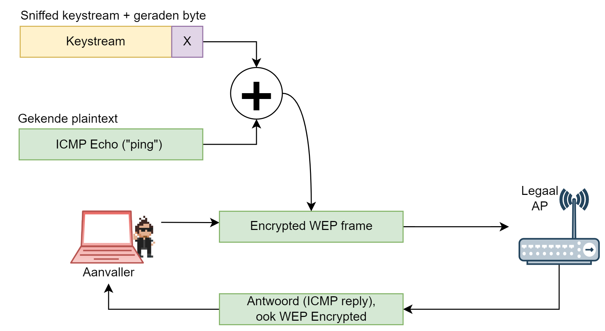{ width=70% }

---

## Probleem 2: IV selectie strategieën

De standaard zei enkel: *"geregeld updaten"* → fabrikanten kozen zelf:

| Strategie | Probleem |
|---|---|
| **Vast IV** | Collision bij **2e pakket** al! |
| **Willekeurig IV** | **Verjaardagenparadox**: 50% kans op collision na ~5000 pakketten |
| **Incrementeel IV** | Collision zodra een **2e apparaat** op het netwerk komt |

::: {.callout-note .fragment}
**Verjaardagenparadox**: bij 23 mensen is er >50% kans dat twee dezelfde verjaardag hebben. Bij ~5000 pakketten met random 24-bit IV: >50% kans op collision.
:::

---

## Probleem 3: CRC-32 en de bitflip aanval

* CRC-32 is een **lineaire functie**:
  * $CRC(m_1) \oplus CRC(m_2) = CRC(m_1 \oplus m_2)$
* Gevolg: je kunt een pakket **aanpassen** zonder de CRC te breken!

**Bitflip aanval:**

1. Capteer **1 geldig WEP frame**
2. Maak een **bitflip masker** (XOR met payload)
3. Bereken nieuwe **geldige ICV** via de lineariteit van CRC
4. AP accepteert het corrupte frame → genereert **foutboodschap**
5. Foutboodschap is gekend → $k = c \oplus p$ → **keystream!**

---

## Bitflip aanval: visualisatie

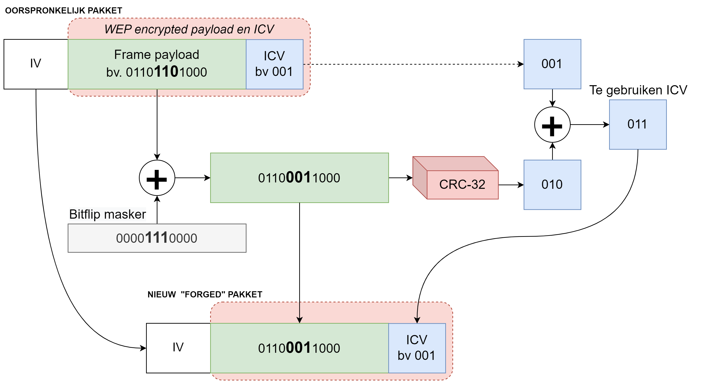

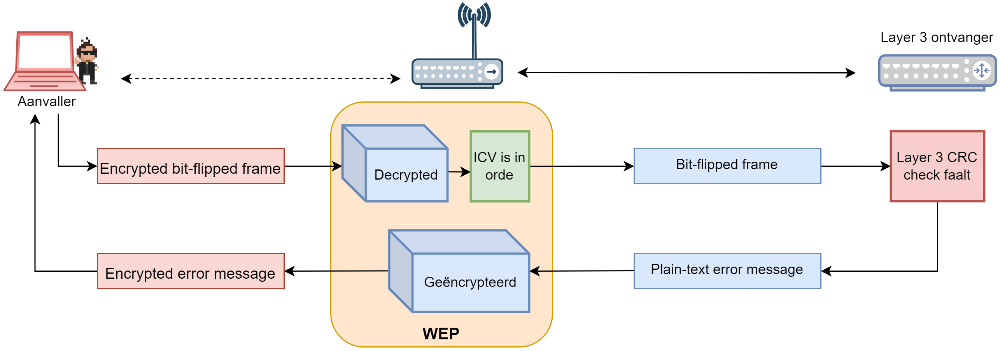{ width=70% }

---

## Probleem 4: sleutelmanagement

* Constant **dezelfde WEP-sleutel** op alle apparaten, dagenlang
* Ontslagen werknemer? → potentiële **sleutel-lekkage**
* Administrators moeten **manueel** sleutels vervangen

Twee ontbrekende zaken:

1. **Geen geautomatiseerd re-keying** mechanisme
2. **Geen gecentraliseerd sleutelbeheer**

::: {.callout-note .fragment}
Bart Preneel (KUL/COSIC): *"WEP is het perfecte schoolvoorbeeld van wat er fout loopt wanneer je zelf een crypto-algoritme ontwikkelt."*
:::

---

## WEP oplossen: twee pistes

Rond **2001**: miljoenen WEP-apparaten in gebruik → oplossing nodig!

| Piste | Doel |
|---|---|
| **WPA1** | Tijdelijke oplossing, compatibel met bestaande hardware (firmware update) |
| **WPA2** | Ultieme oplossing, volledig nieuwe protocollen, nieuwe hardware vereist |

Beide met twee modes:

* **Personal** (PSK): gedeelde sleutel voor thuisgebruik
* **Enterprise** (802.1X): centraal sleutelbeheer voor bedrijven

---

## Overzicht: WEP → WPA1 → WPA2

| Standaard | Encryptie | Integrity | Auth & sleutelbeheer |
|---|---|---|---|
| **WEP** | RC4 | CRC-32 | Geen |
| **WPA1-Personal** | TKIP | Michael | Pre-shared key |
| **WPA1-Enterprise** | TKIP | Michael | 802.1X |
| **WPA2-Personal** | CCMP | CBC-MAC | Pre-shared key |
| **WPA2-Enterprise** | CCMP | CBC-MAC | 802.1X |

---

## WPA1: beperkingen

WPA1 = wrapper rond WEP, rekening houdend met:

* Miljoenen bestaande apparaten → moet via **firmware update** werken
* AP's draaiden al op **maximale capaciteit** → minimale overhead
* RC4 is deels **hardwired** in de hardware → vasthangen aan WEP

---

## 802.1X: Enterprise-mode

:::: {.columns}

::: {.column width="55%"}
* (Mutual) **authentication**
* **Centraal user management** (RADIUS server)
* Veilige **sleuteluitwisseling**
* AP = **doorgeefluik** tussen client en authenticatie-server
:::

::: {.column width="45%"}
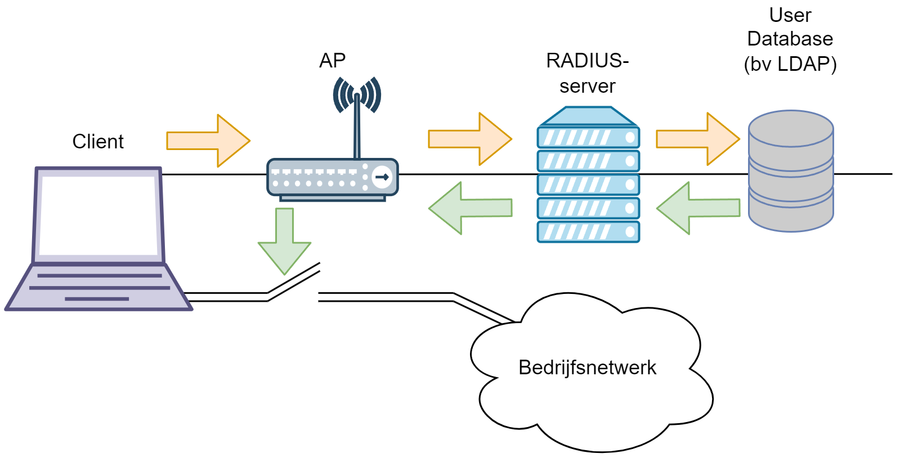{ width=100% }
:::

::::

---

## 802.1X: EAP framework

* 802.1X = **framework**, geen algoritme
* Verschillende **EAP-methoden** in te pluggen:

| Methode | Werkwijze |
|---|---|
| **EAP-TLS** | TLS tunnel + **certificaat**-authenticatie |
| **EAP-TTLS** / PEAP | TLS tunnel + **username/wachtwoord** (geen client-certificaat nodig) |

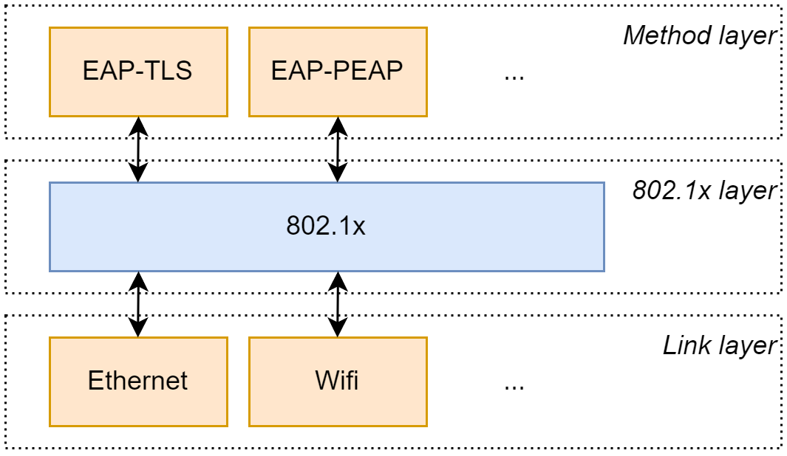{ width=40% }

---

## 802.1X: authenticatie-flow

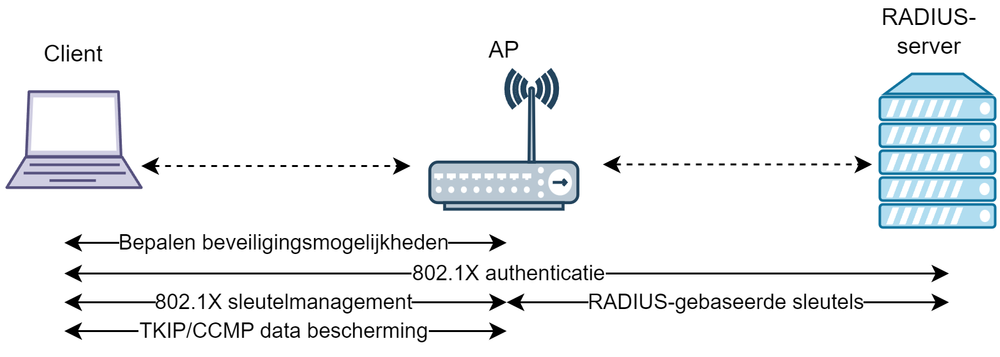{ width=65% }

1. Client en AP kiezen **EAP-methode**
2. AP = doorgeefluik naar **authenticatie-server**
3. Server genereert **sleutels** → naar AP
4. AP beheert sleutels en **ververst** ze tijdens sessie
5. Client krijgt **toegang**

---

## 802.1X: sleutels

Twee sets sleutels:

| Type | Beschrijving |
|---|---|
| **Sessiesleutels** (*pairwise keys*) | Uniek per client, enkel geldig tijdens sessie |
| **Groepssleutels** (*group keys*) | Gedeeld door alle clients van het AP (multicast) |

Met *dynamic key exchange*: sleutels worden automatisch ververst.

---

## TKIP: WEP-wrapper

**Temporal Key Integrity Protocol** — WPA1's oplossing:

| Verbetering | Oplost |
|---|---|
| **Michael MIC** | CRC-32 probleem (bitflip aanvallen) |
| **IV selectie regels** | Replay aanvallen |
| **Per-pakket key mixing** | Weak keys in RC4 |
| **Re-keying** (~10.000 pakketten) | Sleutelmanagement |

---

## Michael: de MIC

:::: {.columns}

::: {.column width="55%"}
* Cryptografisch sterkere integrity check dan CRC-32
* Gebruikt: payload + **Michael-sleutel** + adres verzender + ontvanger
* Twee foute MICs na elkaar? → **aanval gedetecteerd!**
  1. Sleutels verwijderen
  2. Verbinding verbreken
  3. 1 minuut wachten
:::

::: {.column width="45%"}
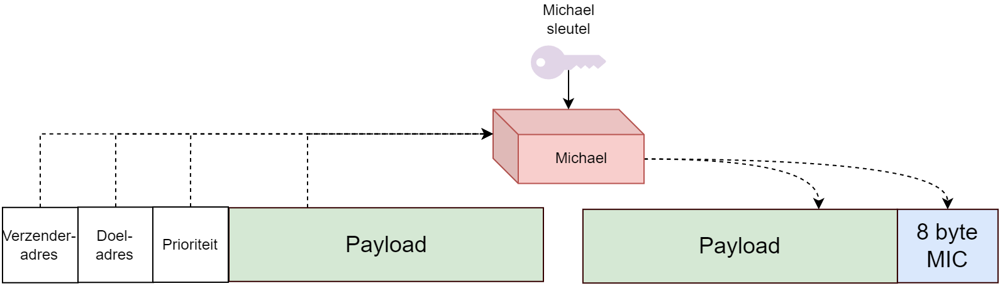{ width=100% }
:::

::::

---

## TKIP: IV en key mixing

**IV verbetering:**

* **48-bit IV** (was 24-bit) → genaamd *TKIP Sequence Counter* (TSC)
* Strikte volgorde: pakketten met lagere IV worden **geweigerd**

**Key mixing** in 2 fases:

* **Fase 1**: Temporal Key + **Transmitter Address** + TSC → intermediate sleutel (uniek per client)
* **Fase 2**: Intermediate sleutel + TSC → **per-pakket RC4-sleutel**

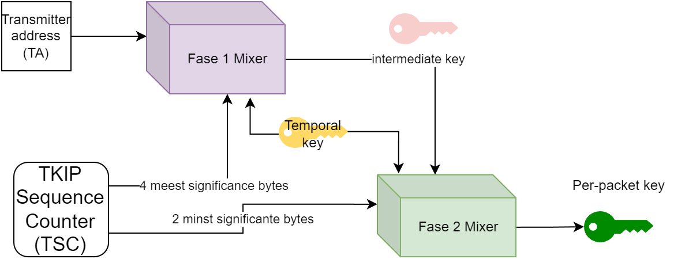{ width=70% }

---

## WPA1: het totaalplaatje

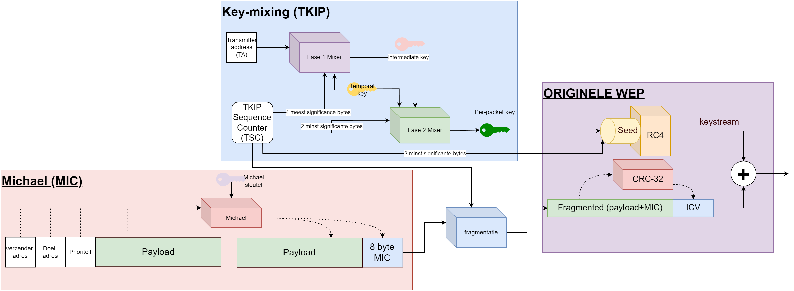

::: {.callout-tip .fragment}
Tools zoals **coWPAtty** en **Aircrack** kunnen WPA1-Personal kraken door de handshake te capteren.
:::

---

## WPA2: AES als hart

* **AES** vervangt RC4 (eindelijk geen streamcipher meer!)
* Twee AES-modes gecombineerd in **CCMP**:

| Component | Functie |
|---|---|
| AES **Counter mode** | Encryptie (blokken onafhankelijk) |
| AES **CBC-MAC** | Integriteit (MIC berekenen) |

**CCMP** = *Counter Mode Cipher Block Chaining Message Authentication Code Protocol*

---

## CCMP: elegantie

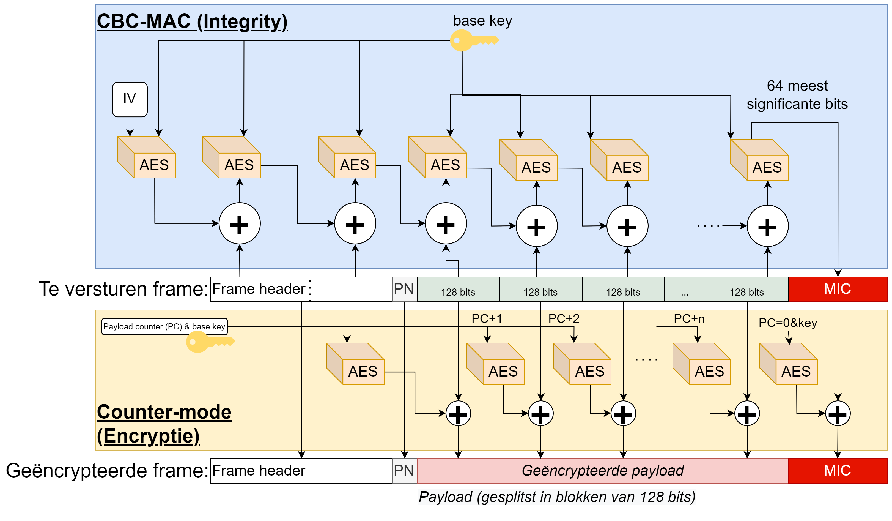

* **CBC-MAC**: keten van encrypties, finale blok = MIC
* **Counter mode**: blokken onafhankelijk, payload counter als extra seed
* 48-bit IV (*packet number*)

::: {.callout-warning .fragment}
**Personal mode**: passphrase gedeeld met alle gebruikers → zij kunnen elkaars data decrypteren! In **Enterprise mode** is dit onmogelijk.
:::

---

## KRACK: aan alles komt een einde

* **2017**: Belgische onderzoeker **Mathy Vanhoef** vindt fout in WPA2
* Niet in AES zelf, maar in de **handshake-procedure**
* Aanval gedocumenteerd op [krackattacks.com](HTTPS://www.krackattacks.com/)
* Verplichtte IEEE om aan **WPA3** te beginnen werken

::: {.callout-tip .fragment}
WPA1/WPA2 **Personal** mode blijft altijd gevoelig voor **dictionary aanvallen** op de pre-shared key. Gebruik een sterk wachtwoord!
:::

---

## WPA3 ("Wifi 6")

**2018**: Wifi Alliance brengt WPA3 uit — state-of-the-art:

| Verbetering | Wat? |
|---|---|
| **SAE** | *Simultaneous Authentication of Equals*: veiligere personal-mode |
| **Forward secrecy** | Oude pakketten niet achteraf decrypteerbaar ("store now, decrypt later" = onmogelijk) |
| **Wifi Easy Connect** | Gebruiksvriendelijk IoT-apparaten verbinden |
| **Wifi Enhanced Open** | Publieke hotspots: ieder z'n **eigen veilig kanaal** |
| **GCMP-256** | Geauthenticeerde encryptie |

::: {.callout-note .fragment}
Resistent tegen **offline dictionary attacks** — een groot verschil met WPA2-Personal!
:::

---

## Conclusie

```{mermaid}
%%{init: {"theme": "base", "flowchart": {"useMaxWidth": true}} }%%
graph LR
    A("WEP 🚫<br/>RC4 + CRC") --> B("WPA1<br/>TKIP wrapper")
    B --> C("WPA2<br/>AES/CCMP")
    C --> D("WPA3<br/>SAE + GCMP")

    style A fill:#ff4444,stroke:#333,color:#fff
    style B fill:#ff9900,stroke:#333,color:#000
    style C fill:#44aa44,stroke:#333,color:#fff
    style D fill:#2266cc,stroke:#333,color:#fff
```

* **WEP**: fundamenteel gebroken (RC4, IV, CRC, geen sleutelbeheer)
* **WPA1**: tijdelijke patch, wrapper rond WEP
* **WPA2**: AES-gebaseerd, sterk maar KRACK-kwetsbaar
* **WPA3**: state-of-the-art met forward secrecy en SAE

::: {.callout-important}
Gebruik altijd **WPA3** (of minstens WPA2-Enterprise) en kies een **sterk wachtwoord**!
:::
